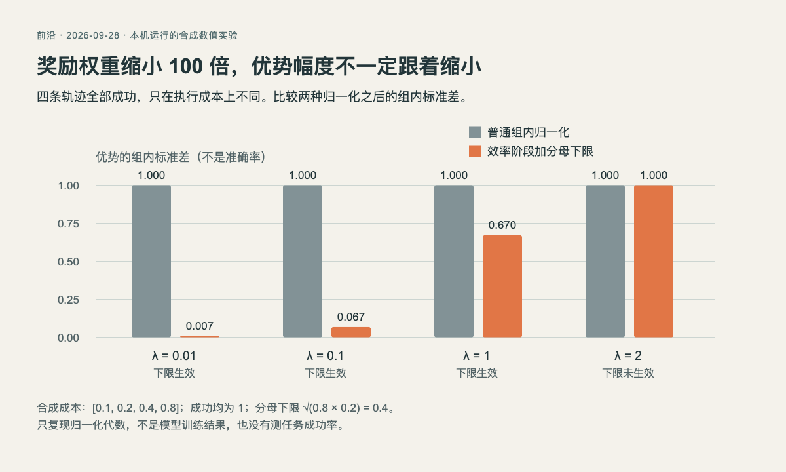

# 奖励权重变小，训练信号一定会变小吗

已运行验证：本机Python 3.14.3，只用标准库、CPU，无模型下载、无API调用、无随机采样。这是四条合成轨迹的数值实验，不是强化学习训练或论文性能复现。

[Qwen-Planner-Agent](03-论文精选.md)提醒了一个容易被公式藏起来的问题：希望模型在完成任务后适当节省成本，把成本奖励权重调小，经过组内归一化后却可能没有预想的作用。

## 先看奖励，再看归一化

设四条轨迹都成功，成功分都是1，执行成本分别为0.1、0.2、0.4、0.8。为了让较便宜的轨迹得分更高，令奖励 `R = 1 - λ × cost`。λ越小，本来应该越少强调成本。

普通组内优势计算是 `(R - 平均奖励) / (奖励标准差 + ε)`。当全部成功且成本仍有差异时，分子中的λ和分母标准差里的λ几乎抵消，所以把λ从1降到0.01，优势幅度仍接近1。这里“幅度”用组内总体标准差衡量，不是任务成功率。

论文只在高成功率的效率阶段加一个分母下限：`max(奖励标准差, sqrt(p_high × (1-p_high))) + ε`。本例人为取`p_high=0.8`，下限为0.4，不声称这是论文所有实验的参数。成本差异较小时，下限阻止它被放大到统一幅度；足够大时，归一化恢复普通形式。

## 本机实际输出

| λ | 普通优势标准差 | 加下限后的标准差 | 下限生效 |
| --- | --- | --- | --- |
| 0.01 | 0.999996 | 0.006702 | 是 |
| 0.1 | 1.000000 | 0.067024 | 是 |
| 1 | 1.000000 | 0.670238 | 是 |
| 2 | 1.000000 | 1.000000 | 否 |



数据来自随文Python程序的实际输出；HTML/JS按准确数值绘图，非生成式概念图。灰柱为普通归一化，橙柱为分母下限。来源原图不能替代本次合成数值，imagegen也不适合生成要求逐项精确的实验结果。[查看大图](images/advantage-scale.png) · [绘图源码](code/advantage-chart.html) · [原始JSON](code/advantage-results.json)

## 复现与检查

下载[Python源码](code/advantage_scale.py)，在对应目录运行：

```bash
python3 advantage_scale.py
```

程序输出每个λ的两种标准差，并保存`advantage-results.json`。核心代码如下，`pstdev`使用总体标准差，ε取1e-8：

```python
rewards = [1.0 - weight * cost for cost in costs]
mean = statistics.mean(rewards)
sigma = statistics.pstdev(rewards)
ordinary = [(r - mean) / (sigma + epsilon) for r in rewards]
calibrated = [(r - mean) / (max(sigma, anchor) + epsilon)
              for r in rewards]
```

检查不只看柱高：两种方法都保留了“成本越低、优势越高”的组内排序，程序也检查了均值接近零及排序一致。若要重绘，将HTML与JSON放在同一目录，通过本地HTTP服务打开HTML；直接用file协议可能无法读取JSON。

## 这个例子没有证明什么

它没有混合成功与失败，也没有模型梯度、KL约束、截断或真实环境。λ非常小时，ε不再可忽略；成本没有差异时，标准差为零，抵消推导也不成立。分母下限能解释为什么小权重终于变“小”，但能否改善成功率、节省token而不损失质量，仍需完整训练与留出评估。

原理依据：[Qwen-Planner-Agent，CARE的Quality-Preserving Advantage Calibration部分](https://arxiv.org/abs/2609.29892v1)。本机产物用于帮助理解该公式，没有复刻作者的性能图。
