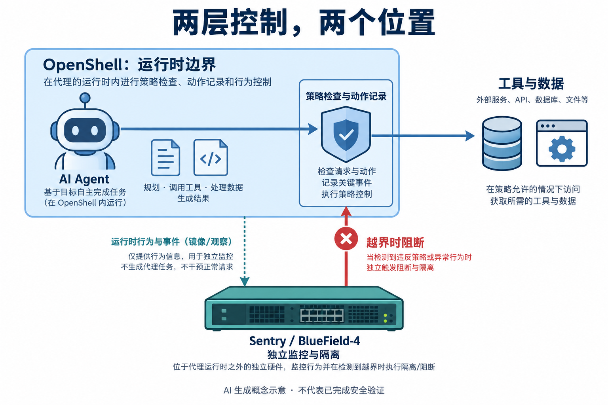
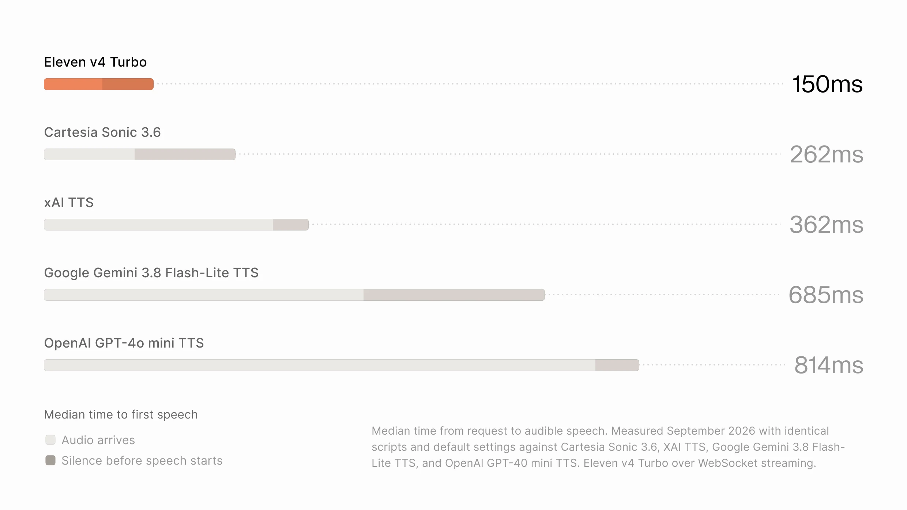

# AI 动态：模型变快之后，团队协作和执行边界怎么接上

本期为 **5条重点详解 + 10条速读**，事件日期覆盖9月25日至28日。只有日期的公告保留原日期，不猜测首发时刻。热度与实用价值分别判断：Sonnet同时有具体用户讨论和下游集成；其余主要依据新发布与可核验用途入选，不把作者宣传当独立使用证明。

前五条建议先读；完整阅读约18–24分钟。文中的价格、开放范围和实验条件均以所引版本为准。

## 01 · Sonnet 5.5：单价没变，任务成本和推理强度要分开看

2026-09-28。近期热门 / 新近实用；官方公告与文档，本站未实测。

Anthropic发布Sonnet 5.5，重点是更快地完成编码、工具调用和知识工作，而非只把上下文或参数数字加大。官方称相对Sonnet 5，生成速度提高30%以上；在匹配设置的任务中，较少的输出token可使单次任务费用最多下降约30%。这是特定评测下的任务账单，不是API价目表整体降价：每百万输入token仍为2美元、输出10美元、缓存读取0.20美元。

因此要把三个问题分开：每个token多少钱、完成任务需要多少token、选择多强的推理。提高推理强度可能增加思考和成本，不能同时拿最低成本设置与最高能力设置宣传同一收益。Claude应用和Claude Code默认采用Medium，平台默认High；迁移时应保留实际使用的推理设置，再比较正确率、耗时与总账单。

官方公布的Terminal-Bench 4.0成绩为70.6%，Sonnet 5为10.3%。这说明该组终端任务中的差距很大，却不代表任意仓库都有同样幅度：测试环境、任务集和执行框架都是条件。对研究读者，较好的检查方法是选一组已有验收标准的脚本修复或资料提取任务，保持工具与预算一致，而不是仅对话几次比较语气。

模型已进入Claude、Claude Code及API，平台模型名为`claude-sonnet-5-5`。开发者还要核对思考模式迁移、保留思考内容和网络安全相关限制；部分高风险网络安全请求可能由安全机制回退至Sonnet 5。可用不等于所有旧参数都可以原封不动迁移。[开发与能力说明](https://www.anthropic.com/claude-sonnet-5-5)给出了这些边界。

为什么现在值得看：这是能力、速度与工具生态同时变化的一次正式升级。[Hacker News讨论](https://news.ycombinator.com/item?id=49881850)采集时为519分、349条评论，其中有用户讨论实际编码比较和安全拦截；另有[GitHub官方宣布Copilot集成](https://github.blog/changelog/2026-09-28-claude-sonnet-5-5-in-github-copilot/)。讨论与下游采用是两类信号，但仍不足以证明长期留存或所有人的生产率提升。本站未运行模型对照。

[原始来源](https://www.anthropic.com/claude-sonnet-5-5)

## 02 · NVIDIA：把 Agent 的软件边界与独立硬件监控分开

2026-09-28。新近实用；官方公告与文档，本站未实测。热度待验证。

NVIDIA公布Open Agent Safety Platform，核心不是再给Agent加一句“请安全操作”，而是把约束放到运行系统。OpenShell负责跟踪动作、执行策略和控制工具访问；Sentry则是独立于Agent运行时的监控与隔离参考设计，依托BlueField-4 DPU，处在另一信任域。软件内的限制与外部监控因此承担不同职责。

可以用一个修改仓库的Agent理解：模型决定下一步做什么，运行时记录并检查它能否读取某个目录、访问外部服务或执行动作；外部监控再观察行为与策略是否一致，在检测到问题时触发隔离。这里是依据公告整理的机制示意，不是本站对该产品的实测部署，也不是安全攻击已经全部被挡住的证明。

读图先看位置：蓝色边界内是运行时策略执行，底部硬件位于其外。虚线是观察，红线是概念性的阻断控制，不是实际接线图。AI生成概念示意，依据NVIDIA公告；硬件外观为抽象画法，未进行安全验证。（[事实来源](https://nvidianews.nvidia.com/news/open-agent-safety-platform)；[查看大图](images/nvidia-boundaries.png)。）

公告将OpenShell软件描述为已广泛可用，并计划扩展到其他Arm与Intel系统；Sentry要按参考设计的成熟度理解，不能把二者统一写成开箱即用的同一个产品。DOCA涉及身份、遥测和策略连接，实际可观测范围取决于怎样接入，不能由“独立硬件”四个字直接推出完整防护。

Anthropic的配套说明进一步解释，Claude Managed Agents把Agent循环和执行沙箱分离，让企业可以控制执行环境，再与OpenShell及BlueField相关能力衔接。这对需要审计文件访问、网络连接和工具权限的团队很实用：要验证的是哪些动作被记录、什么情况下会拦截、隔离后怎样恢复，而不仅是模型回答是否礼貌。[合作方说明](https://claude.com/blog/giving-companies-more-control-over-their-ai-agents-with-nvidia)。

为什么现在值得看：Agent正在从给建议转向实际执行，运行权限开始成为可单独设计的系统组件。公告中的响应速度和伙伴名单属于官方主张与合作信息，尚不能替代独立攻击测试。原公告的Logo图不能说明机制，所以此处采用明确标记的生成概念图。

[原始来源](https://nvidianews.nvidia.com/news/open-agent-safety-platform)

## 03 · Eleven v4：更自然的表达与更早出声，需要用不同指标看

2026-09-28。新近实用；官方公告与文档，本站未实测。热度待验证。

ElevenLabs发布Eleven v4及面向实时交互的v4 Turbo。输入仍是文本与声音配置，但新增架构把情绪、语气和交付方式放到更可控的位置，支持90多种语言。多说话人场景要保持各自身份，文本中的表达提示则影响怎么说；它不是只在句尾加一个音效，也不是宣布所有语言已经达到一样的质量。

对旁白制作，重点是一次性读长稿时能否保持角色和语气；对语音Agent，重点是用户说完之后多久听到第一段回答。两种场景的好结果并不等价：更快发出第一个声音，不能保证整段内容准确、自然，也不能省掉上游识别、思考、工具请求和网络传输的时间。

ElevenLabs公告中的对照原图，仅引用用于解释延迟口径。作者报告Turbo推理中位数约100ms、首段语音约150ms；二者不是完整语音Agent的端到端耗时。比较依赖公告的输入和默认设置，本站未复测。（[来源原图](https://elevenlabs.io/blog/eleven-v4)；[查看大图](images/eleven-latency.webp)。）

官方报告盲测中相对所列对照约75%的偏好率。偏好实验回答“这组听众更喜欢哪段声音”，不直接回答名字、数字、专业术语是否全部读对，也不能推广为所有应用的75%用户都会迁移。正式接入前，适合用自己语料里的缩写、数字、多语混排和长段落检查，记录失败例子，避免只试听精选片段。

声音克隆、发音控制与实时生成要连成一条工作流。文档提供即时克隆与专业声音克隆路径，IPA发音控制也有相应说明；十秒参考录音等门槛是功能入口，不是任何质量录音都能得到可靠音色的保证。产品已进入Agents、Creative和API，属于商业服务能力，没有因此开放底层模型权重。[能力与使用说明](https://elevenlabs.io/docs/overview/capabilities/text-to-speech/eleven-v4)。

为什么现在值得看：新版本给开发者一个更明确的选择——优先长篇表达，还是优先快速接话，再在相同业务条件下衡量质量。本文依据官方示例与实验，未用本机合成语音，也没有将单一厂商图表当作独立速度排名。

[原始来源](https://elevenlabs.io/blog/eleven-v4)

## 04 · Team Bots：把个人助手的工作方法变成团队共享上下文

2026-09-28。新近实用；官方公告与文档，本站未实测。热度待验证。

xAI推出Team Bots公开测试，面向Teams与Enterprise。与每人各自教一遍助手相比，它试图把角色、工作流、技能、连接的工具和部分记忆组织成团队可复用的上下文。成员能够使用共享的工作方法，个人对话和个人上下文则按公告保持私有；共享技能与共享全部聊天记录不是一回事。

官网展示的场景包括销售每日客户简报、研发排查线上问题、营销材料审阅，以及查询数据仓库。以研发为例，入口问题可以连接Slack讨论、Notion资料、Linear工单和Datadog监控，再交给编码Agent执行后续工作。这里真正改变的是上下文怎样跨工具衔接，不能把“能连接多个系统”直接理解为每个连接都已得到当前组织的授权。

读者可以把团队层和个人层分开理解：团队层保存可重复的方法和工作规范，个人层保留当前任务及对话；每次执行再依赖连接器的凭据和权限。一次销售简报可以复用统一格式，但客户资料是否可读、结果给谁看，仍由接入设置决定。公告提供产品层面的说明，本站没有对隔离机制做独立安全验证。

另一个值得注意的区别是查询与写操作。官方数据场景使用只读仓库和技能库，营销流程保留预览与最终确认；这些具体约束比“自动做完一切”的概括更有参考价值。团队试用时可以先选可核对的检索或汇总任务，再评估需要更大权限的执行步骤，而不是把演示的所有连接同时开放。

为什么现在值得看：Team Bots公开测试让共享工作方法成为可使用的协作单元，适合经常重复解释项目背景的团队。官网中的小团队高PR数量和客户反馈属于作者案例或客户证言，没有统一任务难度和对照组；不能据此推算人力节省。本文核对了公告正文，演示视频下载返回403，因此没有制作假界面或用生成图冒充实际操作。

[原始来源](https://x.ai/news/team-bots)

## 05 · Shopify WebMCP：让浏览器 Agent 调用店铺动作，付款仍要买家确认

2026-09-28。新近实用；官方公告与文档，本站未实测。热度待验证。

Shopify将WebMCP接入店铺浏览流程，让支持它的浏览器Agent在当前页面里发现并调用结构化工具。它与看截图、猜按钮位置相比，给搜索商品、读取详情和更新购物车提供了更明确的输入输出。Liquid店铺按官方说明无需额外配置；Hydrogen处于开发者预览，浏览器支持也不是所有客户端都已具备。

一个购物请求可以拆成三段：先查商品，再把确定的款式和数量放进购物车，最后进入结账。店铺工具复用当前访问者的会话以及Shopify既有购物行为，而不是在页面之外另造一份购物车。信息不明确时，`update_cart`会要求澄清，不应擅自用猜测补齐；这也是结构化接口优于仅凭页面文字自动点击的地方。

到了结账页，可用工具会重新注册，页面导航之后必须重新检查，不能缓存上一页工具名单一直调用。`update_checkout`涉及状态替换，因此文档要求先获取当前状态；金额使用最小货币单位，10799可能代表107.99，而不是一万多元。这些细节决定一个看似简单的“帮我购买”是否能正确执行。

付款权限另有明确边界。`complete_checkout`需要买家确认；某个结账环境没有提供相应工具时，Agent应把操作交回给买家。能更新地址、看配送方式，不代表已经获准最终下单；工具是否存在也受当前结账条件影响。[结账接口说明](https://shopify.dev/docs/agents/carts-and-checkout/checkout-webmcp)值得与首页一起阅读。

为什么现在值得看：这是浏览器Agent与现有电商会话连接的实用路径，开发者可以对照真实接口考虑工具发现、状态同步和确认步骤。9月28日是本次公开发布事件日期，文档抓取时间不充当首发时间。本站核对了接口与条件，未操作任何真实购物车或支付，也没有把官方工具清单当成跨浏览器兼容性实测。原文以代码和状态定义为主，用文字顺序比虚构商店截图更准确。

[原始来源](https://shopify.dev/docs/api/web-mcp)

## 06 · World Labs 宣布加入 AMD：空间模型与算力协同成为组织层面的选择

2026-09-28。新近实用；官方公告与文档，本站未实测。热度待验证。

李飞飞宣布World Labs将加入AMD，自己担任执行副总裁兼首席科学家，延续空间智能和世界模型工作。为什么现在值得看：此前的模型训练、推理与硬件合作，进一步变成组织和研发资源的整合，值得观察后续软件接口与部署路径。本文采用创始人公告，不把媒体报道的交易金额当已在该原文确认的事实，也不据此声称收购交割或新模型已经完成；Atlas等既有能力不重算一次发布。

[原始来源](https://drfeifei.substack.com/p/worldlabs-joining-amd)

## 07 · Meta Enterprise：把企业 Agent、模型 API 与开发工具放进同一业务线

2026-09-28。新近实用；官方公告与文档，本站未实测。热度待验证。

Meta宣布Meta Enterprise，围绕Muse相关Agent、Business Agent、Muse API及Muse Code组织企业业务，并任命CJ Desai负责。现在值得看的是企业接入方向变得明确：模型调用、面向客户的执行与开发工具开始按业务流程组织。公告属于平台及业务安排，不能直接推导所有组件今天均已GA、开放权重或有统一价格。对开发者，可跟踪具体可用入口与条款；本站未把合作意向当客户已全面部署的证据。

[原始来源](https://about.fb.com/news/2026/09/launching-meta-enterprise-platform/)

## 08 · Gemini 将 Gems 迁移为 skills：个人、企业和教育账号时间不同

2026-09-27 · 近期补充。新近实用；官方公告与文档，本站未实测。热度待验证。

近期迁移通知对应的官方帮助页给出分阶段安排：个人账号2026年11月、Workspace企业2027年3月、教育2027年6月。skills可自动触发、组合或用命令调用，现有Gems及支持的文件会迁移。为什么现在值得看：使用固定提示工作流的人需要核对迁移后的实际行为。当前说明仍有Canvas、Deep Research等兼容限制，GitHub文件不受支持；不能写成所有账号马上替换、原功能无差别保留。9月27日为通知事件日期，帮助页更新本身不冒充产品首发。

[原始来源](https://support.google.com/gemini/answer/18560919)

## 09 · ChatGPT Health：从选中的健康记录进入个性化解释

2026-09-28。新近实用；官方公告与文档，本站未实测。热度待验证。

OpenAI发布说明新增Health交互：选择一个图表、指标或记录，就能结合已连接的健康信息获得解释。它把问题锚定在当前数据对象，减少用户重新描述“我问的是哪项”的负担。为什么现在值得看：这是数据界面到对话入口的具体变化，可供研究面向个人数据的交互设计。此次更新并未同时给出医疗准确率新实验、普遍账号开放时间或新的诊断能力；本站只确认发布说明，不把便于询问等同于结论可靠性提升。

[原始来源](https://help.openai.com/en/articles/6825453-chatgpt-release-notes)

## 10 · YODAS v3：大规模语音数据开始保留更多原始声学信息

2026-09-27 · 近期补充。新近实用；官方公告与文档，本站未实测。热度待验证。

ESPnet介绍YODAS v3，规模约110万小时、100多种语言，34种语言超过1000小时，增加高采样率、多声道、词与语句时间戳等材料。相比只拿文字转录训练识别，高保真音频让语音生成与声学研究有更多输入信息。为什么现在值得看：数据形态而非单纯时长发生变化。但完整数据约60TB，下载、解码、分片和质量过滤都是门槛；数据卡采用CC BY 3.0，具体子集仍需核对。历史下载总量不作为本周热度证据，本站未下载整库。

[原始来源](https://huggingface.co/blog/espnet/yodasv3)

## 11 · Perceptron Mk1.5：用点、框、轨迹表达视觉结果，而不只是一段描述

2026-09-25 · 近期补充。新近实用；官方公告与文档，本站未实测。热度待验证。

Mk1.5接受文字、图像、视频与音频，输出文本以及点、框、多边形、视频片段和对象轨迹。实际价值在于把“看到什么”转为下游可处理的对象与时间位置，减少只读自然语言再解析的步骤。作者对照也有明显边界：部分跟踪与定位表现较好，MeViS、EgoSchema或动作动词等并非全面领先。现阶段按API与官方实验理解，不能因SDK公开就称模型开源。9月25日发布作为近期补充，本站未调用API复现。

[原始来源](https://www.perceptron.inc/blog/introducing-perceptron-mk1-5)

## 12 · Perplexity Fast Search：明确查询可以换较轻的检索预算

2026-09-25 · 近期补充。新近实用；官方公告与文档，本站未实测。热度待验证。

[创始人公告](https://www.linkedin.com/posts/aravind-srinivas-16051987_perplexity-has-the-fastest-and-most-capable-activity-7508961651606605825-ZjqI)发表于9月24日18:52 UTC（北京时间25日）。Search API增加`search_type: "fast"`，公开文档价格为每千次1美元，标准web搜索为5美元，响应结构一致。适合问题明确、希望尽快得到网页结果的调用；文档仍建议复杂或含糊查询用标准搜索。为什么现在值得看：Agent可以按任务选择检索预算，但不能把低延迟等同于同样的召回质量。还应检查SDK版本对新字段的支持；这与Agent API的fast预设不是同一开关，模型token费用也不能自动算进搜索单价。

[原始来源](https://docs.perplexity.ai/docs/search/fast-search)

## 13 · Lenfest 扩大新闻编辑部 AI 驻场计划，重点是把工具复用起来

2026-09-28。新近实用；官方公告与文档，本站未实测。热度待验证。

Lenfest宣布OpenAI新增500万美元支持，并提供最高500万美元的软件额度与工程支持，扩展此前11家新闻机构参与的计划。可核对的场景包括档案检索、公共信息监测和音频转录；下一阶段希望把各机构做出的工具和实施经验复用。现在值得看的是驻场工程与具体工作需求怎样连接，而非一次通用聊天模型部署。公告中的节省工时来自参与方案例，没有统一对照；新增承诺也不等于所有共享工具已经发布。

[原始来源](https://www.lenfestinstitute.org/institute-news/lenfest-institute-openai-ai-fellowship-expansion/)

## 14 · Modulate 获2500万美元融资：语音风险识别继续走专用模型组合路线

2026-09-28。新近实用；官方公告与文档，本站未实测。热度待验证。

Modulate宣布2500万美元融资，计划扩展语音欺诈识别与Agent监督。其路线是组合处理不同信号的专用模型，不把全部声音先压成转录文字再判断。为什么现在值得看：语气、说话方式与上下文可能影响风险识别，这是语音Agent接入时值得区分的输入层。Velma等已有技术不能因融资重新写成今天首发；官方对模型数量和能力的描述，也没有替代误报率、漏报率与跨语言独立评估。

[原始来源](https://www.modulate.ai/blog/we-started-by-asking-what-machines-could-hear-now-were-building-what-comes-next)

## 15 · NASA 的 AI 数据工作流：找出历史资料中的证据，控制仍由人承担

2026-09-28。新近实用；官方公告与文档，本站未实测。热度待验证。

Microsoft新案例介绍NASA怎样在多年积累的数据中检索、整理资料，并展示支持空间站电力和热控分析的SPARTAN原型。研究读者可关注输入是历史记录和工程知识，输出是可供人员判断的摘要或辅助信息，而非让模型自主接管飞行。为什么现在值得看：它把资料检索放进有明确工作对象的流程。文中“几周到几秒”等来自受访者案例，不是匹配任务的独立基准；本文按9月28日新披露案例收录，不将原型写成已认证的自动控制系统。

[原始来源](https://news.microsoft.com/source/features/digital-transformation/at-nasa-ai-is-helping-scientists-unlock-discoveries-hidden-in-decades-of-data/)
