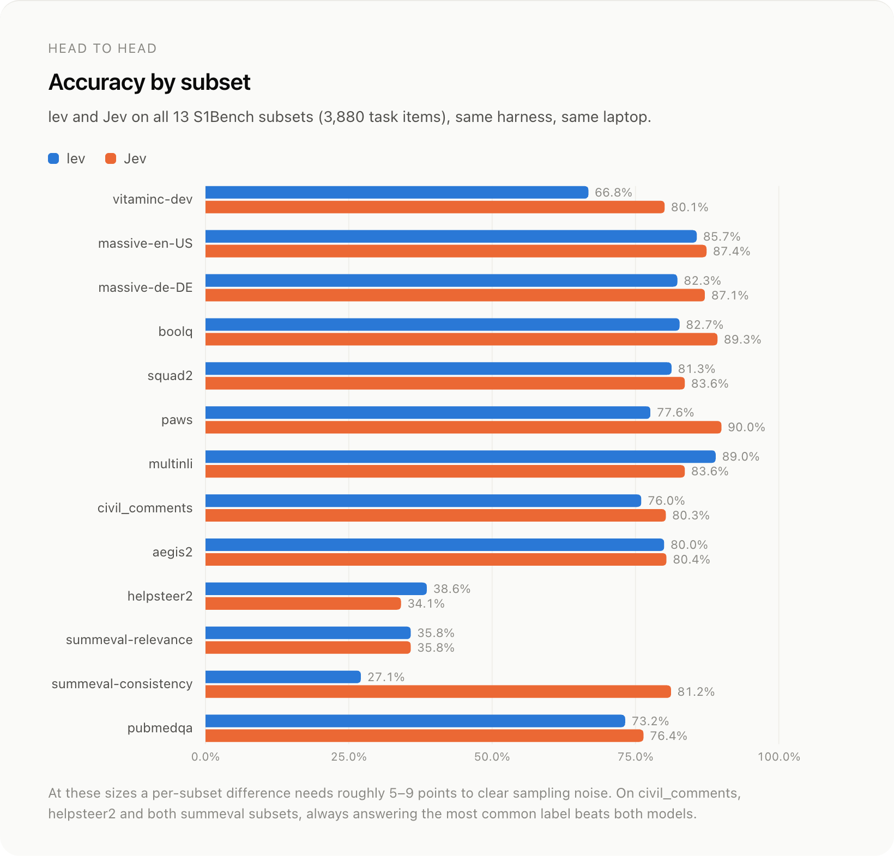
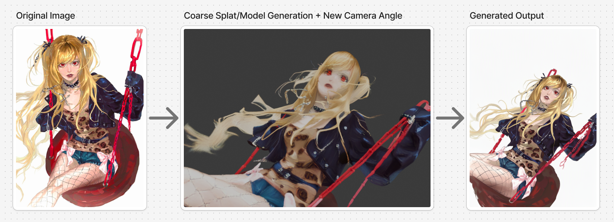
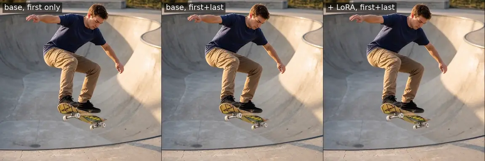

# 六模型：有限选择、桌面动作、机械臂和新视角

本栏保留“开源模型”的栏目名称，但不把受限开放权重写成宽松开源。六项均核对模型卡、权重文件与对应许可，本站未下载运行；图和数字来自作者示例、实验。决策模型也要分别看标签约束、概率质量和部署成本。

| 模型 | 输入 → 输出 | 主要门槛与开放边界 |
| --- | --- | --- |
| Lev | 上下文与有限候选 → 概率/分数 | Qwen3.5-4B + LoRA；Apache-2.0 |
| Xor v1.1 | 文本及视觉上下文 → 2–255项选择 | 35B-A3B基座、约66GB BF16权重；Apache-2.0 |
| CUA s1 0.2 | 屏幕与候选动作 → 动作选择 | 4B基座与文本/视觉适配器；Apache-2.0 |
| FLUX.3 Action SO101 | 两路相机与状态 → 动作段 | 实体机械臂与校准；FLUX Kommunity受限许可 |
| QI 2.1 AnyAngle | 原图、粗糙新视角 → 新视角图像 | 3D重建链路；基座仅非商业研究/评估 |
| H3 Orbit LoRA | 相同首尾图 → 环绕短视频 | H3视频基座；有地域与商业条件 |

## 01 · Lev：把有限选项的判断变成一次前向计算

2026-09-24。新近实用 / 新近创新；热度待验证。

Lev基于Qwen3.5-4B，以LoRA提供候选选择、是非判断和评分。业务先定义允许的答案，再从一次前向计算得到对应分数；不用生成一长段话之后再解析标签。它适合分类、路由和有明确候选范围的判别任务，但结构上不会输出非法标签，不代表内容判断不会错。

作者在S1Bench的3880条、13类任务上报告宏平均68.9，对照Jev为76.1；一致性等具体子项仍有明显差距。有些类别不平衡任务，常量基线也很强，因此不能只看漂亮的速度数字就认定有实用准确率。

Interfaze团队公开对照原图，材料随Apache-2.0项目发布。重点看各任务差异，而非把宏平均当作任意分类任务正确率；作者结果，本站未复现。（[来源原图](https://huggingface.co/interfaze-ai/lev)；[查看大图](images/lev-accuracy.png)。）

为什么现在值得看：9月24日公开的权重和实现，让“只做一次受约束判断”的路径可以直接检查。需Python 3.12、PyTorch、Transformers、PEFT及基座；基座约8GB、适配器约200MB，不能只按小文件估计总资源。H100约69ms指作者前向计算；其他端到端示例约414–654ms，口径不同。概率用于阈值决策前仍需任务校准。

[模型卡与权重](https://huggingface.co/interfaze-ai/lev)

## 02 · Xor v1.1：候选数扩到255，但部署仍是大模型

2026-09-27。新近实用 / 新近创新；热度待验证。

Xor基于Qwen3.6-35B-A3B，公开合并的LoRA权重，接收文本及图像、视频上下文，输出有限候选的判断。v1.1从较少选项扩到最多255项，最低2项。仓库北京时间9月22日建立，本次实际权重发布提交为9月26日22:48 UTC，即北京时间27日；不把仓库建立日和新检查点混为一谈。

作者在231条公开JEVBench题目上自测207条正确，即89.61%，p50约0.0753秒且不含网络。这不是官方排行榜认证，也不能保证混合图像与视频输入可靠；模型卡对混合模态和请求大小另有限制。

为什么现在值得看：候选规模和公开服务协议更适合真实业务路由，但3B激活参数并不意味着只有3B参数需要存储。BF16权重约66GB、16个分片，作者部署示例用单张143GB H200及修订的SGLang容器，要求Linux、NVIDIA容器环境与约120GB磁盘。Apache-2.0权重开放；用之前应先估算完整部署链，而不是由单次速度反推普通笔记本表现。

[模型卡与权重](https://huggingface.co/juspay/xor)

## 03 · CUA s1 0.2：桌面动作选择改善，同时暴露分布迁移的风险

2026-09-22。新近实用 / 新近创新；热度待验证。

这组适配器将Qwen3.5-4B接入桌面Agent的有限动作选择：输入屏幕、任务与候选元素/动作，判断下一步。文本与多模态路径分别提供LoRA，基座保持冻结。完整应用仍需截图、生成候选动作并执行，不是下载一个适配器就能自动控制所有桌面。

作者跨数据集评测中，GUI360表单项从旧版0.455到0.939，搜索项0.958，但分页项从0.571降到0.429。另一组原分布对照也出现新版明显回退，部分小子集甚至只有4或12例。新的平均表现不能掩盖旧任务损失，更不能把这些比例解释为整个桌面工作流成功率。

为什么现在值得看：9月22日公开的新版本同时给出评测实现，能研究候选动作表示和分布变化。需要4B基座、CUDA推理环境与GUI运行框架；Apache-2.0。本站读了[评测实现及结果](https://github.com/trycua/cua/tree/main/libs/cua-bench-s1)，未执行桌面任务。原结果表信息密集，本条用代表性进退数字说明，避免把一张总分图画成“全线升级”。

[模型卡与权重](https://huggingface.co/cua-ai/cua-s1-4b-0.2)

## 04 · FLUX.3 Action SO101：预测一段动作，再回到新观察

2026-09-22。新近实用 / 新近创新；热度待验证。

这个约7B检查点把视觉观察和动作联系起来：输入固定顺序的两路相机、机器人状态及任务，产生42步动作段，通常执行其中32步后重新观察与规划。30Hz控制下，“生成一整段”和“全部一次性执行”不同；新观察能在后续段落修正先前预测。

SO101的数据单位与相机顺序必须一致：五个关节按角度，夹爪按百分比，不能重复归一化。需要校准机械臂、对应处理器和共享编码器，软件路径为Linux、Python 3.12、CUDA 12.8等。官方用约200条遥操作演示展示行为，视频经过4倍加速并剪掉等待，因此不能从视频观感估算实际延迟。

为什么现在值得看：22日公开了可接入具体硬件的权重和操作说明，研究者可以对照动作分段与闭环观察。它采用[FLUX Kommunity许可](https://huggingface.co/black-forest-labs/flux-3-action-so101/blob/main/LICENSE)，包含用途限制、非商业条款及符合条件用户的例外，不能概括成Apache式自由商用。本站没有实体设备验证；未将演示结果推广到其他机械臂或生产可靠性。

[模型卡与权重](https://huggingface.co/black-forest-labs/flux-3-action-so101)

## 05 · QI 2.1 AnyAngle：粗糙3D提供视角，扩散模型负责补画

2026-09-28。新近实用 / 新近创新；热度待验证。

AnyAngle不是凭一张图片直接得到可信的完整3D模型。流程先用TriPo、Trellis2或Pixal3D等构建粗糙表示，在Blender中移动相机并渲染目标角度，再让适配器结合原图外观与粗渲染生成新图。几何条件决定从哪儿看，扩散模型负责外观与细节；背面未观察的内容仍可能被补写。

模型卡建议LoRA强度1、CFG 3、至少20步。3D重建的脸部、遮挡或深度出错时，下游无法自动保证还原真实结构；需要的是前后对照，不是只看输出好不好看。

lilylilith模型卡中的完整示例。看粗糙视角怎样提供结构约束，再看最终图补回外观；这是作者定性示例，不是几何精度评测。仅引用该图说明流程。（[来源原图](https://huggingface.co/lilylilith/QI_2.1_AnyAngle)；[查看大图](images/anyangle-example.png)。）

为什么现在值得看：28日新公开的适配器把视角控制拆成可检查的两个阶段，适合插画或资产探索。适配器页面标Apache-2.0，但[Qwen-Image-2.1基座许可](https://huggingface.co/Qwen/Qwen-Image-2.1/blob/main/LICENSE)只允许非商业研究或评估；附属权重的小许可不能覆盖基座限制。需要完整图像模型及3D工具链，本站未推理。

[模型卡与权重](https://huggingface.co/lilylilith/QI_2.1_AnyAngle)

## 06 · H3 Orbit LoRA：用同一张首尾图约束三秒环绕视频

2026-09-27。新近实用 / 新近创新；热度待验证。

这组rank16 LoRA使用MiniMax H3的首尾帧流程，把同一张图同时放在开始和结束，生成三秒左右的冻结主体环绕视频。推荐768×768、73帧、24fps、28步、强度1，并关闭音频。它不是任意长度、任意主体都保持真实三维一致性的模型。

作者用28个人物片段训练3000步，在A100 80GB上约10小时24分。这里的显卡和时长属于训练记录，不能直接当作用户推理的最低配置。原比较区分只给首帧、基座首尾帧、加LoRA三种设置，避免把新增首尾条件的收益全部算给训练。

pablodawson模型卡的作者动态对照原图。对比的是短片中的相机环绕与主体稳定性，偶发眨眼或几何变化仍可能出现；本站未生成视频。仅引用示例作方法评论。（[来源原图](https://huggingface.co/pablodawson/MiniMax-H3-360-Orbit-LoRA)；[查看大图](images/orbit-comparison.webp)。）

为什么现在值得看：27日发布的专项适配器提供具体训练范围和可复用设置，适合研究小样本动作控制。需要H3基座及对应视频推理链。其[上游社区许可](https://huggingface.co/MiniMaxAI/MiniMax-H3/blob/main/LICENSE)有排除地区和商业授权条件，不能按无条件开源描述；不应从人像短片推断物品、宽画幅或长镜头同样可靠。

[模型卡与权重](https://huggingface.co/pablodawson/MiniMax-H3-360-Orbit-LoRA)
