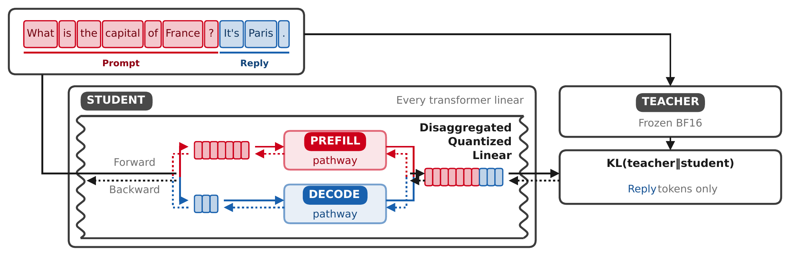
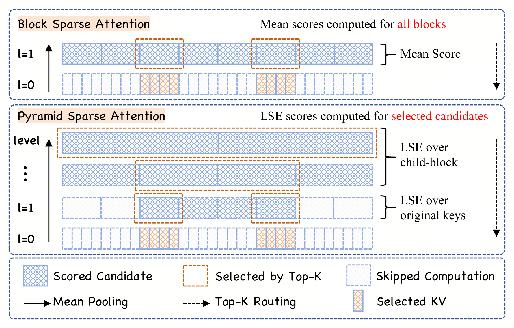
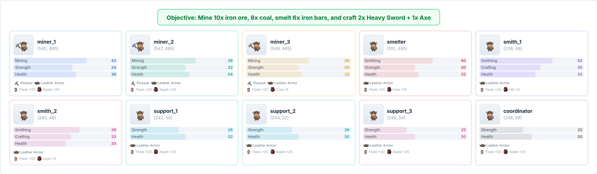
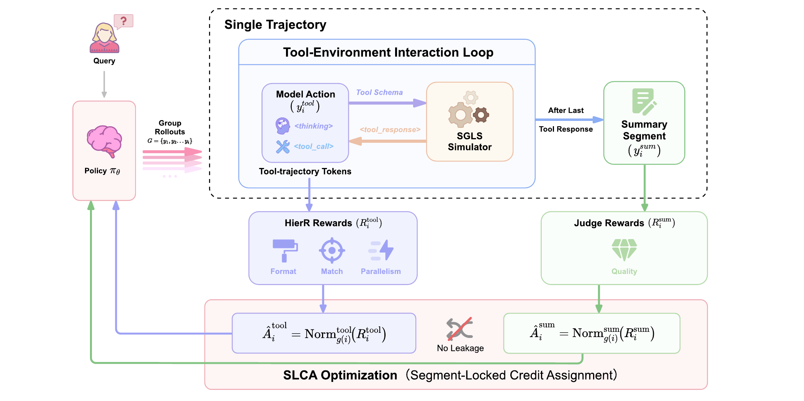

# 六篇论文：省计算、分信用，也要看比较条件

本期先比较12篇近期候选，再精读下面六篇的核心方法、实验、基线与局限。论文榜单票数只作发现线索，未获得两类独立近期热度信号的条目不标热门。均为作者实验，本站没有进行模型训练复现；技术实践只验证一个小型数学现象。

六篇均保存站内阅读卡；其中四篇CC BY 4.0论文另存原版PDF，另外两篇保留原站PDF入口。论文首页日期、arXiv首次提交和录用状态分别核对，不能把预印本模板当录用证明。

## 01 · FuseReg：重建看浅层，生成看深层，训练时让解码器少依赖固定组合

arXiv提交2026-09-25 · 2609.31620 v1 · 预印本。新近创新 / 新近实用，热度待验证。

冻结的视觉编码器有很多层：浅层细节有利于重建，深层语义往往更利于生成。FuseReg不是寻找一组永远最好的融合权重，而是在训练解码器时随机使用不同层子集，使完整、稀疏乃至单层输入都能被解码。直觉是避免解码器把某个固定组合当作必需条件。

实验采用DINOv3-L表征与ImageNet 256×256。固定DiT-XL生成器、只改解码器时，深层k=23的无引导gFID从3.01降到2.21；但是带引导条件下，对照1.25与所列最佳设置1.25相同。不能将无引导的约27%相对变化搬到所有设置。

分布变化实验更能解释方法价值：在k=7生成潜变量上，某对照的gFID为27.73，正则化解码器为1.92，说明它不那么依赖固定输入分布。另一组联合训练使用较小DiT-Base，13.96到9.93；这与只换解码器的实验不是一组。重建指标也有取舍，PSNR改善同时rFID可能变差。

为什么现在值得看：它把表征选层和生成解码之间的冲突变成可做消融的训练策略。复用时应同时测重建、原分布生成和潜变量变化后的输出，而不是挑一个最有利数字。结论主要来自一个视觉骨干与ImageNet，跨编码器、视频或其他数据分布仍需验证。

FuseReg作者的层表征与重建对照原图，CC BY 4.0。先比较不同层输入引起的重建变化，再看融合后的稳定性；示例图解释层信息差异，不代替整体生成评测。（[作者原图](https://arxiv.org/abs/2609.31620v1)；[查看大图](images/fusereg-reconstruction.png)。）

[站内阅读卡](../../../../papers/frontiers/fusereg/00-阅读卡.md) · [归档PDF](../../../../papers/frontiers/fusereg/2609.31620v1.pdf) · [原文](https://arxiv.org/abs/2609.31620v1)

原文为CC BY 4.0，保存未改动的v1 PDF并保留作者和许可。

## 02 · Disaggregated Quantization：预填充和解码不必共用一套量化格式

arXiv提交2026-09-22 · 2609.26333 v1 · 预印本。新近创新 / 新近实用，热度待验证。

长输入先做预填充，再逐token解码，两阶段的硬件瓶颈不同。论文把二者拆开：预填充偏好适合快速矩阵计算的低精度格式，解码可以使用更压缩的权重与不同激活精度；两者仍通过KV状态衔接。它不是简单把同一个模型随意切成两个互不相关的模型。

QADD利用指令数据训练这种衔接，监督重点放在助手输出，提示词产生的KV又参与后续答案的梯度。这样调整的是预填充产生的状态是否适合既有解码器，而不只是分别最小化两个权重误差。作者比较Qwen3与Gemma3若干规模，并控制约1亿token的训练预算。

实验将解码任务和长上下文RULER分开报告。DGX Spark上的一个Qwen3.8-27B系统，用NVFP4预填充并连接冻结的低比特GGUF解码路径；按需从SSD流入预填充权重，在8K输入下报告首token时间约1.78倍改善。长输入有机会摊薄加载成本，不能把这个数写成短问答或多用户吞吐普遍加速。

为什么现在值得看：部署优化的单位可以从“整个模型用几bit”变成“每个阶段用什么表示”。代价是更多格式、状态兼容与存储调度需要一起验证。高并发、多轮Agent轨迹及缓存重算差异尚未充分覆盖，本站未在相同硬件复现。

作者QADD训练原图，单幅方法评论引用。看预填充状态怎样接到解码路径，以及助手位置的监督怎样影响上游；图中的两阶段不能理解为没有共享状态。完整原图保留，不重画数据。（[作者原图](https://arxiv.org/abs/2609.26333v1)；[查看大图](images/dq-training.png)。）

[站内阅读卡](../../../../papers/frontiers/disaggregated-quantization/00-阅读卡.md) · [原文](https://arxiv.org/abs/2609.26333v1)

arXiv非独占分发许可不直接授权本站再分发全文；本期保存阅读卡和原站链接，只引用一幅有署名的原图作方法评论。

## 03 · PISA：先在粗层选区域，再逐层缩小注意力候选

arXiv提交2026-09-25 · 2609.31093 v1 · 预印本。新近创新 / 新近实用，热度待验证。

稀疏注意力想省掉大部分token连接，却可能先花很大代价才能知道该选哪些块。PISA把键向量组织成金字塔：上层由下层汇聚，先在较粗层选候选区域，再逐层展开和筛选，直到实际要计算的叶子块。细层分数使用LogSumExp相关计算，路由预算由每层候选数量控制。

在块大小、每层保留数和分支数等固定的假设下，作者讨论接近N log N的路由复杂度。这不是证明始终选到了全局最好的块：如果上层摘要让真正重要的分支被丢掉，下层就看不到它。近似路由质量与节省开销应同时测。

论文训练418M、1.47B、2.67B等模型，先用100B token做4K预训练，再用10B token扩至16K；比较完整注意力及BSA、NSA、HiLS等。常识任务可以接近对照，稀疏候选覆盖优于所列稀疏方法，但完整注意力在相关检查中仍有优势。

为什么现在值得看：它把“寻找稀疏块”的开销纳入算法设计，而不只报告最终少计算了多少连接。路由内核的长序列微基准做到256K，但不包含选中块上的全部注意力计算；模型长上下文验证主要到16K。不能据此宣布已验证百万上下文端到端性能。

PISA金字塔路由原图，仅裁去外围空白，结构与连接完整保留；单幅方法评论引用。由上到下看候选逐层展开，被早期丢弃的分支不再进入最终块。[未裁切原图](images/pisa-routing-full.png)提供完整页面。（[作者原图](https://arxiv.org/abs/2609.31093v1)；[查看大图](images/pisa-routing.png)。）

[站内阅读卡](../../../../papers/frontiers/pisa-attention/00-阅读卡.md) · [原文](https://arxiv.org/abs/2609.31093v1)

arXiv非独占分发许可不直接授权本站再分发全文；本期保存阅读卡和原站链接，只引用一幅有署名的原图作方法评论。

## 04 · AgentWorld：多 Agent 完成任务，需要测协作链而不只是聊天

arXiv提交2026-09-25 · 2609.31590 v1 · 论文标注COLM 2026。新近创新 / 新近实用，热度待验证。

AgentWorld提供100个基础任务与100个扩增任务，让3至20个能力不对称的Agent在带工具的环境中合作。角色看到的信息、背包与能做的动作不相同，因此即使某个Agent知道目标，也未必能独自完成。13类高层工具减少低层控制细节，让评测更聚焦协作。

例如铸造任务可以由采矿、冶炼与制作角色接力。评价不只看最终是否成功，还用CCE等指标分析成功动作的因果依赖链。不过环境轨迹和裁判能看见的内容有限，这种依赖得分不等于真实企业协作的完整因果测量；失败任务的处理方式也影响汇总解释。

主实验中Gemini 3 Flash基础任务成功率52%，Claude Haiku 4.5为45%，GPT-5 Mini为36%，DeepSeek-R1-70B为20%；到了扩增任务，Gemini结果降至24%。这个差距比只看排名更有用：对既有任务会协作，不代表改变组合后仍然可靠。

作者还检查模型裁判与人工的一致性，在11个任务的84例中69例匹配，约82%、κ约0.64。样本较小，保留了不确定性。为什么现在值得看：它提供可研究的角色依赖与分布变化，而非只记录Agent互相说了多少话。论文首页标注COLM 2026，本文据此记录；本站未独立核查全部会议流程或运行环境。

AgentWorld任务设计原图，CC BY 4.0。重点沿采集、加工、制作的依赖读，而不是逐格记住所有道具；不同角色的信息和行动能力不对称，解释了为什么单个模型分数不能代表协作成功。（[作者原图](https://arxiv.org/abs/2609.31590v1)；[查看大图](images/agentworld-task.png)。）

[站内阅读卡](../../../../papers/frontiers/agentworld/00-阅读卡.md) · [归档PDF](../../../../papers/frontiers/agentworld/2609.31590v1.pdf) · [原文](https://arxiv.org/abs/2609.31590v1)

原文为CC BY 4.0，保存未改动的v1 PDF并保留作者和许可。

## 05 · SLCA-GRPO：工具过程与最终总结，应该得到不同的训练信号

arXiv提交2026-09-24 · 2609.29050 v1 · 预印本。新近创新 / 新近实用，热度待验证。

常见Agent训练把一次总奖励分给整条输出，导致工具选择做错和最后总结做错被混在一起。SLCA将策略生成的工具段与最后连续的总结段分开，环境返回的token不参与策略学习，再针对过程和最终结果分别计算、归一化优势。这比把同一奖励广播给所有动作更有区分度。

作者使用分层奖励，并用遵循schema的模型模拟器SGLS构建较便宜的环境反馈。主设置为Qwen2.5-7B，先用42,423条数据监督训练，再以31,818条做强化学习，采样组大小16。分段并不额外从轨迹中途启动更多rollout，但仍依赖模拟器和奖励设计。

Toucan的4000条测试中，三次运行平均Success@0.9为79.13，对照GRPO为76.60，差2.53个百分点。这里的成功定义是过程评分达到阈值，不是外部用户确认实际任务完成。BFCL与tau2另有改善，但任务、预算与指标不同，不应混为一个通用成功率。

为什么现在值得看：方法简单地改变信用分配的位置，并给出匹配基线；复现者可以先检查分段是否正确、奖励是否偏好某条标准工具路径。它还没有解决每个工具段内部的精细时间信用问题，替代但有效的路径可能被标准答案惩罚；实验规模主要到8B，不能直接外推更大系统。

SLCA作者方法总览原图，CC BY 4.0。把工具调用对应的策略段与最后总结段分开看，环境观察不参与同样的策略更新；不同颜色代表奖励和优势流，不是额外多跑一遍完整任务。（[作者原图](https://arxiv.org/abs/2609.29050v1)；[查看大图](images/slca-method.png)。）

[站内阅读卡](../../../../papers/frontiers/slca-grpo/00-阅读卡.md) · [归档PDF](../../../../papers/frontiers/slca-grpo/2609.29050v1.pdf) · [原文](https://arxiv.org/abs/2609.29050v1)

原文为CC BY 4.0，保存未改动的v1 PDF并保留作者和许可。

## 06 · Softmax Reparameterization：概率完全相同的权重，量化后不再等价

arXiv提交2026-09-25 · 2609.31291 v1 · 预印本。新近创新 / 新近实用，热度待验证。

Softmax只看logit之间的相对差异。对输出权重的每一行减去同一个向量，再乘同一隐藏状态，所有logit就减去同一个标量；在精确计算中，概率完全不变。论文沿行均值方向引入参数t，改变权重的共同偏移，再对修改后的权重量化。

量化有舍入和裁切，原先等价的表示会出现不同误差。作者在14个候选t中用独立验证集挑选，再评估留出数据；这不是保证t=1或去均值总最好。量化拟合用128篇WikiText文章的隐藏状态，验证与测试各16篇，并另讨论独立保留数据来减少探索偏差。

七个输出头、W4/G128且解码器为BF16的条件下，Phi-4-mini的AWMSE KL从0.936到0.256，GPTQ从0.158到0.059；本来表现较好的Gemma和Qwen改善较小。低比特压力测试有更大相对变化，但绝对质量仍可能很差，不能只写下降百分比。

为什么现在值得看：它在不改变全精度函数的方向上寻找更容易压缩的表示。部署仍有边界：若logit先经过softcap等非线性，需要在非线性前恢复相应低秩项；输入输出嵌入绑定时，保留原输入嵌入与新输出头还会增加存储。本站的技术实践只用合成小矩阵验证代数与量化现象，不复现这些大模型成绩。

作者Figure 2的局部原图，CC BY 4.0，裁去页面正文但保留坐标、图例与曲线。同一个Phi模型中不同t产生不同量化KL，最小点不是普遍固定常数；完整页面可在归档PDF查看。（[作者原图](https://arxiv.org/abs/2609.31291v1)；[查看大图](images/softmax-shift.png)。）

[站内阅读卡](../../../../papers/frontiers/softmax-reparameterization/00-阅读卡.md) · [归档PDF](../../../../papers/frontiers/softmax-reparameterization/2609.31291v1.pdf) · [原文](https://arxiv.org/abs/2609.31291v1)

原文为CC BY 4.0，保存未改动的v1 PDF并保留作者和许可。
