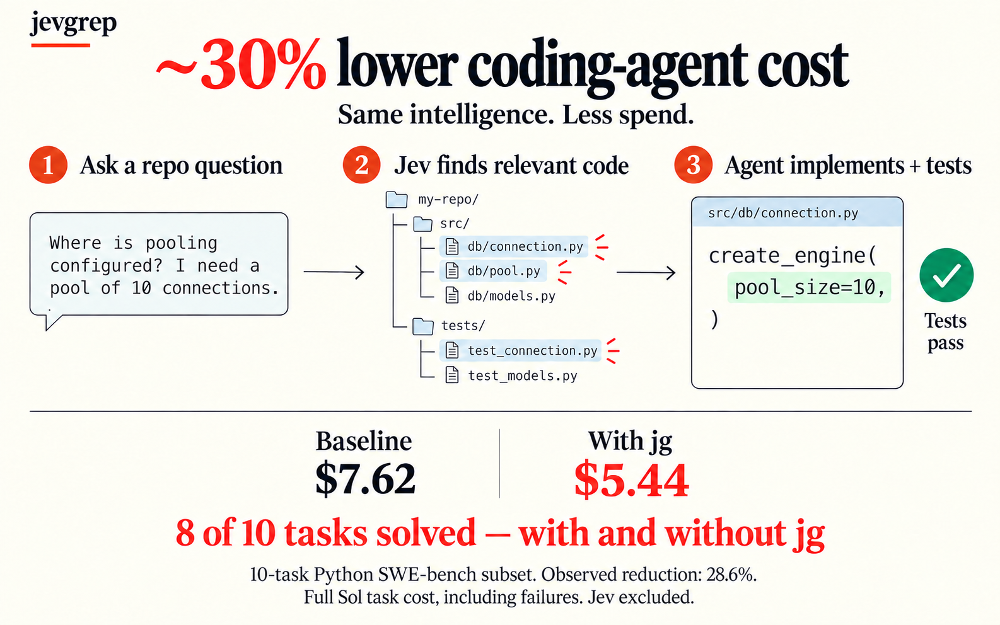
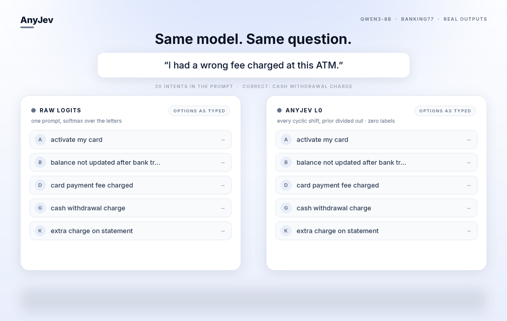
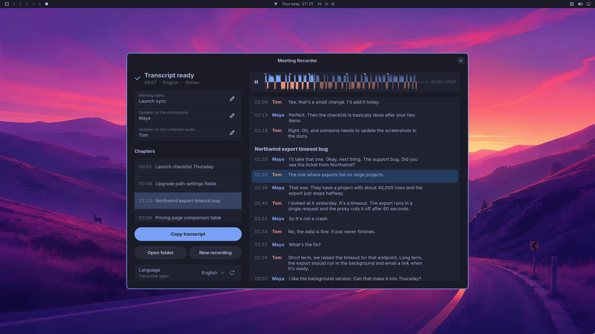

# 十个项目：从具体任务判断实用，而不按总 Star 排名

比较17个仓库候选，并交叉查看GitHub近期发现入口、HN/Show HN、作者文档与包目录。入选条目均核对规范仓库、许可证、维护记录和最小使用路径；本站未安装运行这些项目。作者演示、测试记录与仅文档描述分别标识，不用单次Star快照推算增长或长期热度。

| 任务 | 项目 | 先确认什么 |
| --- | --- | --- |
| 统一管理编码工具的模型配置 | Magpie | 提供商账号、接口和配置范围 |
| 先找到代码再让Agent修改 | Jevgrep | Node 22、检索API、完整成本 |
| 在小显存电脑运行大MoE | Strata | NVIDIA 12GB显存、64GB内存 |
| 让Agent配置部署依赖 | GoLive | 自有云账号、计划审核、费用与回收 |
| 将普通LLM变成有限选择接口 | AnyJev | 旋转预算、模型服务、校准数据 |
| 团队记忆与Slack问答 | Company Brain | Cloudflare、记忆与模型服务 |
| 查看本地编码Agent用量 | Agent Console | Node 22、计费估算与真实账单区别 |
| 长视频剪成短片 | BridgeClip | Electron/Python、云转录与LLM |
| 本地会议录制与转写 | Meeting Recorder | Linux音频、模型、后续Agent设置 |
| 切换论文、笔记与代码窗口组 | Rooms | macOS辅助功能权限 |

## 01 · Magpie：把模型配置管理与本地网关放到同一个入口

2026-09-24 · 新公开的桌面、终端和CLI工具。新近实用；热度待验证。

Magpie为多种编码工具集中管理模型配置，提供桌面、TUI和CLI，并用本地网关衔接OpenAI Chat、Responses与Anthropic等接口。一个实际场景是切换工作用和实验用模型时，不必逐个打开配置文件找字段；项目强调按需修改配置，而不是整份覆盖。

最小路径是下载对应平台发行版、配置已有提供商账号，再用桌面或`magpie tui`选择配置；源码桌面采用Go/Wails与系统WebView。代码许可MIT，模型调用和订阅服务各有自己的费用与使用条件。新近价值来自统一入口和可检查实现，不意味着任意订阅都能跨服务自由复用。本站查看了实现目录、作者说明和维护记录，未测试所有客户端组合。

[源码](https://github.com/yetone/magpie) · [MIT](https://github.com/yetone/magpie/blob/main/LICENSE)

## 02 · Jevgrep：先取带行号的相关代码，再把实现交给编码 Agent

2026-09-26 · 新公开的语义检索CLI及完整成本复测。新近实用；热度待验证。

Jevgrep接收自然语言问题和代码目录，逐层寻找相关文件，返回带行号的原文片段；编码Agent再据此修改。最小路径需要Node 22、macOS或Linux及支持的检索提供商，安装`@dzhng/jevgrep`后配置认证，再用`jg "问题" 路径`查询。代码片段会进入所选外部服务，不能称作全离线搜索。

值得看的是维护者把旧成本图补成[完整账单复测](https://github.com/dzhng/jevgrep/blob/main/evals/results/total-cost-2026-09-28.md)：十道经过调试的Python SWE-bench任务中，两组均解决8道，计入Jev费用后总成本少25.8%。它不是留出集，也没有方差估计；新轨迹与旧运行不同，不能把两组费用简单拼接。旧图约30%的数字只算主编码模型。MIT实现，本站未跑该基准；试用时要记录检索与编码两笔费用。

Jevgrep作者原图说明分层检索如何把相关片段交给Agent。图中旧的约30%节省仅计算Sol费用，不能视作完整账单；维护者后续十任务复测计入Jev后为25.8%，两组同为8/10成功。原图未改数字，此处保留其历史口径并作纠正说明。（[来源原图](https://github.com/dzhng/jevgrep)；[查看大图](images/jev-workflow.png)。）

[源码](https://github.com/dzhng/jevgrep) · [MIT](https://github.com/dzhng/jevgrep/blob/main/LICENSE)

## 03 · Strata：小显存跑大 MoE，靠的是CPU内存与存储分工

2026-09-25 · 新公开的消费硬件MoE运行方案。新近实用；热度待验证。

Strata围绕Qwen3.8 Flash Next等MoE模型，把专家计算、非专家部分和大嵌入表分配给CPU、GPU与存储。它解决的是有限显存下如何装入并使用模型，不是把全部参数凭空压成小模型。主路径需要NVIDIA约12GB显存、64GB内存及数十GB磁盘，首次模型下载也较大。

作者RTX 5070、Ryzen 5 7600、64GB内存例子中，Q2_0短上下文约90 token/s、128K约67；另一量化设置约52与41。速度随量化质量和上下文变化，不能只保留最快一格。Windows有启动脚本，Linux有对应安装路径；主代码MIT，模型权重许可另核对。为什么现在值得看：具体的内存分配与设备条件可用于判断自己的机器是否适合，本站未下载大权重或复测速度。

[源码](https://github.com/Niko1221/Strata) · [MIT](https://github.com/Niko1221/Strata/blob/main/LICENSE)

## 04 · GoLive：让部署先有计划，再记录资源归属和回收结果

2026-09-23 · 新公开的部署技能，当前为早期alpha。新近实用；热度待验证。

GoLive把托管、数据库、域名、支付测试与邮件等部署需求组织为“规划—批准执行—验证—记录资源”的流程，使用用户已有云账号。它适合Agent把一个本地应用送到可访问地址时，减少遗漏依赖或忘记资源由谁创建；不是另一个替用户托管的云平台。

需要Node 20以上、npm、Git与对应Agent及服务账号。作者验证记录覆盖多条真实部署路径，但支付使用测试模式，某些回滚只在模拟环境验证；不能写成所有资源都能可靠一键撤销。输出的状态和残留报告仍需查看。MIT许可，alpha阶段的新近价值是把部署与回收记录连起来；模型调用、域名及云资源可能收费，本站没有创建外部资源。

[源码](https://github.com/mikehasa/golive-skill) · [MIT](https://github.com/mikehasa/golive-skill/blob/main/LICENSE)

## 05 · AnyJev：普通模型也能做有限选择，但要付出旋转与校准预算

2026-09-28 · 9月21日建库，v0.2.0加入自适应选项旋转预算。新近实用；热度待验证。

AnyJev把一般LLM包装为有限选项判断接口。L0反复旋转选项顺序，汇总判断来削弱位置偏差；自适应预算尽早停止不必要旋转。作者一组实验从18次降到平均7.2次，约2.2倍吞吐变化，但“1%风险”指与完整循环结果不一致的风险，不是真实任务错误率只有1%。

最小路径可安装`anyjev[hf]`，接入HF/vLLM模型，先用明确候选做分类；模型/GPU预算另计。L2还可训练线性输出头，需隐藏状态与标注数据，不能把它与无标签L0混为一谈。Apache-2.0，28日v0.2是实质近期变化。本站核对实现和作者实验，未测不同模型上的速度或校准。

Nokia Applied Research的选项旋转示例，Apache-2.0。左侧原始logit随选项位置改变，右侧汇总结果更稳定；主体是单个BANKING77例子的动态演示，底部另报300例顺序反转比例；两种分母不同，不证明所有任务同样准确。（[来源原图](https://github.com/nokia-applied-research/AnyJev)；[查看大图](images/anyjev-rotation.gif)。）

[源码](https://github.com/nokia-applied-research/AnyJev) · [Apache-2.0](https://github.com/nokia-applied-research/AnyJev/blob/main/LICENSE)

## 06 · Company Brain：把团队知识、私有上下文和工具访问一起组织

2026-09-26 · 近期公开完整应用实现。新近实用；热度待验证。

Company Brain把Slack讨论等上下文变成可检索记忆，再支持团队问答与MCP工具调用。文档区分公共频道共享记忆、私有频道与个人对话的可见范围，适合反复询问项目背景的团队；权限规则是实现需要验证的部分，不能据README直接保证任何接入都不会越权。

部署依赖Cloudflare Workers、D1、KV、Durable Objects，以及Supermemory和模型API配置，部分执行路径还使用Daytona。代码Apache-2.0并不意味着所需云服务免费。为什么现在值得看：北京时间26日新公开的实现让团队记忆的存储、检索和权限路径可以被检查；文档示例展示预期流程，本站未导入真实团队数据或做权限对抗测试。

[源码](https://github.com/supermemoryai/company-brain) · [Apache-2.0](https://github.com/supermemoryai/company-brain/blob/main/LICENSE)

## 07 · Agent Console：本地看编码 Agent 用量，先区分估算和账单

2026-09-27 · 北京时间9月21日建库；27日发布v0.4系列及v0.4.1。新近实用；热度待验证。

Agent Console读取Claude Code、Codex等本地会话记录，汇总token、缓存、模型和任务通道，用于找到开销集中在哪里。无需先部署服务器，Node 22环境可从源码以`node bin/agent-console.mjs --demo --open`查看演示；当前路径不是假定已有稳定npm发行包。

价格按公开单价等信息估算，不能替代服务商账单，缓存和订阅计费会造成差异。团队模式需主动配置，默认共享汇总计数而非完整提示词。MIT许可；27日系列版本使这个近期工具有明确维护记录。本站只核对作者演示和实现，没有读取用户私人会话，下面图中的金额全部来自项目自己的虚构demo。

Agent Console维护者提供的DEMO界面。任务通道和缓存分项用于解释费用集中位置；所有金额与记录是作者演示数据，不是本站实测、用户账单或节省证明。MIT项目资料。（[来源原图](https://github.com/LockedinLabs-AI/agent-console)；[查看大图](images/agent-console-demo.png)。）

[源码](https://github.com/LockedinLabs-AI/agent-console) · [MIT](https://github.com/LockedinLabs-AI/agent-console/blob/main/LICENSE)

## 08 · BridgeClip：从长视频中选短片，同时留下剪辑依据

2026-09-25 · 新公开的桌面剪辑工作流。新近实用；热度待验证。

BridgeClip接收本地视频或链接，经过下载、语音转写、模型选段，再用FFmpeg制作字幕与不同画幅短片。界面保留转录、入选区间和修剪依据，适合把访谈、教程整理成可复核的小片段；自动评分不能当作发布后的真实传播效果。

应用采用Electron/Node与Python引擎，源码先按贡献文档安装两侧依赖，再运行`npm run dev`。下载依赖yt-dlp，转录和规划通过OpenRouter等服务，尽管最后渲染本地完成，也不是全离线。可选语义检查可能少产出甚至不产出片段，边界修复有次数限制。MIT实现，北京时间25日新公开的价值是把选段和回溯放在同一流程；本站未上传视频、调用收费API或发布内容。

[源码](https://github.com/bridge-mind/bridgeclip) · [MIT](https://github.com/bridge-mind/bridgeclip/blob/main/LICENSE)

## 09 · Meeting Recorder：麦克风和电脑声音分开录，再生成可回听转录

2026-09-24 · 新公开的Linux会议记录应用。新近实用；热度待验证。

这款Omarchy/Hyprland应用分别录制麦克风与系统声音，通过whisper.cpp生成带说话人信息的转录，并可点击段落回听。一个实用场景是边复核原声边整理技术讨论，而不是仅拿一份不能追溯的会议摘要。

依赖Rust、GTK4/libadwaita、PipeWire与FFmpeg，语音模型也需下载；新版构建可用Vulkan，没可用GPU则回落CPU，长录音处理可能较慢。录音和转写本地进行，但章节或自定义整理动作可调用已有编码Agent，文本是否发往云端取决于该Agent配置。MIT许可。作者截图里的会议是编造内容并用Piper配音，下面只用它说明界面；本站未录制用户会议或检验真实多人识别率。

作者提供的会议播放器界面，MIT项目资料。转录段落与音轨对应，便于点击回听；演示会议内容为作者编写并用Piper合成，不能当作真实会议识别结果。文字密集时请打开原尺寸。（[来源原图](https://github.com/jankeesvw/omarchy-meeting-recorder)；[查看大图](images/meeting-recorder.webp)。）

[源码](https://github.com/jankeesvw/omarchy-meeting-recorder) · [MIT](https://github.com/jankeesvw/omarchy-meeting-recorder/blob/main/LICENSE)

## 10 · Rooms：把论文、笔记和代码窗口存成一个可切换的工作组

2026-09-24 · 新公开的macOS窗口组工具，v1.0.1。新近实用；热度待验证。

Rooms按任务保存和切换窗口组：例如读论文时同时展开PDF、笔记和实验代码，换任务时恢复另一套位置。它管理现有应用窗口，离开一个房间主要隐藏其他窗口而非关闭应用；这是研究工作流的辅助工具，不是AI模型或会自动理解文档的助手。

需要macOS及辅助功能权限，按项目发行说明下载对应版本后配置窗口组。应用本地工作，不要求模型服务；恢复机制不能保证所有应用退出或崩溃后仍完整还原。MIT许可，北京时间24日新公开的价值是提供较轻的任务切换方式。本站检查了文档与发行记录，未操作用户窗口；原宣传封面不能说明真实布局变化，因此保留文字步骤。

[源码](https://github.com/saragordic/rooms) · [MIT](https://github.com/saragordic/rooms/blob/main/LICENSE)
