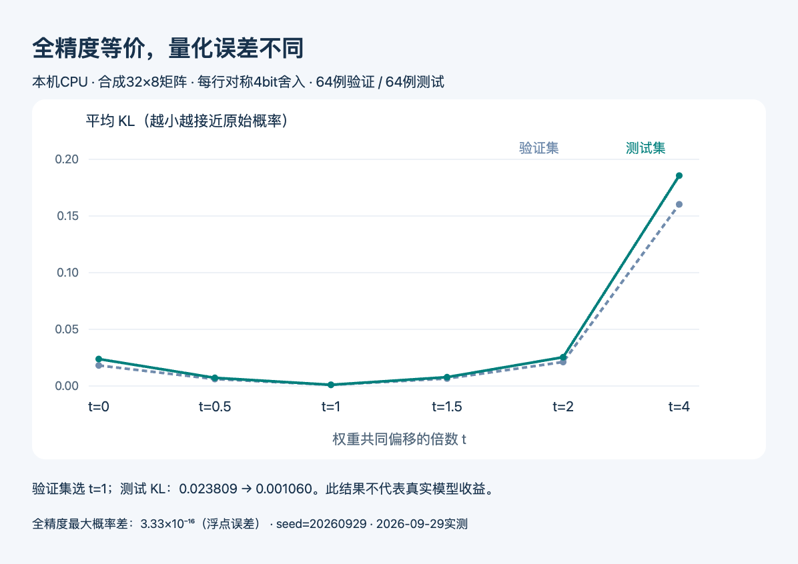

# 小实验：减去同一个方向，为什么概率不变而量化误差会变

**已运行验证：本机CPU、Python 3.14.3、仅标准库。** 本实验使用固定随机种子的32×8合成矩阵，不加载真实模型，不代表论文中的W4/G128训练或部署结果。对应[今日第六篇论文](03-论文精选.md)的一个代数现象。

## 1. 先看不变的是什么

输出头把隐藏状态h映射为logit：`z = W h`。如果W的每一行都减去同一向量` t × μ`，新的每个logit都会减去相同标量` t × μh`。Softmax先指数化再归一化，共同的乘数会抵消，所以概率不变。这里μ取所有权重行的均值，t控制平移多少。

本机对128个隐藏状态、6个t逐一比较，最大概率差为`3.33e-16`，属于浮点舍入尺度；代码中用`1e-12`阈值作断言。这个检查验证的是同一个数学函数，不是模型准确率。

## 2. 再加入不可逆的舍入

给每行权重一个独立尺度，将值映射到整数`[-7,7]`后再还原。原来相同的共同偏移，会影响这一行的数值范围，进而改变舍入后的间距。我们特意构造带共同偏移的合成权重，用来让现象容易观察；这不是随机抽取现实模型后的统计结论。

```python
shifted = [[x - t * m for x, m in zip(row, mean)] for row in weight]
scale = max(abs(x) for x in shifted_row) / 7
quantized_row = [round(x / scale) * scale for x in shifted_row]
```

64个隐藏状态用于选择t，另外64个只用于测试。比较量化概率与原始全精度概率的平均KL；值越小，二者越接近。只在验证集选t，避免直接用测试集调参数。

| t | 验证KL | 测试KL |
| --- | --- | --- |
| 0 | 0.018124 | 0.023809 |
| 0.5 | 0.006117 | 0.007215 |
| 1 | 0.000996 | 0.001060 |
| 1.5 | 0.006557 | 0.007808 |
| 2 | 0.021146 | 0.025414 |
| 4 | 0.160296 | 0.185634 |

验证集选中t=1，测试KL从0.023809到0.001060；但t=4反而明显变差。因此可学到的是“先验证候选平移”，而不是“偏移越多越好”或“所有模型去均值都更好”。




本机实测合成矩阵结果；HTML/JS依据同目录JSON绘制，非AI生成数据。虚线为验证集、实线为测试集，纵轴从0开始且两组同尺度。来源论文原图不能代表本次运行，生成图也不适合表达精确数值，因此采用可复现程序图。（[方法来源](https://arxiv.org/abs/2609.31291v1)；[查看大图](images/softmax-local-result.png)。）


## 3. 怎样重跑，以及这次没有验证什么

下载[完整Python脚本](code/softmax-toy.py)，在Python 3运行：

```bash
python3 softmax-toy.py
```

脚本保存[本次实际JSON输出](code/softmax-results.json)。[绘图HTML/JS](code/softmax-plot.html)包含当前结果快照，可在浏览器打开并截图；改实验后需同步其中的DATA记录。没有额外包、GPU、API key或网络请求。

本例没有分组量化、真实语言模型隐藏状态、softcap、输入输出嵌入绑定或推理内核，不能报告模型困惑度、token速度或显存节省。原论文对这些条件另有讨论；尤其非线性之前的公共偏移不能随意省略。正确的下一步是在独立校准、验证和测试材料上评估真实模型，而不是把本次合成结果复制成部署承诺。
