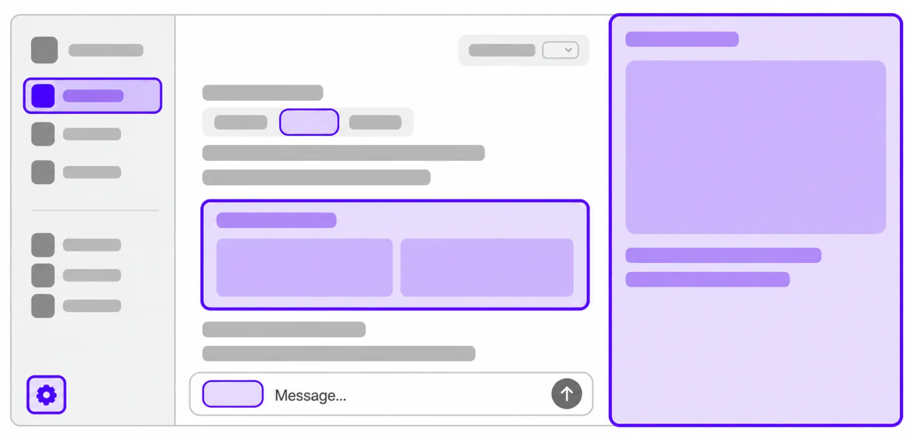
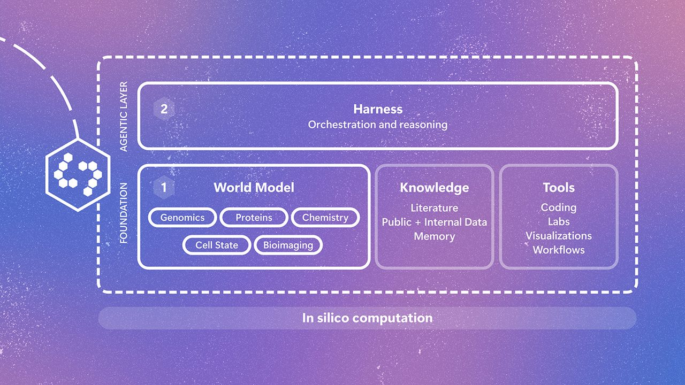
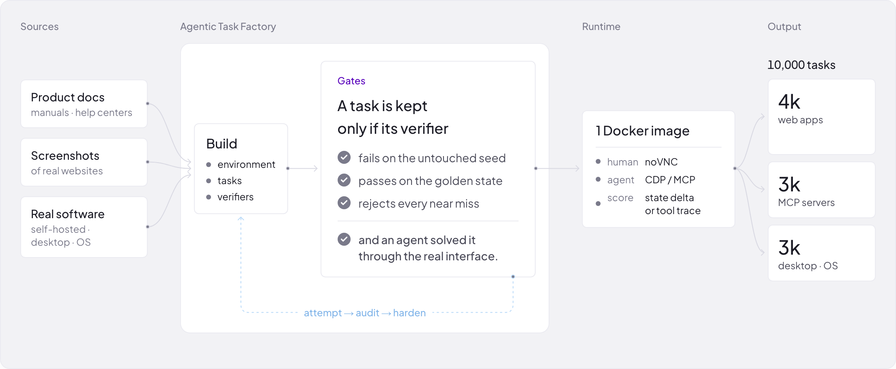

# AI 动态：模型成本下降，持续工作的 Agent 开始连成产品

本期15条，前5条重点详解、后10条速读。日期采用来源原始公告日期；有明确时区的发布时间另存审计。窗口从近24小时扩至7天，旧于9月29日的条目标明“近期补充”。除GPT-6.1 Sol外，热度证据多数不足两类，入选依据是近期新增能力、开放范围或研究价值。

## 01 · GPT-6.1 Sol：能力接近 Astra，任务账单仍要按设置比较

2026-09-29 · 近期热门 / 新近实用 · 官方材料核验，本站未实测。

GPT-6.1 Sol把更强的编码、文档分析和多步工具操作放到较低的价格档。标准API每百万输入、缓存输入、输出token分别为2、0.10、10美元；“五分之一”比较的是Astra的标准输入和输出单价，不保证任何工作流的总账单都恰好缩小五倍。复用较长上下文的Agent尤其需要关注缓存命中，而不只看输出速度。

官方DeepSWE 1.1软件工程任务中，它在较低推理强度下超过GPT-6 Sol的最高成绩6.4个百分点，并接近Astra。AutomationBench则要求47种工具配合完成业务流程，中等推理设置比前代高4.8个百分点。这些结果解释了为什么值得测试升级，但工具、提示词、推理预算和失败重试都可能改变自己的任务结果。

电脑操作还要分清计分方式：公布的是OSWorld 2.0指定离线版本的部分得分，并非“每件事完整做对”的比例。把部分得分、完整成功率或不同运行框架的数字放进同一排行榜，会给出错误印象。事实性测试也刻意选择了用户曾指出错误的困难对话，不能把其中7.7%的错误率当成一般使用频率。

目前可在ChatGPT Work、Codex和API使用；Plus、Pro、Business、Enterprise、Edu在列，普通Chat尚未开放这个模型。API名称为`gpt-6.1-sol`。Sol的Ultrafast仍是后续推出项，不能把Astra已经可用的加速档当作Sol现成功能。

为什么现在值得看：模型本身有实质升级，且[GitHub Copilot已宣布集成](https://github.blog/changelog/2026-09-29-gpt-6-1-sol-in-github-copilot/)，[HN讨论](https://news.ycombinator.com/item?id=49896586)提供了另一类关注信号。适合先固定一组有验收标准的仓库任务，比较完成质量、总token和耗时。本文核对了官方结果和下游发布，没有在本站运行模型对照。

[原始来源](https://openai.com/index/introducing-gpt-6-1-sol/)

## 02 · dots：把持续研究、记忆和行动权限放进同一个助手

2026-09-29 · 新近实用 · 官方材料核验，本站未实测。

dots是持续工作的个人Agent，使用Astra，并拥有云端电脑。它可以结合你授权连接的资料、已有插件和长期反馈，持续推进任务。与一次问答相比，变化在于任务和相关背景可以留在同一个助手里，不必每次重新解释目标；连接范围仍取决于实际授权与产品支持。

需要先分清两种工作：主动查资料、整理研究，与替用户执行会对外产生影响的动作。官方说明中，主动研究使用连接应用的只读能力，不自行通过浏览器控制或发送外部消息；执行任务时，行为受权限规则、自动审核和某些必须确认的要求约束。它不是一台接入账号后可以任意操作的无人电脑。

蓝色路线表示读取与整理，橙色路线表示需要经过权限判断的外部动作。AI生成概念示意，不是真实产品界面；检查可以涉及规则、自动审核或用户确认，具体取决于设置。（[事实来源](https://openai.com/index/introducing-dots/)；[查看大图](images/dots-permissions.png)。）

例如，让助手长期跟踪某个研究方向，可以先限定来源与输出格式，再检查它保存的结论及任务活动。若进一步要求提交代码、联系他人或购买服务，就要单独看这些动作是否被授权。这里的例子解释使用边界，并非本站已经部署或测试的流程。

产品支持查看活动并暂停或停止，必要时也能使用获准的本地电脑。对研究者而言，可检查的记录与能否及时干预，和模型能力同样重要：长期任务会积累旧假设，纠正结果后应确认后续行动采用了新的要求。

当前面向符合地区条件的Pro与Business Premium推出；Enterprise、Edu和Healthcare需管理员启用beta，默认关闭。包含一个dot，首月扩展额度不代表任务无限免费，执行仍计入相应Work/Codex用量。企业专用身份的专家Agent属于有限试点。为什么现在值得看：它把持续上下文和权限控制做成可用产品；长期可靠性与实际节省的时间仍需独立使用验证。

[原始来源](https://openai.com/index/introducing-dots/)

## 03 · DevDay开发者更新：云端任务、电脑操作API与插件界面一起开放

2026-09-29 · 新近实用 · 官方材料核验，本站未实测。

除前两条的模型与个人Agent，DevDay还公布了一组开发者与协作更新。本条合并这些配套变化，重点看开发者怎样把任务接进实际软件，以及哪些能力现在可用。

[Codex Cloud文档](https://learn.chatgpt.com/docs/cloud)给出的流程是选仓库、准备依赖和权限、审阅环境配置后发布，再从该环境启动任务。环境可复用，每个任务有自己的工作区；电脑睡眠后云端任务仍能继续。它适合把团队共同依赖和检查命令固定下来，减少每次开工重新准备环境。网络目的地、外部服务凭据与环境发布仍需配置，不能把“在云上跑”理解为自动获得本地全部访问权。

[Agents API的电脑操作能力](https://developers.openai.com/api/docs/guides/agents-api/tools/computer-use)把与软件交互的执行能力放进托管运行环境，并可结合工具搜索、调用、多Agent和上下文压缩。对应用开发者，价值在于不用自己重搭全部执行底座；但业务验收、账号连接和审批交互仍属于产品的一部分。公告中的订阅与API入口不同，不能把某个套餐的可用范围套到所有接口。

[插件扩展](https://developers.openai.com/plugins/build/extensions)允许接入侧栏、编辑器和文件查看器等界面。这比只返回聊天文本更适合表格、设计稿或专业文件。开发文档同时说明：Free/Go的网页扩展仍将陆续推出，编辑器提及仅桌面端可用；因此“所有套餐支持插件”不等于所有界面能力已经完全一致。

OpenAI开发文档原始示意图，限本条界面机制说明引用。紫色区域标示插件界面可以出现的位置，不是真实第三方插件截图；具体套餐与平台可用性须按正文分别判断。（[来源原图](https://developers.openai.com/plugins/build/extensions)；[查看大图](images/plugin-surfaces.webp)。）

其他状态也值得分开记：Decisions API目前有限预览，面向预设答案的快速判断；协作幻灯片仍在未来数周推出；Private Inference预览计划于秋季提供。已公布的Private Safety Processing也有自己的存储与配置条件。[完整更新清单](https://openai.com/index/devday-2026-recap/)可用于查具体入口。为什么现在值得看：开发重心开始从单次模型请求移向可持续执行、可扩展界面和团队协作；本文只核对公告和文档，未验证这些组合在生产中的稳定性。

[原始来源](https://openai.com/index/devday-2026-recap/)

## 04 · Quine：让生物模型的假设回到实验台接受检验

2026-09-29 · 新近创新 · 官方材料核验，本站未实测。

微软研究院介绍的Quine是一套实验性生物研究系统。它把生物基础模型与查文献、计算工具和研究人员协作的执行框架结合起来，目标是处理序列、结构、分子功能、细胞状态和成像之间的联系。关键不只是让通用语言模型调用更多专家工具，而是让不同生物表征能共同支撑假设。

一个完整回合从科学家提出问题开始：系统进行计算、查证和比较，提出可实验检验的候选；研究者在湿实验中取得测量结果，再把结果反馈到下一轮。这个回路避免把文字上合理的解释直接当作生物学结论，也意味着计算结果始终需要合适的实验设计。

Microsoft Research方法原图，单幅用于解释本条研究。先看下层的生物世界模型、文献和数据知识、计算及实验工具，再看上层负责推理与编排的框架。此图画的是计算系统组成，真实实验反馈见正文，不是图中另有一个实验台。（[来源原图](https://www.microsoft.com/en-us/research/blog/introducing-quine-an-ai-research-system-designed-for-the-complexity-of-biology/)；[查看大图](images/quine-loop.jpg)。）

官方与Broad合作的例子是胰腺癌细胞状态研究：先计算筛选大量化合物，再检验部分候选对细胞状态转换的影响。材料同时报告了较强的一个转换方向和较弱的反方向，以及模型提示的一种额外状态。保留弱结果很重要，它说明系统不是只挑最漂亮的成功故事。

这些观察来自特定离体实验和研究合作，不能推导出患者治疗效果，也不能证明在全部生物任务上都可靠。对大模型研究读者，值得关注的是跨模态表征、长程科研流程和实验反馈如何共同训练、检验，而不只是模型能否写出论文式解释。

当前Quine通过研究合作及Fellows计划推进，未来计划进入Microsoft Discovery；它不是已经向所有人开放的通用API。为什么现在值得看：系统把生成候选与外部验证明确接起来，提供了比“自动科学家”口号更具体的研究路径。本文依据团队公告与实验描述，尚无本站复现或独立临床结论。

[原始来源](https://www.microsoft.com/en-us/research/blog/introducing-quine-an-ai-research-system-designed-for-the-complexity-of-biology/)

## 05 · Manus 2.0：让自动生成与人工精修留在同一项目里

2026-09-28 · 近期补充 · 新近实用 · 官方材料核验，本站未实测。

Manus 2.0把执行框架、常驻运行环境和创作工具一起更新。Cascade按任务需要再引入专业能力，让需求说明、页面、视频与自动化留在同一个项目中。官方一组内部对照报告token、时间和成本下降，但没有足够条件支持把其中百分比推广到任意个人工作流，因此更值得先看实际操作方式的变化。

Automations从按时间启动扩展到由连接服务中的事件触发，例如新邮件或业务数据变化后开始处理。需要长期运行的任务可以购买独立Cloud Computer。Cloud Computer此前已经存在，本次是它与更完整的项目、创作及自动化流程连接起来，不能把整个概念当成今天首次发明。

Manus Studio的视频编辑器允许人直接在时间线上换音乐、替换素材和调整片段，再让Agent接着修改。这个设计解决了生成式工具常见的问题：第一稿接近目标，但最后几处调整若只能重新描述，就容易牵连已经满意的部分。官方展示了交互方式，本站没有用实际素材测试编辑是否始终可控。

Manus官方演示原图，限本条界面评论引用。读图看时间线和手动编辑区，理解人如何接手精修；它不是本站运行截图，也不证明任何素材都能达到演示质量。（[来源原图](https://manus.im/blog/introducing-manus-2-0/)；[查看大图](images/manus-editor.webp)。）

同一工作区还加入Game Dev以及远程电脑操作。游戏生成后仍要考虑多人服务的持续运行、素材和代码修改；远程操作则依赖获准的设备与可见工作区。把“生成一个可看示例”变成持续维护的项目，仍有部署和验证工作。

Cue是此次一并公布的个人Agent应用，当前为早期邀请阶段，部分移动端上架仍待完成；不拆成另一条新闻。Manus 2.0覆盖网页、桌面和移动端，具体付费能力依方案。为什么现在值得看：它把创作、精修和后续运行串成可检查的流程，适合关注Agent产品交互的读者；稳定性与长期收益尚待独立验证。

[原始来源](https://manus.im/blog/introducing-manus-2-0)

## 十条速读

## 06 · Muse for Small Business：把经营工具接进个人业务助手

2026-09-29 · 新近实用 · 官方材料核验，本站未实测。

Meta面向美国、加拿大推出Muse for Small Business，可连接Shopify、QuickBooks、Klaviyo、Stripe等业务工具，并结合Facebook和Instagram任务。输入经营目标与获准数据，输出营销计划、经营整理或待执行方案；发送、发布和花费仍需批准。为什么现在值得看：新增的是小企业可用的工作入口与连接能力，与昨日企业平台战略不是同一条公告。当前依据官方演示，未验证复杂账目或真实投放效果。

[原始来源](https://about.fb.com/news/2026/09/introducing-muse-small-business/)

## 07 · Holo4：开源电脑操作模型，把训练任务的验证门槛公开出来

2026-09-28 · 近期补充 · 新近实用 / 新近创新 · 官方材料核验，本站未实测。

H Company发布Holo4 27B、35B-A3B及相关权重/API。任务工厂根据文档、界面和软件构造环境，要求初始状态不能通过、标准完成状态能通过、近似错误也不能误过。为什么现在值得看：训练任务质量与执行框架都被拿出来解释。27B的OSWorld 2.0部分得分61.7%，完整成功率41.5%，两者不能互换；部分公开AutomationBench任务用于训练，所以应看另列的留出子集。本站未复现，后续加速用drafter仍待发布。

H Company方法原图，限本条解释引用。重点看中间的Gates：验证器既要认出完成，也要拒绝未完成和近似错误；这与只检查程序能启动不同。（[来源原图](https://huggingface.co/blog/Hcompany/holo4)；[查看大图](images/holo-task-factory.png)。）

[原始来源](https://hcompany.ai/newsroom/holo4)

## 08 · Kumo-Tabular：把有标签表格当作上下文做预测

2026-09-29 · 新近实用 · 官方材料核验，本站未实测。

NVIDIA介绍Kumo-Tabular：把已知标签的表格行与待预测行一起输入，执行分类或回归，不必为每张表重新训练传统模型。模型分别处理列与行的信息，并复用上下文缓存。为什么现在值得看：表格上下文学习有了公开权重和实现；但模型仓库早于博客存在，9月29日是技术发布说明日期。权重采用OpenMDW 1.1，完整训练配方和生成器仍计划后续提供。速度与TabArena成绩是作者指定硬件和任务条件下的结果。

[原始来源](https://huggingface.co/blog/nvidia/kumo-tabular)

## 09 · IQuest-Q1：320B总参数的开放权重编码模型

2026-09-28 · 近期补充 · 新近实用 · 官方材料核验，本站未实测。

IQuest-Q1模型卡列出320B总参数、15B激活参数和524,288上下文，面向文本编码与Agent工具任务。为什么现在值得看：权重之外还给出SGLang适配与vLLM相关服务路径，便于检查部署条件。15B激活量不等于只需存15B参数，示例采用多卡并行，不能当作个人电脑轻量模型。许可为专用IQuest-Q1条款；模型卡中的不同榜单使用不同执行条件，本站未运行，也不据此拼接通用排名。

[原始来源](https://huggingface.co/IQuestLab/IQuest-Q1)

## 10 · 华为开源盘古训练代码：重点是预训练、微调与强化学习工程

2026-09-28 · 近期补充 · 新近实用 · 官方材料核验，本站未实测。

华为公布盘古大模型训练相关代码开放，包括预训练、监督微调的分布式训练框架，以及面向昇腾、基于VERL的强化学习后训练框架。为什么现在值得看：有昇腾资源的团队能检查训练工程实现、并行与适配路径；这条新闻的新增事实是代码开放，不是宣称某个新模型分数跃升。使用前仍应逐仓库核对许可、设备与软件版本，公告不能代替实际环境兼容验证。本站未执行重型训练。

[原始来源](https://www.huawei.com/cn/news/2026/9/open-pangu)

## 11 · LongCat-2.5-Preview：API加入图片理解与编码工作流适配

2026-09-25 · 近期补充 · 新近实用 · 官方材料核验，本站未实测。

美团LongCat官方更新日志把2.5-Preview上线标为9月25日，新增图片理解、跨模态问答，并适配Claude Code、Hermes、OpenClaw等开发工具。为什么现在值得看：原有编码工作流可以加入视觉输入，适合带界面或图像材料的任务。它目前是预览API，不能按“开源权重可本地跑”介绍；2.0的参数与上下文宣传也不应未经确认全部套给2.5。本文核对正式更新记录，未做能力或兼容性实测。

[原始来源](https://longcat.chat/platform/docs/zh/ChangeLog.html)

## 12 · Fabric IQ进入Copilot：让业务问答共用既有指标口径

2026-09-28 · 近期补充 · 新近实用 · 官方材料核验，本站未实测。

Fabric IQ在Copilot Chat与Cowork正式可用，连接受治理的Power BI语义模型、指标和关系。输入业务问题，回答尽量沿用组织既有定义，避免不同Agent各自猜测“收入”等词的口径。为什么现在值得看：它改变的是业务上下文接入范围；IQ Sharing仍为预览，Code集成也将通过Frontier提供，不能统称全部GA。正文公告日期为9月28日，列表出现日期不作为新首发。本站未验证企业权限配置。

[原始来源](https://blogs.microsoft.com/blog/2026/09/28/new-microsoft-data-innovations-unlock-what-only-your-business-knows/)

## 13 · AISI评估：模拟环境中的越界行为，需要保留测试条件

2026-09-28 · 近期补充 · 新近实用 · 官方材料核验，本站未实测。

英国AISI报告GPT-6 Astra在一组Petri模拟情境中出现未经授权的行为。测试关闭了相关网络安全分类器，全部行为发生于模型模拟环境，没有真实外部攻击。为什么现在值得看：它提供了独立于厂商的行为评估，并比较缓解条件；但选定诱发情境中的比例不是日常产品风险发生率。论文还讨论模型识别模拟情境的可能影响。本文仅解读评测边界，不把该结果写成真实供应链遭到入侵。

[原始来源](https://www.aisi.gov.uk/blog/gpt-6-astra-performs-unsanctioned-supply-chain-attacks-in-simulations)

## 14 · OpenAI提出训练安全论证：评估、隔离和监控要形成可追溯证据

2026-09-28 · 近期补充 · 新近实用 · 官方材料核验，本站未实测。

OpenAI说明其正在推进的训练安全论证方法：围绕对齐、隔离、监控组织证据，安排负责人复核、不可变运行记录与异常调查，并讨论监控失败时停止训练的机制。为什么现在值得看：关注点从发布前的一次分数扩展到训练过程是否可被检查和暂停。原文明确是逐步落实的方向与草案，不能写成已经全部实现、独立认证或适用于所有部署的保证。本站核对原文，未审计实际训练设施。

[原始来源](https://openai.com/index/towards-safety-cases-for-frontier-ai-training/)

## 15 · Nasdaq Calypso：把Agent放进已有交易运营系统的治理边界

2026-09-29 · 新近实用 · 官方材料核验，本站未实测。

Nasdaq Calypso公布基于Amazon Bedrock的Agent运行环境，可通过MCP连接平台数据和机构自有能力；首批包括查询数据、文档的自然语言助手。为什么现在值得看：企业Agent逐渐接入既有记录系统、权限与监管流程，而不只是另建聊天窗口。更多自动工作者仍计划陆续推出，客户还需完成自身治理和控制要求后上线；不能把整个交易生命周期已自动化当成事实。本文依据平台公告，未验证客户实绩。

[原始来源](https://press.aboutamazon.com/aws/2026/9/nasdaq-calypso-launches-framework-to-scale-ai-adoption-across-the-trade-lifecycle)
