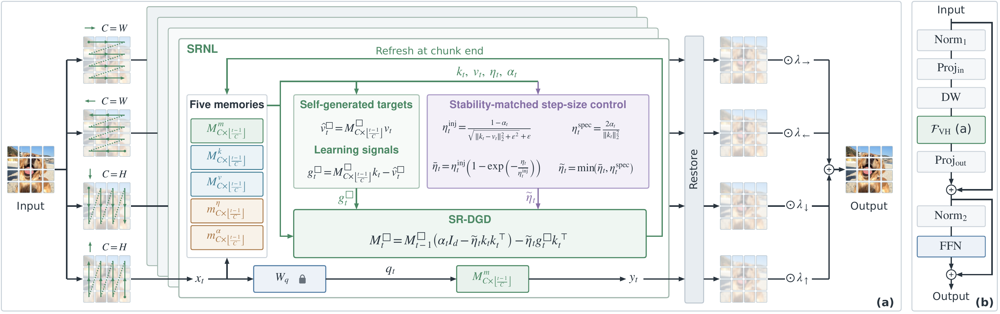
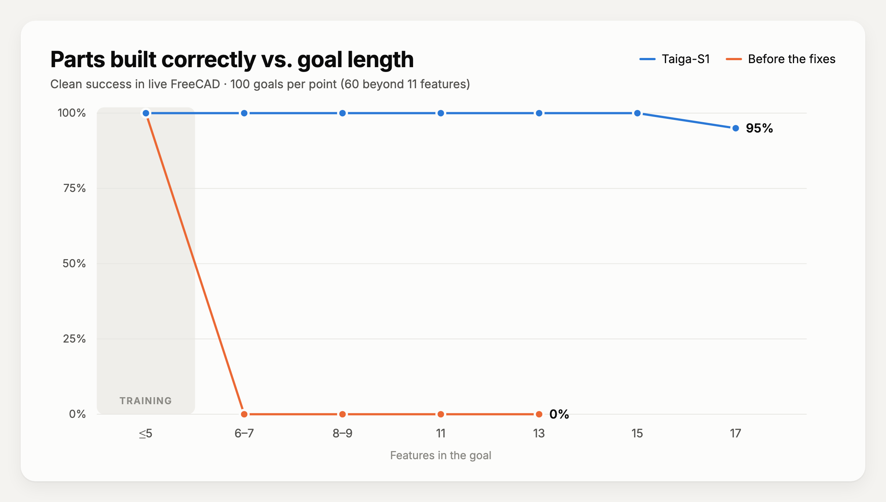
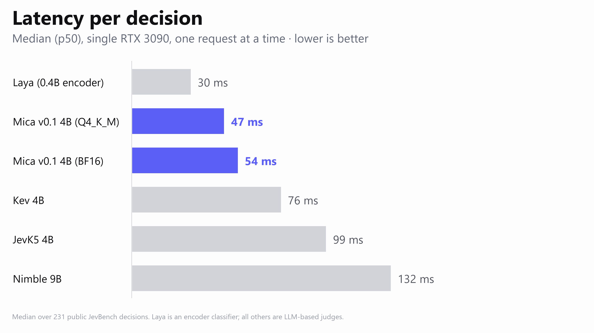
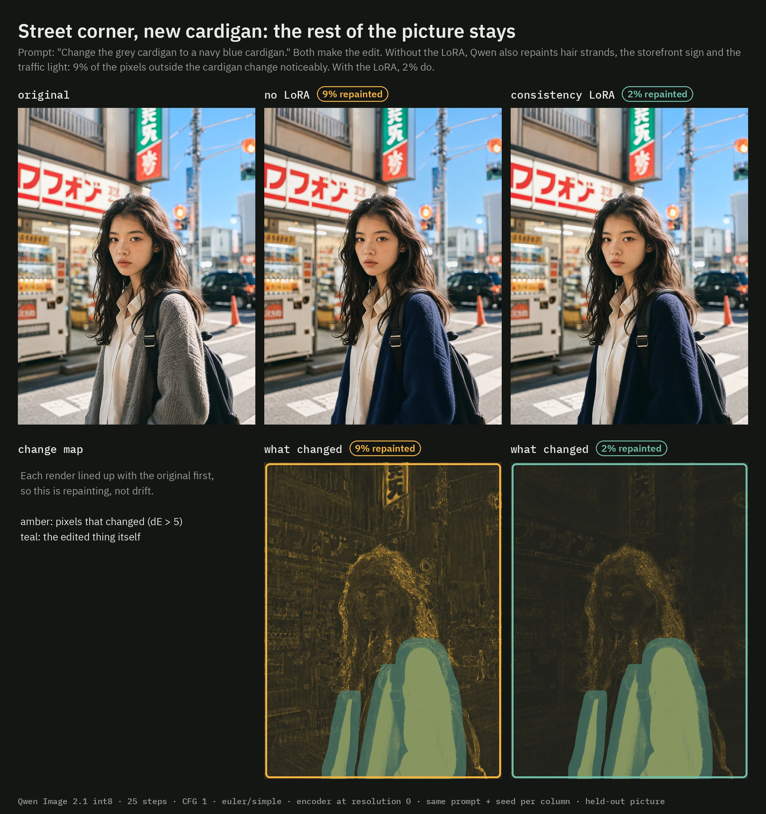
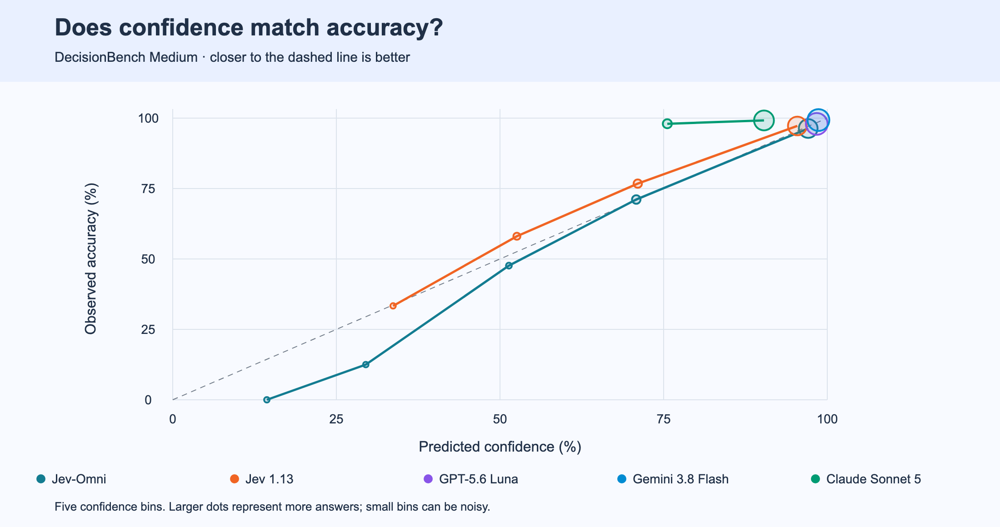

# 六模型：看输入输出，也看能力边界

本栏包含视觉骨干、语音合成、CAD动作模型、有限选项判断和图像编辑适配器。“开源模型”是栏目名，不代表六项都采用相同的宽松许可：Gemma条款与Qwen研究许可有额外约束。作者测试、模型卡说明与本站实测分别标识；本期没有运行这些大模型。条目日期保留模型卡或HF原始日期口径；精确建库UTC时间与实际采集时间另存来源审计。

| 具体任务 | 对象 | 使用时先核对 |
| --- | --- | --- |
| 图像分类与密集预测 | VisionHOPE | CUDA扩展与任务依赖 |
| 参考音色、风格合成语音 | Irodori v4 Large | 语音许可、读音回退与资源 |
| 有限CAD特征计划执行 | Taiga-S1 | FreeCAD状态接口与动作词表 |
| 文本状态选择预定义答案 | Mica 4B | 量化服务、校准与测试泄漏边界 |
| 图像局部编辑保持布局 | Consistency LoRA | 研究许可及过拟合限制 |
| 多模态状态选择答案 | Jev-Omni | 12B权重的真实显存成本 |

## 01 · VisionHOPE：一边读取图像，一边调整记忆的更新方式

2026-09-29 · 新近实用 / 新近创新 · 热度待验证。

VisionHOPE把图像特征沿四个空间方向扫描，内部的五种耦合记忆同时维护内容、键值映射与更新控制。直觉是：不仅“当前记住什么”会变化，“下一步怎样写入和保留”也随上下文变化。稳定性约束用于避免记忆更新无限放大，四方向结果还原空间位置后融合。

PSRben团队MIT仓库方法原图。先看左侧多个扫描方向，再看内部记忆与更新控制的联系；它是视觉特征骨干，不是能持续改写自身代码的通用Agent。（[来源原图](https://github.com/PSRben/VisionHOPE)；[查看大图](images/visionhope-architecture.png)。）

9月29日公开Tiny、Small、Base的ImageNet检查点，并提供COCO检测/实例分割与ADE20K分割权重。为什么现在值得看：新近论文的方法有了不同任务的实际检查点，而不只有结构图；可以先用分类输入验证，再分别核对密集预测的配置。

最小路径依赖Linux、NVIDIA GPU、CUDA 12.1、PyTorch 2.1与编译工具；首次使用会构建CUDA扩展。COCO/ADE20K还需相应OpenMMLab依赖，不能只安装一个通用包就假定全部任务能跑。公开接口保持张量形状，但这不等于能无成本替换任何现有骨干。训练、数据与效率结论来自作者材料。

[权重与模型卡](https://huggingface.co/PSRben/VisionHOPE) · 许可：MIT。本站未推理实测。

## 02 · Irodori v4 Large：更强的音色描述遵循，也有读音取舍

2026-09-27 · 新近实用 / 新近创新 · 热度待验证。

这个日语语音合成模型接收文字、参考音频和风格描述，输出48kHz语音。Large约3.29B参数，相对766M的Small扩大了编码能力；多个参考片段可合并使用，作者测试到120秒参考长度。参考更长主要提供说话者信息，不代表输出必然更自然。

风格遵循测试使用8,670条样本和单一Gemini裁判，平均分从Small的4.2339到4.2991，差约0.065；这不是人类听感MOS。读音检查反而显示常用汉字准确率92.80%，低于Small的93.42%，JSUT假名字符错误率也从3.43升至3.67。选择大模型时应同时听音色和检查错读。

为什么现在值得看：它公开了“风格更贴合、读音未必更好”的版本权衡。[Irodori-TTS实现](https://github.com/Aratako/Irodori-TTS)提供推理路径，仍需下载模型、音频编解码器及依赖；量化版本的计划不能视为已经提供。采用Gemma条款，参考音色还涉及素材授权，不能把模型可下载等同于任意声音可使用。本期用小表和具体条件解释，不制造假波形或假听感结果。

[权重与模型卡](https://huggingface.co/Aratako/Irodori-TTS-v4-Large) · 许可：Gemma Terms。本站未推理实测。

## 03 · Taiga-S1：从结构化状态选择CAD下一步

2026-09-27 · 新近实用 / 新近创新 · 热度待验证。

Taiga-S1不是从截图读懂任意机械图纸。它接收目标特征序列与FreeCAD的结构化状态，例如特征树、选择和约束，再选择允许的动作。模型只有约120万参数，作者报告CPU决策约1毫秒；完整CAD操作仍有应用执行成本。

Shiv Shanmugam的MIT模型卡实验原图。灰色区域是训练长度；蓝线是最终系统，橙线是修复前版本。13、15、17特征分别报告100%、100%、95%，每个长度60个合成任务；其余点各100个。它检验相同词表内的长度泛化，不是任意工业设计。（[来源原图](https://huggingface.co/shhivv/taiga-s1)；[查看大图](images/taiga-length.png)。）

训练目标最多5个特征，测试中11特征任务100/100完成，13、15、17特征各60个任务分别报告100%、100%、95%。这些任务共享有限动作/特征词表，正确性用几何交并比与多余实体检查衡量，不能外推为工业图纸验收。

为什么现在值得看：它提供了一个可检查的小模型动作闭环，适合研究“结构化状态是否足以替代大模型逐步生成”。上手要运行配套FreeCAD接口和权重，输入必须符合项目状态格式；超出词表、复杂约束和真实工程容差仍需另外验证。本文只核对作者实验与公开模型卡。

[权重与模型卡](https://huggingface.co/shhivv/taiga-s1) · 许可：MIT。本站未推理实测。

## 04 · Mica 4B：一次前向给出答案分布，概率仍需校准

2026-09-25 · 新近实用 / 新近创新 · 热度待验证。

Mica把状态、问题和有限选项变成一次前向计算，再对标签logit归一化输出概率，不生成长解释。它由Qwen3.5-4B的LoRA合并而来，适合路由、分类和下一动作选择；答案只能落在允许范围，不等于选择本身正确。模型卡主要覆盖英语和韩语。

作者原图。条件是单张RTX 3090、作者服务配置；不同量化版本分别列出。看延迟时还应同时检查任务准确率，不能把这些单次中位数套到网络调用或高并发服务。（[来源原图](https://huggingface.co/sky7350/Mica-v0.1-4B)；[查看大图](images/mica-latency.png)。）

BF16文件约9.7GB，Q5_K_M约3.51GB，运行还有缓存与框架开销；实现给出Linux、CUDA、Docker以及特定llama.cpp版本。为什么现在值得看：权重和可检查服务接口一起公开，便于从一个真实分类集开始比较成本。

评测边界尤其关键：官方服务在JevBench hard上的64.9%与作者PyTorch路径69.5%不同；作者还承认部分hard数据用于开发，不能称完全未见测试。概率阈值需在自己的任务上校准，高置信错误并未消失。延迟图是作者测量，本站没有部署该服务。

[权重与模型卡](https://huggingface.co/sky7350/Mica-v0.1-4B) · 许可：Apache-2.0。本站未推理实测。

## 05 · Consistency LoRA：少改无关区域，也可能妨碍想要的姿态变化

2026-09-27 · 新近实用 / 新近创新 · 热度待验证。

这个rank-32适配器针对Qwen-Image-2.1编辑时的画面拉伸与无关区域重绘。给定原图和局部改色或风格指令，目标是保留更多位置关系。作者提供1,500步和2,000步检查点，后者约束更紧，并非所有任务都更好。

AusBoss模型卡效果原图，限本条对照评论引用；模型适配器受Qwen研究许可约束。看衣服以外的区域是否变化，示例的局部差异不代替完整测试集。（[来源原图](https://huggingface.co/ausboss/Qwen-Image-2.1-Consistency-LoRA)；[查看大图](images/consistency-example.jpg)。）

作者在36张留出风格转换中测量几何偏移，18张局部改色中测量对象外变化。测试采用ComfyOrg INT8基座、25步、CFG 1、约1MP配置，不能推广到所有采样器或更高分辨率。

为什么现在值得看：它解决了图像编辑中的具体痛点，同时及时公开失败条件。9月28日警告称训练可能过拟合、抑制转头和姿态调整；需要真的改变几何时，保持构图反而成为障碍。使用需基座、ComfyUI相应节点与适配器，数据和示例素材各有权利边界。本站未运行编辑对照。

[权重与模型卡](https://huggingface.co/ausboss/Qwen-Image-2.1-Consistency-LoRA) · 许可：Qwen Research License。本站未推理实测。

## 06 · Jev-Omni：把图像、音频和视频判断限制在明确选项里

2026-09-20 · 近期补充，扩至近30天 · 新近实用 / 新近创新 · 热度待验证。

Jev-Omni基于Gemma 4 12B，接收文本、图像、最多30秒音频或抽样视频帧，再对预定义选项给出概率。它不输出解释，适合明确枚举下一步动作或内容类别；一次问一个问题与自由多轮推理有不同适用范围。

作者模型卡原图，按Apache-2.0声明材料引用。看预测置信度与实际正确率是否一致；该测试集上的校准不自动迁移到新的场景、语言或选项分布。（[来源原图](https://huggingface.co/akhilaaa3/Jev-Omni)；[查看大图](images/jev-calibration.png)。）

DecisionBench Medium报告场景平均87.57%，逐样本微平均86.01%，两个数字不能交换。模型支持的选项上限与充分验证的范围也不同，作者建议优先20项以内。音频、视频实验使用各自采样和预处理条件，没有一个统一“多模态准确率”。

为什么现在值得看：虽不是过去7天首发，它在近30天内提供了可检查的多模态有限选择路径，与只处理文本的判别模型形成对照。资源门槛很高：FP32权重约50GB，BF16自动混合计算不等于权重已减半储存。需CUDA与配套推理代码，不能按4B模型估算设备。本文依据模型卡与作者实验，缺少独立复现和持续热度证据。

[权重与模型卡](https://huggingface.co/akhilaaa3/Jev-Omni) · 许可：Apache-2.0（模型卡声明）。本站未推理实测。
