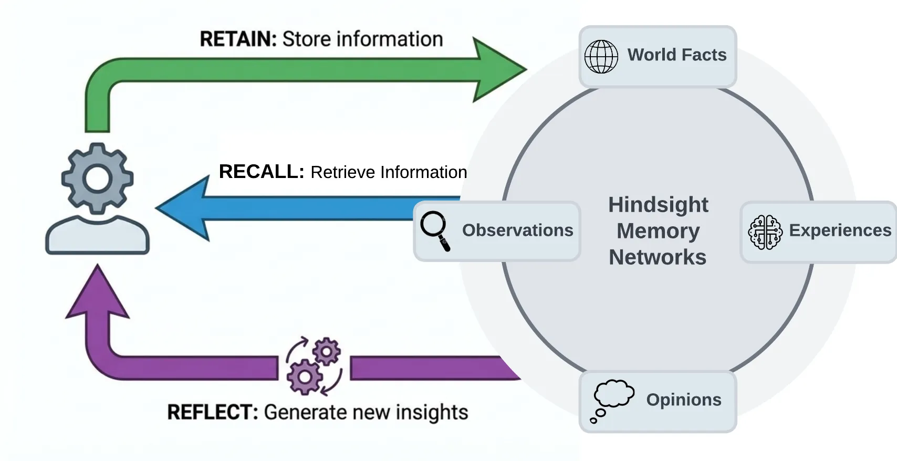
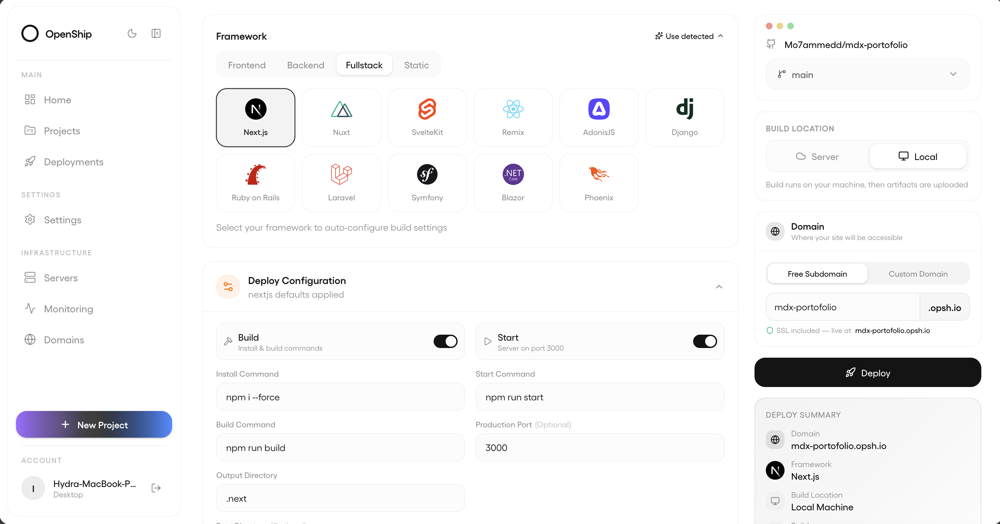
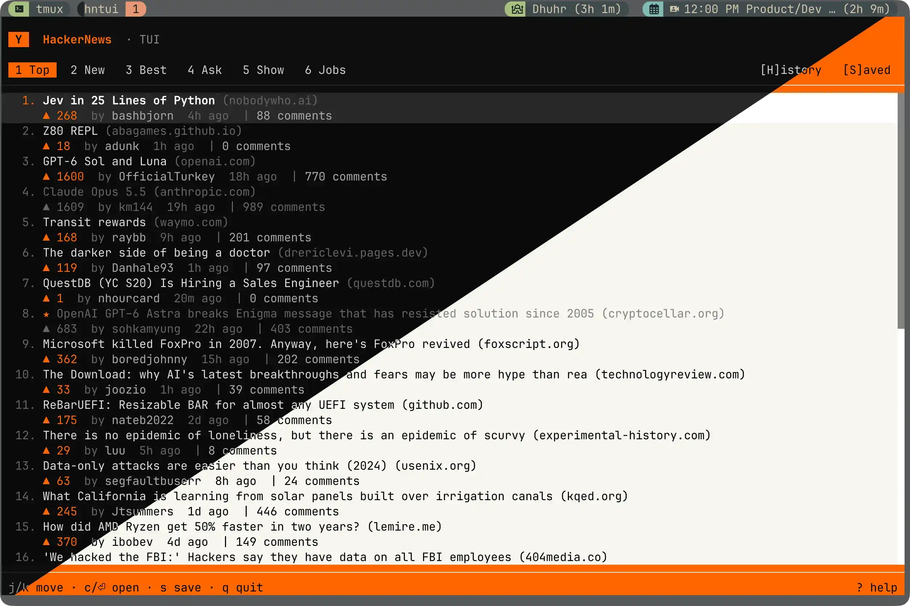
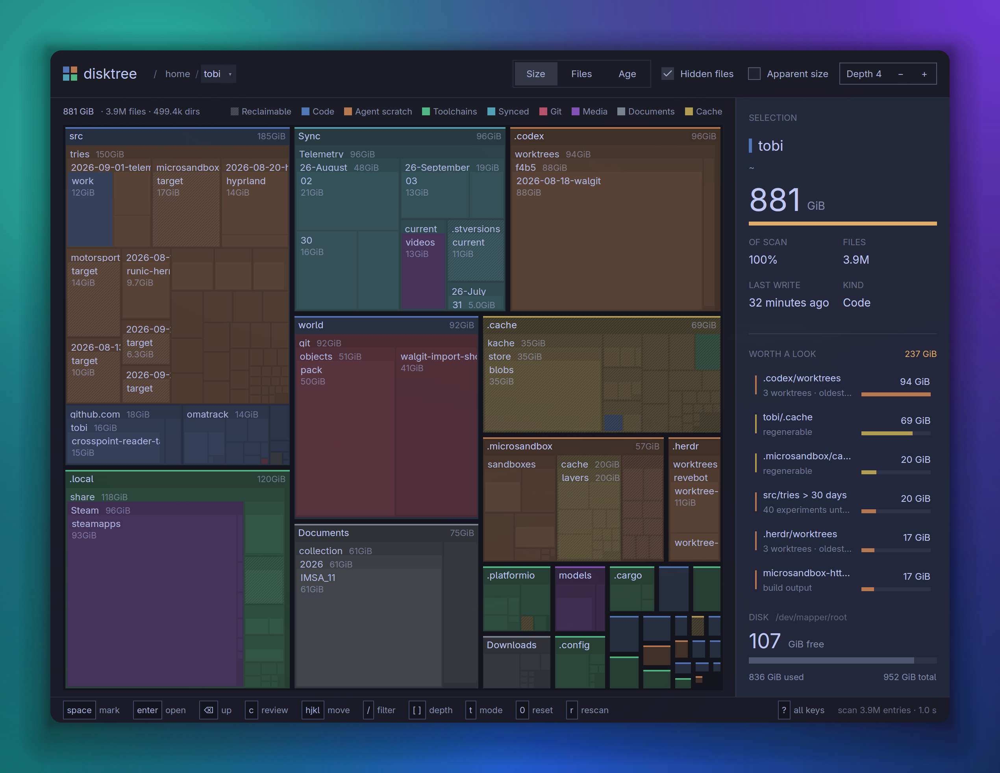

# 十个项目：从实际任务找到值得试的工具

比较17个仓库后选10项，发现入口包括GitHub近期趋势与新项目、HN/Show HN、作者文档及版本记录。每项检查了规范仓库、LICENSE、依赖与维护状态；热榜和总Star不代替实用性判断。这里的界面是维护者提供的演示，本站没有安装运行这10个项目。

| 你要解决的任务 | 项目 | 最先注意的门槛 |
| --- | --- | --- |
| 训练、部署有限答案的小模型 | Jeff | 基座、数据与训练资源 |
| 按行业筛选并聚合资讯事件 | AIHOT | API服务、PostgreSQL与人工复核 |
| 给Agent保留可追溯长期记忆 | Hindsight | 模型、数据库与记忆质量 |
| 同时管理多个编码Agent席位 | OpenRig | Node、tmux与各Agent账号 |
| 查询数据库、备份本地连接配置 | DBX | 数据库权限与备份密钥 |
| 把小应用部署到自己的服务器 | Openship | Linux、Docker或远程主机 |
| 在Linux上运行隔离开发环境 | nsl | KVM、systemd与资源共享边界 |
| 在终端筛读HN讨论 | hntui | 预编译平台与网络 |
| 把歌词做成动态排版 | JIZURA | 浏览器编码能力、音频与字体授权 |
| 找出模型与数据缓存占用 | disktree | 平台图形环境、删除前复核 |

## 01 · Jeff：把分类任务训练成可以部署的小型判断器

2026-09-30 · 新近实用 · 热度待验证。新项目；北京时间9月30日发布v1.1，扩大选项范围与训练覆盖。

Jeff提供训练和服务有限答案模型的代码：先定义状态、问题和选项，再训练模型选择答案，不必生成一整段文字后解析。适合工单路由或界面下一步选择，也可研究小模型究竟学到了哪些判断。v1.1把可选标签从26扩至254，并调整数据；部分新增训练覆盖的分类集不再是零样本测试。

最小路径是准备权重与依赖后运行配套服务；Apple Silicon另有MLX相关安装选项。代码MIT、模型权重与数据各有独立条款，不能只看代码许可。[HN讨论](https://news.ycombinator.com/item?id=49883844)有关于测试集、规模和使用限制的具体质疑；作者结果并非所有规模都提高。为什么现在值得看：新版本同时提供训练、评估与服务路径，适合用自己的小任务做对照，而不是直接采用演示中的准确率。

[源码](https://github.com/firelex/jeff) · [MIT](https://github.com/firelex/jeff/blob/main/LICENSE) · [版本记录](https://github.com/firelex/jeff/releases/tag/v1.1)

## 02 · AIHOT：把多篇报道聚成事件，再按行业筛选

2026-09-29 · 新近实用 · 热度待验证。新公开仓库，包含采集、预筛、评分、写作和事件聚类实现。

AIHOT输入多来源报道，经规则预筛、两次模型评分、写作和聚簇，输出行业资讯与事件热点。对需要日报的人，实用点是先识别“这些文章是否讲同一件事”，再形成可读结果；公开版提供演示信源，不能视为线上站点全部生产配置。

AIHOT维护者MIT仓库原图。看多篇文章如何汇入一个事件；同源转载仍需额外审查，不能因为平台不同就算独立热度证据。（[来源原图](https://github.com/KKKKhazix/AIHOT)；[查看大图](images/aihot-cluster.png)。）

运行需要Node 24、PostgreSQL、Docker相关环境与模型服务配置。为什么现在值得看：新公开的流程将事件去重和行业筛选做成可检查实现。热度衰减与来源计数只是规则，误聚合、重复宣传稿和模型编造仍需抽查；它不能替代本日报要求的原始日期与独立证据核验。品牌和示例内容也不随MIT代码许可自动放开。

[源码](https://github.com/KKKKhazix/AIHOT) · [MIT](https://github.com/KKKKhazix/AIHOT/blob/main/LICENSE)

## 03 · Hindsight：记住经历后，仍能追问结论来自哪里

2026-09-29 · 新近实用 · 热度待验证。成熟项目的v0.10.2实质更新：分范围整合策略、附件溯源与知识页改进。

Hindsight把Agent记忆分成保存、检索和反思等操作。输入会话或资料，形成记忆与观察，再供后续任务查用；适合需要跨会话保持背景且能追溯依据的研究助手。9月29日版本增加按范围配置整合策略、让观察与反思携带相关附件，以及记忆库别名等能力。

Hindsight维护者MIT仓库原图。按保存、检索、反思的联系阅读，注意原始资料与整理结论不是同一层信息；图描述作者设计，不代表本站验证了记忆正确率。（[来源原图](https://github.com/vectorize-io/hindsight)；[查看大图](images/hindsight-memory.webp)。）

最小部署可从Docker服务开始，还需PostgreSQL与模型提供方；不同模型、嵌入与预算会影响记忆提取。为什么现在值得看：此次更新能改善附件证据和长期知识维护，不是仅凭历史Star推荐旧工具。趋势页近期增长是关注线索，但没有完整独立使用趋势，仍标热度待验证；“记住更多”也不自动避免错误记忆。

[源码](https://github.com/vectorize-io/hindsight) · [MIT](https://github.com/vectorize-io/hindsight/blob/main/LICENSE) · [版本记录](https://github.com/vectorize-io/hindsight/releases/tag/v0.10.2)

## 04 · OpenRig：给多个编码Agent安排席位、任务与可见状态

2026-09-29 · 新近实用 · 热度待验证。v0.6.0加入按席位权限和人工输入保护；随后v0.6.1修复首次使用路径。

OpenRig用持久配置、任务队列与终端状态管理多个原生编码Agent。适合需要同时推进实现、检查与文档工作的人，而不必自己在多个tmux窗口间记住谁在等输入。近期0.6.0新增按席位选择权限、人工输入时暂停自动键入等控制；0.6.1主要补首次使用和工作树识别。

需要Node 22或24、tmux和已配置的Agent账号，Apple Silicon优先按作者说明用Node 22。可先查看配置和`rig setup --dry-run`的计划，再决定如何启动；上层工具不能替代各Agent本身的权限规则。为什么现在值得看：实质变化是协调时的可见性与操作控制，不是“更多Agent必然更快”。作者只对部分安装组合给出验证，Linux等组合及所有认证流程不能据此视为已全面测试。

[源码](https://github.com/mvschwarz/openrig) · [Apache-2.0](https://github.com/mvschwarz/openrig/blob/main/LICENSE) · [版本记录](https://github.com/mvschwarz/openrig/releases/tag/v0.6.1)

## 05 · DBX：数据库查询界面，加上可选择内容的本地备份

2026-09-30 · 新近实用 · 热度待验证。成熟数据库工具的v0.6.28新增加密备份与恢复等功能。

DBX提供数据库连接、查询和数据编辑界面，可结合自选模型或MCP能力。一个小型任务是打开研究实验的SQLite记录、检查失败任务与导出结果；先使用只读连接更容易分清查询和修改。最新版本增加本地加密备份与恢复、选择备份内容等功能，适合需要迁移连接配置的人。
可选桌面发行版、CLI或容器路径；源码涉及Go、TypeScript和Wails，模型服务需自行配置。为什么现在值得看：此次新增的是可控制范围的备份工作流，而不是把所有数据库支持列表当作已实测。备份密码丢失、连接权限或模型收到敏感查询内容等边界需按实际配置处理，本文没有连接用户数据库。

[源码](https://github.com/t8y2/dbx) · [Apache-2.0](https://github.com/t8y2/dbx/blob/main/LICENSE) · [版本记录](https://github.com/t8y2/dbx/releases/tag/v0.6.28)

## 06 · Openship：让应用、数据库和服务器在一个入口里管理

2026-09-27 · 新近实用 · 热度待验证。v0.8.0补充多服务器资源、私网与SDK/MCP能力。

Openship面向把小应用部署到自己服务器的开发者，连接仓库后构建应用，并管理PostgreSQL、Redis等资源。近期版本扩展多服务器应用、私有网络和共享文件能力，提供SDK/MCP入口。适合把研究演示页从本地运行推进到有固定访问地址的服务。

Openship维护者Apache-2.0仓库原图。看项目、资源与状态如何集中显示；界面便利不等于底层服务器、网络与凭据已自动正确配置。（[来源原图](https://github.com/oblien/openship)；[查看大图](images/openship-interface.png)。）

运行控制面需要Node 22或相应Docker环境，部署目标仍需服务器权限。桌面控制面只在应用打开时工作；远程服务器上的应用可以继续运行，但持续webhook与团队自动化需常驻控制面。为什么现在值得看：它把个人部署中的散碎资源接起来，同时明确了桌面模式与常驻服务的差别。本站核对文档和版本，没有实际部署。

[源码](https://github.com/oblien/openship) · [Apache-2.0](https://github.com/oblien/openship/blob/main/LICENSE) · [版本记录](https://github.com/oblien/openship/releases/tag/v0.8.0)

## 07 · nsl：把Linux开发环境放进VM，先看哪些资源仍共享

2026-09-30 · 新近实用 · 热度待验证。近几日新项目，已有v0.6.1；仍处早期快速迭代。

nsl在Linux上用虚拟机与systemd-nspawn管理不同开发发行版，支持终端工具及Waypipe图形程序。适合希望把一组编译依赖或试验工具从主环境分离的人。先运行诊断，再创建环境和执行命令，比把桌面截图当安装成功证据更可靠。

门槛包括x86 Linux、KVM、systemd-vmspawn、QEMU与相应权限，Wayland集成也有条件。普通模式会共享主机目录和桌面能力，不是强安全沙箱；`--isolated`使用独立VM并去掉相应共享。为什么现在值得看：公开实现把“运行方便”和“隔离程度”作为显式取舍，但新项目的空闲退出、文件通知和图形兼容仍需验证。没有将其在本机安装或声称Mac可直接使用。

[源码](https://github.com/frostyard/nsl) · [MIT](https://github.com/frostyard/nsl/blob/main/LICENSE) · [版本记录](https://github.com/frostyard/nsl/releases/tag/v0.6.1)

## 08 · hntui：在终端里筛读帖子和折叠讨论

2026-09-23 · 新近实用 · 热度待验证。9月23日v0.5.0增加更新路径与发行包检查，9月28日Show HN重新讨论其终端阅读用途。

hntui把Hacker News多个信息流和评论树放进终端，支持折叠讨论、保存帖子与键盘操作。对每天寻找研究和工具线索的人，输入是一条信息流，输出是需要进一步查原站的候选；它不负责判断一条新闻是否真实，也不会替代近期热度证据核验。

hntui维护者MIT仓库界面拼图，深浅两区用于展示主题，不是左右并排评论面板。可查看信息流类别、帖子摘要和底部键盘提示；图中票数是截图时点，不代表今天的热度。（[来源原图](https://github.com/ahmd-sh/hntui)；[查看大图](images/hntui-interface.webp)。）

有macOS ARM与Linux预编译包，源码路径依赖Bun；Windows支持未充分验证。为什么现在值得看：v0.5.0补上自更新提示及macOS发行包签名/启动检查，[9月28日Show HN讨论](https://news.ycombinator.com/item?id=49876760)也提出登录、直接读文章等具体需求。最小路径清楚，但这些反馈不等于已经大规模采用。不要把HN单个平台的排序当成全网代表性，遇到值得推荐的项目仍需回查仓库、版本与作者材料。

[源码](https://github.com/ahmd-sh/hntui) · [MIT](https://github.com/ahmd-sh/hntui/blob/main/LICENSE) · [版本记录](https://github.com/ahmd-sh/hntui/releases/tag/v0.5.0)

## 09 · JIZURA：在浏览器把歌词变成可微调的动态排版

2026-09-23 · 新近实用 · 热度待验证。新公开的浏览器创作工具，当前主分支标示0.9.0。

JIZURA接收歌词和音频，用预设动态排版组件组织镜头，并可调整节拍、文字样式与时间点。适合制作歌曲片段、课程开场或节奏化字幕。最小路径是打开网页、导入自己的素材、调整同步后导出；处理主要在浏览器内进行，字体加载仍可能访问Google Fonts。

输出支持MP4、PNG序列和供后续编辑使用的数据，但MP4依赖浏览器与系统的WebCodecs/H.264支持，不能保证每个平台一样；不满足条件可保留PNG序列。为什么现在值得看：新实现把自动编排和人工微调接在一起，给动态文字创作一个不必先搭完整视频工程的入口。代码MIT不覆盖任意音乐和字体权利，本站未用素材进行完整导出。

[源码](https://github.com/852wa/JIZURA) · [MIT](https://github.com/852wa/JIZURA/blob/main/LICENSE)

## 10 · disktree：把模型缓存和数据目录的体积看清楚

2026-09-26 · 新近实用 · 热度待验证。新项目，v0.10.1在北京时间9月26日发布。

disktree用矩形面积显示目录占用，帮助找出模型权重、构建产物或实验数据为什么挤满磁盘。它把选择、发现的问题和可释放空间放在同一界面；删除是选择后检查再提交的操作，不应该看到大块就直接清理。

disktree维护者MIT仓库原图。大矩形表示更大的占用，斜线表示作者工具估算的可回收区域；APFS共享块与系统可清除空间会影响数字，不能把图直接当删除建议。（[来源原图](https://github.com/tobi/disktree)；[查看大图](images/disktree-interface.png)。）

项目基于Rust/GPUI，预编译与源码依赖因平台不同；Linux还需支持相应图形后端。为什么现在值得看：新工具将研究者常见的“大文件在哪里”变成可观察的问题。文件大小、实际磁盘占用与克隆共享空间不完全相同，不能把系统存储面板或`df`数字不一致直接判为软件错误。本站未扫描或删除用户文件。

[源码](https://github.com/tobi/disktree) · [MIT](https://github.com/tobi/disktree/blob/main/LICENSE) · [版本记录](https://github.com/tobi/disktree/releases/tag/v0.10.1)
