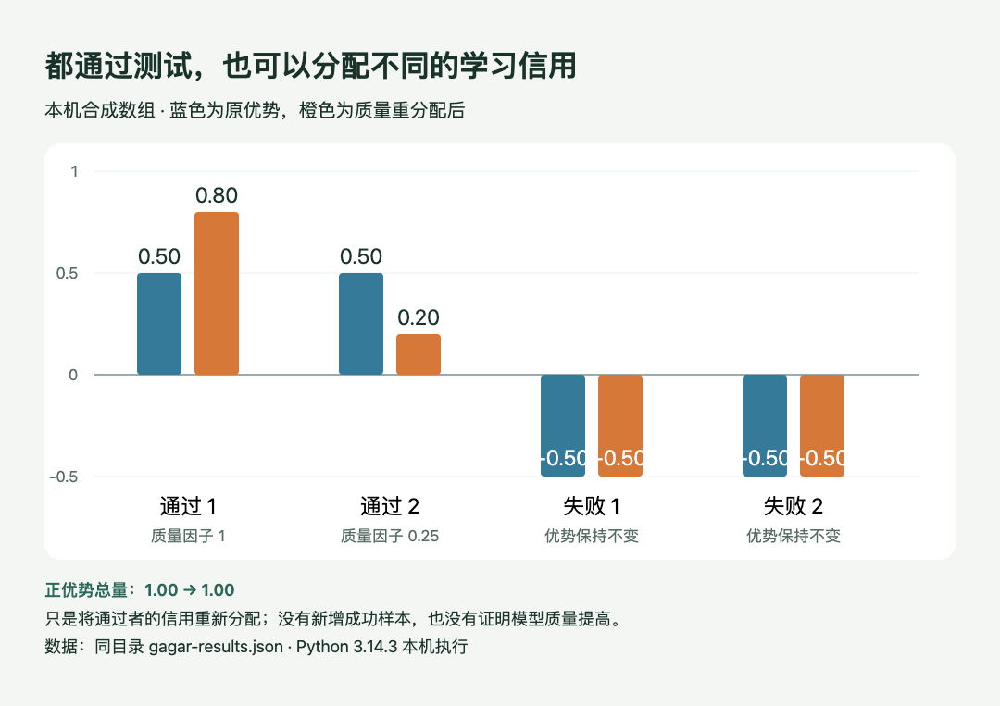

# 小实验：通过者分配不同信用，怎样保持总量不变

**已在本机CPU运行。** 输入是手工构造的二值奖励和质量因子，验证的是[GAGAR论文](https://arxiv.org/abs/2609.32577v1)中优势重分配的一项代数性质，没有训练模型、调用评分Agent或测量软件工程成功率。

## 先想清楚要改变什么

同一题采样四条轨迹，奖励为`[1, 1, 0, 0]`，代表两条通过、两条失败。减去组平均奖励0.5，原优势是`[0.5, 0.5, -0.5, -0.5]`。如果通过轨迹的质量因子分别是1和0.25，直接相乘会把正优势总量从1压到0.625，同时破坏正负平衡。

所以再乘一个公共比例：原正优势总量除以加权后的正优势总量。这里是`1 / 0.625 = 1.6`，结果变为`[0.8, 0.2, -0.5, -0.5]`。成功轨迹之间拉开差距，失败轨迹不变，正优势总量仍为1。




本站实际运行的合成数据，HTML/JS根据保存的JSON绘图。看两根橙色正柱的和仍等于两根蓝色正柱的和；它验证数值守恒，不证明代码质量或模型成绩提高。（[本机数据](code/gagar-results.json)；[查看大图](images/gagar-result.png)。）


## 核心代码

```python
base = [reward - mean_reward for reward in rewards]
mass = sum(base[i] for i in passing)
weighted_mass = sum(base[i] * factors[i] for i in passing)
scale = mass / weighted_mass
new = [base[i] * factors[i] * scale if i in passing else base[i]
       for i in range(len(base))]
```

这段只适用于通过和失败都有、且质量因子有效的组。完整附件还处理全通过、全失败、只有一个通过、质量相同和无效评分；当没有正优势可以分配时，不执行除法。无效质量评分退回原分配，输入长度或奖励格式不合法则明确报错。

## 怎样复查

保存[Python源码](code/gagar-toy.py)，使用Python 3.10以上的标准库即可：

```bash
python3 gagar-toy.py
```

它在脚本旁写出`gagar-results.json`。这次执行包括7组合成情况及3组无效输入检查，共10组检查通过；每组核对总优势接近零、正优势总量不变、失败项不变，并核对退化情况下是否恢复原分配。实际Python版本与执行时间保留在[结果文件](code/gagar-results.json)。

[绘图HTML/JS](code/gagar-plot.html)读取同目录结果；通过本地HTTP服务打开即可重绘。没有采用生成图来表现数值，是因为这里必须逐项对应真实程序输出；来源论文原图解释整体算法，不能代替这次合成数组的运行结果。

## 这个实验还没有证明什么

质量因子是我们给定的，并未检验评分器会不会误判。这里没有每token策略损失、重要性权重、长轨迹采样、奖励投机检测或训练稳定性。尤其不能由`0.8 > 0.5`推出模型已经更好：它只是一次更新中更偏好哪条通过轨迹。完整论文结论与条件见[论文精选](03-论文精选.md)。
