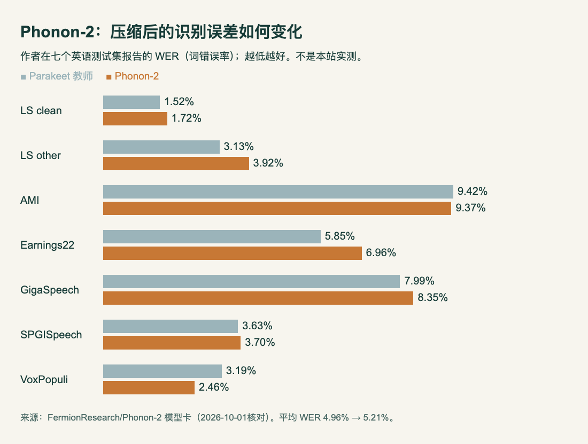
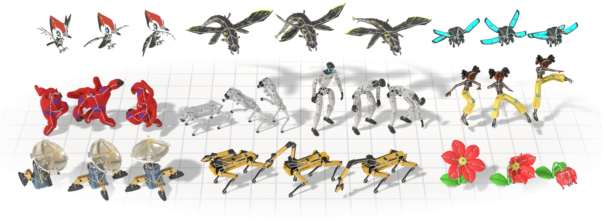

# 六模型：从本地转录到长期任务

先按任务选，再看机器能否装下。日期依据本次模型仓库创建时间或明确版本记录，不用抓取时间冒充首发。所有能力证据来自作者模型卡、实验和公开实现，尚无本站推理复现。

| 任务 | 模型 | 先核对 |
| --- | --- | --- |
| 英语音频离线转录 | Phonon-2 | 英语范围与低比特精度取舍 |
| 多语言翻译且保留格式 | Index-Translate-9B | 9B约24GB起步的部署建议 |
| 多轮试验、反思、修订 | AREX-2 | 工具反馈、上下文和执行环境 |
| 韩文表单与布局解析 | schift-ocr-1-beta | beta、合并单元格和长页重复 |
| 文档分块的上下文向量 | pplx-embed v2 context | 查询接口不同、预览向量不兼容未来版 |
| 不同骨架的动作生成 | UniMate v2 | 动画预处理、骨架范围与数据许可 |

## 01 · Phonon-2：164MB英语转录模型，保留精度与体积的真实取舍

2026-09-28（本次权重/实质版本日期，北京时间）· 新近实用 / 新近创新 · 热度待验证。

Phonon-2 将 Parakeet TDT 0.6B v3 的编码器权重限制在五个学习到的取值上，约 2.1 bit 表示，下载体积为 164MB，教师模型为 2508MB。输入音频，输出带标点和大小写约定的转录文本，适合先从英语会议或课程录音做评估。

七组英语测试的平均词错误率为 5.21%，教师为 4.96%，因此不能说压缩完全没有质量损失；在个别会议、议会语音集合上更好，在其他集合上退步。下图展示同一指标的逐项取舍，越低越好。

HTML/JS按模型卡数字制作，非本站ASR结果。两模型各有优势；平均值5.21%与4.96%不应被个别最好成绩遮住。模型卡原始表格保留在数据来源，生成图不适合保证逐项数字准确。（[作者数据](https://huggingface.co/FermionResearch/Phonon-2)；[查看大图](images/phonon-wer.png)。）

[图表源码](code/phonon-wer-chart.html)与[逐项数据](code/phonon-wer-data.json)可下载复核。

作者称 M5 MacBook Air 上约 174 倍实时，H100 batch 128 下约 6680 倍；后者属于批量吞吐，不能拿来预测单条录音等待时间。为什么现在值得看：本地小体积路线有了可直接检查的误差表和 CPU、MLX、CUDA 入口。[实现](https://github.com/fermionresearch/phonon)提供 `phonon transcribe recording.wav` 路径；需安装对应运行依赖、下载权重。目前英语范围明确，不能据教师的其他能力推断中文识别效果。

[权重与模型卡](https://huggingface.co/FermionResearch/Phonon-2) · 许可：CC BY 4.0权重；Apache-2.0代码。本站未推理实测。

## 02 · Index-Translate-9B：翻译之外，还要保住术语与文档结构

2026-09-28（本次权重/实质版本日期，北京时间）· 新近实用 / 新近创新 · 热度待验证。

这款 9B 文本翻译模型以 Qwen3.5 为基础，覆盖约 150 种语言，并训练术语、格式和上下文约束。官方样例把 JSON 字段中的中文翻成韩文，同时保留星号和指定话题标签；这比只问一句“翻译成某语言”更贴近实际本地化流程，但样例成功不代表组合约束始终可靠。

作者在 FLORES COMET、WMT26 和指令翻译上报告改善；不同任务使用不同输出上限和裁判，不能将几列数字混成总能力分。9B 的官方 BF16 显存起点约 24GB，长上下文还需更多 KV 缓存；配置上限 262144 不等于默认服务就开到这个长度，指南示例为 32768。

为什么现在值得看：权重、客户端、提示样例和报告一起开放，可以针对保留 JSON、术语表或字幕等任务建立自己的回归集。[仓库](https://github.com/bilibili/Index-Translate)提供 vLLM 服务和 `translate.py` 客户端，默认关闭 thinking、greedy 解码、输出预算1024。长文与指定音节翻译在同系列有专用模型，本栏合并介绍系列，不重复计数。

[权重与模型卡](https://huggingface.co/IndexTeam/Index-Translate-9B) · 许可：Apache-2.0。本站未推理实测。

## 03 · AREX-2：让每轮反思由测量结果推动

2026-09-30（本次权重/实质版本日期，北京时间）· 新近实用 / 新近创新 · 热度待验证。

AREX-2 是 27B 稠密多模态 Agent 模型，使用“提出方案—运行测量—阅读反馈—修改”的多轮训练。它把分数、日志、错误和耗时作为下一步修订的依据；训练使用可验证的机器学习、算法编程任务，并结合既有 AREX 深度研究数据。

作者在 Frontier-CS 的 188 题 Agent Track 上报告 70.7，MLE-Lite 的 Any Medal 为 81.8、取三组种子平均。两个分数的分母与含义不同；深度研究表中的 HLE 还标有文本子集与其他结果范围差异，不宜直接排一张绝对榜。

为什么现在值得看：此前的 AREX 研究现在出现新的 27B 版本，可研究额外执行轮次怎样变成有效修订。模型卡给出 262144 上下文，但真正运行还需要[AREX-2执行代码](https://github.com/VectorSpaceLab/AREX-2)、工具环境和模型服务，不能把权重下载完成当作整个 Agent 配好。27B 的 BF16 参数本身约54GB是粗略算术估计，不含缓存和运行开销；本站没有测得最低显存。

[权重与模型卡](https://huggingface.co/BAAI/AREX-2) · 许可：Apache-2.0。本站未推理实测。

## 04 · schift-ocr-1-beta：韩文表单识别，要把字符与表格结构分开看

2026-09-29（本次权重/实质版本日期，北京时间）· 新近实用 / 新近创新 · 热度待验证。

这是基于百度Unlimited-OCR微调的约3.6B BF16模型，输入页面图片，按阅读顺序输出文本、HTML表格和每个块的布局框。微调重点是表格内容路由到的专家前馈层；路由器保持原样，每层从72个路由专家中选6个，并有2个共享专家。

作者在相同页面、temperature=0下比较：60页韩文银行和金融表单上，字符错误率从基座的0.135降到0.067。这里是每页编辑距离除以参考长度、上限截到1，再对页面平均；不是表格完整正确率。100页幻灯片和100页通用材料也有结果，但标记归一化和不完整参考影响比较；通用材料上本模型0.191，并未超过表中若干其他模型，不能说全面领先。

输出示例中的`title [132, 68, 310, 86]`给出标题框，坐标按页面0—1000标度；`table`后接HTML。用它处理表单时，可以把字段文字识别和合并单元格结构分别验收。原模型卡只有结果表和文本例子，没有可忠实引用的对应页面图，本条保留格式例子，不画假扫描件。

为什么现在值得看：新权重给韩文表单任务提供了具体可评估的起点，能力与缺点都能对应输入输出。vLLM需包含Unlimited-OCR支持，作者核验过`unlimited_ocr.py`提交`7aaf016a1`；Transformers示例使用CUDA和自定义代码。BF16参数约7.2GB只是算术估计，不含运行开销。长页可能重复，复杂合并表格可能单元格数不齐；这是beta开放权重，作者另有更强的API版，API成绩不能套到本版本。

[权重与模型卡](https://huggingface.co/schift-io/schift-ocr-1-beta) · 许可：MIT。本站未推理实测。

## 05 · pplx-embed v2 context：一个片段的向量也能看见前后文

2026-09-26（本次权重/实质版本日期，北京时间）· 新近实用 / 新近创新 · 热度待验证。

普通分块向量常把每段独立编码，省略“它”“这个项目”指向的上下文。这款预览模型接收按文档组织的片段列表，把同一文档的片段一起编码，再为每个片段返回一个向量。检索仍可定位到具体片段，但向量包含邻近内容的语义。

上手最容易出错的是接口：文档用 `encode`，查询用 `encode_queries`；二者使用不同前缀，混用会悄悄降低检索质量。原生输出是未归一化的 int8 向量，比较时用余弦相似度，或先设 `normalize_embeddings=True` 再点积。支持2048维及训练过的1024维截断，不保证任意维度都合适。

为什么现在值得看：这是新近可下载的上下文嵌入实现，适合用有跨段指代的文档验证召回。模型卡暂无充分公开对照成绩，因此本期只确认接口和可运行路径，不宣称超过现有检索模型。依赖 Transformers≥5.4、PyTorch等和自定义代码，示例使用CUDA。预览版未来权重及向量可能不兼容，建库时需要保存版本，不能混合新旧向量。

[权重与模型卡](https://huggingface.co/perplexity-ai/pplx-embed-v2-context-9b-preview) · 许可：MIT。本站未推理实测。

## 06 · UniMate v2：同一生成模型面对不同关节拓扑

2026-09-28（本次权重/实质版本日期，北京时间）· 新近实用 / 新近创新 · 热度待验证。

UniMate 接收英语动作描述、目标骨架层级与关节信息，生成动作。推荐v2采用图注意力和flow matching，去噪器约74.1M参数；文本编码器另行下载。相比预览版，它把训练关节上限从60提高到70，并重新平衡不同来源数据，保留更多训练片段。这是本次新事实，论文于9月更早时已公开。

UniMate作者模型卡原图，MIT项目材料。观察不同关节布局仍共享生成方法；这些是作者示例，不代表任意陌生骨架可以零准备输入。（[来源原图](https://huggingface.co/Linzhan/UniMate)；[查看大图](images/unimate-example.png)。）

一次输出固定60帧、30fps，即2秒；更长运动需要拼接扩展。新骨架不能只交一份静态骨架文件，还要预处理并提供至少一个动画片段；Mixamo专用检查点也只适用对应22关节骨架。

为什么现在值得看：可用检查点和特征处理流程让不同拓扑的动作生成变成可研究的实际对象。[代码](https://github.com/Friedrich-M/UniMate)输出`.npy`动作和`.mp4`骨架预览；训练配置使用多张H100，不等于推理必须同样规模，模型卡未给出本站可确认的最低推理显存。Truebones为商业素材且未在Hub分发，Mixamo及Objaverse素材也各有条款，MIT模型许可不能覆盖所有训练素材。

[权重与模型卡](https://huggingface.co/Linzhan/UniMate) · 许可：MIT权重与代码；训练素材各有原始条款。本站未推理实测。
