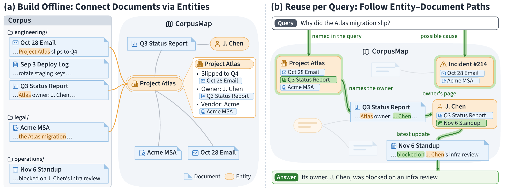

# 六篇论文：把容易被平均值掩盖的问题拆开

先比较了12篇9月28—29日arXiv新提交候选，再选出下面6篇。依据是方法、对照和可复核价值，不把HF投票当成研究质量或两类独立热度信号。已读核心方法、实验设置和相关图表，均未在本站训练复现。稿件里的会议页眉不单独作为录用证明。

## 01 · 压缩KV缓存：同一条信息换个位置就可能更难取回

arXiv提交2026-09-28 · 2609.36322 v1 · 预印本。新近创新 / 新近实用，热度待验证。

KV缓存保存模型读过的内容，分块压缩能省资源，却给每个token多了一个坐标：它落在压缩窗口的哪个位置。论文固定查询和信息内容，只改变前面的填充长度，观察检索随位置余数变化，称为“相位敏感性”。

128K单token键值检索中，DeepSeek-V4-Flash基座不同相位的最大差距为40.2个百分点；后训练减弱了差距，但未完全消除。作者另从头训练Qwen3派生小模型，以全注意力为对照，分别改变窗口与步长：周期更贴近压缩步长，而非绝对文本位置。因果干预进一步观察不同注意力组件对相位的分工。

为什么现在值得看：如果只报一个平均召回率，就可能漏掉固定边界附近的失败。复核时可保持长度、查询位置和目标绝对位置分布一致，再按位置取模分组。研究覆盖特定压缩架构及合成检索，不能推断全部长上下文模型都有同样差距；理论论证也依赖理想化嵌入几何，不是一般模型的普遍定理。

作者Figure 2原图，显示位置模8分组的检索准确率。灰带对应步长边界，阴影是95% Wilson区间；比较同一个模型内部的起伏，不把基座与后训练的差值混成水平均值。（[作者原图](https://arxiv.org/abs/2609.36322v1)；[查看大图](images/phase-retrieval.png)。）

[站内阅读卡](../../../../papers/frontiers/periodic-weak-spots-kv/00-阅读卡.md) · [归档PDF](../../../../papers/frontiers/periodic-weak-spots-kv/2609.36322v1.pdf) · [原文](https://arxiv.org/abs/2609.36322v1)

原文为CC BY 4.0，保存未改动的v1 PDF并保留作者和许可。

## 02 · SAKI：老师真正介入的位置，应该接受不同监督

arXiv提交2026-09-29 · 2609.36601 v1 · 预印本。新近创新 / 新近实用，热度待验证。

学生自己生成的轨迹能减少训练与推理的分布错位，但弱学生容易早早走偏。SAKI先在学生附近构造教师引导分布，再用最大耦合尽可能保留学生提议：能保留的位置沿用reverse-KL监督，需要修正的位置改为学习教师概率最高的token。

要分清两件事：残差分布抽出的token决定后续轨迹，教师Top-1决定当前训练目标；二者一般不相同。理论上修正概率等于两个分布的总变差距离，给出了介入量的明确含义，而非另设一个经验阈值。

实验将Qwen3的0.6B和1.7B学生从同一个4B教师蒸馏，使用相同200步预算和七组数学测试。1.7B相对TRB的宏平均Mean@8从27.9到29.0，Pass@8从44.6到47.5。引擎内验证比外部循环快4.22倍，但仍慢于纯学生生成，不能说教师验证没有成本。

为什么现在值得看：它把“在哪些token上教”变成可控、可对照的机制。本站[技术实践](05-技术实践.md)只运行四token分布的耦合实验，帮助理解采样，不冒充论文训练复现。结论目前主要在小模型数学蒸馏上成立，泛化到其他任务尚待验证。

作者Figure 1原图。上方依次看引导分布、接受或修正、监督分流；修正token与教师Top-1的不同用途是关键。底部4.22倍只比较匹配工作负载下的两种实现。（[作者原图](https://arxiv.org/abs/2609.36601v1)；[查看大图](images/saki-method.png)。）

[站内阅读卡](../../../../papers/frontiers/saki-coupling-distillation/00-阅读卡.md) · [归档PDF](../../../../papers/frontiers/saki-coupling-distillation/2609.36601v1.pdf) · [原文](https://arxiv.org/abs/2609.36601v1)

原文为CC BY 4.0，保存未改动的v1 PDF并保留作者和许可。

## 03 · Corpus Map：用实体页连接散落在不同文档里的证据

arXiv提交2026-09-29 · 2609.37226 v1 · 预印本。新近创新 / 新近实用，热度待验证。

一个项目的立项、需求和状态可能分别写在三份文件里。Corpus Map先离线提取人物、项目、事件等实体，消解不同叫法，再为跨文档出现的实体建页面：每条事实附来源，每页链接相关原文。Agent既能沿链接走，也保留直接搜索原始文件的能力。

实验在EnterpriseRAG-Bench、WixQA、HERB的多文档任务上，对比裸语料、文档摘要页、分组页、LLM Wiki及主题层级方法。GPT-5.5在EnterpriseRAG的正确性从62.08提高到73.75，输入token从206.5k降到88.1k；表中均为三次运行的均值，不代表全部数据集都按同一比例下降。

为什么现在值得看：它把可复用的跨文档关系显式保存，适合企业知识库和项目资料检索。建图本身需要计算、实体消歧与更新维护；不能只计算查询节省而忽略前期成本。实验部分质量指标由模型裁判评估，语料规模和任务集合有限，错误合并实体也可能传播错误关联。这些边界应在迁移到个人资料库时单独测试。

作者方法原图。读图追随文档到实体页再到其他文档的路径；实体页不是无来源的大摘要，回到原文的链接是可核查性的基础。（[作者原图](https://arxiv.org/abs/2609.37226v1)；[查看大图](images/corpus-map.png)。）

[站内阅读卡](../../../../papers/frontiers/corpus-map-agentic-search/00-阅读卡.md) · [原文](https://arxiv.org/abs/2609.37226v1)

arXiv非独占分发许可不直接授权本站再分发全文；本期保存阅读卡和原站链接，只引用一幅有署名的原图作方法评论。

## 04 · EngiWorld：验收工程产物，而不是只看Agent说完成了

arXiv提交2026-09-29 · 2609.37686 v1 · arXiv研究稿；会议页眉未独立核实。新近创新 / 新近实用，热度待验证。

EngiWorld收集1301个任务，覆盖CAD、仿真、制造、建筑、电子设计和3D可视化等六类领域、26种软件。关键是读取实际产物，如STEP、网表和G-code，检查几何、物理及规则要求；量化设计先过可行性门槛，再按质量计分。

为控制成本，七模型主实验使用同一份300题分层子集，含152个CLI任务与148个GUI任务，并非全量1301题。最高总体EngiScore为44.3；所有模型在128题上均得零分。跨软件任务共168次尝试只成功6次，说明会操作单个应用与能维持跨应用约束之间仍有差距。

为什么现在值得看：专业Agent需要能够重新计算、检查的交付物，截图相似或口头完成不足以验收。EngiScore混合二元成功与连续质量，不能简单称44.3%全任务成功率。商业软件许可、虚拟机、不同任务轮数和少量开放题也限制复现及排名解释；稿件写有ICLR 2027页眉，本期未取得独立录用记录，按arXiv研究稿阅读。

作者Figure 2原图。上半部是GUI/CLI与软件交互，下半部才是文件和领域验证器。真正决定分数的是产物验收；主实验只用300题子集。（[作者原图](https://arxiv.org/abs/2609.37686v1)；[查看大图](images/engiworld-framework.png)。）

[站内阅读卡](../../../../papers/frontiers/engiworld-engineering-agents/00-阅读卡.md) · [原文](https://arxiv.org/abs/2609.37686v1)

arXiv非独占分发许可不直接授权本站再分发全文；本期保存阅读卡和原站链接，只引用一幅有署名的原图作方法评论。

## 05 · HybridCUA：有命令行还不够，模型要学会何时使用

arXiv提交2026-09-29 · 2609.38008 v1 · 预印本。新近创新 / 新近实用，热度待验证。

直接给电脑操作模型增加命令行，可能让它更早失败。HybridCUA构建5000条GUI、CLI及交错轨迹，并准备3000个可程序验证的强化学习任务；先监督训练，再分别奖励合适的接口选择和可靠的命令执行。

以Qwen3.5-9B为底座、每题最多50步的OSWorld测试中，裸模型只用GUI为38.8%，直接加CLI反降到18.4%；训练后的HybridCUA为53.6%，平均14步。与同样训练的GUI分支相比，RL后的准确率为53.6对50.4，而非把全部14.8个百分点归因于“多一个接口”。WindowsAgentArena上从32.0到36.0，属于跨系统迁移证据。

为什么现在值得看：步骤更少可能是高效，也可能是提前失败，必须和完成率一起看。消融显示不同奖励分别影响接口使用和执行错误，但移除某项奖励并不总让准确率大幅下降。论文承诺开放数据与训练管线，发布状态应到项目页逐项确认；本站没有部署电脑控制模型，也未把训练效果当成任何命令都可靠。

作者方法原图。先看三类示范轨迹怎样进入SFT，再看任务与执行层面的奖励。它教的是接口选择与执行方式，不能简化为越多用CLI越好。（[作者原图](https://arxiv.org/abs/2609.38008v1)；[查看大图](images/hybridcua-method.png)。）

[站内阅读卡](../../../../papers/frontiers/hybridcua-gui-cli/00-阅读卡.md) · [原文](https://arxiv.org/abs/2609.38008v1)

arXiv非独占分发许可不直接授权本站再分发全文；本期保存阅读卡和原站链接，只引用一幅有署名的原图作方法评论。

## 06 · Context Language Models：让模型直接维护自己的上下文文件

arXiv提交2026-09-29 · 2609.37725 v1 · 预印本。新近创新 / 新近实用，热度待验证。

CLM把当前上下文映射成一个文件，模型可以用普通文件工具删改、整理，再同步回下一轮推理。没有编辑时仍然追加新内容。这比只能调用预设“压缩”按钮更自由，也允许不同任务维护不同的笔记、追踪表或外部引用。

作者先用32K上下文的合成ContextBench检查精确保留、局部修改和卸载检索，再测试研究、编码和长程任务。Qwen3.5-9B经强化学习后，BrowseComp-Plus从28.8%到42.5%；与同配方训练的摘要框架相比高0.4个百分点，同时少38.8%的prefix-reuse FLOPs。不能把相对自身未训练的提升全部归因于文件接口。

这里的FLOPs计入上下文中途编辑带来的重新预填充，仍是计算量指标，不等于实际延迟或账单节省。另提出Suffix Cache Reuse进一步复用后缀缓存，需要服务端配合。为什么现在值得看：长程Agent的记忆管理有了可训练、可比较的实现方式；允许自由删改也可能丢证据，外部持久记录和业务验收仍需设计。本站未复现长期运行成绩。

作者Figure 1原图。先看上下文被当作可修改文件，再区分零样本使用、技能优化和强化学习三种结果；不同图块不能当成同一次实验相加。（[作者原图](https://arxiv.org/abs/2609.37725v1)；[查看大图](images/clm-context.png)。）

[站内阅读卡](../../../../papers/frontiers/context-language-models/00-阅读卡.md) · [归档PDF](../../../../papers/frontiers/context-language-models/2609.37725v1.pdf) · [原文](https://arxiv.org/abs/2609.37725v1)

原文为CC BY 4.0，保存未改动的v1 PDF并保留作者和许可。
