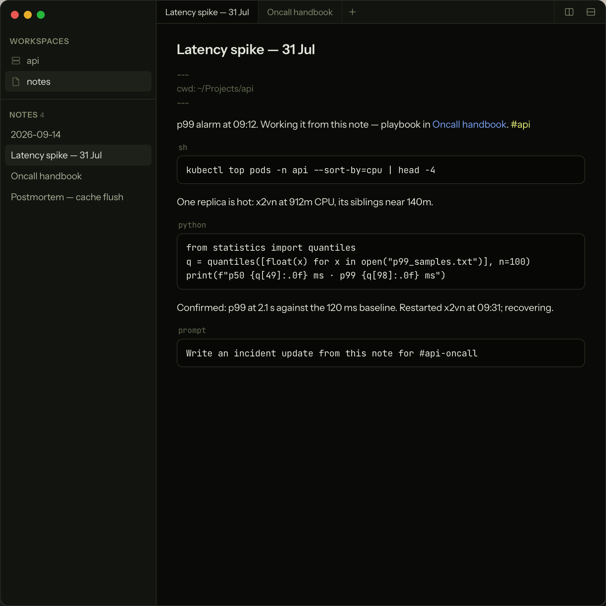
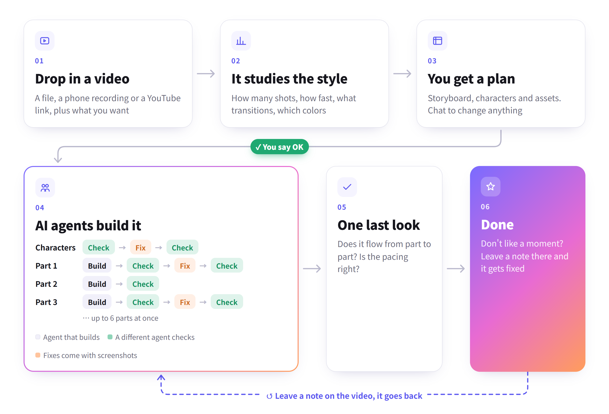

# 十个项目：先找到具体任务，再决定要不要试

比较17个应用与方法仓库后选10项。高关注但许可不明、非商用限制或只有查看许可的候选没有混入。下面的截图、演示与成绩来自维护者，本站没有安装运行这些项目；单次Star、下载和HN计数不足以证明持续热门。

| 任务 | 项目 | 上手门槛 |
| --- | --- | --- |
| 本地会议转录、通话中查资料 | Parrot | macOS 14+、Apple Silicon、录音权限 |
| 把操作笔记变成可执行步骤 | Ledge | 运行时、SSH；Windows依赖WSL |
| 约束Agent的数据流向 | OpenAPPA | 策略、集成与预览接口变化 |
| 清理Agent遗留子进程 | corral | Linux、cgroup或subreaper |
| 在桌面看到编码任务等待审批 | Coucou | Claude Code hooks、macOS或自建Windows版 |
| 检验科研假设工作流的组件 | hypoarena | Python、NumPy；默认合成数据 |
| 阅读精简GPT训练实现 | TurboGPT | CUDA、NVIDIA GPU及编译环境 |
| 跟踪数学论证的形式化对应 | SpivakCalculus | Lean 4、Mathlib、原书 |
| 编写含图表与公式的Markdown | Sarala | 桌面环境、导出工具 |
| 从参考节奏规划新动画 | ReelMimic | Node、Python、FFmpeg、Agent账号 |

## 01 · Parrot：会议还没结束，就能从自己的资料里找答案

2026-10-01（北京时间）· 新近实用 · 热度待验证。原仓库创建于4月；本次v0.25.0新增实时提示、报告时间线和Parakeet本地转录。

Parrot录下Mac能听到的通话，将转录、说话人识别和文档检索放在本机；实时助手可从PDF、Markdown里找片段并标明出处。适合在访谈或项目会议中查FAQ、回看承诺事项。新增报告时间线把说话占比和关键时刻放到同一条时间轴，便于回听。

在macOS 14+、Apple Silicon上从Release安装并配置录音权限，再选本地Ollama或外部模型服务。要注意“资料索引在本地”不等于全部处理都离线：使用云端助手时，相关片段和对话会发给所选服务；全本地路径也要下载权重。新Parakeet选项覆盖25种欧洲语言，不是通用中文转录方案。为什么现在值得看：这是可影响实时使用的新版本，功能与边界都有明确说明；主界面海报属于作者绘制示意，本期不把它当真实截图转载。

[源码](https://github.com/turantekin/Parrot) · [GPL-3.0](https://github.com/turantekin/Parrot/blob/master/LICENSE) · [版本记录](https://github.com/turantekin/Parrot/releases/tag/v0.25.0)

## 02 · Ledge：Markdown代码块运行后，结果就留在旁边

2026-09-29（北京时间）· 新近实用 · 热度待验证。原仓库7月创建；近一周新增Linux、Windows与Android测试版入口。

Ledge把普通Markdown代码块变成可执行步骤：按快捷键运行shell、Python或Node，输出在下方出现，同一笔记保留工作目录与环境。适合记录数据处理、开发排错和可重跑的实验步骤；笔记仍是本地文件，可自行选择同步方式。

维护者Apache-2.0仓库原始演示。看代码与输出怎样连在同一份笔记里；动画是作者演示，不是本站执行记录。（[来源原图](https://github.com/ledgesh/ledge)；[查看大图](images/ledge-runnable.gif)。）

Mac版要求macOS13+和Apple Silicon；Windows通过WSL运行，手机通过SSH连接服务器，并不是手机直接跑全部解释器。v0.1.3/0.1.4的平台扩展让相同笔记跨设备使用成为本次新增价值。代码块具有所选账户权限，最小试用从无副作用的小计算开始；Agent的prompt块还依赖相应CLI。本站未验证跨设备恢复效果。

[源码](https://github.com/ledgesh/ledge) · [Apache-2.0](https://github.com/ledgesh/ledge/blob/main/LICENSE) · [版本记录](https://github.com/ledgesh/ledge/releases/tag/v0.1.4)

## 03 · OpenAPPA：在工具执行前，检查数据能不能去那个目的地

2026-10-01（北京时间）· 新近实用 · 热度待验证。原研究与仓库更早；v0.30.0新增Windows运行与受保护会话恢复入口。

OpenAPPA插在Agent与工具之间，跟踪已读数据的敏感程度和信任状态，用TOML策略判断下一次调用是否允许。输入是策略和事件记录，输出是可重放的决定；适合检查“内部会议资料能否发到公开仓库”这类信息流规则。

MIT仓库原始演示。重点看拒绝原因与数据目的地的关系，不据一张截图推断所有泄露方式都被阻止。（[来源原图](https://github.com/archestra-ai/OpenAPPA)；[查看大图](images/openappa-blocked.png)。）

可先用`appa describe --check`检查策略，再用`appa replay`验证预设调用，无需让真正工具执行。作者报告的零成功攻击只适用于其测试集；标签、集成边界和策略本身仍可能出错。当前是preview/RFC，接口可能变化。为什么现在值得看：近期Windows支持与恢复入口扩大了可试场景，同时提供可执行策略测试；不是新提出了七月论文中的整个概念。

[源码](https://github.com/archestra-ai/OpenAPPA) · [MIT](https://github.com/archestra-ai/OpenAPPA/blob/main/LICENSE.md) · [版本记录](https://github.com/archestra-ai/OpenAPPA/releases/tag/v0.30.0)

## 04 · corral：命令结束后，还要确认子进程真的清干净

2026-09-28（北京时间）· 新近实用 · 热度待验证。新公开Linux进程生命周期工具，附故障样例和比较记录。

编码Agent启动服务或测试后，主命令结束不代表后台进程都退出。corral对整棵子进程树设置时限并核验清理；强制模式使用cgroup v2，回退模式利用subreaper、`/proc`和pidfd。如果无法证明全部停止，返回120，不把不确定当作成功。

最小用法是`corral --wall 30s -- ./build.sh`，可写JSON审计。需要Linux5.11+，强制模式5.14+及委派cgroup；预编译文件另有glibc要求，不能直接在Mac运行。作者比较了十种故障程序和多次重复，其中`timeout`来自uutils而非GNU。为什么现在值得看：新实现针对Agent常见的进程残留，有公开故障夹具；它不限制文件和网络访问，也管不到通过外部服务启动的工作，因此不是安全沙箱。

[源码](https://github.com/Cardinal44/corral) · [MIT](https://github.com/Cardinal44/corral/blob/main/LICENSE) · [版本记录](https://github.com/Cardinal44/corral/releases/tag/v0.1.0)

## 05 · Coucou：把Claude Code的等待状态放到桌面边缘

2026-09-28（北京时间）· 新近实用 · 热度待验证。新项目提供会话观察与人工Allow/Deny入口。

Coucou通过Claude Code hooks显示任务正在读什么、运行什么，以及何时需要用户决定；有多个终端任务时，可以减少反复切窗口确认的工作。界面中的Allow/Deny仍由用户选择，状态小组件本身不证明任务已经正确完成。

MIT仓库原图。这里的阅读价值是会话状态和交互位置，不是角色装饰；所示为维护者界面，未在本站连接会话。（[来源原图](https://github.com/Louis-CFM/coucou)；[查看大图](images/coucou-session.png)。）

macOS需要15+；源码构建需要Xcode16与XcodeGen。Windows安装包暂不可用，可按Tauri源码路径构建，不能写成已恢复下载。聊天功能另需Anthropic API等服务。为什么现在值得看：新公开的实现把任务观察与审批放到可见位置；hook安装会修改本地配置，应先查看它提供的备份与差异。模型账户和可选集成各有费用与权限。

[源码](https://github.com/Louis-CFM/coucou) · [MIT](https://github.com/Louis-CFM/coucou/blob/main/LICENSE) · [版本记录](https://github.com/Louis-CFM/coucou/releases/tag/v0.1.0)

## 06 · hypoarena：用合成文献检验科研Agent流程的每个环节

2026-09-30（北京时间）· 新近实用 · 热度待验证。新公开离线工作台，把引用、去重、排序和证据更新拆成可测试组件。

hypoarena默认不调用真实大模型，而是在带已知因果链的合成文献上运行生成、核验、辩论、排序、演化与报告流程。输入可控语料及脚本式Agent，输出引用检查、重复簇、排序和信念更新，适合学习科研助手管线或测试工程组件。

运行时主要依赖NumPy，CPU PyTorch排序器是可选项。安装后用`hypoarena demo --chains 2 --chain-length 2 --out ...`生成Markdown和HTML报告；默认示例不联网。为什么现在值得看：新工具给出可重放产物与故障夹具，便于检查某个环节是否按定义工作。找回预先埋入的因果链不是发现新科学规律；作者对此有明确说明，本站也没有把示例成功率当成真实科研能力。

[源码](https://github.com/OpSafari/hypoarena) · [MIT](https://github.com/OpSafari/hypoarena/blob/main/LICENSE)

## 07 · TurboGPT：从精简CUDA代码理解字节级GPT训练

2026-09-24（北京时间）· 新近实用 · 热度待验证。新公开CUDA C++训练实现，近一周开发者社区发布。

TurboGPT把字节级GPT训练放在精简CUDA C++实现中，输入文本文件，输出训练日志及包含模型、优化器和调度状态的检查点。它适合已经了解PyTorch训练循环、想往底层读内核和状态保存的学习者；不适合直接当成现成聊天模型。

Linux可按Nix路径构建，Windows示例使用Visual Studio2022和CUDA13.4，并指定GPU架构。运行时可设置日志目录，再用`--load`恢复；仓库提供`tests/verify.py`。作者在hn1g、15亿训练token后报告2.5295 BPB，即每字节的预测编码成本。为什么现在值得看：新实现便于把训练过程和底层代码对照阅读；这个单一结果没有足够基线证明比其他训练器更快，也不是本站跑出的成绩。

[源码](https://github.com/lostmsu/TurboGPT) · [MIT](https://github.com/lostmsu/TurboGPT/blob/master/LICENSE) · [版本记录](https://github.com/lostmsu/TurboGPT/releases/tag/v0.0.1)

## 08 · SpivakCalculus：把书中的数学陈述连到可检查的证明

2026-09-27（北京时间）· 新近实用 · 热度待验证。新公开Lean4形式化实现，按章节和版本标明对应与更正。

项目用Lean4与Mathlib形式化Spivak《Calculus》的定义、定理和习题关系，并标记第三、第四版的对应。对数学基础尚在补课的读者，较好的用法是先选一个熟悉的极限或导数陈述，看原书假设如何变成类型与证明义务，别从全库规模开始。

先安装匹配Lean环境，取Mathlib缓存，再用`lake build +SpivakCalculus`构建；整库从头构建可能数小时。作者提供公理审计入口，并声称无`sorry`等跳过证明，本期未执行全库审计。为什么现在值得看：新公开实现提供了明确的原书映射及可检查代码，适合形式化学习和模型证明评估。Apache-2.0覆盖代码，原书仍有独立版权，需要自行取得书籍；作者所列更正也应逐条读原文核对。

[源码](https://github.com/stormj-UH/spivak-lean) · [Apache-2.0](https://github.com/stormj-UH/spivak-lean/blob/fourth-edition/LICENSE)

## 09 · Sarala：编辑图、公式与正文时保持同一阅读位置

2026-09-29（北京时间）· 新近实用 · 热度待验证。原仓库6月创建；v1.1.2加入图表源代码附着编辑卡与相关编辑交互。

Sarala是按块原位编辑的Markdown桌面工具：当前块可见源码，离开后就在原处渲染。与本期负责执行代码的Ledge用途不同，它更偏向写作、公式、图表和导出。v1.1.2让图表仍留在页面，源码在其下方编辑，减少改一处图就失去阅读位置的问题。

维护者GPL-3.0仓库原始界面，限本条功能说明引用。看正文、表格与侧边大纲怎样共处，不把图中内容当成本期实际写作结果。（[来源原图](https://github.com/solancer/sarala)；[查看大图](images/sarala-editor.png)。）

从对应平台Release安装；PDF导出涉及Chromium，更多格式依赖Pandoc。源码构建还需Tauri/Rust和前端工具链。为什么现在值得看：近期改动具体改善图表与公式的写作流程，但规模不等于一次全新产品首发。安装包签名、公证与系统提示应按实际平台核对，本站未验证导出保真度。

[源码](https://github.com/solancer/sarala) · [GPL-3.0](https://github.com/solancer/sarala/blob/main/LICENSE) · [版本记录](https://github.com/solancer/sarala/releases/tag/v1.1.2)

## 10 · ReelMimic：先拆解参考视频的节奏，再审阅新动画方案

2026-09-29（北京时间）· 新近实用 · 热度待验证。新公开本地动画工作流，提供计划确认、分镜复核与逐时刻反馈。

ReelMimic接收参考视频和创作说明，分析镜头时长、转场、构图和色彩，再先给出分镜与风格计划。确认后执行动画制作，并保留审阅、修正前后图和时间点反馈。适合做研究方法或产品功能的短动画，作者演示并不代表每种素材都能自动成功。

MIT仓库原始工作流图。看计划确认和修正证据所在的位置，理解生成后仍需审阅；它不是本站渲染的视频结果。（[来源原图](https://github.com/edenfunf/reelmimic)；[查看大图](images/reelmimic-plan.png)。）

依赖Node22.18+、Python3.10+、FFmpeg、Chrome，以及已登录的Claude Code或Codex；通过本地4318端口使用。作者称30—60秒动画通常耗时1—3.5小时，主要在Windows测试，Mac与Linux验证较少。为什么现在值得看：新实现把创作和审阅接起来；目前仅2D风格，部分引擎较新。Agent调用消耗账户额度，模型和素材权限也不由MIT代码许可一并授予。

[源码](https://github.com/edenfunf/reelmimic) · [MIT](https://github.com/edenfunf/reelmimic/blob/main/LICENSE)
