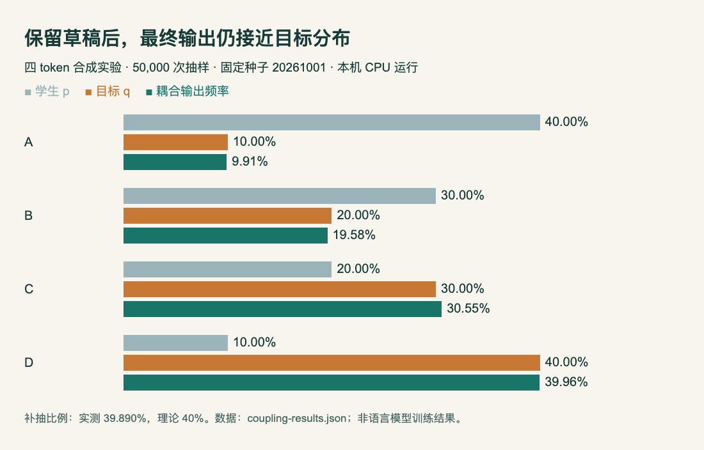

# 小实验：少改几个 token，怎样仍然得到目标分布

本机已运行。这个四 token 合成实验对应 [SAKI 的采样直觉](03-论文精选.md)，不训练语言模型，也不复现论文的数学成绩或加速比。只需 Python 3 标准库；本次实际环境为 Python 3.14.3，macOS，CPU。

## 先把两种概率分清

假设学生给 A、B、C、D 的概率是 `p = [0.4, 0.3, 0.2, 0.1]`，我们希望最终输出服从 `q = [0.1, 0.2, 0.3, 0.4]`。这里的 q 是手工给定的目标；SAKI 中它来自学生与教师之间受约束的桥接分布，两者不能混为一谈。

最直接的办法是扔掉学生草稿、重新按 q 抽样。最大耦合做的是尽量保留草稿，同时保证最终输出的边缘分布仍然是 q。先从 p 抽一个 z，以 `min(1, q[z]/p[z])` 的概率接受；不接受时，从正差 `max(q-p, 0)` 归一化后补抽一个 token。

```python
z = rng.choices(range(len(p)), weights=p)[0]
if rng.random() < min(1.0, q[z] / p[z]):
    return z, False
residual = [max(b-a, 0) for a, b in zip(p, q)]
return rng.choices(range(len(q)), weights=residual)[0], True
```

为什么不会改错分布？对任意 token，保留下来的概率质量是 `min(p, q)`，补回来的质量是 `max(q-p, 0)`，相加恰好是 q。拒绝概率等于两种分布的总变差距离，即所有概率差的绝对值之和再除以 2。本例是 40%。

## 运行与真实输出

下载 [完整 Python 脚本](code/coupling-toy.py)，运行 `python3 coupling-toy.py`。脚本使用固定随机种子 20261001，抽样 50,000 次，生成 [原始结果 JSON](code/coupling-results.json)。本次 A–D 计数为 `[4956, 9788, 15277, 19979]`，触发补抽 19945 次，占 39.890%。




本机合成实验的实际结果，HTML/JS 绘制。比较橙色目标与绿色实测；接近说明本次抽样与目标相容，严格的分布保证来自前面的代数等式。采样误差不是训练误差。（[图表源码与数据](code/coupling-chart.html)；[查看大图](images/coupling-result.png)。）

脚本还检查了 p=q 时无需补抽、支持集不重叠时全部补抽，以及空数组、长度不一致、负概率和总和错误的输入。有限样本只验证实现行为，不能取代分布推导。

## 不要把这个结果外推到模型训练

这里没有分词器、神经网络、KL 预算优化或梯度更新。SAKI 的残差采样控制轨迹如何前进，教师 Top-1 的监督损失控制学生如何学习；它们是两个环节。本例也没有测量吞吐，40% 补抽并不自动意味着节省 60% 训练时间。

p 中概率为零的 token 不会作为草稿被抽到；它仍可能经残差分布出现在输出里。实际工程还需要考虑浮点下溢、批量张量和概率截断，这个标准库示例只用于理解。

来源：[SAKI 原文 v1](https://arxiv.org/abs/2609.36601v1)，最大耦合采样机制；数据为本站自设四 token 分布。本机验证范围仅限此脚本。
