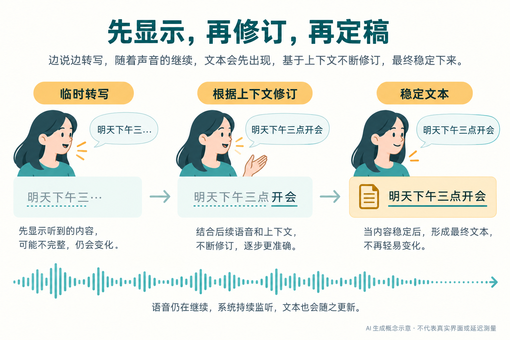
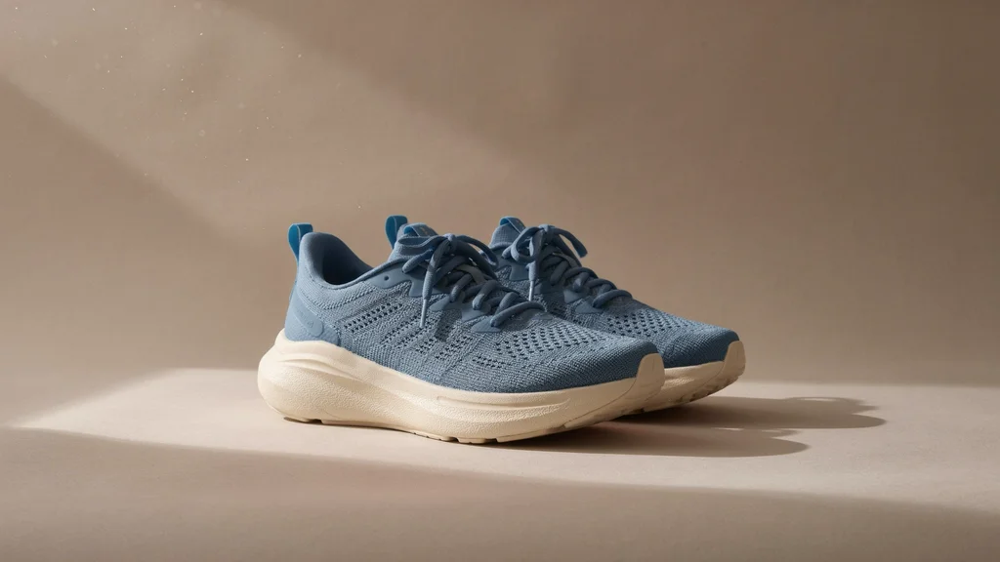
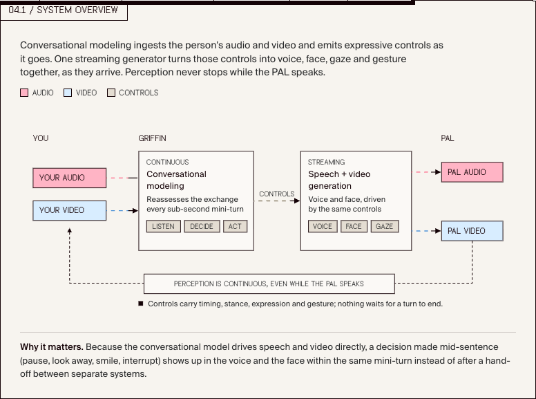
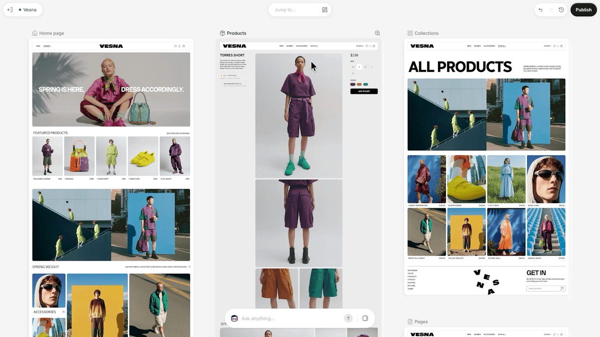

# AI 动态：实时交互、精确编辑与可检查的决策

5 条重点详解 + 10 条速读。资讯来源日期覆盖 9 月 29 日至 10 月 1 日；Pi 与 GLiDE 的可核验发布时间换算后为北京时间 10 月 2 日凌晨。只有日期的公告保留原日期，不猜首发时刻；Ideogram 的日期精度单独说明。

## 01 · MAI语音更新：边听边出字，还要知道哪部分可以定稿

来源日期：2026-10-01。新近实用 · 热度待验证 · 官方材料核验，本站未实测。

微软推出 MAI-Transcribe-2 流式转写，支持 60 种语言，并在音频持续进入时自动识别语言。相比等整段录音结束再转写，它可以先返回临时文本，随着后续声音修订，再提交稳定片段。字幕、会议记录和语音 Agent 都需要区分这两种状态：屏幕可以提前显示，后续动作应判断内容是否已经稳定。

例如用户说“明天下午三点开会”，在句子结束前，界面可以出现不完整的临时片段；收到更多音频后再补齐。下图解释的是这个交互机制，并非微软真实界面，也不代表测出的等待时间。开发时如果把每次临时结果都当成新指令执行，后面的修订可能变成重复操作。

AI生成的概念示意：虚线区域表示仍可能修订的临时文本，稳定片段才进入后续处理。依据Microsoft公告绘制，不是真实截图或延迟测试。（[事实依据](https://microsoft.ai/news/our-first-streaming-transcription-model/)；[查看大图](images/mai-streaming-concept.png)。）

同批 MAI-Voice-2.1 扩展到 23 种语言、26 个地区变体；Flash 版本面向更低延迟的语音输出。微软报告 Flash 生成一段 45 秒音频约需 150 毫秒，但这是指定生成测试，不能与转写、网络、模型思考、播放缓冲相加之前就称为完整对话响应时间。音色克隆与跨语言声音使用也应按相应授权流程处理。

开发者可以通过 Microsoft Foundry、MAI Playground 等入口使用相关模型；不同分发渠道及语音产品的支持情况须逐项查看。公告给出的转写首个临时结果在接收音频后约 100 多毫秒返回，也不意味着每一句稳定文本会在同样时间提交。使用者更应分别观察首次显示、最终定稿和开始播音三个阶段。

为什么现在值得看：实时语音系统的体验取决于整条交互链，不能只选语音质量或单段生成最快的模型。这轮更新提供了可接入的新组件，适合先在打断、改口和语言切换任务上验证；本站没有调用付费接口，数值与能力范围均来自官方说明。

[原始来源](https://microsoft.ai/news/our-first-streaming-transcription-model/)

## 02 · Ideogram 4.5：多轮改图时，保住没有要求修改的部分

来源日期：2026-10-01。日期取合作方公告；模型首发时刻未确认。新近实用 · 热度待验证 · 官方材料核验，本站未实测。

Ideogram 4.5 把重点放在已有图片的连续修改：先换产品颜色，再调整材质、背景或文字，尽量避免每一轮把已经满意的区域重新画坏。官方模型页提供多轮示例，API 文档说明 Precise Edit 会保留未修改像素，并返回与输入相同的尺寸。这里的价值是保留原有工作成果，而不只是生成一张看起来不错的新图。

[接口文档](https://developer.ideogram.ai/ideogram-api/api-overview)给出的路径支持编辑提示、可选遮罩和最多四张参考图。遮罩帮助限定编辑区域；仍需检查边缘、文字和纹理。原尺寸输出不等于模型对任意大小画面都完成同样的全局推理，官方还展示了裁出局部、编辑后沿保持的边缘拼回原图的工作方式。

Ideogram官方接口文档的原始输入示例。先记住鞋底、阴影与背景，下一幅用于对照局部换色；限本条功能评论引用。（[来源原图](https://developer.ideogram.ai/ideogram-api/api-overview)；[查看大图](images/precise-edit-shoes-original.webp)。）

Ideogram官方输出示例：比较鞋面颜色变化与未要求改变的背景、鞋底。它说明编辑目标，不是本站逐像素验证或跨模型盲测。（[来源原图](https://developer.ideogram.ai/ideogram-api/api-overview)；[查看大图](images/precise-edit-shoes-recolor.webp)。）

对商品图和设计稿而言，这种流程可以把“更改指定区域”与“保留构图”分开验收。比如鞋面换色后，仍要核对材质纹理、阴影和标签是否被意外修改。官方的示例选择和模型比较由作者提供，本文没有据此认定所有连续编辑任务都优于其他产品，也未复述缺少复测的第三方分数。

模型现可通过平台和 API 使用，开放权重仍属于后续计划。Recraft 在 [10月1日的接入公告](https://www.recraft.ai/blog/ideogram-4-5-is-coming-to-recraft-studio)中表示将纳入 Studio；该平台的未来接入不能写成已经到账。本条以这份有明确日期的合作方公告定位本周进展，Ideogram 模型页本身未显示可核验的首发时刻。

为什么现在值得看：多轮编辑中的漂移是实际交付问题，官方提供了可以自己复测的输入输出与接口，而非只有宣传封面。建议用同一原图连续做数轮小改动，保存每一轮，分别比较编辑区域和未编辑区域；本文图片保留来源原样，不用重画图替代原始示例。

[原始来源](https://ideogram.ai/models/4.5/)

## 03 · Cloudflare Clef：给固定选项打分，减少生成长答案的开销

来源日期：2026-10-01。新近实用 / 新近创新 · 热度待验证 · 官方材料核验，本站未实测。

Cloudflare 发布 Clef 27B 与 Clef Flash 9B，将模型用于分类、路由和候选选择。输入除了问题，还包含允许的结果，例如“放行、复查、拒绝”；输出是这些选项的概率。它减少了先生成长文字、再从文字解析决策的环节，但概率是否可信仍需要在目标任务中校准。

两款模型基于不同 Qwen 底座，保留视觉输入并提供 64K 上下文。训练结合交叉熵、Brier 概率误差和基于决策反馈的优化，通过 LoRA 调整。直觉上，训练不只奖励选对，也关心给出的置信度是否过满；这不意味着遇到全新领域时可以直接把最高概率当成确定事实。

作者报告的一组 43 项测试中，Clef 和 Flash 的中位延迟分别为 209.3 与 38.8 毫秒，所列 Jev 对照为 524.1 毫秒。图中橙点明确属于 Cloudflare 自报，其他点的验证方式不同，不能忽略这一条件。较快的 Flash 也有性能取舍，并非大模型的无损替代。

Cloudflare原始实验图：横轴越左响应越快，纵轴越高该测试得分越高；橙色为作者自报，图例保留验证类别。图中结果不代表本站测试或所有任务的端到端耗时。（[来源原图](https://blog.cloudflare.com/clef-decision-models/)；[查看大图](images/clef-latency.png)。）

看单项同样有必要：在官方列出的 When2Call 任务中，Clef 并未超过 Jev。实际应用若是决定是否调用工具，应优先复测工具调用数据，而非拿整体均值代替。Cloudflare 还展示 Browser Run 分类工作流，属于特定系统配置下的应用案例，不能把其耗时推广到任意浏览器 Agent。

权重以 Apache 2.0 开放，并可在 Workers AI 使用；当前企业定制训练与未来自助入口的状态有所区别。为什么现在值得看：任务输出本来就有有限选项时，这是一种可落地的新推理方式。对研究者，更值得连同[论文栏的等级偏差研究](03-论文精选.md)一起读：模型给出格式正确的选项，不等于充分使用了所有等级。

[原始来源](https://blog.cloudflare.com/clef-decision-models/)

## 04 · Tavus Griffin：把“什么时候接话”纳入实时多模态模型

来源日期：2026-10-01。新近创新 · 热度待验证 · 官方材料核验，本站未实测。

Tavus 公布 Griffin 研究预览，希望让数字人物在持续接收声音与画面时参与对话。传统串行流程通常先判断用户说完、转成文字、生成回答，再合成声音与视频；Griffin 将持续感知与生成分成协作的部分，在较短的时间片上决定等待、回应或作出反应。关键问题从“这句话回答什么”扩展到了“此刻该不该说话”。

例如用户停顿但尚未说完，系统需要继续等待；用户结束并看向对话者时，才开始回应。模型还需要在输出声音时接收新的信号，避免自己的播放过程遮蔽用户插话。官方把视频与流式音频结合，页面中的时序示意用于解释这种并行关系，不应当成真实测量曲线。

Tavus研究团队官方页面04.1系统总览的忠实截图：从左向右看音视频输入、会话决策、语音视频生成；下方回路表示说话时感知继续，不是逐项延迟测量。（[来源原图](https://www.tavus.io/griffin)；[查看大图](images/griffin-system.png)。）

生成部分使用扩散式方法，并以蒸馏和训练策略调整减少实时生成的负担。官方给出在 H100 上约 0.43 秒的音频到视频延迟，这个数字只对应所测生成环节，未覆盖网络、感知、语言响应与播放的所有时间。实时交互要验证的是整条链如何协作，不能仅以一个子模块的数字下结论。

作者还报告了一分钟交互辨别实验：新版条件中 54 人里有 26 人把系统判断为真人，旧系统条件为 41 人中 1 人。两个样本规模、产品配置及测试情境都应与结果一起保留；它不是普遍的“通过图灵测试”，也不是本站独立实验。自然感评测与任务正确率、可靠性是不同维度。

目前 Griffin Lite 面向选定测试者处于研究预览，并非所有开发者都已能接入完整产品。为什么现在值得看：它把连续感知、接话时机和音视频同步放在同一个交互问题里，对研究全双工 Agent 有参考价值。真实部署还需明确系统身份并核验打断和误接话行为；现有材料能够支持理解架构与作者实验，尚不足以判断跨场景稳定性。

[原始来源](https://www.tavus.io/griffin)

## 05 · Shopify Canvas：在多个真实页面之间编辑整家店铺

来源日期：2026-10-01。新近实用 · 热度待验证 · 官方材料核验，本站未实测。

Shopify 推出 Canvas，将店铺的多个页面放进可平移、缩放的工作区。用户可以点击页面元素修改，也可以通过 Sidekick 描述想要的变化。它展示的是店铺主题代码渲染出的页面，设计修改会落实为代码；这种工作方式适合在首页、商品页与集合页之间检查视觉和内容的一致性。

一个具体流程是：先建立或复制支持的主题，让 Sidekick 修改某个区块，再查看相关页面是否同时符合预期。官方介绍的 Agent 会修改文件、验证代码，并通过截图检查效果继续迭代。截图能帮助发现布局问题，但不自动证明商品规则、无障碍体验和所有交互都正确，商家仍要审阅产物。

Shopify官方操作动图：观察多个页面如何同时处于可编辑工作区，理解跨页面检查布局的过程；这是官方演示，本站没有创建或修改真实商店。（[来源原图](https://www.shopify.com/news/introducing-canvas/)；[查看大图](images/shopify-panning.gif)。）

Canvas 还可以沿用个人设计偏好，让后续修改保持风格。它的价值在于把自然语言、页面观察和代码变更连起来，而非一次性生成一张店铺效果图。开始前保留原主题，也便于比较变化和回退；是否支持某个功能，应以这次发布的兼容范围为准。

[发布记录](https://changelog.shopify.com/posts/design-a-fully-bespoke-store-with-canvas)列出当前限制：第三方 Theme Store 主题、Markets、rollouts、翻译以及应用区块和嵌入等还不在首批支持范围。通过 Canvas 编辑的主题也不会继续收到常规主题更新。这些条件直接影响现有店铺是否适合迁入，不能只根据演示外观决定。

为什么现在值得看：网站 Agent 的工作对象从单个页面扩展为一组互相关联的真实页面，验证也进入迭代流程。官方称将在随后数日逐步推出，账号未出现入口不等于操作有误；本文按公告和操作动图说明能力，没有把逐步发布写成所有商家立即可用。

[原始来源](https://www.shopify.com/news/introducing-canvas)

## 06 · Gemini Live Guided Vision：持续描述镜头里的变化

来源日期：2026-10-01。新近实用 · 热度待验证 · 官方材料核验，本站未实测。

Google 将 Guided Vision 带到 Android 9 及以上设备，覆盖 Gemini Live 已支持的语言和地区。它面向盲人及低视力用户，持续描述摄像头内容，并提示怎样调整取景；可从设置或 TalkBack 手势启动。现在值得看的是从试用走向更广开放，而非把既有预览再次当首发。官方称与 Aira 等进行用户测试，但它不能替代出行导航或障碍规避工具，本文未做无障碍实测。

[原始来源](https://blog.google/innovation-and-ai/products/gemini-app/guided-vision-gemini-live/)

## 07 · Barclays扩大Claude使用：已用规模与推广计划分开看

来源日期：2026-10-01。新近实用 · 热度待验证 · 官方材料核验，本站未实测。

Barclays 介绍 Claude 在内部检索、文档及邮件处理中的采用，并计划让 Claude Code 在 2026 年底覆盖约一半开发者、2027 年覆盖多数开发者。已经运行的内部助手始于 2025 年，现有约 1.6 万用户、累计超过 100 万次搜索，不能写成今天才上线。为什么现在值得看：新披露的采用范围与推广安排给出了企业部署的具体路径；收益和使用量为客户案例自报，未来覆盖目标尚未完成。

[原始来源](https://www.anthropic.com/news/barclays-scales-claude)

## 08 · Claude for Government正式可用：合规环境也要看功能阶段

来源日期：2026-09-30 · 近期补充。新近实用 · 热度待验证 · 官方材料核验，本站未实测。

Claude for Government 在 7 月公开测试后进入正式可用，运行于面向美国政府需求的 FedRAMP High 环境，提供组织身份、审计和用量管理。Claude Code CLI 与 Microsoft 365 连接等功能仍有早期访问安排，不能把 GA 等同于全部功能已正式开放。为什么现在值得看：机构可以评估真实采购与部署路径；这是产品可用范围变化，并非另发一个基础模型，实际权限和用量上限仍需配置。

[原始来源](https://claude.com/blog/claude-for-government-is-now-generally-available)

## 09 · Fastino GLiDE：让有限选项决策也能按需思考

来源日期：2026-10-01。新近创新 / 新近实用 · 热度待验证 · 官方材料核验，本站未实测。

Fastino 发布 GLiDE，尝试在困难决策时增加推理、简单任务中减少开销。作者在 Decision Index 0.2.1 的 155390 次请求中报告 64.81，对照已公布 Jev 为 57.91；这是公司发布稿中的测试口径，未独立复测。为什么现在值得看：它将“是否需要多想”引入结构化决策。API 已公布，不能据此称权重开源。稿件时间为美东 10 月 1 日 17:21，换算北京时间为 10 月 2 日 05:21。

[原始来源](https://www.prnewswire.com/news-releases/fastino-labs-releases-glide-the-first-thinking-decision-model-leading-the-decision-indexs-top-model-by-6-9-points-302896638.html)

## 10 · NVIDIA cuObject：对象存储的数据通路改走RDMA

来源日期：2026-09-30 · 近期补充。新近实用 · 热度待验证 · 官方材料核验，本站未实测。

NVIDIA 宣布 cuObject 与 SCADA Server SDK 可用：控制请求仍走 HTTPS/TCP，大块数据可通过 RDMA 传输，减少 AI 数据访问中的额外搬运。为什么现在值得看：它把优化落在存储客户端与服务端协作上，适合有兼容网络及存储栈的团队。并非给任意 S3 桶装个包就能提速；双方需要集成和兼容检查，公告中的后续一致性验证计划也不能当成已经完成的认证。本站未进行硬件测试。

[原始来源](https://developer.nvidia.com/blog/expanding-ai-storage-access-with-nvidia-cuobject-and-the-nvidia-scada-server-sdk/)

## 11 · Pi 1.0与Durable：工具接入成熟，持久执行仍是实验方向

来源日期：2026-10-01。近期热门 / 新近实用 · 近期讨论与增长均有证据 · 官方材料核验，本站未实测。

Pi 1.0 加入 codemode、内建 MCP 和延迟加载工具等能力；同日的 [Pi Durable](https://earendil.com/posts/pi-durable/)是独立实验包，用存储与检查点恢复执行。可安全重放的工具与有副作用的工具需区别处理，中断后不能盲目重跑。为什么现在值得看：HN 用户讨论减少 MCP 扩展依赖的真实使用，GitHub 日榜另记录 298 新增 Star；两个信号仍不证明质量。1.0 发布时刻换算为北京时间 10 月 2 日 03:20。

[原始来源](https://earendil.com/posts/pi-1-0/)

## 12 · Glow披露截图泄漏：临时调试图也可能进入公开仓库

来源日期：2026-09-29 · 近期补充。新近实用 · 热度待验证 · 官方材料核验，本站未实测。

Glow 报告发现逾 1.3 万张相关截图，涉及约 900 个仓库、300 家组织；问题来自开发者为帮助 Agent 理解界面，将带有工作内容的截图放到公开位置。为什么现在值得看：除了源代码，还应检查图片附件、调试产物与复用技能的默认保存位置。数量为研究团队统计，本站未下载泄漏内容；9 月 29 日是报告日期，先前通知组织的日期不能混作当天新事件。

[原始来源](https://www.glow.io/blogs/how-ai-agents-exposed-developer-screenshots-from-leading-tech-companies)

## 13 · turbopuffer调整存储布局：向量索引不再决定一切

来源日期：2026-09-30 · 近期补充。新近实用 / 新近创新 · 热度待验证 · 官方材料核验，本站未实测。

turbopuffer 介绍 v3 架构：把 ANN 向量索引作为次级结构，缓解多向量文档重复、聚类移动连带搬运属性以及扫描粒度受限等问题。为什么现在值得看：RAG 常同时需要向量、过滤和全文搜索，数据布局会影响这些操作如何共存。文章原日期是 9 月 30 日，不能用 10 月 1 日讨论时间冒充首发。当前通过 CI 与继续优化性能不等于完成生产全面切换，公开性能基准仍待后续披露。

[原始来源](https://turbopuffer.com/blog/rip-vector-database)

## 14 · Safeway接入ChatGPT：从菜谱组织购物车，再去商家结账

来源日期：2026-10-01。新近实用 · 热度待验证 · 官方材料核验，本站未实测。

Albertsons 与 OpenAI 介绍新的 Safeway 购物体验：用户从菜谱、照片或购物清单开始，ChatGPT 推荐相关商品与优惠、整理购物车，随后跳转 Safeway 结账。为什么现在值得看：它把自然语言计划接到了可执行的零售流程。正文明确保留商家结账这一步，不能只凭标题写成全程在聊天里支付。扩展到旗下其他品牌属于计划；客户使用与收益为官方案例材料，本站未下单验证。

[原始来源](https://openai.com/index/albertsons-reimagining-retail)

## 15 · The Den案例：把找文件、补缺件与格式转换连起来

来源日期：2026-10-01。新近实用 · 热度待验证 · 官方材料核验，本站未实测。

OpenAI 发布 The Den 扩店案例：通过 Gmail、Slack、Drive 插件汇集文件，发现缺件并转换格式，再由团队审阅。客户估计领导团队每周节省 10—15 小时，许可申请材料准备从四天缩至三小时。为什么现在值得看：用途具体到了输入、整理过程与交付物；这是新公开案例，使用早已开始。它缩短的是材料准备，不能写成政府审批提速；数据为客户估计，未来用 Codex 开发会员应用尚属计划。

[原始来源](https://openai.com/index/the-den-family-social)
