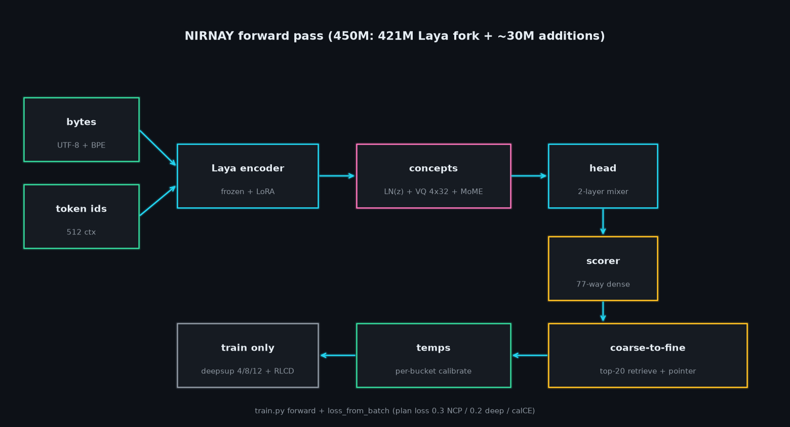
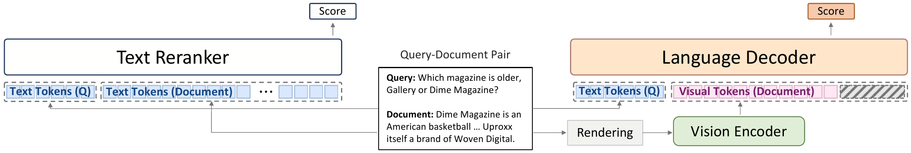

# 开源模型：选择输出形式，也选择部署门槛

今天看六项不同实现。前三项围绕有限选项决策，但从小型适配器、27B多模态模型到450M专用结构，部署取舍不同；后面分别处理检索重排、化学结构识别与语音生成。新闻中已详解的Clef不在此重复。

“开源模型”栏目同时介绍开放权重；MolParser权重有非商业限制，不能视作可任意商用的开源软件。下列成绩均为作者提供，未在本站实测。

## 01 · Strands Decider 2B：小型适配器把状态变成多项决策

权重记录：2026-09-30。模型库创建于9月30日，10月1日更新；不把更新时间当首次上传。新近实用 / 新近创新 · 热度待验证 · 作者材料核验，本站未运行。

这个仓库发布的是 Qwen3.5-2B-Base 上的 LoRA 适配器和小型评分头，需要另下载基础权重。输入一段状态，可以同时询问二选一、多个候选和有序等级，例如工单该转哪个团队、是否紧急、用户有多不满；输出对应选项及置信度，不能当成任意文本生成器。

[实现仓库](https://github.com/strands-labs/strands-decider)提供训练配方、数据清单及命令行。最小路径是安装 `strands-decider` 后用 `ask` 传入状态与选项，可选 CUDA、MPS 或 CPU。Apache 2.0 覆盖代码与适配器；首次下载、基础模型内存和目标任务校准仍是门槛，并非只加载一个很小的文件就能运行。

当前模型卡的 JevBench public 231 题在 4096 和 3072 窗口下均为 167/231；仓库其他实验配置的结果不能混入这个权重记录。作者还给出短任务和拒答等分项，适合检查不同决策类型是否退步。为什么现在值得看：它提供从 typed question 到概率输出的可复用实现与材料，而不只发布一个均分。小测试集和训练分布限制了外推，本文不将作者所说“校准”理解为所有领域都可信。

[模型卡、文件与许可](https://huggingface.co/StrandsAgents/strands-decider-2B-hobson-v19)

## 02 · pplx-decider-v1-27b：多模态选择器，显存门槛也更高

权重记录：2026-10-01。新近实用 · 热度待验证 · 作者材料核验，本站未运行。

Perplexity 将 Qwen3.8-27B 微调为决策模型。传入文本、可选图片，以及候选项的说明，可以输出选择及概率；例如把带截图的故障工单分给技术支持、账单或销售。对这类任务，结构化结果省去解析自由文本的步骤。

模型卡给出 11 个基准的整体成绩 85.71%，所列 Jev 为 84.51%、原底座为 74.76%。但 WinoGrande、BBH 和 JevBench public hard 等单项没有领先，而且新模型成绩明确通过 **Perplexity API** 测得，不能直接当作已下载权重在本机的结果。部署后仍需用相同数据、提示和选项定义复测。

权重和推理材料以 Apache 2.0 提供。示例需要 Python 3.12+、CUDA GPU，以及约49 GiB权重空间之外的工作显存；模型下载和自定义实现也需检查。为什么现在值得看：这是新近公开的完整大模型方案，能与小型决策器比较质量及资源成本。上传时间为10月1日21:24 UTC，即北京时间10月2日05:24，本文保留原始日期口径。

[模型卡、文件与许可](https://huggingface.co/perplexity-ai/pplx-decider-v1-27b)

## 03 · Nirnay 450M：先粗选候选，再精确打分

权重记录：2026-09-30。新近实用 / 新近创新 · 热度待验证 · 作者材料核验，本站未运行。

Nirnay 在约421M参数的 Laya 编码器上增加约30M模块：先把状态编码为概念表示，再做粗粒度筛选，最后用指针式结构对保留下来的候选打分。输入支持的上下文仅512 token，超长内容可能被截断，因此适合先整理过的短工单或意图识别。

eulogik模型卡原图：沿箭头看编码器、概念层和coarse-to-fine；图中左下train only属于训练机制，不是部署时必须额外调用的大模型。图内77路评分对应其任务配置。（[来源原图](https://huggingface.co/eulogik/nirnay-450m)；[查看大图](images/nirnay-architecture.png)。）

作者在 Banking77 微调任务上报告87.92%，与 Jev 零样本80.3%的条件不同，不能当公平同条件胜出。公开 JevBench hard 结果约0.396，也提醒我们专门意图任务的表现不能直接外推为通用推理。作者给出的M4/MPS延迟是其环境结果，本站未复现。

Apache 2.0 权重附 `NirnayAgent` 使用代码，仍需要其编码器、检查点与依赖。为什么现在值得看：它把小模型的资源约束与专用任务设计摆在一起，并披露了效果较弱的泛化测试。温度校准可以调整已有验证集上的置信度，却不能保证分布变化后的正确率。

[模型卡、文件与许可](https://huggingface.co/eulogik/nirnay-450m)

## 04 · RenderRank-2B：把候选文档画成图再重排

权重记录：2026-09-28。新近实用 / 新近创新 · 热度待验证 · 作者材料核验，本站未运行。

RenderRank 保留查询的文本输入，把候选文档渲染成图片，经视觉编码后由语言解码器给出相关性分数。它用于检索后的重排：先拿到一批候选，再决定哪些排在前面；并非替代整个向量库或搜索引擎。

nlpai-lab模型卡原图：左侧是普通文本重排，右侧只把Document部分换成视觉token；Query未变。图用于理解输入表示差异，不表示检索质量必然更高。（[来源原图](https://huggingface.co/nlpai-lab/RenderRank-2B)；[查看大图](images/render-rank.png)。）

作者在11个BEIR数据集、BM25前100候选条件下报告平均NDCG@10为55.96，平均输入token约290；Qwen3-Reranker-4B为57.99、约439。减少token伴随精度取舍，不能只摘取节省比例。渲染使用固定字体、字号、图像边长和最多56行，较长文本的截断会影响结论；视觉编码本身也有计算成本。

Apache 2.0 权重附自定义推理代码，使用Qwen视觉组件和指定Transformers等依赖；应按模型卡环境安装，而非认为任何旧版重排接口都兼容。为什么现在值得看：它提供了可检查的“改变文档表示”方案，适合在英文文档候选集上比较成本和召回损失；目前证据主要来自作者实验，中文密集排版与长文仍需单独验证。

[模型卡、文件与许可](https://huggingface.co/nlpai-lab/RenderRank-2B)

## 05 · MolParser-Mobile-V2：化学结构图识别，精度与吞吐有取舍

权重记录：2026-09-21。近期补充（近30天）；这是最早上传记录，当时注明private，转公开日期未确认。新近实用 · 热度待验证 · 作者材料核验，本站未运行。

这个10M模型读取化学结构图，输出ESMILES2，可表达普通分子、Markush结构和聚合物信息。V2将输入从224提高到384像素，输出长度从256扩至384，解决的是化学图像到结构串的任务，不是通用PDF识别。

作者在USPTO测试集上的识别成绩由0.836升到0.909；但同一模型卡所列RTX4090、FP16、贪心解码、batch512吞吐从1520降至1296分子/秒。更高分辨率并非无成本升级，实际小批量延迟也不能由该吞吐数字直接换算。建议先用自己论文中的旋转、扫描噪声及特殊基团图核验输出。

[MolParser代码](https://github.com/dptech-corp/MolParser)为Apache 2.0；本项权重为CC BY-NC-SA 4.0，含非商业和相同方式共享条件。为什么现在值得看：这是面向具体科研资料抽取的新权重，输入输出和代价都有可核对材料。历史显示9月21日上传时注明private，9月28—29日是README更新，准确首次公开时刻未确认；本期按近30天近期补充，绝不将改文档日期当模型首发。

[模型卡、文件与许可](https://huggingface.co/UniParser/MolParser-Mobile-V2)

## 06 · SupraTTS 0.1 Beta：小型英语语音模型，先看声音表现的上限

权重记录：2026-09-27。新近实用 · 热度待验证 · 作者材料核验，本站未运行。

SupraTTS 将约29.6M的GlowTTS和14M的HiFi-GAN组合，输入英语文本输出语音。训练基于约24小时、单一女性说话人的LJSpeech，不能把单音色英语模型写成多语种声音克隆。Beta调整了学习率、时长建模等训练细节，并重新训练声码器。

作者用10条域外文本、10条留出文本和5个随机种子评估，UTMOS由旧版3.05提高至3.59，真人录音为4.34；WER由3.72%到3.64%，改善较小。音高变化仍明显弱于真人，说明听感代理分数提升并不等于已经具备丰富表达。本站未试听或复测，不把自动指标改写成听感结论。

MIT权重配配置及 `infer_v2.py`，模型卡路径需要Python3.10、PyTorch、Coqui相关组件与CUDA环境。为什么现在值得看：它体量较小、训练修订和失败面透明，适合做可控TTS实验；仍处于Beta，短评估集、单说话人及英语范围限制了用途，实际产品需要更长文本和异常发音检查。

[模型卡、文件与许可](https://huggingface.co/SupraLabs/SupraTTS-0.1-Beta)
