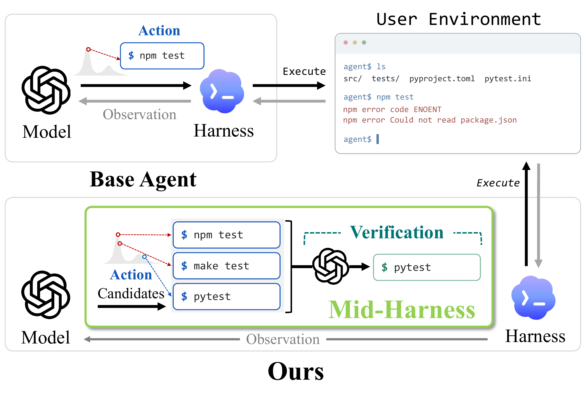
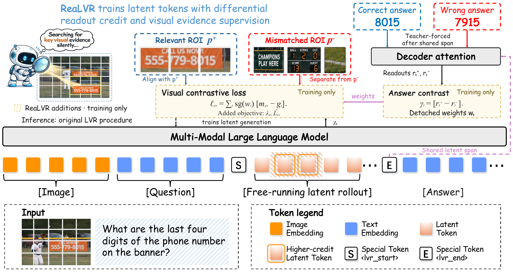
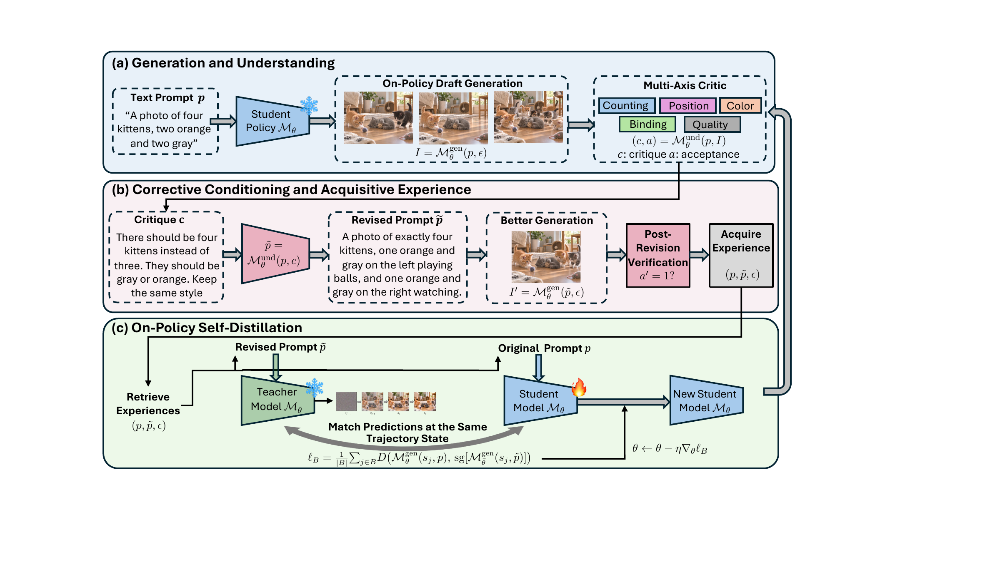

# 六篇论文：先检查反馈，再看分数

本期从 12 篇近期候选中选出 6 篇，覆盖自训练、决策评估、Agent 推理、视觉训练和科学软件操作。以下均为预印本；结论依据作者原文实验，本站未做训练复现。HF 榜单关注只是发现线索，不足以单独证明“热门”。

## 01 · False Frontiers：出题者和解题者一起答错，奖励仍可能上涨

arXiv提交2026-09-30 · 2609.39102 v1 · 预印本。新近创新 / 新近实用，热度待验证。

模型自己出题、自己作答，再按双方是否一致发奖励，看上去能不断生成训练题。但如果出题者给了错误答案，解题者又从同一批伪标签学会了这个错误，一致性便成了错误的正反馈。论文称其为 co-cheating，指的是系统性共享错误，不需要假定模型有意作弊。

CrossFit 的关键是**按原始来源文档分组**，不是随机拆问题：辅助解题器 A 只用 A 组来源训练，去给 B 组问题评分；另一个辅助解题器反过来做。主解题器仍可用全部获准题目训练。改变的是用于奖励出题者的反馈来源，原有奖励函数与主解题器学习规则保留。

三轮实验中，Qwen3.5-4B/9B 的错误一致占比由 6.1%/8.8% 降至 3.0%/3.7%；只做多采样标签验证的 MSV 为 5.7%/7.2%。在固定 1325 题、七个搜索问答基准、相同工具预算与单条贪心轨迹条件下，七项平均成绩由 40.0/42.8 提高到 48.8/51.2。论文另有固定题库回放实验，0.4%/0.1% 属于该诊断条件，不能拿来替代完整自训练结果。

为什么现在值得看：新论文把“奖励增长是不是能力增长”落实为来源隔离实验，对合成数据流水线很有参考价值。真值审计仍借助带来源的外部模型判断，不是全面人工标注；来源分组不能消除共享预训练知识中的错误，还增加辅助模型训练成本。复现宜先记录每道题的来源及反馈模型训练来源，再讨论换更强裁判。

论文作者的 CrossFit 算法原图，CC BY 4.0。先看中间按来源分组，再看右上交叉评分；右下主解题器仍使用全部训练题。评分模型与主模型的职责不能混为一谈。（[作者原图](https://arxiv.org/abs/2609.39102v1)；[查看大图](images/crossfit.png)。）

[站内阅读卡](../../../../papers/frontiers/false-frontiers-2609-39102/00-阅读卡.md) · [归档PDF](../../../../papers/frontiers/false-frontiers-2609-39102/2609.39102v1.pdf) · [原文](https://arxiv.org/abs/2609.39102v1)

原文为CC BY 4.0，保存未改动的v1 PDF并保留作者和许可。

## 02 · Ordinal Scale Bias：给模型更多等级，它未必真的使用这些等级

arXiv提交2026-09-30 · 2609.38827 v1 · 预印本。新近创新 / 新近实用，热度待验证。

把质量分成 1—5 档与分成 1—14 档，并不只是多给几个标签。论文研究 JEV 1.13 和 KEV 三个规模，在 40 个数据集、每集最多 5000 条的评估中发现：有顺序、语义相邻的等级容易被挤到少数输出；语义彼此独立的类别较少出现同样程度的收缩。

作者用 R 比较预测与真值分布的“有效类别数”：先对类别频率算熵，再取指数，最后相除。R 衡量用了多宽的输出空间，**不是正确率**。在同一批 1400 条样本上，把连续分数等频切成 2 至 14 档，JEV 的 R 从 95.9% 降至 54.5%；KEV-0.8B 从 77.3% 降至 26.5%。对同一题打乱候选顺序能改善部分结果，却没有消除整体收缩。

BA-LoRA 用 3.2 万条有序任务样本继续训练。KEV-4B 在未见来源上也有改善；0.8B 的迁移较混合，不能据训练来源提升就认定所有评分任务都修好了。R=100% 同样不能保证质量：两种分布可能频率一样，但每条都错配，所以必须同时看准确率和总变差距离 TVD。

为什么现在值得看：近期直接决策模型密集出现，这篇给出了比单一准确率更细的验收办法。限制是只覆盖一个托管系统与一个开放家族，两次随机排列不足以穷尽顺序敏感性；DBpedia 对照接近满分，未做到难度匹配，部分既有训练集的样本级重叠也未审计。本站在[技术实践](05-技术实践.md)用可运行的合成例子解释这些指标，不冒充复现作者模型。

作者图 3，限本条研究评论引用，完整保留坐标与图例。优先看 a：同样的文本，候选等级 K 变细后 R 下降；c 的概率分布仍可能较宽，说明取最大概率这一决策步骤也值得检查。R 轴不是准确率。（[作者原图](https://arxiv.org/abs/2609.38827v1)；[查看大图](images/ordinal-scale.png)。）

[站内阅读卡](../../../../papers/frontiers/ordinal-bias-2609-38827/00-阅读卡.md) · [原文](https://arxiv.org/abs/2609.38827v1)

arXiv非独占分发许可不直接授权本站再分发全文；本期保存阅读卡和原站链接，只引用一幅有署名的原图作方法评论。

## 03 · Mid-Harness：命令执行前，先让候选动作竞争

arXiv提交2026-09-30 · 2609.39982 v1 · 预印本。新近创新 / 新近实用，热度待验证。

终端 Agent 一条错误安装命令就可能改变环境。Mid-Harness 在执行前让生成器提出 N 个动作，验证器选出一个，再交给原执行器；下一步继续读取真实环境反馈。它并不把所有候选命令各跑一次，因此与复制整个环境跑多条完整轨迹不同。

论文比较逐条打分、整组排序和两两比较。在 TerminalBench-Lite、TMAX-9B、最多 64 步及约 65k 上下文的设定中，基础 Agent 的平均 Pass@1 为 50.00%；N=8 时，同模型零样本两两验证为 54.76%，蒸馏验证器为 57.14%，更强的 GPT-5.6 Sol 验证器为 68.03%。关键不是候选越多越好，而是验证器能否分出更值得执行的动作。

作者用 244 个任务的 732 条轨迹构造约 11.7 万对偏好训练验证器，动作生成器不变。动作筛选与完整轨迹搜索也能组合：Best-of-3 单独为 55.10%，叠加蒸馏验证器为 66.33%。但相同环境执行次数不等于相同计算成本；N=8 两两验证的输出 token 开销明显高于整组排序，论文的并行输出时间估计也不是本站测量的端到端耗时。

为什么现在值得看：它把推理时计算的投入位置从“多跑几次整题”挪到“每一步少做坏动作”。补充跨模型、跨执行框架实验的规模并不都相同，部分迁移设置并未稳定获益；缺少每一步动作的金标准，尚不能证明验证器选对的比例。适合先在可回放任务中记录候选、选择及环境变化，再评估成本。

NVIDIA、KAIST 作者图 1(a) 的独立原始子图，CC BY 4.0。上方直接执行错误命令，下方在执行前筛选；这是论文概念例子，不是本站终端实测。图中品牌标志来自原图，不代表只适用于该模型。（[作者原图](https://arxiv.org/abs/2609.39982v1)；[查看大图](images/mid-harness.png)。）

[站内阅读卡](../../../../papers/frontiers/mid-harness-2609-39982/00-阅读卡.md) · [归档PDF](../../../../papers/frontiers/mid-harness-2609-39982/2609.39982v1.pdf) · [原文](https://arxiv.org/abs/2609.39982v1)

原文为CC BY 4.0，保存未改动的v1 PDF并保留作者和许可。

## 04 · ReaLVR：潜在推理状态也需要具体的视觉证据

arXiv提交2026-09-28 · 2609.34563 v1 · 预印本。新近创新 / 新近实用，热度待验证。

潜在视觉推理把中间计算放在连续隐藏状态里，未必写成文字。难点是最终答案正确，不代表这些隐藏状态真的读到了决定答案的图像细节。ReaLVR 先让当前模型生成自己的潜在轨迹，再保留梯度去训练它，而不是只在一个固定的旧轨迹上优化最后的文字答案。

方法分两个问题。哪里需要加强：比较正确答案和错误答案对各潜在位置的读取，把更多权重给对正确答案有帮助的位置。应该学什么：让隐藏状态靠近相关图像区域的视觉表示，并远离不匹配区域；缺少区域标注时使用整图目标。这两个训练分支在推理时撤掉，推理仍沿用原 LVR 的流程。

Qwen2.5-VL-7B 上，五项视觉基准的无权平均为 63.7±0.2，LVR-RL 为 60.4±0.2，最强平均分对照 ILVR-Stage2 为 62.9±0.2；不是所有单项都领先。比如 BLINK 为 55.8，低于 ILVR 的 56.8。跨家族还测试 InternVL3 与 Gemma 3；235B 条目只测三个基准，不能与完整五项均值并排比较。

为什么现在值得看：这项新训练目标使“隐藏推理是否依赖视觉证据”可以通过图像编辑、状态替换与消融来检验，而非只看注意力热图。论文方法需要训练资源及视觉监督，作者整体实验使用 800 张 MI250X，不能据“推理不加模块”推断训练便宜；没有区域标注时监督更粗，潜在 token 数也仍是预设预算。

作者图 2 方法原图，限本条方法评论引用。下方橙色位置是潜在状态；右上正误答案的读取差异决定监督权重，左上正负图像区域决定学习目标。黄色虚线标出的分支只用于训练，测试时不能读到答案。（[作者原图](https://arxiv.org/abs/2609.34563v1)；[查看大图](images/realvr.png)。）

[站内阅读卡](../../../../papers/frontiers/realvr-2609-34563/00-阅读卡.md) · [原文](https://arxiv.org/abs/2609.34563v1)

arXiv非独占分发许可不直接授权本站再分发全文；本期保存阅读卡和原站链接，只引用一幅有署名的原图作方法评论。

## 05 · UniEvo-VL：把看图后的修订经验训练回生成器

arXiv提交2026-09-30 · 2609.38721 v1 · 预印本。新近创新 / 新近实用，热度待验证。

先画一张图、让视觉模型挑错、改提示再画，能改善单次结果，但下次同类请求还要重新纠错。UniEvo-VL 想把这段经验写回生成模型：原提示生成草图，冻结的视觉批评器检查计数、位置、文字与质量，给出修订提示；教师看到修订版，学生只看到原请求，二者在同一学生去噪状态上匹配预测。

教师随训练做滑动平均更新，生成器用 LoRA 学习。修订后图像主要用于筛选经验是否值得保留，不是简单拿更好图片作监督目标。实验把 Qwen-Image-2512 与固定的 Qwen-VL 组合为流水线；另测外部 GPT-5.6 Luna 反馈。不能据“统一”一词说所有理解和生成都由一个共享单体权重完成。

应分配置读结果。表 1 中，经修订验证的 Qwen 反馈版本，GenEval 从 0.747 到 0.818，OCR 从 0.771 到 0.790；未经验证的反馈在 GenEval2 和 OCR 上会退步。表 2 使用其自身匹配基线，继续加入推理时反思仍有收益，说明训练并没有完全取代额外纠错。不同表的基线数值有变化，本文不交叉拼接提升幅度。

为什么现在值得看：论文把“会指出错误”与“会从错误中学习”分开做了对照，修订验证这一环尤其适合复现。容易任务在历史子集仍下降 1—4 个百分点；标为 HumanPref 的分数是自动偏好代理，并非重新招募人的盲评。结果依赖批评器能力、筛选规则和训练采样，尚不能保证通用自我进化。

作者图 2，CC BY 4.0。按上、中、下三层阅读：草图和批评 → 修订及验证 → 教师与学生在同一轨迹状态上匹配。右侧回路更新的是学生生成能力，冻结批评器没有因此自行变强。（[作者原图](https://arxiv.org/abs/2609.38721v1)；[查看大图](images/unievo.png)。）

[站内阅读卡](../../../../papers/frontiers/unievo-vl-2609-38721/00-阅读卡.md) · [归档PDF](../../../../papers/frontiers/unievo-vl-2609-38721/2609.38721v1.pdf) · [原文](https://arxiv.org/abs/2609.38721v1)

原文为CC BY 4.0，保存未改动的v1 PDF并保留作者和许可。

## 06 · OSWorld-Science：会操作科学软件，不等于交付了正确研究产物

arXiv提交2026-09-30 · 2609.39903 v1 · 预印本。新近创新 / 新近实用，热度待验证。

OSWorld-Science 将计算机使用评测带入七个科学领域：146 个任务，覆盖化学、物理、医学、统计、生物、地理信息和语言学。任务不是看一张图选答案，而是在配置好的虚拟机里操作真实软件，生成可检查的图表、分析文件或其他产物。

评测沿用截图、鼠标和键盘交互；122 个任务允许命令行辅助，24 个要求 GUI。各模型在相同执行框架中工作，通常最多 100 步，保留最近五张截图。多数任务按完成要点给 0—1 的部分分，因此总表的 73.7% 等数值是**平均任务得分**，不能写成 73.7% 的任务全部成功。

作者比较 12 个视觉语言模型，表中 Fable 5.1 平均得分 73.7%，Claude Opus 5 为 57.9%，GPT-6 Astra 为 57.4%。这组排名只对应给定软件、模型版本、思考设置和交互预算。领域数量很不均衡，例如化学 43 题、语言学仅 2 题，整体均值不等于每个科研方向的可靠性。

为什么现在值得看：它让“Agent 能帮科研”落到文件产物与任务步骤上，失败轨迹也可用于排查软件知识、界面定位还是验证能力不足。科学软件许可、账号与虚拟机配置是复现门槛；SAS 等受限环境的轨迹用途需分别遵守原条款。文中环境和 Agent 设置处的分辨率表述也不一致，复现前应核对实际配置，本站不据此填写一个猜测分辨率。

论文作者图 1，CC BY 4.0。先看中间截图—动作—软件状态的闭环，再看右侧分步骤与二元产物评价；这解释了平均部分得分为什么不等于完整成功率。（[作者原图](https://arxiv.org/abs/2609.39903v1)；[查看大图](images/osworld-science.png)。）

[站内阅读卡](../../../../papers/frontiers/osworld-science-2609-39903/00-阅读卡.md) · [归档PDF](../../../../papers/frontiers/osworld-science-2609-39903/2609.39903v1.pdf) · [原文](https://arxiv.org/abs/2609.39903v1)

原文为CC BY 4.0，保存未改动的v1 PDF并保留作者和许可。
