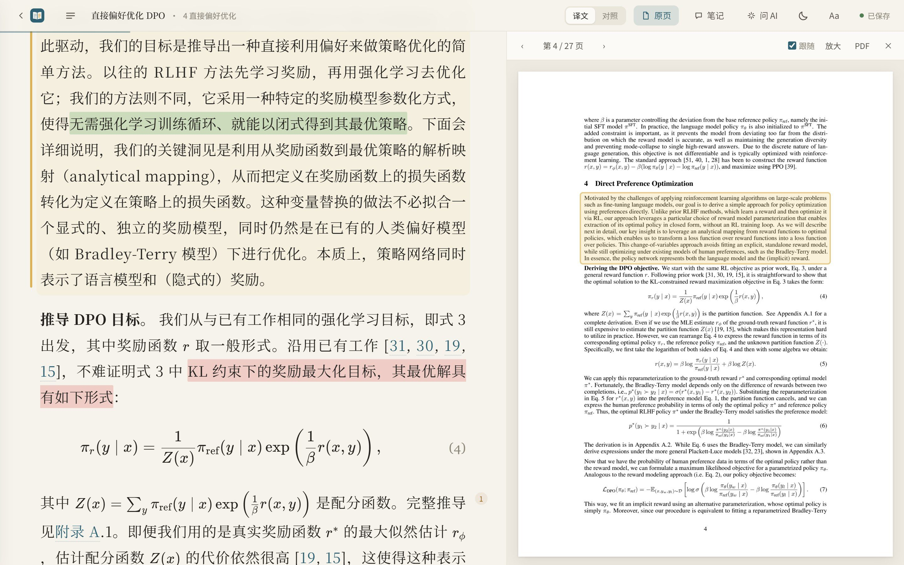
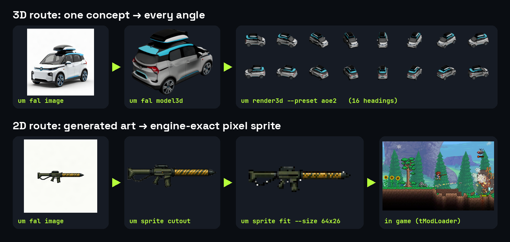
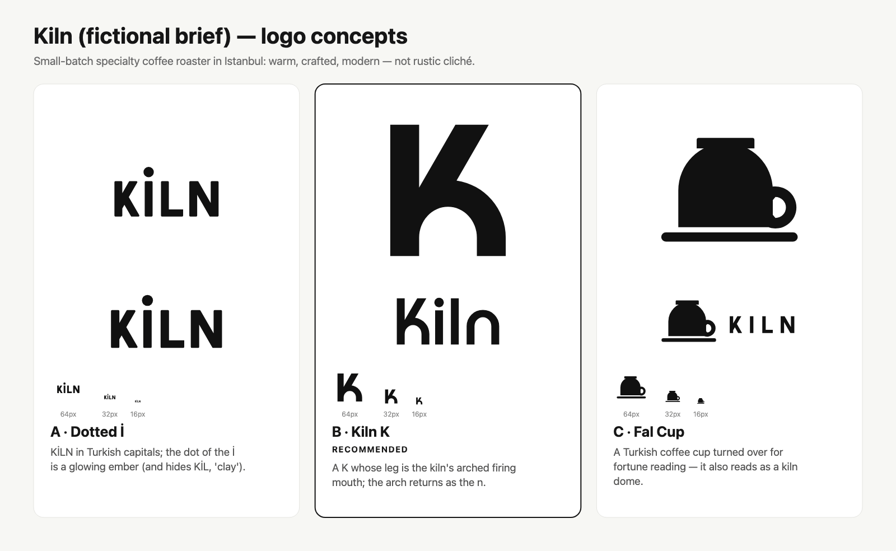

# 开源项目：十个有明确输入与产出的近期工具

先按任务挑选，再看安装和许可。本期对照了17个仓库候选，保留10项；Pi已在新闻速读，Strands和MolParser在模型栏，限制再分发或商业使用、许可未确认的候选未混入开源软件名单。所有项目均核对仓库、许可、版本或提交记录；未安装运行，不将作者演示写成实测。

| 想完成的任务 | 工具 | 主要门槛 |
| --- | --- | --- |
| 边读原论文边看翻译和笔记 | EasyRead | 桌面端或Python，所选AI后端 |
| 把本地模型接到已有Agent | Magnitude | 模型适配、内存与内核调优 |
| 给GGUF模型提供轻量本地接口 | Janus | Go、llama.cpp/Vulkan运行库 |
| 从语法规则生成C++解析器 | Yantra | C++23与CMake |
| 同时管理多个编码Agent终端 | Agent Office | Node20+、git与Agent CLI |
| 用Angular开发原生手机界面 | Angular Native | Expo、匹配版本与alpha限制 |
| 把素材变成可验证的游戏模组 | Universal Modder | Python、游戏/引擎工具与素材权利 |
| 生成并检查可交付SVG标志 | logo-design-skill | Agent、Python与渲染后端 |
| 研究神经渲染的Vulkan实现 | OpenDLSS-NR | NVIDIA Ada、独立模型文件 |
| 沿函数关系审查代码改动 | Perspica | Rust二进制；模型总结可选 |

## 01 · EasyRead：让译文、原页与笔记保持对应

本次进展：2026-09-30。新近实用 · 热度待验证 · 作者材料核验，本站未实测。

EasyRead面向需要精读英文论文的人：导入PDF后，译文、原始页面和笔记可对照查看，公式保留排版，并可把解释或笔记导出。相比在翻译窗口与PDF之间手动找位置，它将“这句译文来自哪一段”留在同一阅读流程中。

Edwardxlai仓库原始界面示例：左右高亮对应同一段，适合核对翻译是否偏离原意；图中论文内容仅用于解释阅读界面，非本站试用截图。（[来源原图](https://github.com/Edwardxlai/easyread)；[查看大图](images/easyread-pages.jpg)。）

可使用已提供的桌面安装包，或按Python3.10+路径运行；翻译和问答还需要所选CLI登录、API或本地Ollama后端。为什么现在值得看：新实现展示了实际的论文阅读产物，输入输出清楚。保存文件在本地不代表发送给云模型的段落也留在本机；译文、公式解释和复杂版面仍要与原文核对，早期版本更新较密集。

[仓库与上手说明](https://github.com/Edwardxlai/easyread) · [MIT](https://github.com/Edwardxlai/easyread/blob/main/LICENSE)

## 02 · Magnitude：为当前机器调优，再连接已有Agent

本次进展：2026-09-30。仓库始于2026-06-12；本条记录近期产品发布，不称新建仓库。新近实用 · 热度待验证 · 作者材料核验，本站未实测。

Magnitude将本地模型推理引擎做成桌面应用：在Discover下载适合机器的模型，在Connections连接已有Agent。它会针对设备编译和调优内核，并在并发会话间共享前缀缓存，面向的是重复调用本地模型的开发工作。

仓库最早创建于6月12日，本次选择依据是9月30日的[Launch HN发布](https://news.ycombinator.com/item?id=49911995)及当前公开实现，不是旧仓库总Star。支持Apple Silicon、NVIDIA、AMD或CPU，但可跑模型仍受内存和专用内核覆盖限制；首次调优也有成本。作者列出的Metal和CUDA收益不同，不能把“最高2倍”套给所有电脑。为什么现在值得看：安装、选模型、接Agent组成了具体的新使用路径；正式采用前宜用自己的任务比较质量、首轮等待和后续吞吐。

[仓库与上手说明](https://github.com/magnitudedev/magnitude) · [Apache-2.0](https://github.com/magnitudedev/magnitude/blob/main/LICENSE)

## 03 · Janus：把GGUF模型包成轻量本地API

本次进展：2026-10-01。原仓库日期2026-09-24，近期补充；10月1日为讨论日期。新近实用 · 热度待验证 · 作者材料核验，本站未实测。

Janus用Go封装llama.cpp，输入本地GGUF模型文件，输出兼容OpenAI调用形式的本地服务，适合把小型自用工具接到现有客户端。文档强调轻量程序及模型热切换，免去自行拼装Python服务的步骤。

最小路径需Go1.22+构建、指定模型文件，并准备匹配的llama运行库；Vulkan支持也依赖平台驱动。Windows是主要路径，Linux需相应共享库，macOS路径不应直接假定具备同样GPU支持。为什么现在值得看：近期公开了可用封装和具体启动例子，但“单个可执行文件”不等于模型及动态库都不存在。该项目9月24日创建，10月1日出现Show HN讨论；本文没有验证跨平台性能，CPU、内存与显存需求仍由所选模型决定。

[仓库与上手说明](https://github.com/Vibra-Ingenn/Janus) · [MIT](https://github.com/Vibra-Ingenn/Janus/blob/main/LICENSE)

## 04 · Yantra 0.5：从语法规则生成可嵌入C++的解析器

本次进展：2026-09-28。旧项目2025-10-09创建，本次有明确版本变化。新近实用 · 热度待验证 · 作者材料核验，本站未实测。

Yantra接收语法定义，生成C++解析器、AST和遍历代码，适合为配置语言、代码分析或研究数据格式编写工具。它将词法模式、Unicode和流式输入放在同一实现中，减少手写解析器里重复的状态处理。

项目始于2025年10月9日，本次按9月28日v0.5.0的重要变化收录：包括C++23、类成员注入、文本walker等；9月30日v0.5.1属于后续修复，未包装成全新产品。上手需要CMake和C++23编译器，先运行仓库语法示例并检查生成代码。为什么现在值得看：新版本改善实际生成和集成路径，有公开实现；它并不自动具备编辑器所需的增量解析能力，也不能仅据作者性能描述认定比同类解析器更快。

[仓库与上手说明](https://github.com/TantrixAuto/yantra) · [MIT](https://github.com/TantrixAuto/yantra/blob/main/LICENSE)

## 05 · Agent Office：多Agent终端的工作台

本次进展：2026-09-26。新近实用 · 热度待验证 · 作者材料核验，本站未实测。

Agent Office用可视工作台管理多个编码Agent的实时终端；某个任务需要输入时，可以定位对应会话，再回到仓库和任务列表。适合已经有多条本地开发会话、经常不知道哪条在等人的工作流，3D桌面只是其中一种界面，也有较轻的列表视图。

运行需要Node20+、git和已配置的Agent CLI；GitHub操作另需gh等条件。仓库工作区与worktree的隔离需按配置核对，多个终端仍拥有相应本地用户权限，视觉分成不同桌子不构成安全隔离。为什么现在值得看：9月26日公开后持续提供可执行版本，任务状态到终端的路径明确。项目尚早且版本变化快，本文只核对文档和实现材料，没有将新版本频繁发布当成稳定性或真实采用规模的证明。

[仓库与上手说明](https://github.com/AgentSystemLabs/agent-office) · [MIT](https://github.com/AgentSystemLabs/agent-office/blob/main/LICENSE)

## 06 · Angular Native：让Angular组件直接落到原生视图

本次进展：2026-09-27。原创建时间UTC 9月27日，对应北京时间9月28日。新近实用 · 热度待验证 · 作者材料核验，本站未实测。

Angular Native允许用Angular组件、signals和路由编写手机界面，再通过React Native的Fabric渲染原生视图。React组件本身不进入这条渲染路径；它复用的是底层原生设施，并非在WebView里展示网页。

仓库提供Expo模板创建命令，最低环境按文档需要Node22.18+及匹配的Angular22、Expo57/React Native0.86版本。示例输入一个计数状态，输出可点击的原生按钮，适合先验证小组件；不应直接移入整套React组件库，第三方React hooks和同一Fabric树的共用存在限制。为什么现在值得看：9月27日新公开的桥接实现给已有Angular经验者另一种试验路径。项目独立维护、仍属alpha，CSS、表单和原生模块要按支持列表核对；源码公开不代表Google官方承诺兼容。

[仓库与上手说明](https://github.com/ng-native/ng-native) · [MIT](https://github.com/ng-native/ng-native/blob/main/LICENSE)

## 07 · Universal Modder：把素材制作接到引擎内验证

本次进展：2026-09-30。新近实用 · 热度待验证 · 作者材料核验，本站未实测。

Universal Modder提供Python CLI与Agent可用流程：先扫描游戏和引擎，备份后做一项小修改，再进入实际游戏验证并记录结果。它还提供从概念图、3D模型、多角度渲染到精灵图的路径，适合研究素材如何成为引擎可接受的文件。

rehan-remade仓库原图：上排展示从概念到多个朝向，下排展示裁切和尺寸适配后进入游戏。它是作者工作流示例，图中生成素材和游戏画面并非本站运行结果。（[来源原图](https://github.com/rehan-remade/universal-modder)；[查看大图](images/modder-pipeline.png)。）

需要Python3.10+，具体步骤还可能需要FFmpeg、Blender、目标引擎工具；调用fal等生成服务另需账户和费用，不能视为安装后全部离线免费。为什么现在值得看：近期提供了可执行工具和产物转换范例，超出纯提示词清单。MIT仅覆盖项目自身，游戏与素材另有权利条件；建议从自己有权修改的离线素材与单机测试环境开始，不把一条扫描命令当作所有游戏均支持的保证。

[仓库与上手说明](https://github.com/rehan-remade/universal-modder) · [MIT](https://github.com/rehan-remade/universal-modder/blob/main/LICENSE)

## 08 · logo-design-skill：从候选图形走到可检查的SVG交付

本次进展：2026-09-26。新近实用 · 热度待验证 · 作者材料核验，本站未实测。

这个项目将标志设计分成需求、候选方案、SVG构造、光学校正与导出检查，并附Python工具。输入一份品牌简报，输出多方案和可检查的矢量文件；比只让模型画一张图更接近图标、单色印刷和favicon等实际交付要求。

kaankiziltug作者示例原图：重点看各方案底部的小尺寸版本，比较细节缩小时是否消失。它解释交付检查，不是本站推荐品牌的Logo墙，也不是实际客户案例。（[来源原图](https://github.com/kaankiziltug/logo-design-skill)；[查看大图](images/logo-kiln-concepts.png)。）

上手需能读取技能的Agent、Python以及相应PNG渲染环境，建议先用虚构简报复核SVG路径和小尺寸可读性。为什么现在值得看：9月26日公开的流程配有具体产物和检查脚本，能够复用到创作任务。MIT覆盖项目代码与约定范围；参考品牌素材保留各自权利，不能将整理的品牌样本当免费商标库。本文看过作者产物，尚未独立跑完整设计流程。

[仓库与上手说明](https://github.com/kaankiziltug/logo-design-skill) · [MIT](https://github.com/kaankiziltug/logo-design-skill/blob/main/LICENSE)

## 09 · OpenDLSS-NR：拆开看神经渲染的Vulkan实现

本次进展：2026-09-20。近期补充（近30天）；9月30日讨论不是首发。新近实用 · 热度待验证 · 作者材料核验，本站未实测。

OpenDLSS-NR公开DLSS 5神经渲染相关的Vulkan实现，关注从输入渲染信息到输出画面的过程，与超分辨率DLSS SR应区分。作者提供分块验证材料和场景输出，适合研究GPU执行及生成细节如何变化。

maanHimself仓库原始NR OFF/ON对照；场景Cowboy Gramps由Muhammed Ismayil创作并以CC0提供。比较生成效果，不把新增细节当真实世界信息恢复或本站GPU实测。（[来源原图](https://github.com/maanHimself/OpenDLSS-NR)；[查看大图](images/opendlss-example.jpg)。）

代码MIT，但运行还需兼容NVIDIA Ada、Windows/Vulkan环境，以及另外取得的模型文件；这些模型文件不因代码MIT而自动获得相同许可。为什么现在值得看：这是近期可检查的底层实现，作者还给出中间块对齐条件。原仓库创建于9月20日，按近30天近期补充；9月30日HN讨论只是一类热度信号，未据此称热门。本站未具备对应硬件测试，特定场景的速度或对齐结果不能推广到全部游戏。

[仓库与上手说明](https://github.com/maanHimself/OpenDLSS-NR) · [MIT](https://github.com/maanHimself/OpenDLSS-NR/blob/main/LICENSE)

## 10 · Perspica：沿着函数关系阅读代码改动

本次进展：2026-09-30。创建时间UTC 9月30日，北京时间10月1日；Show HN只提供一类讨论线索。新近实用 · 热度待验证 · 作者材料核验，本站未实测。

Perspica输入git差异或PR，先用tree-sitter解析两边代码，区分函数修改、移动、签名和格式变化，再按调用关系组织阅读顺序。审查大块重构时，可以先看入口及其调用函数，将纯格式改动折叠，减少在文件之间来回跳转。

sshah03仓库对pallets/click PR #3767的原始界面：左侧由入口走到pager函数，右侧标明调用者及测试路径；这是作者演示，非本站运行结果。（[来源原图](https://github.com/sshah03/perspica)；[查看大图](images/perspica-reading-order.jpg)。）

核心是Rust单二进制，可用cargo install perspica或发布包安装，运行perspica --web查看本地仓库；读取GitHub PR需gh。结构分析不要求模型，意图总结等LLM功能为可选项。为什么现在值得看：新工具提供了清楚的代码输入、差异产物与真实PR示例，适合研究实现和审查Agent生成的代码。调用边采用名称与导入等启发式，不能当成完整程序证明；支持列表之外的语言会退回行级差异。启用远端总结或会话上下文前，应了解会发送哪些代码和提示词。

[仓库与上手说明](https://github.com/sshah03/perspica) · [MIT](https://github.com/sshah03/perspica/blob/main/LICENSE)
