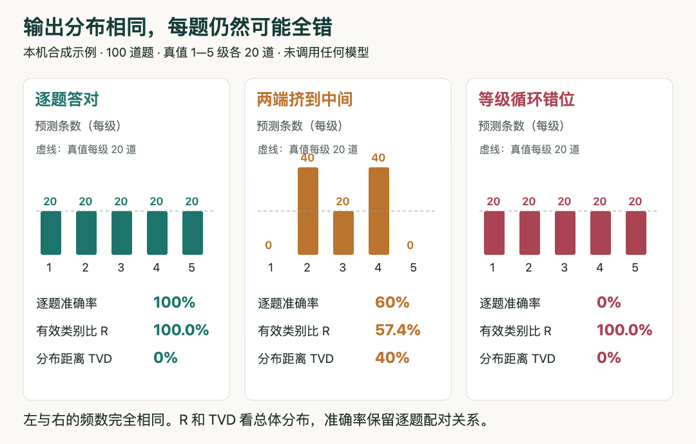

# 小实验：五个等级都用了，为什么仍可能每题都错

**已在本机实际运行。** 这是100道合成题的CPU演示，不使用模型、网络API或训练数据，不冒充[Ordinal Scale Bias论文](03-论文精选.md)的模型复现。需要Python标准库，无第三方依赖。

## 三种预测，只改一条规则

构造1—5级各20道题，真值分布完全均匀。分别生成三套预测：逐题原样复制；把1压到2、5压到4；所有等级循环移位，即1→2、2→3、3→4、4→5、5→1。

第二种模拟输出空间收缩，第三种保留频数但破坏每一道题与答案的对应。后者是检查指标是否遗漏重要信息的反例，不是对真实模型行为的断言。

## 指标到底在量什么

准确率逐题比较答案。总变差距离TVD把两份类别频率逐项相减、取绝对值相加再除以2；0表示总体频率相同。有效类别比R先计算两份频率的熵，再取指数之比：

```text
H(p) = -Σ p[i] log(p[i])
有效类别数 = exp(H(p))
R = exp(H(预测分布)) / exp(H(真值分布))
TVD = 0.5 × Σ |预测频率[i] - 真值频率[i]|
```

直觉上，均匀用到五级时有效类别数是5；大部分挤在少数等级时会变小。R不是正确率，也不是一律不超过100%：真值本身很集中而预测更分散时，它可以超过100%。这里真值均匀，所以分母恰好是5。




本站HTML/JS按实际Python运行结果制图。每组100题，灰虚线为真值每级20题；比较最左与最右，同样的直方图隐藏了完全不同的逐题对应关系。无模型成绩。（[指标背景论文](https://arxiv.org/abs/2609.38827v1)；[查看大图](images/ordinal-result.png)。）


## 实際结果与复现

| 合成预测 | 逐题准确率 | R | TVD |
| --- | ---: | ---: | ---: |
| 逐题答对 | 100% | 100.0% | 0% |
| 两端挤到中间 | 60% | 57.4% | 40% |
| 等级循环错位 | 0% | 100.0% | 0% |

第二种预测的计数是0、40、20、40、0；第三种仍是20、20、20、20、20。只有逐题指标能在这个反例中区分第一种与第三种。真实验收还可加入混淆矩阵、按等级召回以及校准误差，不能用这一百条合成数据选择真实模型。

下载[实验脚本](code/ordinal-toy.py)后运行：

```bash
python3 ordinal-toy.py
```

脚本在同目录生成JSON，保存全部100条真值、三套预测、计数和运行环境，并用断言检查反例成立。本机Python版本为 3.14.3，结果与[实际输出](code/ordinal-results.json)一致。为了查看交互源码，可将[图表HTML/JS](code/ordinal-chart.html)与JSON放在同一目录，通过本地静态HTTP服务打开；图从同一份JSON读取，不手填指标。

为什么需要自己作图：论文原图是作者模型实验，不能当本站运行结果；生成图也不能承担逐项准确的频数和指标。这里采用HTML/JS是为了让数据、代码和图中的数字可以对应复核。
