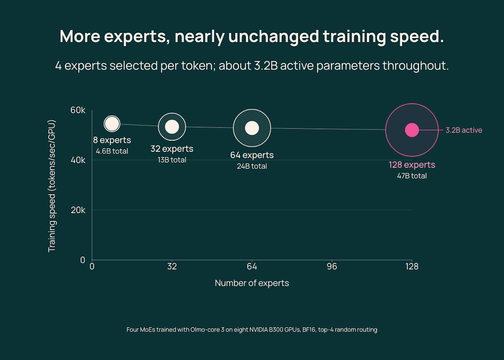
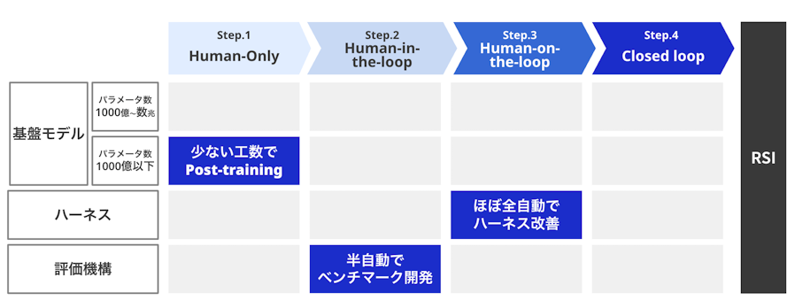

# AI 动态：把能力接进可检查的工作流程

本期 15 条：前 5 条重点详解，后 10 条速读。事件日期覆盖 2026-09-27 至 2026-10-02，按 24 小时、72 小时、7 天依次扩展；仅有日粒度的公告保留原日期，不猜发布时间。各条依据新近实用或创新价值入选，尚未取得两类独立近期热度信号，不统一冠以“热门”。

## 01 · Claude Code Mods：工具调用与界面都能通过插件改写

日期：2026-10-01 · 近期补充。选题：新近实用 / 新近创新；验证：官方公告、文档或作者实验，非本站实测；热度待验证。

Claude Code 新增 Mods：开发者可以写 JavaScript 或 TypeScript 函数，在工具调用、提交提示词、绘制界面等事件发生时介入。与只给模型一段说明的 skill 不同，mod 能观察事件、修改参数，或直接处理事件而不运行原来的行为。正式文档要求 v2.1.287 或更新版本，默认启用；这是此前早期实验之后的正式入口变化。

可以把它理解成同一应用里的可编程接点。例如，一个处理函数统计工具调用次数，另一个把计数画在输入框上方；团队也可以在调用前检查参数，弹出额外面板，再决定是否继续。数据不必绕到一个外部聊天模型才能呈现。自定义命令还可直接运行函数，不消耗一次 Claude 对话回合。

这几种扩展仍有分工：现有 shell/HTTP hooks 适合复用脚本，MCP 适合接外部工具，Mods 则处理应用内部事件与界面。官方把 `/diff` 等内置功能也做成 mod，并提供上下文用量、危险命令影响范围、文件修改回放等示例。读者能从完整示例看到事件如何转成界面反馈，不必先搭一个新客户端。

安装沿用插件和 marketplace 流程，更新后可重载。终端与 Desktop 的 Code 页能显示新增面板；VS Code 聊天面板、无界面执行等环境仍可运行已加载的处理函数，却不显示同样的 UI。组织管理员还能限制允许加载的 mods。不能把“到处能运行”写成“各客户端界面完全一致”。

为什么现在值得看：它把编码代理的可观察性和工作流控制开放给插件作者，同时扩大了插件的权限边界。Mods 并非沙箱，可能读取文件、启动进程、联网或改写会话；应像审查本地程序一样审查来源。本文核对了版本、示例与权限说明，未安装插件，也未把可编程控制等同于已验证的安全保证。[能力、版本与运行位置](https://code.claude.com/docs/en/plugins/mods/overview)。

[原始来源](https://claude.com/blog/claude-code-mods)。

## 02 · FLUX 3 Image：用同一个接口生成、改图和组合参考

日期：2026-10-01 · 近期补充。选题：新近实用 / 新近创新；验证：官方公告、文档或作者实验，非本站实测；热度待验证。

Black Forest Labs 的 10 月 1 日发布记录确认了 FLUX 3 Image：文字生成、局部编辑和多图参考共用一个端点，不需要另设 mode 参数。提示词决定任务；最多输入十张参考图，输出支持十五种宽高比、最高约 1600 万像素的 4K 档。这里报道的是这次 Image 接口，不把此前的 FLUX 3 视频更新重新算一次。

新接口值得细看的部分是布局表达。用户可把 JSON 形式的对象框附在提示词末尾，再用对象 id 连接文字描述与位置。框采用 0–1000 的归一化坐标，顺序是上、左、下、右；它不是另一个独立请求字段。这样，“标题在上、人物在右下”可以转成明确的空间约束，比只反复改自然语言更容易检查输入。

编辑示例把这套表达用于对象：指定两个元素换色，同时描述哪些树木、积雪和木头应保留。下面保留官方同一示例的输入与输出，重点看老虎和蝴蝶变粉色后，树干与主体位置是否一致。它直观解释了局部编辑的目标，但一组挑选的结果不足以证明所有图片都能像素级保持不变。

BFL 官方编辑示例输入；两个待改对象是老虎与蝴蝶。原图未裁切，仅引用这一对示例来解释局部改色。（[来源原图](https://docs.bfl.ai/flux_3/flux3_image_overview)；[查看大图](images/news-flux-before.webp)。）

BFL 官方编辑示例输出；上下对照对象颜色与背景布局。属于厂商生成演示，非本站调用结果，也未做逐像素一致性测量。（[来源原图](https://docs.bfl.ai/flux_3/flux3_image_overview)；[查看大图](images/news-flux-after.webp)。）

多参考则按图片在请求中的位置引用，说明哪张提供场景、哪张提供物体或风格。这对商品素材、画面排版和多轮设计有直接用途：输入可以明确检查，输出仍需核对文字、位置、身份一致性与未编辑区域。空间描述能力不等于任意复杂约束都必然满足。

当前可用路线是 BFL 的商业接口；本次公告并非开放权重。4K 的单图成本与低分辨率预览有明显差别，实际开发应先用小图确认布局再决定是否输出大图。为什么现在值得看：它将生成和编辑连成同一套可表达、可复用的输入流程。本文读了发布说明和接口概览，未调用付费服务，性能与保真结论仍限于官方材料。

[原始来源](https://docs.bfl.ai/release-notes)。

## 03 · DGX Spark 新增 64GB 版，双机配置也有了向导

日期：2026-10-02。选题：新近实用；验证：官方公告、文档或作者实验，非本站实测；热度待验证。

NVIDIA 宣布 DGX Spark 的 64GB 配置，继续采用 GB10 与 DGX 软件环境，但内存容量低于已有的 128GB 版本。新品由合作伙伴提供，官方给出的上市计划是 10 月 23 日、起价 4999 美元；公告当天尚不能写成普遍现货。Acer、ASUS、Dell、GIGABYTE、HP 与 MSI 被列入合作伙伴范围，实际配置和地区仍需看各家供货。

对本地模型用户，最直接的变化是容量与成本的选择。官方用单机最多约 100B、两机最多约 200B 参数作为可承载模型的量级示意；这依赖量化、上下文和运行开销，不是任何模型都能满速运行的保证。64GB 与 128GB 的区别也不能只看模型文件能否放下，长上下文缓存、并发和其它程序都会占用空间。

两机路线通过高速网络连接，并新增 Sync Cluster Assistant，帮助发现设备、设置集群和完成连接检查。其价值是减少手工配置步骤，不是把两台机器自动变成一张无通信成本的大显卡。官方报告两台 64GB 机器运行 Qwen3.8-27B 可达到单台约 1.7 倍性能；读这个数字时必须保留模型、测试配置与双机通信条件，不能套用到训练或全部工作负载。

软件安排中还包括面向模型与应用的 Launcher 更新，公告提到 Qwen3.8-27B、OpenCode 与 Blender 等路径，计划在月底提供。采购硬件、软件宣布支持和实际可安装是三个不同状态。若关心研究复现，优先确认模型实现、依赖和内存占用，再比较自己的任务是否值得分布到两台设备。

为什么现在值得看：本地 AI 工作站增加了更小内存档，并开始把集群搭建做成面向个人开发者的流程。它适合评估本地推理、隐私数据实验与原型开发的读者；对于只想试一个小模型的人，公告中的参数上限并不能替代需求判断。本文依据厂商公告，未做硬件测速，报价、上市日期和加速数值均保留其官方条件。

[原始来源](https://blogs.nvidia.com/blog/local-ai-dgx-spark-64gb-sync/)。

## 04 · Olmo-core 3：让 MoE 扩大专家池时少搬权重

日期：2026-10-01 · 近期补充。选题：新近实用 / 新近创新；验证：官方公告、文档或作者实验，非本站实测；热度待验证。

Ai2 发布 Olmo-core 3，重点是让混合专家模型的训练扩展更有效率。MoE 每个 token 只访问少量专家，但如果并行策略频繁聚合和重新切分权重，节省的计算可能被数据搬运吃掉。新实现把专家留在负责它们的 GPU 上，让 token 去找专家，并组合数据、专家与其它并行方式；公开的是训练基础设施，不是一款同名聊天模型。

官方最有解释力的一组实验固定每个 token 激活四个专家、约 3.2B 活跃参数，将专家池从 8 个扩到 128 个，总参数从约 4.6B 增至 47B。八张 B300 上吞吐下降不到 5%。它说明在这组并行配置下，更大的“可选知识池”不必线性增加每步成本；并不意味着任意规模、负载或路由分布都没有代价。

Ai2 官方实验图：先读固定 top-4 与八张 B300 条件，再比较专家数增加时四个圆点的高度。随机路由与真实训练可能有不同负载，不能把这些实验点直接视为生产速度承诺；原图完整保留。（[来源原图](https://allenai.org/blog/olmocore3)；[查看大图](images/news-olmo.png)。）

同一篇公告在 47B 模型上给出每 GPU 约 52k token/s，相比旧方案约 19.4k，约为 2.7 倍；这是特定八卡实验。另一组四卡 B300 的均匀路由实验中，MXFP8 相比 BF16 端到端吞吐提高约 21%，峰值显存从约 103GiB 降到 95GiB。两组硬件与精度条件不同，应分别阅读，不能组合成一个更漂亮的加速比。

更大规模部分测试了约 1.2T 总参数、58.36B 活跃参数的配置，在 512 张 B300 上报告高峰吞吐；还有 2.38T 的短时容量测试。它们回答的是“系统是否装得下、跑得动”，尚不能回答“训练出的模型质量更好”。公告也提醒，某些通信重叠优化并非总有效，表面负载均衡指标改善也未必转成实际速度。

为什么现在值得看：公开实现与分条件实验让研究团队可以检查扩展成本来自哪里。读者应先对照自己的专家数、路由偏斜和网络，再选择并行设置。本文核对了博客中的机制、硬件和结果；未运行多卡训练，也不把系统吞吐当成模型能力提升。

[原始来源](https://allenai.org/blog/olmocore3)。

## 05 · ELYZA 建立 RSI Research，先公开研究自动化的具体环节

日期：2026-10-02。选题：新近实用 / 新近创新；验证：官方公告、文档或作者实验，非本站实测；热度待验证。

ELYZA 宣布设立 RSI Research，研究让 AI 参与模型和代理的持续改进。公告明确表示尚未实现递归自我改进；现阶段公开的是后训练、评测与 harness 优化等组成环节。把这个边界放在前面很重要：一个系统能写实验脚本或改提示词，距离自主产生并验证下一代系统仍有很多步骤。

当天材料同时介绍了 ELYZA Thinking 1.0 的两个 LLM-jp-4 基座版本，以及客服代理任务集与优化流程。本期把这些放在同一事件内，不再到模型栏拆成多个推荐。后训练部分讨论自动执行实验后，人还需投入约 1–2 个人日组织与检查；这里的数字是人工参与量，不能说成全部训练只花一两天或只需一台普通电脑。

代理评测把用户请求、工具调用和服务流程放在一起，既看最后是否解决问题，也看是否遵循规定步骤。它覆盖文字与语音客服，公开了任务实现。这样，“说得像解决了”与“实际完成必要操作”才有机会分开记录；具体指标仍受到任务设计、模拟用户和判定器影响，不能直接代表真实呼叫中心表现。

作者报告在反馈驱动的 harness 改进实验中，任务表现从 34.3 提到 52.9，增加 18.6 个百分点。另一个同时考虑成本的设置，在近似保持准确性的条件下，相比只追准确性的方案将成本降低约 67%。这些是不同目标下的实验比较，不应写成所有系统都能同时获得相同准确率增益与成本降幅。

ELYZA 官方路线图：看当前后训练、评测与 harness 各处在哪一列；右侧闭环仍是研究目标。只引用这张图解释成熟度，未裁切，非已经实现 RSI 的证明。（[来源原图](https://elyza.ai/news/2026/10/02/rsiresearch)；[查看大图](images/news-elyza.png)。）

为什么现在值得看：它提供了比“AI 自己进化”更具体的检查对象——任务、工具、反馈、人工介入与成本。读者可以先阅读[客服代理任务实现](https://github.com/elyza-inc/elyza-agent-tasks-customer-service)，再判断哪些环节能迁移到自己的评测。本文读了公告和实验说明，未复现训练或代理优化；服务演示与研究路线不能当作独立验证结果。

[原始来源](https://elyza.ai/news/2026/10/02/rsiresearch)。

## 06 · Suno Speech 测试版：让朗读与音乐一起生成

日期：2026-10-01 · 近期补充。选题：新近实用；验证：官方公告、文档或作者实验，非本站实测；热度待验证。

Suno 将 Speech beta 开放给所有用户，输入文字想法、诗歌或叙述，再描述声音与音乐风格，生成带原创背景音乐的 spoken audio。新近价值在于把朗读和伴奏放进同一创作流程，适合先做叙事音频草稿。当前仍是测试版，口音、停顿和表达稳定性要逐段试听；官方演示不能代表所有文字都能达到同样效果。本文未生成音频，也不据此推断额外的声音授权或商用权利。

[原始来源](https://suno.com/blog/introducing-speech-beta)。

## 07 · Claude Frontier Academy：从培训到真实项目考核

日期：2026-10-02。选题：新近实用；验证：官方公告、文档或作者实验，非本站实测；热度待验证。

Anthropic 宣布投入 1 亿美元，目标是在 2027 年底前培养 1 万名面向企业部署的 FDE。课程面向有经验、通过客户团队提名的工程师，先在旧金山、纽约或伦敦参加集中学习，再用约 12 周真实项目接受评估；首批完整认证预计在 2027 年初。值得关注的是把模型接入企业流程、评估和交付能力纳入考核，而非只教提示词。人数与认证时间是计划，不是已经毕业或人人可免费报名的事实。

[原始来源](https://www.anthropic.com/news/claude-frontier-academy)。

## 08 · Apple 计划收紧 Full Disk Access 的交互授权

日期：2026-10-02。选题：新近实用；验证：官方公告、文档或作者实验，非本站实测；热度待验证。

Apple 向开发者预告，将为 Full Disk Access 增加要求明确用户操作的控制。这个权限可能绕过其它隐私边界，随着 AI 应用接入本地文件，如何取得和使用权限更值得检查。做桌面代理的开发者应核对授权流程是否真正由用户发起，并关注后续 API 与系统要求。公告是方向与计划，尚不能据此写成某一版本已部署全部限制；本文没有猜测上线日期或把权限调整扩写成禁止本地 AI。

[原始来源](https://developer.apple.com/news/?id=p6zjojqw)。

## 09 · 微软年度防御报告：代理的身份、记忆和工具都要纳入检查

日期：2026-10-01 · 近期补充。选题：新近实用；验证：官方公告、文档或作者实验，非本站实测；热度待验证。

《Microsoft Digital Defense Report 2026》强调，AI 正在加速攻击链中的具体环节，而风险检查需覆盖整套系统。对代理尤其要看身份与权限、凭据撤销、工具调用、记忆和提示注入，不能只测模型的一句回答是否安全。新近实用价值是为部署者提供检查范围：谁能执行什么、上下文从哪来、权限如何失效。结论来自微软的遥测与调查视角，不能自动代表全部机构，也不等于证明攻击已全面无人化。

[原始来源](https://www.microsoft.com/en-us/security/blog/2026/10/01/insights-from-the-2026-microsoft-digital-defense-report/)。

## 10 · Project Suncatcher 原型入轨，先测试太空计算条件

日期：2026-10-01 · 近期补充。选题：新近创新；验证：官方公告、文档或作者实验，非本站实测；热度待验证。

Google 与 Planet 的 Suncatcher 原型随 SpaceX Transporter-18 发射，并已建立联系。接下来数周将检查 TPU 在轨运行，重点涉及辐射、温度与持续负载等约束。此次新增事实是原型开始接受真实空间环境检验，适合关注计算基础设施的读者跟踪后续数据。它仍是早期研究，不能由此推导出商业太空数据中心已经可用、成本已优于地面，或训练大模型的问题都已解决。

[原始来源](https://blog.google/innovation-and-ai/models-and-research/google-research/project-suncatcher-prototype/)。

## 11 · Chatham 用 Codex 辅助交易核验，保留人工检查

日期：2026-10-02。选题：新近实用；验证：官方公告、文档或作者实验，非本站实测；热度待验证。

OpenAI 披露 Chatham Financial 用 Codex 构建交易核验应用：收集交易资料、比对关键条款，把差异交给专业人员检查。客户称早期流程由约 30 分钟缩短至不足 4 分钟，仍在验证结果，扩大自动化前保留资深人员审核。它的实用启发是把输入、规则和异常输出说清楚，再让编码代理帮助实现；不是让语言模型自行批准交易。时间是客户案例数据，本文未独立测量，也不将其推广为金融工作的通用收益。

[原始来源](https://openai.com/index/chatham-financial/)。

## 12 · BootLoops 案例：把模型探索与领域专家核查连起来

日期：2026-10-01 · 近期补充。选题：新近实用；验证：官方公告、文档或作者实验，非本站实测；热度待验证。

Anthropic 刊载 Matthew Schwartz 的研究案例，介绍用 Claude 与半数值 bootstrap 工具 BootLoops 探索物理、生态等问题，再由领域专家检查。作者报告三个月形成 36 份手稿、涉及 18 个领域与 19 名合作者，前期筛过约 400 个候选想法。新近价值在于公开探索和筛选流程；这些数量不等于 36 个已同行评审的发现。与此前 NineLoops 的数学结果是不同材料，仍须逐篇读论证、实验和失败条件。

[原始来源](https://www.anthropic.com/research/claude-shaped-science)。

## 13 · Ling-3.1-Flash 接入 Vercel AI Gateway，免费与付费路径分开

日期：2026-09-30 · 近期补充。选题：新近实用；验证：官方公告、文档或作者实验，非本站实测；热度待验证。

Vercel 将 Ling-3.1-Flash 加入 AI Gateway，公布 560B 总参数、25B 活跃参数与 262K 上下文规格，并提供到 10 月 13 日的免费使用窗口。普通模型 id 在优惠结束后继续按价计费，带 `-free` 的 id 则停止服务，方便只做免费试验的人限制意外续用。此次看的是新接入与成本边界，不是重复宣布模型首发；网关可调用也不表示权重开源，参数规模不直接证明自己的任务会更准确。

[原始来源](https://vercel.com/changelog/ling-3-1-flash-is-now-available-on-ai-gateway)。

## 14 · Stitch CLI：把设计生成与画布导入接到终端

日期：2026-10-01 · 近期补充。选题：新近实用；验证：官方公告、文档或作者实验，非本站实测；热度待验证。

Google Labs 的 `@google/stitch` 包于 10 月 1 日首次发布，提供生成、编辑设计及把本地页面捕获后送入 Stitch 画布的 CLI 路径。`--json` 与 schema 输出帮助代理发现和调用明确工具，适合把现有页面作为设计迭代的输入。需要 Node.js 20+、Google 登录，并按功能配置对应访问凭据；实验功能不代表默认可用。本文核对了 [SDK 仓库](https://github.com/google-labs-code/stitch-sdk) 与 npm 时间记录，未登录或运行设计生成。

[原始来源](https://www.npmjs.com/package/@google/stitch)。

## 15 · Ramp 最新完整周样本：模型支出集中度要连同分母一起读

日期：2026-09-27 · 近期补充。选题：新近实用；验证：官方公告、文档或作者实验，非本站实测；热度待验证。

Ramp 的 AI Index 提供 Token Spend Management 连接样本。本次读取最新完整周 9 月 21–27 日的 token 支出，按厂商汇总，Anthropic 约占 51.0%，OpenAI 约占 44.5%。这是新近一周的使用结构观察，适合关注企业模型选择的读者；日期是统计周末日，不冒充今天首发公告。分母是连接了用量与账单数据的样本，不是 Ramp 全部客户、全部 AI 支出或全球市场。已保存聚合方法与结果，不能由单周份额推导增长率或用户数。

[原始来源](https://ramp.com/data/ai-index)。
