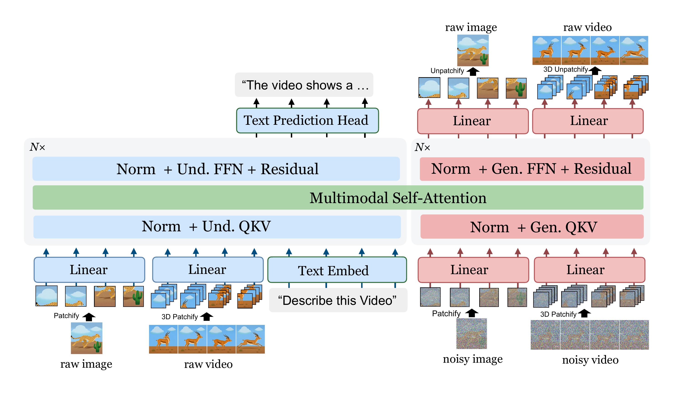

# 开源模型：先看开放边界，再看能做什么

六项均在 9 月 29 日至 10 月 2 日出现新的公开权重。本站已核对模型卡、权重文件列表与许可，没有运行这些模型；成绩均为作者实验，热度待验证。本栏沿用“开源模型”名称，但 PixelUMM 和 DMAD 属于受限开放权重，不能与 MIT、Apache 许可混为一谈。

| 模型 | 具体任务 | 开放条件与主要门槛 |
| --- | --- | --- |
| PixelUMM | 图像、视频理解和生成的统一研究 | 权重非商业；约 15.2B 参数，GPU 环境 |
| DMAD | 将 MiniMax-H3 采样蒸馏到 4 步 | 需基座；地域和商业限制；作者路径为 80GB GPU |
| FRIDA-Decisions | 俄语文本动态选项分类 | MIT；CPU INT8 / GPU 可用 |
| TAE-Qwen-Image-2.1 | 扩散中间结果快速预览 | Apache-2.0；ComfyUI 特定预览节点 |
| Tokle-SPAB-3M | 研究极小语言模型的统计注意力偏置 | MIT；含冻结表后共约 11.3M 参数 |
| Apex Flash 1 | 代码与隔离安全任务中的工具代理 | MIT；部署门槛依基座架构，未给统一最低显存 |

## 01 · PixelUMM：从像素块直接连接理解与生成

权重仓库创建于 2026-10-02（北京时间）。新近实用 / 新近创新；官方材料核验，未本机运行，热度待验证。

常见多模态模型先用视觉编码器把图片变成特征。PixelUMM 直接把 RGB 图像分成 16×16 像素块，经线性映射进入模型；视频也按时空块处理。理解分支预测文字，生成分支从噪声逐步预测像素，共享多模态注意力。因此值得看的新东西是输入输出表示与统一结构，不能仅用一张好看的生成图判断能力。

模型以 Qwen3-8B 为语言骨干，总参数约 15.2B。若只按 BF16 权重估算，存储就约 30.4GB，实际运行还要加上激活、缓存与框架开销；这不是官方最低显存承诺。官方代码采用 Linux、CUDA、PyTorch 与 FlashAttention 环境。

权重使用 NVIDIA One-Way Noncommercial License，仅限符合条款的非商业研究评估；代码的 Apache-2.0 不会消除权重限制。新近价值在于研究“去掉独立视觉编码器后还能怎样组织多模态任务”。模型卡仍提示语义、时间一致性等错误，不能视为生产质量保证。

NVIDIA 模型卡原图：先看底部的像素分块，再看中间共用的注意力；蓝色分支输出文字，红色分支还原图片和视频。仅引用这一幅结构图作研究说明，保留机构署名；权重的非商业限制另见正文。（[来源原图](https://huggingface.co/nvidia/PixelUMM)；[查看大图](images/model-pixelumm.png)。）

[模型卡与文件](https://huggingface.co/nvidia/PixelUMM) · [版本记录](https://huggingface.co/nvidia/PixelUMM/commits/main)

## 02 · DMAD：4 步生成音视频，但仍需要大基座

权重仓库创建于 2026-10-02（北京时间）。新近实用 / 新近创新；官方材料核验，未本机运行，热度待验证。

DMAD 公布了 MiniMax-H3 的 4 步学生 LoRA，面向文字到同步音视频。输入仍是提示词，输出是视频和音频；减少的是扩散采样步数，不能直接把 50÷4 当成真实运行提速。项目给出论文主运行的 lora_critic 检查点，以及作者称 AVGen-Bench 分数更高的 full_critic 变体，两份权重各约 1.4GB。

小 LoRA 不意味着小部署：还需要 33B 基座与其它组件，文档下载路径约 170GB；作者给出配合 CPU 卸载、单张 80GB GPU 的运行路线。示例使用 124 帧、24fps、1344×768，4 步，无分类器自由引导。复现前应匹配采样设置，不把无声预览 GIF 当作音画同步质量的证据。

许可沿用 MiniMax H3 Community License。条款排除欧盟、英国、韩国和美国，并对年收入超过 2000 万美元的商业产品服务要求单独书面授权；这是受限开放权重。为什么现在值得看：它公开了缩短音视频扩散链的具体适配器和推理代码，但总时延、基座存储和许可都比“4 步”这个数字更影响能否使用。[代码与硬件条件](https://github.com/Yzmblog/DMAD) · [许可原文](https://huggingface.co/ZhengmingYu/DMAD/blob/main/LICENSE)。
[模型卡与文件](https://huggingface.co/ZhengmingYu/DMAD) · [版本记录](https://huggingface.co/ZhengmingYu/DMAD/commits/main)

## 03 · FRIDA-Decisions：一次编码，对一组候选做选择

权重仓库创建于 2026-10-02（北京时间）。新近实用；官方材料核验，未本机运行，热度待验证。

把一段俄语文本和一组候选标签送入 FRIDA-Decisions，可以得到多选、序数判断、是非或排序结果。它用约 823M 参数的 T5 编码器处理这些受限决策，不必让通用聊天模型逐 token 写出答案。适合工单路由、意图判断等标签随请求改变的工作。

在作者 razvilka 的同一批 73515 个任务上，模型分数为 0.893，对照 JEV 为 0.897，McNemar 检验 p=0.84；这表示本次比较没有发现显著差异，不能证明任意任务都等价。作者在 RTX 5060 Ti、400 token 设置下给出约 28–34ms；CPU INT8 另有精度和 ONNX 路径。不同线程、长度和批处理条件不能混用成同一延迟。

模型及实现采用 MIT。先用项目锁定的安装版本和一小批自己的俄语标签任务核对分数与阈值，再评估 CPU 或 GPU。为什么现在值得看：这份新模型把“选择一个有定义的答案”单独做成了可部署接口；它不是中文通用模型，也没有独立跨语言验证。
[模型卡与文件](https://huggingface.co/ai-forever/FRIDA-Decisions) · [版本记录](https://huggingface.co/ai-forever/FRIDA-Decisions/commits/main)

## 04 · TAE-Qwen-Image-2.1：为中间预览省一次重解码

权重仓库创建于 2026-09-29（北京时间）。新近实用；官方材料核验，未本机运行，热度待验证。

生成大图时，每隔几步查看进展，如果都运行完整 VAE，会增加等待。这个 1.63M 参数、约 3.3MB FP16 的小解码器将 Qwen-Image 的 64 通道潜变量直接转为 RGB，做 16 倍上采样。它用于看构图和进度，最终成图仍应交给完整 VAE。

作者报告 RTX 5080 上 1024 分辨率预览约 15ms，PSNR 为 30.1，相比 LinearLatent2RGB 的 20.9 有改善；训练使用 4072 张图像、512 裁块和 30000 步。这个小样本对照说明预览细节可能更清楚，不等于所有场景都保真。

Apache-2.0 权重可配合 ComfyUI-KJNodes 的 ModelPreviewOverride。ComfyUI 原生 TAESD 的 8 倍解码假设无法直接自动选择这个 16 倍模型；它也没有编码器和 alpha 通道。为什么现在值得看：这是新近出现、范围明确的小组件，改善的是等待时的可观察性。

AcademiaSD 官方对照原图：每行从左到右为原图、TAE、LinearLatent2RGB。重点看脸部和边缘能否在预览中辨认；作者示例不代表全数据集质量，本站未运行。保留完整对照，不改动任何一栏。（[来源原图](https://huggingface.co/AcademiaSD/TAE-Qwen-Image-2.1)；[查看大图](images/model-tae.jpg)。）

[模型卡与文件](https://huggingface.co/AcademiaSD/TAE-Qwen-Image-2.1) · [版本记录](https://huggingface.co/AcademiaSD/TAE-Qwen-Image-2.1/commits/main)

## 05 · Tokle-SPAB-3M：小模型加上一张统计偏置表

权重仓库创建于 2026-09-29（北京时间）。新近创新（效果待验证）；官方材料核验，未本机运行，热度待验证。

这项小模型实验把训练语料中的 token 对共现统计做成哈希 PMI 表，再由可学习的每头系数加入注意力 logits。它提供一个可读的混合思路：一部分语言关联不用全靠梯度记进权重，而由冻结统计表提供。偏置与位置无关，效果要与没有这张表的同规模模型对照才能判断。

名称中的 3M 指约 2.91M 可训练参数；另外还有约 8.39M 个冻结 float32 表项，总规模约 11.3M。模型为 9 层、隐藏宽度 144，512 token 上下文，使用 12B token 训练。它是英语基础语言模型，不是指令助手。

作者报告的零样本 acc_norm 包括 HellaSwag 27.22%、ARC-Easy 34.68%、ARC-Challenge 24.49%、PIQA 54.95%；模型卡没有提供足以隔离统计偏置贡献的完整匹配消融。因此新近创新标签指公开的新实现路径，不代表已经证明优于现有小模型。MIT 代码与权重适合研究者阅读注意力实现，加载远程自定义代码前仍需自行检查。
[模型卡与文件](https://huggingface.co/techdotus/Tokle-SPAB-3M) · [版本记录](https://huggingface.co/techdotus/Tokle-SPAB-3M/commits/main)

## 06 · Apex Flash 1：把验证最终状态放进安全代理评估

权重仓库创建于 2026-09-30（北京时间）。新近实用；官方材料核验，未本机运行，热度待验证。

Apex Flash 1 针对代码调查和工具调用进行后训练，评测时将任务放在隔离环境中，核对目标系统的最终状态，而不只看代理是否声称完成。对防御团队来说，这种“可验证完成条件”比漂亮的推理文字更值得借鉴。

作者在 20 个保留案例的三种视图、合计 60 项任务上报告：Apex 通过 40 项，基座 GLM-5.3-Flash 通过 36 项，Opus 5 high 通过 43 项，即 66.7%、60.0%、71.7%。样本较小、任务由作者构造，不能推广成所有真实安全工作的排名；不同服务费用也不宜直接当成受控效率对照。

权重采用 MIT，模型继承基座的图文架构，但这次评测主要是文字和工具任务，并未证明视觉能力提高。部署需兼容其基座架构的 Transformers 或 vLLM 环境，作者未给适用于所有配置的最低显存。为什么现在值得看：新的权重与验证协议可供授权、隔离的防御实验研究，本站没有运行任何攻击测试。
[模型卡与文件](https://huggingface.co/cantina-security/apex-flash-1) · [版本记录](https://huggingface.co/cantina-security/apex-flash-1/commits/main)
