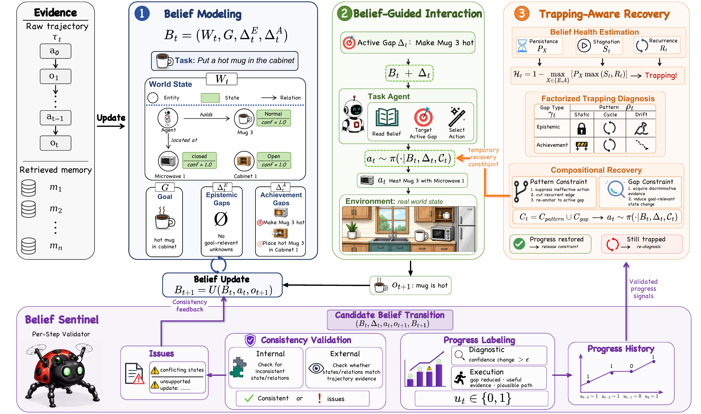
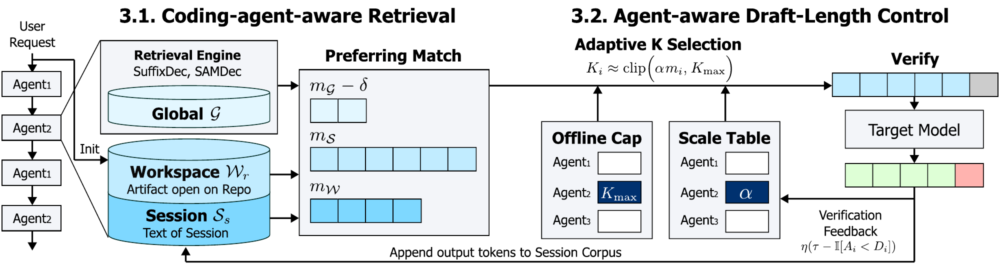

# 论文精选：把“成功”拆成可核对的条件

本期比较 12 篇近期候选后选 6 篇，均为 10 月 1 日提交的 v1 预印本。以下结论来自原文核心方法、实验和图注阅读，尚未由本站训练复现；榜单出现只是发现线索，六篇均标注热度待验证。

建议先读 OneStreamer 的记忆取舍，再读 Sharpening Tax：一次回答更容易成功，未必意味着多试几次还能覆盖同样多的问题。涉及部署时，尤其留意 PoS 的总 token 成本，以及 AgSpec 的吞吐统计排除了什么。

## 01 · OneStreamer：把旧画面变成带时间的记忆

arXiv提交2026-10-01 · 2610.01762 v1 · 预印本。新近创新 / 新近实用，热度待验证。

持续视频助手不能提前知道用户下一刻会问什么，也不能把过去所有帧永远放进上下文。OneStreamer 留下最近 16 帧的视觉信息，将更早内容压成带时间的局部观察和事件摘要。直觉上，眼睛看眼前，笔记保留过去；模型还学习在沉默、等待更多证据、回答之间切换。

它的另一项改动是 PSTL：保留全部输出锚点，并平衡状态改变与状态持续的监督，最终只给约 27.5% 的状态 token 计算这部分损失。这是在改训练监督密度，并非把输入序列直接缩短到四分之一。实验以 Qwen3-VL-4B-Instruct 为底座，冻结视觉模块及投影层，使用 32 张 H200 进行一次完整训练。

同一检查点的记忆消融中，只留 16 帧的 FIFO 在 ASI 上为 63.5，加入 PHCM 后为 71.6；另一个 EPM 指标为 62.6，仍低于完整上下文的 63.0。对一个 360 秒样例，H200 上回答阶段的首 token 延迟由 4.560 秒降到 0.124 秒，峰值显存由 25.18 GB 降到 9.98 GB；这里记忆已预先算好，不能据此宣称整个实时系统提速 36 倍。

为什么现在值得看：这份新研究给持续感知提供了可拆开的实现路线——保留多少原始视觉、怎样概括过去、什么时候开口。代价也明确：字幕漏掉的细节无法凭空找回，错误摘要还可能沿时间传播。适合先复查作者的同检查点消融，再研究自己的长视频任务。

Xiangyu Zeng 等，论文 Figure 3 方法原图：左侧旧帧不再保留完整视觉，局部观察与事件摘要进入分层记忆；右侧最近帧支持当前判断。注意“等待”也是模型输出状态。整图引用，CC BY 4.0。（[作者原图](https://arxiv.org/abs/2610.01762v1)；[查看大图](images/paper-onestreamer.png)。）

[站内阅读卡](../../../../papers/frontiers/onestreamer-2610-01762/00-阅读卡.md) · [归档PDF](../../../../papers/frontiers/onestreamer-2610-01762/2610.01762v1.pdf) · [原文](https://arxiv.org/abs/2610.01762v1)

原文为CC BY 4.0，保存未改动的v1 PDF并保留作者和许可。

## 02 · PoS：代理需要检查自己的世界状态

arXiv提交2026-10-01 · 2610.01415 v1 · 预印本。新近创新 / 新近实用，热度待验证。

普通记忆常常保存“之前做过什么”，却没有区分“现在相信什么”和“哪些目标还没实现”。PoS 把实体、状态、关系、目标和未知项组织成结构化信念，再从未解决的缺口选择下一步行动。Sentinel 检查这些信念是否与真实轨迹矛盾，同时记录证据出处与置信程度。

系统还识别缺口长期不变、进展停滞和旧问题反复出现的情况，区分静止、循环和漂移，再临时加上行动约束，直到重新产生进展。这里的世界状态是可更新的工作记录，不是模型获得了可靠的世界真相。

作者在 ALFWorld、LOCA、RCA、ClinDiag 等任务上测试三个模型。Qwen3.7-Plus 在 ALFWorld 上由最强对照的 72.39% 提升到 88.81%，增加 16.42 个百分点；RCA 上由最强对照的 28.16% 到 38.83%。但额外检查并不免费：RCA 的 103 个任务中，总 token 从原始代理的 355.70K 上升到 1800.13K，约为 5.06 倍。只看主代理减少到 281.2K，会漏掉辅助组件的开销。

为什么现在值得看：它把“代理卡住了”分成可检查的状态和干预类型，适合工作流调试与失败分析。复现时应同时统计成功率、辅助调用、总费用和延迟。医学等任务只是论文中的基准场景，不能将这些作者实验当成可靠的实际诊断验证。

Yu Luo 等，论文 Figure 2 方法总览：按“观察形成信念 → 找目标缺口 → 行动 → Sentinel 复核”阅读；下部的脱困规则在检测到停滞时介入。辅助组件也会消耗 token。整图引用，CC BY 4.0。（[作者原图](https://arxiv.org/abs/2610.01415v1)；[查看大图](images/paper-pos.png)。）

[站内阅读卡](../../../../papers/frontiers/pos-2610-01415/00-阅读卡.md) · [归档PDF](../../../../papers/frontiers/pos-2610-01415/2610.01415v1.pdf) · [原文](https://arxiv.org/abs/2610.01415v1)

原文为CC BY 4.0，保存未改动的v1 PDF并保留作者和许可。

## 03 · HC-DLM：离散文字与连续隐状态一起去噪

arXiv提交2026-10-01 · 2610.02193 v1 · 预印本。新近创新 / 新近实用，热度待验证。

离散扩散语言模型通常反复修订 token，连续方法则在向量空间逐步去噪。HC-DLM 保留一个持续演化的连续隐状态，每一步再解码出离散 token，作为下一步更新的“脚手架”。因此它不是每轮丢掉隐状态、只把旧文字重新喂回去。

训练目标联合重建、隐空间去噪与熵约束，防止编码器坍缩；具体实验使用条件流匹配。采样过程还会对预测出的干净 token 重新加噪。这个设计要回答的是：离散结构能否约束连续搜索，同时保留后者的表达能力。

在不含嵌入层、约 6M 生成参数的匹配设置中，Hard Sudoku 达到 72.41%，对照 CCDD 为 70.73%；Easy Sudoku 则是 94.21% 对 94.65%，并非全面领先。Countdown 的 CD5 上为 37.52% 对 25.35%。在 LM1B、序列长度 128、约 118M 参数且同样不含嵌入层的语言实验里，128 步采样的 GPT-2-large 生成困惑度为 75.5，优于文中的部分扩散对照，却仍差于自回归模型的 66.7。

为什么现在值得看：新方法把两类生成过程放在同一模型中，并给出小规模结构任务与语言任务对照。适合研究采样路径和训练约束；尚不能推断它会替代大规模自回归聊天模型，也需要把 128 步的推理成本计入比较。

Hui Ren 等，论文 Figure 1 推理原图：下方浅蓝色连续隐状态沿主路径持续更新；上方多色离散 token 由它解码，再成为后续去噪的条件。看循环关系，不要把两行理解成两个独立模型。整图引用，CC BY 4.0。（[作者原图](https://arxiv.org/abs/2610.02193v1)；[查看大图](images/paper-hcdlm.png)。）

[站内阅读卡](../../../../papers/frontiers/hc-dlm-2610-02193/00-阅读卡.md) · [归档PDF](../../../../papers/frontiers/hc-dlm-2610-02193/2610.02193v1.pdf) · [原文](https://arxiv.org/abs/2610.02193v1)

原文为CC BY 4.0，保存未改动的v1 PDF并保留作者和许可。

## 04 · Sharpening Tax：单次成功率提高后，解题范围可能缩小

arXiv提交2026-10-01 · 2610.01509 v1 · 预印本。新近创新 / 新近实用，热度待验证。

后训练会把概率集中到更常成功的答案，但也可能压掉少见、仍然有效的解题路线。论文比较 4 个模型系列的 14 组基础与后训练模型，在 3 个代理基准上形成 42 个设置，发现 pass@1 的改善常与较大的 pass@K 覆盖损失同时出现。基础模型使用了轻量代理适配，因此比较的是论文设置下的系统表现。

作者用 pass@K 曲线构造归一化搜索潜力 S，并把基础模型与后训练模型的 S 差定义为 Sharpening Tax。42 个设置中有 36 个在 K=128 时税值为正。这个指标描述现象；不同检查点的训练差异不全相同，不能把每个差异都归因于单一 RL 步骤。

缓解方法 PTGS 在训练时用带遗忘的 Beta 分布估计题目难度，再按难度调整采样温度，给困难题保留探索空间。Qwen2.5-7B-Instruct 在 Sokoban 的 PPO 实验中，pass@1 从 46.5% 到 61.1%，pass@128 从 55.0% 到 69.7%，但后者仍低于基础模型的 76.6%。实验为 200 步、5 个随机种子；PPO 使用最终检查点，GRPO 使用验证集最优检查点，跨算法比较时要保留这项区别。

为什么现在值得看：评估编码或研究代理时，只看“一次就做对多少”会漏掉搜索预算增大后的能力。它也提醒训练者同时画出整条曲线。今天的[技术实践](05-技术实践.md)会实际运行一个合成概率例子来解释这个现象；该例子不是对 PTGS 或模型训练的复现。

Changdae Oh 等，论文 Figure 8 PTGS 原图：左侧用成功与失败记录估计题目难度分布，中间将难度映射为采样温度，右侧执行采样与强化学习后更新统计。图解释训练策略，不是本站跑出的结果。整图引用，CC BY 4.0。（[作者原图](https://arxiv.org/abs/2610.01509v1)；[查看大图](images/paper-ptgs.png)。）

[站内阅读卡](../../../../papers/frontiers/sharpening-tax-2610-01509/00-阅读卡.md) · [归档PDF](../../../../papers/frontiers/sharpening-tax-2610-01509/2610.01509v1.pdf) · [原文](https://arxiv.org/abs/2610.01509v1)

原文为CC BY 4.0，保存未改动的v1 PDF并保留作者和许可。

## 05 · AgSpec：利用代理已经见过的文字做推测解码

arXiv提交2026-10-01 · 2610.01108 v1 · 预印本。新近创新 / 新近实用，热度待验证。

代码代理的输出经常重复会话中的文字、仓库内容或之前的补丁。AgSpec 从三个层次寻找可能接上的文本：当前会话、按输出格式整理过的工作区，以及来自不相交任务的全局日志。检索出的文字作为草稿，再由目标模型验证；不是让一个较小的语言模型重新生成草稿。

这些层次共享后缀树或后缀自动机一类检索引擎，外围策略决定查哪里、草稿最长多少。离线得到不同代理的长度上限，在线再根据接受反馈调整。对补丁任务而言，先把源文件整理成输出会用到的格式，也能减少“文字相同、形式对不上”造成的浪费。

作者测试 Devstral-24B、Gemma-3-27B、Qwen3.6-27B，覆盖 SWE-bench Verified 和 TeamBench 的代理轨迹。相对自回归解码，batch=1 的生成吞吐加速范围为 2.27–4.37 倍，batch=16 为 1.08–4.76 倍。统计排除了预填充时间，也没有把工具执行、检索和整个任务等待时间全部算作用户端加速；上限 4.76 倍不能直接写成代理工作完成快 4.76 倍。

为什么现在值得看：新的系统设计复用了代理工作里本就存在的文本，适合研究代码生成与推测解码的结合。复现应同时测草稿命中、验证接受率、预填充和端到端时间。全局日志的任务隔离尤其重要，不能把测试答案放进检索库。

Sumin Lee 等，论文 Figure 3 系统原图：会话、工作区和全局文本提供候选续文，分层检索后交给目标模型验证。仅引用这一幅完整图解释方法；作者保留版权，arXiv 非独占许可不等于全文转载授权。（[作者原图](https://arxiv.org/abs/2610.01108v1)；[查看大图](images/paper-agspec.png)。）

[站内阅读卡](../../../../papers/frontiers/agspec-2610-01108/00-阅读卡.md) · [原文](https://arxiv.org/abs/2610.01108v1)

arXiv非独占分发许可不直接授权本站再分发全文；本期保存阅读卡和原站链接，只引用一幅有署名的原图作方法评论。

## 06 · ScholarCatalyst：论文检索先要找得到关键材料

arXiv提交2026-10-01 · 2610.02202 v1 · 预印本。新近创新 / 新近实用，热度待验证。

科研检索需要的是“这篇文章能帮我推进当前问题”，并不等同于标题相似或最终被引用。ScholarCatalyst 收集 184 位研究者的 207 个项目，形成 207 个核心问题、687 个子问题与约 19 万篇候选文献，并附研究者的相关性理由。语料按项目时间做过滤，减少把未来论文用于解释过去研究的机会。

主实验限制检索系统使用给定语料，比较 BM25、稠密检索与代理方法，而不是开放全网搜索。在表 3 中，Qwen-8B 检索的 CoreQ/SubQ Recall@20 为 0.37/0.51，GPT-4.1 工具代理为 0.37/0.43，o3 深度代理为 0.33/0.38。这里不能据此推断所有真实科研任务都不需要代理：语料、问题、工具预算和时间限制都参与了结果。

作者进一步在 50 个核心问题和 50 个子问题上，把缺失的正确候选替换进固定大小的候选集合，再测试重排序。能力更强的重排模型从这项“正确候选注入”中获得更大收益，说明先前没找进候选池的论文，会限制后续推理。注入使用已知相关答案，是诊断用的理想条件，不是可部署的检索技巧。

为什么现在值得看：它把科研助手的失败拆成“没召回”和“召回后没选对”，可以直接指导评测设计。局限是研究者事后回忆仍有偏差，项目与领域覆盖也不均匀；论文同时区分了时间截点前后的模型，复现时应保持这一边界。

Sohyeon Kim 等，论文 Figure 6 正确候选注入实验原图：看同一重排序器在普通候选与加入已知相关候选后的差异。纵轴为 Recall@5；这是诊断召回瓶颈的受控实验，不是上线后的自动提升。整图引用，CC BY 4.0。（[作者原图](https://arxiv.org/abs/2610.02202v1)；[查看大图](images/paper-scholar.png)。）

[站内阅读卡](../../../../papers/frontiers/scholarcatalyst-2610-02202/00-阅读卡.md) · [归档PDF](../../../../papers/frontiers/scholarcatalyst-2610-02202/2610.02202v1.pdf) · [原文](https://arxiv.org/abs/2610.02202v1)

原文为CC BY 4.0，保存未改动的v1 PDF并保留作者和许可。
