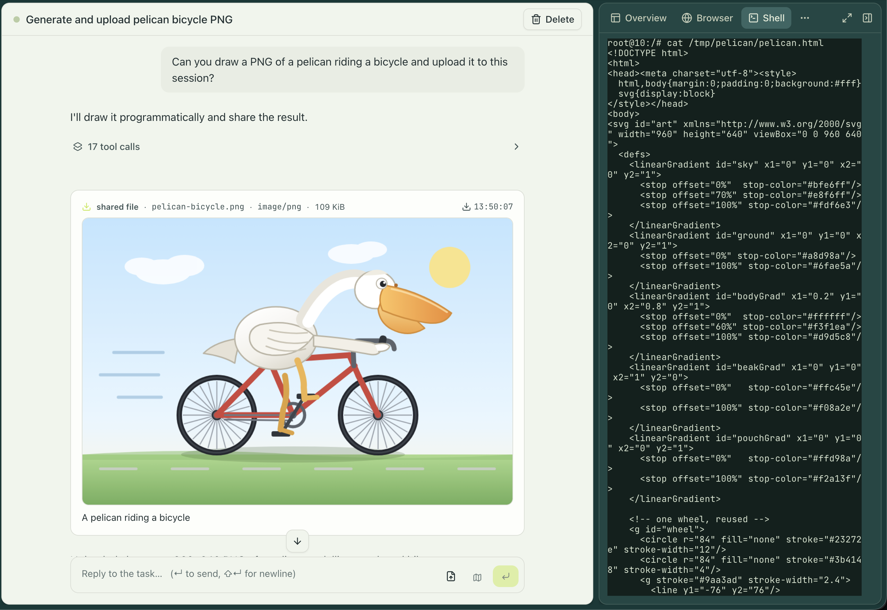
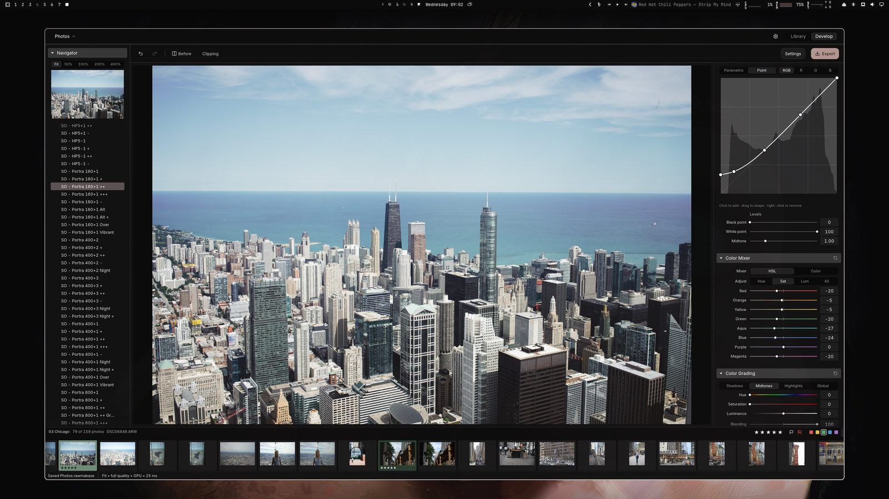
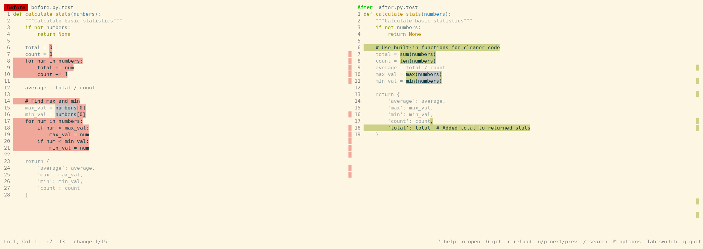
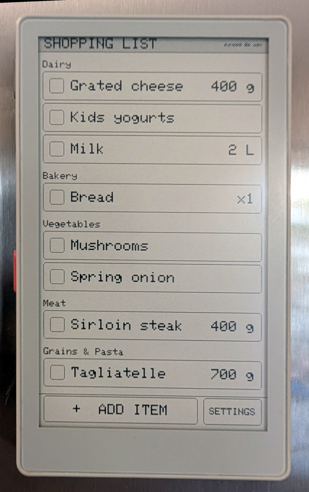
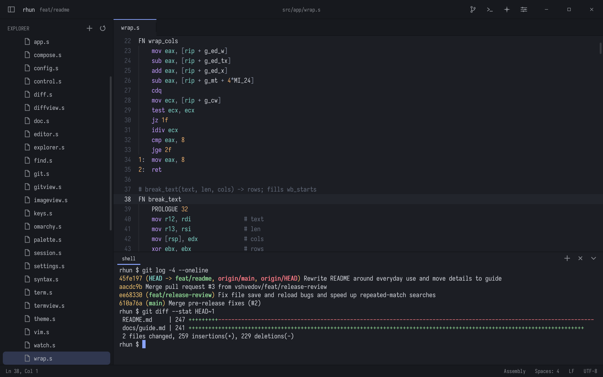

# 开源项目：十个能落到具体任务的工具

本期结合 HN / Show HN、GitHub 近期仓库与版本、项目官网及包目录筛选 20 个候选。带完整 UTC 时间的仓库与版本日期已换算为北京时间。下面十项均核对规范仓库、README、许可和维护记录；展示的界面是作者演示，本站未安装运行这些应用。没有两类独立近期信号的项目统一标注“热度待验证”，不以总 Star 代替使用证据。

| 你要做什么 | 先看 |
| --- | --- |
| 让代理剪音频，同时保留可撤销的工程 | Audionaut |
| 把积木构想做成可继续修改的 CAD | LDraw Nova |
| 部署带独立执行环境的长任务代理 | engrams |
| 在 Pi 中按需使用已有连接器 | Pi Codex Connector |
| 整理 RAW 照片并做非破坏编辑 | RAWmakase |
| 审查代码重构，识别搬动而非整行改写 | OmniDiff |
| 把合法持有的图文页适配墨水屏 | KCC 12 |
| 学习离线优先的物联网小应用 | PaperMono Shopping List |
| 用可重放笔触研究数字绘画 | claude-paint |
| 用轻量编辑器观察终端代理工作 | rhun |

## 01 · Audionaut：代理剪辑落在同一个可撤销工程里

2026-10-02 · 新近实用；热度待验证。

Audionaut 是 C++ / JUCE 多轨音频编辑器。把一首歌或旁白导入工程后，代理可通过 MCP 查询、剪切、调整淡入淡出并导出；每组代理编辑落成可撤销的操作，用户仍在真实音轨里检查结果。作者提供了按小节剪歌、交叉淡化和分轨的演示。

仓库始于 2023 年，本次看的是近期实现：9 月 29 日的 1.6.3 让 MCP 可经已安装应用以 npx 方式启动，北京时间 10 月 2 日的 1.6.4 加入 FLAC、AIFF、Ogg 和 MP3 导出。上手先装桌面应用，再按文档接 Node.js 18+ MCP；不是只装一个 npm 包就有编辑器。

代码为 GPL-3.0-or-later。可选 Essentia、Demucs 的运行环境与模型许可要另查；尤其分轨模型不能从主程序 GPL 推断可任意商用。适合把“代理给出编辑指令”变成用户能试听、撤销的工作流。
[源码与上手文档](https://github.com/kvoltmer/Audionaut) · [版本记录](https://github.com/kvoltmer/Audionaut/releases) · 许可：[GPL-3.0-or-later / 商业双许可](https://github.com/kvoltmer/Audionaut/blob/main/LICENSE.md)。

## 02 · LDraw Nova：从构想生成可继续编辑的积木模型

2026-09-24 · 新近实用；热度待验证。

近期补充。LDraw Nova 把文字构想变成积木 CAD：代理先写结构化计划，经 Python 生成器输出 LDraw / MPD，再渲染检查、修正碰撞和空隙。输出可以继续编辑，也可导出 GLB 进入 Blender；它比只生成一张积木图片多保留了零件和空间关系。

按 v0.6.0 文档需要配套仓库采用同一版本，Docker 环境约数 GB，并连接所选模型服务或编码代理。先用现有小示例核对零件库、渲染与导出，再扩大到复杂结构。可选重排序服务不是无条件必需，文档有基础检索路径。

这是 9 月 24 日创建的新项目，按近 30 天补充收录，不能把今天抓取日期当首发。代码 AGPL-3.0；文档和模型素材另有 CC BY-SA 4.0 与归属要求。渲染没有穿模不等于现实中牢固、可搭建，实体稳定性仍需检查。
[源码与上手文档](https://github.com/anteloc/ldraw-nova) · [版本记录](https://github.com/anteloc/ldraw-nova/releases) · 许可：[AGPL-3.0](https://github.com/anteloc/ldraw-nova/blob/master/LICENSE)。

## 03 · engrams：给长期代理任务一台可恢复的小机器

2026-10-02 · 新近实用；热度待验证。

engrams 为代理会话提供独立执行环境，包含终端、浏览器、文件和任务面板。Linux 生产路径使用 Firecracker microVM；空闲时保存快照，后续恢复，适合需要保留依赖和中间文件的长任务。作者演示里，代理在会话中生成图像文件并把产物交回用户。

项目从 4 月开始开发；北京时间 10 月 2 日的 0.10.0 将协调器、执行节点、网页和 CLI 等构件按版本及摘要发布，并给出升级指南。这次价值在于部署交付路径更具体，不能说 microVM 功能当天才出现。

AGPL-3.0 代码可自托管，但生产依赖 Linux/KVM、容器编排、存储和模型凭据；本地开发还涉及 Nix 或 Rust、Docker 等工具。Mac 的开发模式不能自动获得 Linux 生产环境同等隔离。适合有基础设施经验的团队先读部署文档，不是零配置的桌面助手。

Cortex 作者演示原截图：左边对话交付图片文件，右边能检查生成文件的环境。用来说明“产物属于会话”，不是本站实测，也不据此断言任意任务可自动完成。仓库 AGPL-3.0；保留完整截图。（[来源原图](https://github.com/cortexapps/engrams)；[查看大图](images/project-engrams.png)。）

[源码与上手文档](https://github.com/cortexapps/engrams) · [版本记录](https://github.com/cortexapps/engrams/releases) · 许可：[AGPL-3.0](https://github.com/cortexapps/engrams/blob/main/LICENSE)。

## 04 · Pi Codex Connector：按需发现连接器工具

2026-10-02 · 新近实用；热度待验证。

这款 Pi 扩展把已连接到 Codex 的应用工具按需提供给 Pi 中的模型。输入是连接器名称或工具查询，输出先是工具目录与参数 schema，再按明确参数执行。它只向模型暴露三个发现和调用入口，避免一开始塞入几百个工具定义。

实现通过本地 codex app-server 建立临时、无模型调用的会话，登录与连接器凭据仍由 Codex 管理。需要 Node.js 22.19+、Pi、已登录的 Codex 和已连接应用；安装目标是 `@wileai/pi-codex-connector`，它不是可供任意客户端直接使用的独立 MCP 服务。

仓库 9 月 29 日创建，10 月 2 日发布初版；0.1.1 主要是包名迁移，未被当成第二次能力突破。MIT 许可。默认对非只读工具要求确认，没有交互界面时拒绝写操作。新近价值是减少重复连接的步骤，实际兼容性依赖 app-server 与上游应用。
[源码与上手文档](https://github.com/wileai/pi-codex-connectors) · [版本记录](https://github.com/wileai/pi-codex-connectors/releases) · 许可：[MIT](https://github.com/wileai/pi-codex-connectors/blob/main/LICENSE)。

## 05 · RAWmakase：整理照片与非破坏式显影合在一起

2026-10-03 · 新近实用；热度待验证。

RAWmakase 读取相机 RAW 与照片目录，保存编辑参数，再输出 JPEG 或 16 位 TIFF，原文件保持独立。它还提供 Lightroom 目录导入，适合希望保留照片组织信息、又想尝试另一套开源显影流程的人。

仓库 9 月 26 日创建，北京时间 10 月 3 日的 0.1.12 扩展 Library：批量评分、旗标与颜色标签，Loupe、Compare、Survey 等浏览模式，以及快速集合和撤销。先导入少量照片，检查相机格式、目录信息和输出色彩，再处理整个资料库；导入并不承诺与 Lightroom 像素级一致。

MIT 实现提供桌面与 CLI 路径，图像处理可走 Metal、Vulkan、DX12 或 CPU 回退。Foveon、部分单色 RAW 与线性 DNG 仍有支持边界。下面是 9 月 30 日的 Develop 界面，说明调色流程，并非 0.1.12 新 Library 的截图。

pch 官方 9 月 30 日原截图：中间检查照片，右侧调整曲线和颜色，底部切换图片。MIT 仓库中的界面演示，仅解释显影交互；本站未运行。（[来源原图](https://github.com/pch/rawmakase)；[查看大图](images/project-rawmakase.png)。）

[源码与上手文档](https://github.com/pch/rawmakase) · [版本记录](https://github.com/pch/rawmakase/releases) · 许可：[MIT](https://github.com/pch/rawmakase/blob/main/LICENSE)。

## 06 · OmniDiff：把代码搬动和整段重写分开看

2026-10-02 · 新近实用；热度待验证。

代码重构常常只是移动表达式或把循环改成内置函数，逐行 diff 却把整块标红标绿。OmniDiff 使用语法树比较，支持终端双栏、纯文本及 JSON 输出；对 Python、Rust 等 24 种语言识别结构，其它格式有文本或二进制回退。

9 月 25 日发布首个面向用户的 0.1.0，北京时间 10 月 2 日 0.2.0 从 CodeDiff 更名，并新增一处复制到多处、移动注释和相似短语句对齐规则。这些实质匹配变化才是本次入选依据。源码安装需 Rust 1.90+ 和 C 编译器，也有预编译包；先用两份文件比较，再配置 git difftool。

许可 AGPL-3.0-or-later。作者承认高亮准确率尚未达到自己的目标，所以它帮助阅读变化，不能替代测试或人工代码审查。旧包与配置需按迁移说明换名，不能当成两个工具安装。

Marko Ivankovic 原截图：左侧循环与右侧 sum、len 等表达式是主要变化；未变文本被弱化。AGPL-3.0-or-later 仓库示例，原图完整保留，非本站测得的准确率。（[来源原图](https://github.com/ivankovic/omnidiff)；[查看大图](images/project-omnidiff.png)。）

[源码与上手文档](https://github.com/ivankovic/omnidiff) · [版本记录](https://github.com/ivankovic/omnidiff/releases) · 许可：[AGPL-3.0](https://github.com/ivankovic/omnidiff/blob/main/LICENSE)。

## 07 · KCC 12：把图文页按墨水屏尺寸重新整理

2026-09-26 · 新近实用；热度待验证。

KCC 将图片文件夹、CBZ、EPUB 或 PDF 中的图像页，转换为适配 Kindle、Kobo 等墨水屏的文件。输入合法持有的漫画或图文资料，选择设备和输出格式，程序做缩放、裁边及页面组织；它不把扫描页自动变成可重排的学术文本。

这是 2012 年就存在的工具，入选因为 9 月 26 日的 12.0.0 新增 Windows 11 ARM、Linux ARM 实验构建，调整 macOS 构建，并将裁边放在分割之前。新设备用户因此有了更明确的安装路径。先下载对应 Release，用几页样本在真实设备上确认效果。

ISC 许可覆盖代码，不覆盖用户导入的出版物。部分输出依赖 Kindle 工具；作者提示 Kindle Scribe 2025 的 MOBI 仍可能出现空白页，推荐检查 PDF 路径。本文未运行转换，未采用 README 中第三方漫画图片作为配图。
[源码与上手文档](https://github.com/ciromattia/kcc) · [版本记录](https://github.com/ciromattia/kcc/releases) · 许可：[ISC](https://github.com/ciromattia/kcc/blob/master/LICENSE.txt)。

## 08 · PaperMono Shopping List：一个能离线用的墨水屏清单

2026-09-27 · 新近实用；热度待验证。

这份约 2400 行 C++ 的应用把 PaperMono 变成冰箱上的购物清单：手机添加物品，设备按商店货架顺序显示，断网时继续勾选和编辑，待联网后同步。新物品可选交给 Claude 归类，人工纠正会保留；核心清单并不依赖模型一直在线。

仓库 9 月 27 日创建。作者公开实际家庭设备照片、刷新策略和硬件初始化过程，适合学习“AI 只是可选部件”的离线应用。上手需要 PaperMono C153、PlatformIO、Python/FastAPI 与 SQLite 服务；刷机前依文档备份含校准信息的 flash。

GPL-3.0 固件只验证过作者的一台设备。Wi-Fi 凭据编译进固件，服务端没有内置认证，应按项目要求放在可信局域网或有认证的反向代理后。作者家中运行不等于量产验证，本站也未刷写设备。

Seamus Cawley 的实际设备照片：货架分组和大复选框对应触屏操作；离线编辑稍后同步。GPL-3.0 项目原图，保留完整画面，非本站硬件实测。（[来源原图](https://github.com/seamusc/papermono-shopping-list)；[查看大图](images/project-papermono.jpg)。）

[源码与上手文档](https://github.com/seamusc/papermono-shopping-list) · [版本记录](https://github.com/seamusc/papermono-shopping-list/releases) · 许可：[GPL-3.0](https://github.com/seamusc/papermono-shopping-list/blob/main/LICENSE)。

## 09 · claude-paint：让每一笔绘画都能重放

2026-09-23 · 新近实用；热度待验证。

近期补充。claude-paint 在 Rust 中模拟刷毛携带湿颜料、画布干燥与颜料层混合，再用 Lua 画架驱动画笔。输入不是一条文字就直接得到整张图，而是颜料、笔触与时间组成的动作序列；输出画作与可重放日志，适合研究代理如何经过反馈逐笔创作。

9 月 23 日创建的仓库配有 stillwet.art 画廊和会话回放。最小路线是先编译 easel，按画架指南运行小画布，再查看日志。物理光学模型提供更具体的约束，但不代表已经与真实颜料做过独立一致性验证，也不能把画廊挑选的作品当作总体成功率。

代码 MIT，画作、绘画日志、会话日志与文字另为 CC BY 4.0。新近价值在于创作过程可以分析和重复，适合教学与实验；这是早期作者项目，本站没有渲染画作。
[源码与上手文档](https://github.com/aliceisjustplaying/claude-paint) · [版本记录](https://github.com/aliceisjustplaying/claude-paint/releases) · 许可：[MIT](https://github.com/aliceisjustplaying/claude-paint/blob/main/LICENSE)。

## 10 · rhun：把代码、终端和代理进度放在一起

2026-09-26 · 新近实用；热度待验证。

rhun 面向让编码代理承担更多工作的开发者：保留文件浏览、语法高亮、搜索、内置终端与 Git，把人需要读、改、核对的内容放在同一窗口。也可观察 Claude Code 和 Codex 会话，按配置使用订阅模型或本地 Ollama 草拟提交信息。

仓库 9 月 26 日创建，本期看的是这个新应用；北京时间 10 月 3 日 0.16.3 属于维护修复，不单独包装成新功能。可从 Releases 选择 Linux x86-64、Apple silicon macOS 或 Windows x86-64 包，先打开已有小项目再检查终端与差异视图。

MIT 代码和字体的 SIL OFL 分别适用。它有意收窄编辑器范围，不能假定具备大型 IDE 的全部语言与插件生态。作者截图支持“代码旁边运行终端”的交互说明，启动速度、内存占用和代理兼容性未经本站实测。

vshvedov 官方原截图：终端保留在代码下方，适合随时核对代理执行后的文件与 Git 状态。MIT 项目界面示例，不是本机性能测试。（[来源原图](https://github.com/vshvedov/rhun)；[查看大图](images/project-rhun.png)。）

[源码与上手文档](https://github.com/vshvedov/rhun) · [版本记录](https://github.com/vshvedov/rhun/releases) · 许可：[MIT](https://github.com/vshvedov/rhun/blob/main/LICENSE)。
