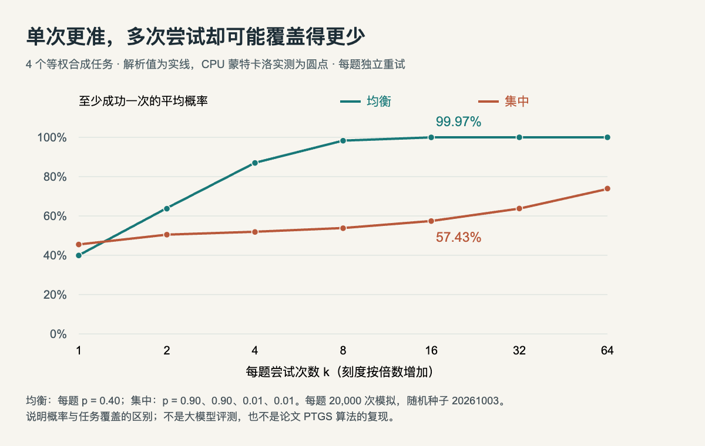

# 小实验：单次更准，为什么多试几次反而覆盖更少

**已在本机 CPU 运行验证。** Python 3.14.3，仅用标准库，不加载模型、不调用付费接口。这里构造四个等权任务，说明 pass@1 与 pass@k 的区别；不是对今天论文 PTGS 方法的复现，也不能反过来证明某个实际模型发生了同样变化。

## 先把任务与尝试分开

假设同一道题每次独立作答，单次成功概率为 p。尝试 k 次全部失败的概率是 `(1-p)**k`，所以至少成功一次的概率为 `1-(1-p)**k`。先在每道题上计算，再对题目求平均，才得到这里讨论的覆盖率。

我们比较两套合成概率。均衡配置在四道题上都是 0.40；集中配置在前两题上都是 0.90，后两题降到 0.01。集中配置单次平均是 45.5%，高于均衡的 40%。但多次尝试时，它在已经擅长的题上很快没有增长空间，另外两题却仍很难成功。

| 配置 | pass@1 | pass@16 |
| --- | --- | --- |
| 均衡 | 40.0% | 99.972% |
| 集中 | 45.5% | 57.427% |

不能先平均 p，再代入公式：`1-(1-mean(p))**k` 会丢掉“不同题有不同难度”的信息。它相当于每次都重新抽题，而这里比较的是在同一道题上重试。




本站 HTML/JS 绘制的实际运行结果。实线是解析值，圆点是固定种子的 CPU 模拟；横轴每格翻倍、纵轴是至少一次成功的概率。数据与源码均在本页附件中，未借用论文数值。（[相关论文（仅概念背景）](https://arxiv.org/abs/2610.01509v1)；[查看大图](images/practice-passk.png)。）

## 模拟怎样验证公式

每个配置、每道题重复 20000 组实验，随机种子为 20261003。每组最多尝试 64 次，记录首次成功的位置；随后判断它是否落在 1、2、4、8、16、32、64 次预算之内。提前成功后停止采样不改变“至少成功一次”的概率。

核心计算如下，完整程序还记录模拟值、解析值和蒙特卡洛标准误：

```python
probs = [0.9, 0.9, 0.01, 0.01]
k = 16
pass_at_k = sum(1 - (1 - p) ** k for p in probs) / len(probs)
print(pass_at_k)  # 0.574271...
```

本次实测，均衡配置的 pass@16 为 99.974%，集中配置为 57.399%；分别与解析值相差约 0.002 和 0.028 个百分点。全部 14 个估计值都落在各自解析期望的五个蒙特卡洛标准误内。这个检查只验证模拟实现与给定概率一致，不评估真实模型的正确性。

## 在自己的电脑复跑

下载同目录的 [Python 程序](code/passk_demo.py)，运行：

```bash
python3 passk_demo.py
```

它在自身目录写出 `passk-results.json`。想看图，把 [图表 HTML/JS](code/passk-chart.html) 和结果 JSON 放在一起，用 `python3 -m http.server 8000` 启动本地目录，再打开图表；浏览器直接打开 file URL 可能阻止读取 JSON。网页没有外部依赖。

本次附件：[原始输出](code/passk-output.txt) · [结果与环境](code/passk-results.json) · [可复现图表源码](code/passk-chart.html)。修改两组概率后重跑，可以检查哪些变化有助于低预算、哪些有助于高预算，不必先训练一个大模型。

## 对真实模型的启发与限制

真实采样常常相关，温度、题目选择、判定器和预算也会改变结果。实际评测还需报告每题成功数、采样策略与不确定性；不能仅凭平均 pass@1 就推断解题覆盖。今天 [Sharpening Tax 论文及阅读卡](../../../../papers/frontiers/sharpening-tax-2610-01509/00-阅读卡.md) 研究的是训练与推理分布的取舍，这个小实验只解释为什么两种指标有可能朝不同方向变化。

这里所有任务概率都是人为设定，没有真实题目、token 成本或训练过程。因此可以得出“这样的反例存在”，不能得出某种算法必然缩小模型能力，也不能把曲线当成任何厂商的性能图。
