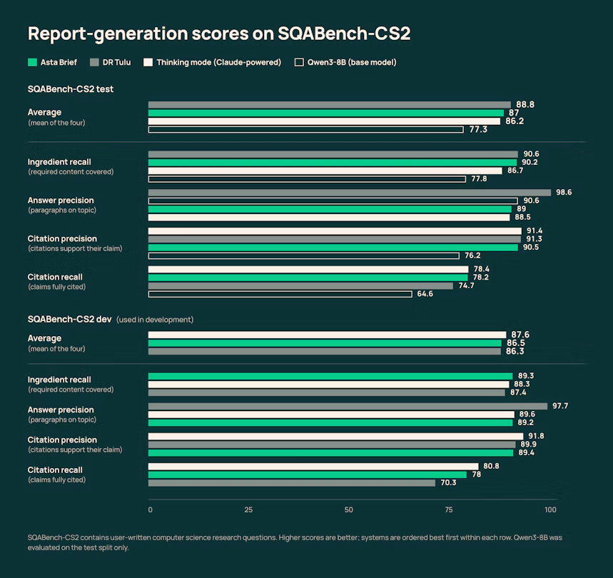
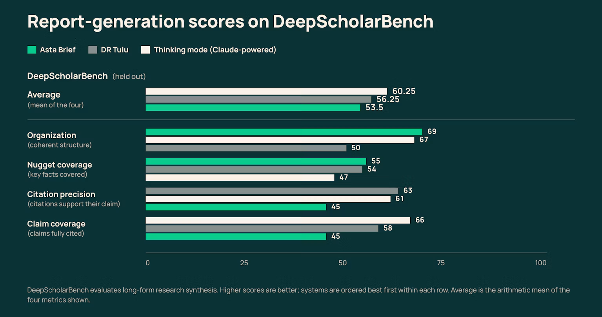
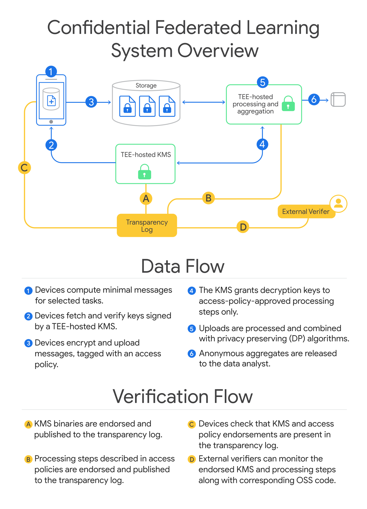

# AI 动态：5 条重点详解 + 10 条速读

本期把可用范围、系统机制与证据边界放在一起读。前五条展开，其余十条保留关键变化。新闻原日期为9月30日至10月3日；没有把采集日当作发布日期。

## 01 · Kolibri 开放英德双语权重：活跃参数少，显存仍要装下全模型

**2026-10-03｜新近实用 / 新近创新｜官方材料，未本机复现；热度待验证。**

Aleph Alpha 在10月3日发布 Kolibri-1，公开完整权重并采用 Apache 2.0。它面向英语、德语及企业文档任务，采用混合专家结构：一次计算只调用部分专家，降低每个词的运算量。这是本期最值得先看的新模型，但“约3B活跃参数”不能理解成只需装下一个3B模型。

| 官方规格 | 应怎样理解 |
| --- | --- |
| 78.1B 总参数、约3.46B活跃参数 | 省的是每步计算，完整专家权重仍需存放 |
| 验证到1,048,576 token | 官方对复杂任务推荐262,144 token，长输入也增加缓存占用 |
| FP8 权重约78GB | 模型卡最低示例包括2张80GB A100/H100或单张H200；还需运行时余量 |
| none / low / medium / high | 可调推理投入，不能直接把最高档成绩套到最低延迟配置 |

相比没有公开发布的内部前身 Kolibri Origin，团队扩大了专家池和训练数据，并采用滑动窗口与周期性全局注意力组合。对研究读者，有用的是模型卡公开了路由、数据配比、训练阶段和部署条件，能够追问性能来自哪里；“欧洲主权”“合规”属于厂商定位，不能据此省略自己的数据与应用审查。

官方比较中，Kolibri 的 AIME 2026 为96.0，德语版本90.0；但 LongBench Pro 的64.5低于同表 Qwen3.6-35B-A3B 的70.8，工具调用也并非全面领先。这些是同一发布方给出的评测，不能把厂商图里的吞吐—质量边界扩写成所有硬件上的结论。模型卡与博客的德语训练比例口径还有差异，本期不把单一比例当确定结论。

现在值得看，是因为需要自托管英德文档模型的团队多了一个可下载、可检查的候选。最小评估应先固定推理档位、上下文长度与自有文档问答集，再测引用、拒答和显存；本站尚未加载权重。下载、具体硬件清单和推理配置见[模型卡](https://huggingface.co/Aleph-Alpha/Kolibri-1)。

[原始来源](https://aleph-alpha.com/en/blog/kolibri-has-landed-a-sovereign-open-weight-model/)。

## 02 · Muse Gadgets 开放设备 SDK，把手机代理接到树莓派和 ESP32

**2026-10-02 · 近期补充｜新近实用｜官方材料，未本机复现；热度待验证。**

Meta 开放 Muse Gadgets 的设备 SDK 与固件，支持把常见 ESP32 板和 Linux 电脑接入 Muse。它的变化是将现成显示屏、按钮、传感器和本地程序变成代理可使用的接口；云端 Muse 能力并未因此变成本地开源模型，设备接入仍需要 SDK token 和手机应用配对。

两条上手路线不同。ESP32 路线适合屏幕、按键、音频和局域网设备桥接，官方固件要求 ESP-IDF 6.0.1；Linux 路线适合树莓派或其他带蓝牙低功耗能力的机器，文档列出 Debian 11、Ubuntu 22.04 等环境。先在机器上安装，再打开手机 Muse 的开发者模式并添加设备，之后设备维持连接。

Linux SDK 给出的具体接口包括运行命令并返回退出码、分块读写文件，以及报告内存、磁盘和温度。因而一个可理解的场景是：用户要求查看家中设备状态，代理调用健康检查或已配置的本地命令，把结果带回手机。这只是依据接口说明的使用路径，本站没有连板测试，也没有验证长期在线稳定性。

这里需要看清权限边界：服务以安装时选择的系统账号运行，账号能访问什么，代理通常就能访问什么；开源代码本身不等于默认隔离。设备配对、家庭网络连接和模型服务还分别有条件。SDK 与固件主要为 Apache 2.0，但仓库列出的第三方组件、头像资源各有例外，应以对应目录声明为准。

官方同时公布 Home Link 领取安排：面向美国活跃 Muse 订阅者、数量有限，计划10月开始发货。这是领取与发货计划，不能写成所有读者已经能收到硬件。真正的新近实用价值是可检查的设备接口与示例已经公开，适合从一个读状态的简单任务开始评估；[Linux 与 ESP32 文档](https://github.com/facebookincubator/muse-gadget-sdk)比设备宣传图更能说明实际门槛。

[原始来源](https://gadgets.muse.ai/)。

## 03 · AstaBrief 用 8B 模型压缩科研报告等待时间，复杂综述仍有取舍

**2026-10-02 · 近期补充｜新近实用 / 新近创新｜官方材料，未本机复现；热度待验证。**

Ai2 公布 AstaBrief，将 Qwen3-8B 微调成面向科学问题的报告生成器，并接入 Asta 的 Fast 模式。输入是研究问题和检索到的论文片段，输出是带引用的报告。它把搜索之后反复推理、整理的过程压成单次生成，目标是让快速查阅文献不必总等完整研究代理跑完。

训练先用监督学习模仿高质量报告，再用偏好优化调整内容和引用。官方描述了隐私过滤后的研究问题、约4.7万份监督样本及约6000组偏好样本。这样的设计把检索与写作质量分开：小模型可以学会组织已有证据，但不能凭空补上没有检索到的论文，也不能因此省掉引用核查。

端到端时间从178.5秒降到51.1秒，约为3.5倍提速；公告另提的约10倍针对模型生成环节，两种分母不可混用。结果也不是“速度更快且所有质量更好”：在 SQABench-CS2 上平均分接近较重系统，在更偏长篇综合的 DeepScholarBench 上，AstaBrief 的平均分及引用精度仍落后。两张原图放在一起，才能看到它适合快速成稿的代价。

Ai2 原图：先看测试集四项指标，再看下面的开发集；每行排序不同，要按颜色辨认模型。开发集参与开发，不能与测试集混算。（[来源原图](https://huggingface.co/blog/allenai/astabrief)；[查看原尺寸](images/asta-training.png)。）

它的基线实验主要沿用2025年的研究系统与模型配置，不能称为对当前最强模型的全面胜出。14个问题的小型科学家评审，以及374名用户的早期使用观察，可以提供产品方向线索，却不足以证明普遍采用或可靠的长期留存。本期也没有独立复现这些数字。

现在值得看，是它给小规模科研助手提供了一个清楚的拆分方式：先做好资料检索，再让专门模型迅速生成可追溯草稿。适合进入候选，不适合直接替代原文阅读。开放模型入口为[allenai/AstaBrief_8B](https://huggingface.co/allenai/AstaBrief_8B)，本期只在新闻展开，模型栏不重复计数。

Ai2 原图：绿色在组织性和关键事实覆盖上有优势，但引用精度、论断覆盖较低。不能用上一张图的平均成绩概括所有综述任务。（[来源原图](https://huggingface.co/blog/allenai/astabrief)；[查看原尺寸](images/asta-results.png)。）

[原始来源](https://huggingface.co/blog/allenai/astabrief)。

## 04 · Copilot 动态工作流让代码负责顺序、并行与暂停点

**2026-10-01 · 近期补充｜新近实用｜官方材料，未本机复现；热度待验证。**

GitHub 在 Copilot CLI 和 Copilot app 中推出动态工作流公开预览。开发者可以把一组代理步骤写成代码：哪些先执行，哪些并行，结果怎样传递，何时检查、暂停或请求人工复核。它改变的是任务执行的组织方式，适合把反复出现的工程流程固化下来。

例如为一个代码库做改动前评估，可以先收集项目结构，再让不同代理分别读测试、接口和依赖，最后由程序汇总结构化结果；只有检查满足条件才进入下一步。这里的例子是依据功能说明的流程设计，并非本站已经在 Copilot 中运行的演示。关键点是把可以明确表达的控制逻辑交给程序，而让模型处理语义判断。

它与一次请求里让模型自行分工有不同的控制力度：顺序、并发、验证和恢复位置可以在工作流代码中检查。原有 `/fleet` 更偏让模型安排委派；动态工作流则允许开发者精确组织这些调用。对于需要重复运行、比较版本或保留审核节点的团队，这种可检查性比一句“帮我完成全部事情”更有价值。

公开预览面向各 Copilot 套餐。Copilot app 中默认开启；CLI 需更新并启用实验功能，可用 `--experimental` 或 `/experimental on`。官方也提供编写工作流的内置指导与 SDK 支持，但预览状态意味着接口和行为还可能变化；本期未测执行费用、重试开销或跨会话恢复的极限情况。

现在值得看，是团队可以开始把一个小而明确的流程变成可读代码，再对失败节点做复盘。它并不自动保证每个子代理输出正确：输入约束、结构化结果校验、完成条件和人工节点仍要由流程作者定义。

[原始来源](https://github.blog/changelog/2026-10-01-dynamic-workflows-in-copilot-cli-and-the-copilot-app)。

## 05 · Google 解释机密联邦学习：加密上传后，谁能拿到解密钥匙

**2026-10-02 · 近期补充｜新近实用 / 新近创新｜官方材料，未本机复现；热度待验证。**

Google Research 介绍正在 Gboard 英语、日语模型中使用的机密联邦学习系统。普通联邦学习常让终端承担训练并只汇总更新；这里把部分计算放进受保护的服务器环境，以减轻设备和轮次调度约束。因此，不能把这次方案简化成“任何数据都不离开手机”。

流程从设备选择并加密任务所需信息开始。设备验证密钥和访问策略，上传带策略的密文；密钥管理服务确认执行环境与策略相符后，才把解密钥匙交给获准的处理步骤。数据在可信执行环境（TEE）内参与计算，输出再接受差分隐私约束。TEE 可以理解为硬件支持的隔离区域，差分隐私则限制最终结果泄露个体信息的程度，两者保护的是不同环节。

Google Research 原图：蓝色1—6是数据流，黄色A—D是可检查的验证流。重点看第4步：得到钥匙需要满足策略；第6步释放聚合输出，不能理解成释放原始样本。（[来源原图](https://research.google/blog/toward-provably-private-learning-from-federated-data/)；[查看原尺寸](images/federated-enclave.png)。）

可核验性来自另一条路线：系统将获准的程序与策略记录到透明日志，外部检查者能够对照这些记录与公开代码；集群里的密钥服务还要处理复制和故障恢复。公告介绍了 Python 根任务、工作节点和 Federated Language 等实现组件，说明它不是只提出一个加密概念。

文章用约5000轮、每轮约6500台设备的既有训练流程解释时间瓶颈，但没有给出可以直接推广到所有任务的固定加速倍率。本期因此不写“训练提速若干倍”。对研究者更有用的问题是：哪些逻辑进入可审查边界，输出经过什么约束，以及日志能验证到哪一步。

现在值得看，是端侧隐私与服务器训练之间出现了更明确的工程分工。它仍依赖可信执行硬件、实现正确性与威胁模型，不能把“可证明”扩写成对所有侧信道和运营风险的无条件保证。本站只核对公开架构与部署声明，没有运行这一分布式训练系统。

[原始来源](https://research.google/blog/toward-provably-private-learning-from-federated-data/)。

## 06 · Copilot CLI 与 app 增加桌面应用操作预览

**2026-10-01 · 近期补充｜新近实用｜官方材料，未本机复现；热度待验证。**

Copilot 可在 macOS、Windows 上读取界面并操作桌面应用，补足没有 API 或命令行的步骤。公开预览支持点击、输入和拖动；CLI 可用 `/computer on` 开启，app 在设置中配置。macOS 需要相应系统权限，并按应用批准访问，组织也能关闭能力。为什么现在看：这让代码任务能接触真实 GUI，但执行授权、界面变化与结果核验仍影响可靠性；本站未实机测试。

[原始来源](https://github.blog/changelog/2026-10-01-github-copilot-can-now-interact-with-desktop-apps)。

## 07 · llama.cpp 增加决策接口，一次前向回答多个类型化问题

**2026-10-02 · 近期补充｜新近实用｜官方材料，未本机复现；热度待验证。**

ggml-org 展示新的 `/v1/systemone` 接口：输入当前状态及选择、是非或打分问题，返回概率和评分，避免为了一个路由选择生成整段文字。适合分类、工具候选筛选等任务。官方在 RTX PRO 6000 上报告若干模型的单问题中位延迟，但这不是所有硬件的保证。为什么现在看：本地推理开始提供更贴近“决策”的调用方式；不同模型许可不同，OpenJev 的非商业限制不能套成整套接口都可商用。

[原始来源](https://huggingface.co/blog/ggml-org/decision-models-in-llamacpp)。

## 08 · AutoSynthData 从失败能力出发，生成带验证器的训练任务

**2026-10-02 · 近期补充｜新近实用 / 新近创新｜官方材料，未本机复现；热度待验证。**

ServiceNow CoreAI 把学生失败、教师成功的任务转成去敏的能力卡，再生成新任务、系统说明与验证器，并用正例执行和负例扰动检查验证器。实验中，混合工具任务约2000份数据、18小时 SFT 得到 pass@1 增加7.2个百分点；ITSM 的18.77升到27.18。为什么现在看：它把数据扩增与可执行验收绑在一起，而非换词复制题目；目前是作者 SFT 实验，不能写成已经证明 RL 或生产任务同样受益。

[原始来源](https://huggingface.co/blog/ServiceNow-AI/autosynthdata)。

## 09 · Copilot 代码审查开放 API 控制每次审查投入

**2026-10-02 · 近期补充｜新近实用｜官方材料，未本机复现；热度待验证。**

REST 与 GraphQL 现在可为每次 Copilot 审查指定 effort，相关 API 已正式可用，便于按改动风险配置自动审查。公告同时重述 Balanced 默认档，但它实际已于9月28日生效；本期新增事实是 API 支持，不能把默认切换再次算新品。为什么现在看：维护者可以把审查档位写入自己的流水线；显式 Lite 设置和组织层级规则仍需核对。

[原始来源](https://github.blog/changelog/2026-10-02-copilot-code-review-api-support-and-new-default-effort-level)。

## 10 · Copilot 下线部分旧模型，自动化配置需要检查替代项

**2026-10-02 · 近期补充｜新近实用｜官方材料，未本机复现；热度待验证。**

GitHub 宣布在 Copilot 各入口弃用部分模型：Gemini 3.5/3.6 Flash 的替代项为3.8 Flash，Kimi K2.7 Code 转向K3，Claude Opus 4.7 转向5.5。为什么现在看：固定模型标识的配置可能需要迁移，组织管理员也需启用可用替代模型。它是服务可用范围变化，不是新模型能力评测；本文没有假设替换后输出、价格或延迟完全相同。

[原始来源](https://github.blog/changelog/2026-10-02-selected-models-in-github-copilot-deprecated)。

## 11 · ChatGPT 增加虚拟试穿和商品收藏

**2026-10-01 · 近期补充｜新近实用｜官方材料，未本机复现；热度待验证。**

服装及配饰商品卡出现“Try on”入口，可上传自拍生成试穿图，也可将商品存入收藏和文件夹。参考照片会保留供之后试穿，能在个性化设置中管理。移动端与网页端提供这些入口。为什么现在看：搜索结果开始接到个人化图像预览；生成效果不能证明真实合身程度。这里只报道产品能力和可用入口，不将其当作本站试穿实测。

[原始来源](https://help.openai.com/en/articles/6825453-chatgpt-release-notes)。

## 12 · ChatGPT Finances 扩至美国 Free 与 Go 用户

**2026-10-02 · 近期补充｜新近实用｜官方材料，未本机复现；热度待验证。**

OpenAI 的[10月2日记录](https://help.openai.com/en/articles/6825453-chatgpt-release-notes)确认，Finances 正向美国 Free、Go 用户逐步开放，覆盖网页、iOS 和 Android。用户可连接账户，查看支出与订阅等信息。为什么现在看：变化在于适用套餐扩大；它提供基于账户资料的解释，不能代用户转账、交易或缴费，也不能据此推断中国区已开放。本站未连接金融账户验证。

[原始来源](https://help.openai.com/en/articles/20001222-finances-in-chatgpt)。

## 13 · Google 公布新流感季预测评估，重点是完整赛季而非一次命中

**2026-09-30 · 近期补充｜新近实用｜官方材料，未本机复现；热度待验证。**

Google Research 公布2025—2026流感季的 FluSight 结果，称其预测系统在39个符合条件的模型中排名第一，任务覆盖各州本周及未来三周住院量预测。该消息的新事实是赛季评估，底层 AI 辅助算法研究不是当天首发。为什么现在看：持续滚动预测比挑选单次准确案例更有参考价值；排名适用于这套时间窗与指标，不代表个体诊断能力或下个流感季表现保证。

[原始来源](https://blog.google/innovation-and-ai/models-and-research/google-research/google-science-ai-flu-forecasts/)。

## 14 · Microsoft Discovery 展示可检查的噬菌体研究流程

**2026-09-30 · 近期补充｜新近实用｜官方材料，未本机复现；热度待验证。**

Microsoft 描述将耐药分析、防御机制和环境噬菌体证据接入 Discovery 的研究流程：从基因组资料出发，输出带证据的候选方案与实验验证计划。示例整理了170篇文献，并接入六类数据源；“不足四小时”指形成研究草稿的流程，不是治疗成功或药物获批。为什么现在看：任务树与中间证据可供专家检查，比只输出最后一段建议更适合科研协作。本站未独立运行生物信息学实验。

[原始来源](https://techcommunity.microsoft.com/blog/microsoft-discovery-blog/developing-bioinformatics-workflows-for-phage-therapy-with-inspectable-agents/4560876)。

## 15 · Qwen-Image-2.1-Pro 出现在国际 Model Studio 新模型记录

**2026-10-02 · 近期补充｜新近实用｜官方材料，未本机复现；热度待验证。**

阿里云 Model Studio 的10月2日记录新增 Qwen-Image-2.1-Pro 国际服务入口，列出统一生成与编辑、透明背景及多参考图能力。为什么现在看：已有国际云端工作流多了一个接入选择。本体 Qwen-Image 2.1 已在[9月21日期刊](../../09/2026-09-21/01-AI动态.md)介绍，本条只记录新的接口可用范围，不重新包装为架构首发。配额、区域和费用以实际控制台及文档为准，本期未发起付费调用。

[原始来源](https://www.alibabacloud.com/help/zh/model-studio/newly-released-models)。
