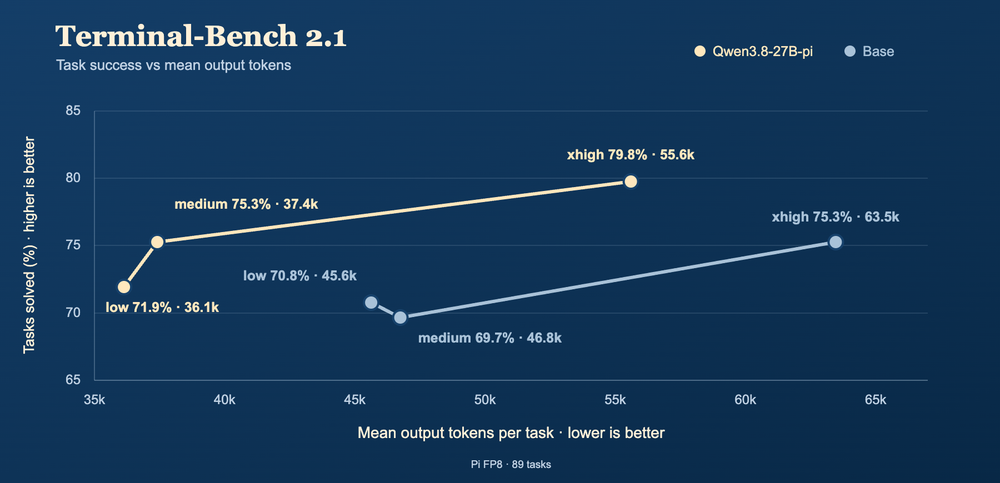
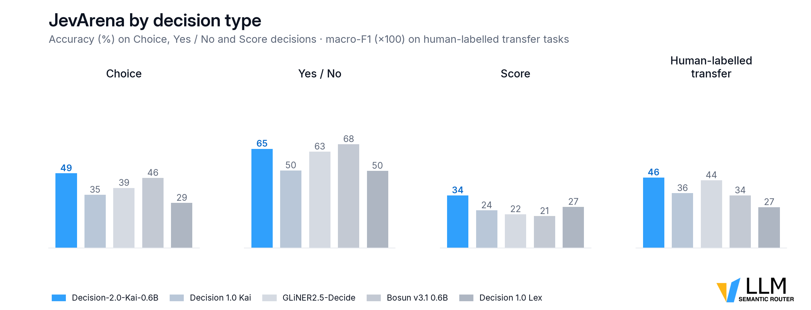
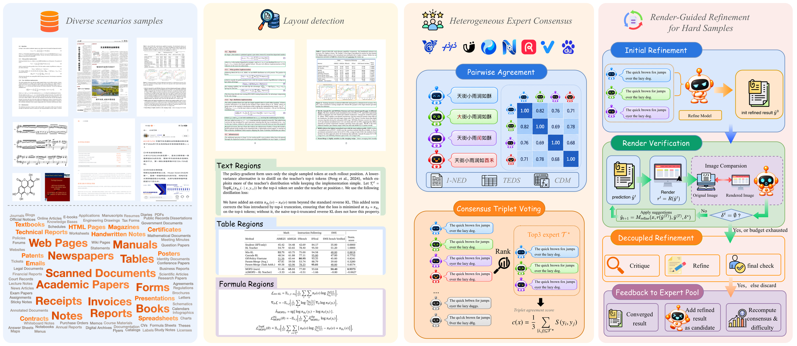

# 开源模型：6 项新近权重与实验性组件

本栏按开放权重收录，逐项区分标准开源许可与受限社区协议。日期采用仓库创建记录，不冒充训练结束或论文首发日期。Kolibri、AstaBrief 已在新闻展开，这里不重复推荐；决策接口新闻和下面两个独立权重也分别说明边界。

## 01 · Whistle：让小型语音识别模型进入 CPU 工作流

**仓库公开记录 2026-09-30（UTC）｜新近实用 / 新近创新｜作者材料，本站未运行权重；热度待验证。**

Whistle 面向短语音转文字，公开的量化 `.cact` 权重约16.9MB，支持英、德、法、西、意、荷、波七种语言。输入为16kHz单声道音频，单段最多30秒，可输出文本、词级时间戳和音频表征；中文不在这一版的声明支持范围。

它使用紧凑音频编码器和解码器，并让编码深度成为可调项。安装入口为 `cactus-needle`，麦克风功能有额外依赖；评估时应先固定量化、beam和音频长度。官方在M4 Pro上的报告混合了不同精度及外部模型设置，不能把16.9MB与一张速度图直接翻译成所有设备更快、更准。

现在值得看，是离线短音频转写有了可下载的小型新候选，适合为CPU采集脚本或低资源应用做对照。权重采用 Apache 2.0；模型小不代表整个Python环境也只有16.9MB。源码说明和作者评测已读，本站未做麦克风或跨语言实测。

[模型卡、权重与原始来源](https://huggingface.co/Cactus-Compute/whistle)。

## 02 · Qwen3.8-27B-pi：把代理完成率与输出 token 一起比较

**仓库公开记录 2026-09-29（UTC）｜新近实用 / 新近创新｜作者材料，本站未运行权重；热度待验证。**

这是 bytkim 发布的社区微调，基座来自Qwen，不能写成Qwen官方新版本。模型针对 Pi 代理执行环境训练，先模仿成功轨迹，再用包含推理效率的奖励继续优化；输入仍是代理上下文，输出是推理、工具调用与回答。

作者在 Terminal-Bench 2.1 中报告，medium档在接近基座xhigh完成率时少用约41%的输出token。不过在SciCode上，节省程度依赖档位，medium也可能用更多token；GPQA等指标并非全面上升。效率收益要在同一执行环境、预算和成功标准下读。

bytkim 原图：Pi / Terminal-Bench 2.1 的 89 个任务，FP8 条件；横轴输出 token 与纵轴完成率一起读，并区分 medium 与 xhigh 推理档；图只支持作者的Pi环境实验，不是vLLM部署吞吐测量。来源仓库为Apache 2.0。（[来源原图](https://huggingface.co/bytkim/Qwen3.8-27B-pi)；[查看原尺寸](images/qwen-pi-tokens.png)。）

上手可按模型卡使用vLLM，配置对应推理/工具解析器，草稿预测另有选项。27B的BF16权重仅参数存储约54GB，这是按参数量估算，不含KV缓存，不能当最低显存承诺。权重 Apache 2.0，训练数据并未因此全部公开。新近价值在于把完成任务与少说话放进同一比较，而不是只追求更短回答。

[模型卡、权重与原始来源](https://huggingface.co/bytkim/Qwen3.8-27B-pi)。

## 03 · Decision-2.0-Kai-0.6B：小模型直接输出选择和评分

**仓库公开记录 2026-09-28（UTC）｜新近实用 / 新近创新｜作者材料，本站未运行权重；热度待验证。**

Kai 0.6B 面向8192上下文的类型化决策：给状态和多个问题，一次前向输出选择、是非或评分。它不生成解释长文，也不负责执行选中的工具，适合做路由或需要固定输出结构的内层步骤。

模型卡报告JevArena从上一代35.9提高到48.6，15类人类标注任务的宏平均F1从35.7到45.9。需注意后者不是“回答正确率45.9%”，不同指标分母不同。页面中的毫秒延迟没有充分说明可迁移的硬件条件，本期不把它当性能承诺。

vllm-sr 原图：题型分别比较，避免用总分掩盖某一类型的弱点；这是作者评测，本站未复现。Apache 2.0 来源资源。（[来源原图](https://huggingface.co/vllm-sr/Decision-2.0-Kai-0.6B)；[查看原尺寸](images/kai-types.png)。）

示例依赖较新的Transformers、PyTorch及自定义模型代码；加载前需读实现与版本要求。0.6B的参数规模利于小预算试验，但实际延迟还由候选数、批大小和设备决定。权重 Apache 2.0。现在值得看，是可以用小型固定接口替换部分大模型文本分类调用，再用自己的错误分布验证可否采用。

[模型卡、权重与原始来源](https://huggingface.co/vllm-sr/Decision-2.0-Kai-0.6B)。

## 04 · MiniMax-H3 X2 Detail VAE：生成解码与参考细节要分开

**仓库公开记录 2026-09-30（UTC）｜新近实用 / 新近创新｜作者材料，本站未运行权重；热度待验证。**

这个社区实验组件提供两条路径。第一条把H3潜变量解码成12通道，再经PixelShuffle得到2倍尺寸图像；第二条利用原始RGB参考图的早期编码特征，帮助参考图保留细节，再进入视频流程。第二条拥有额外参考信息，不能宣称从生成潜变量恢复了原本不存在的细节。

作者明确承认最初追求的“直接替换成高质量VAE”目标没有完全实现。它依赖特定ComfyUI快速解码节点和相配工作流；文档给出分块256、重叠64、CPU输出等设置，并不构成统一的最低显存指标。实际权重文件已核对，本站没有运行ComfyUI或视频生成。

现在值得看的是失败边界和两条路径的区别，而非把试验结果写成通用超分模型。它沿用 **MiniMax H3社区协议**：有地域限制，排除欧盟、英国、韩国和美国，并有营收门槛及额外商业条款。详情须读[随仓许可](https://huggingface.co/speach1sdef178/MiniMax-H3-X2-Detail-VAE/blob/main/LICENSE)。因此本条只标“开放权重”，不称OSI开源或无条件商用；不在本站再分发受限模型及其效果素材。

[模型卡、权重与原始来源](https://huggingface.co/speach1sdef178/MiniMax-H3-X2-Detail-VAE)。

## 05 · Xiaomi-OCR-0：同一个小模型连接版面、表格与问答

**仓库公开记录 2026-09-29（UTC）｜新近实用 / 新近创新｜作者材料，本站未运行权重；热度待验证。**

SeerRay-Lab 发布的 Xiaomi-OCR-0 是约0.8B的文档模型，输入文档图像，可输出文本、版面结构、OTSL表格、LaTeX公式，也支持文档问答和关键信息抽取。这里按模型卡发布者署名；名称中含Xiaomi不自动证明任何公司关系。

方法重点在训练数据：不同专家提供候选标注，再做一致性选择及渲染回图像的校验，之后比较不同训练阶段与强化学习取舍。官方实验中，OmniDocBench 1.6为96.83，仍略低于同表TeleOCR-1.2B的96.87；其他真实、野外数据集的结论也应分别看。

SeerRay-Lab 原图：先看候选标注如何进入筛选，再看渲染校验反馈；这说明数据制作方法，不代表每张真实票据都能无错解析。模型卡标注Apache 2.0。（[来源原图](https://huggingface.co/SeerRay-Lab/Xiaomi-OCR-0)；[查看原尺寸](images/ocr-data.png)。）

作者示例列出Python3.13、Transformers5.17、PyTorch2.14等较新环境，并提供CPU/MPS/GPU精度分支；使用前宜锁定依赖，不把0.8B等同于无需预处理。模型卡声明Apache 2.0，单独LICENSE文件返回404，这一证据范围保留在审计中。现在值得看，是小型文档工作流可比较统一输出的可用性；本站没有OCR实测。

[模型卡、权重与原始来源](https://huggingface.co/SeerRay-Lab/Xiaomi-OCR-0)。

## 06 · ModernJEV Decide：候选描述也作为输入，未见任务仍是短板

**仓库公开记录 2026-09-30（UTC）｜新近实用 / 新近创新｜作者材料，本站未运行权重；热度待验证。**

ModernJEV-Decide-Preview 基于约149.6M参数的ModernBERT，最长4096 token。每个候选的说明与任务上下文一起送入模型，输出一个标量，再在同一候选集合内归一化。它可以换候选文字，却不会生成工具参数或真正执行动作。

作者以6万条样本训练，在1700条范围内测试上，下一动作准确率73.40%、工具选择62.18%；但未见的When2Call任务只有34.39%，低于35.46%的多数类基线。这使它更适合受控、任务相近的候选选择实验，不能据“零样本标签”推断跨场景泛化可靠。

MaziyarPanahi 原图：每个候选都要评分；结果的归一化范围是当前列表，不能当作经过校准的正确概率。模型卡Apache 2.0。（[来源原图](https://huggingface.co/MaziyarPanahi/ModernJEV-Decide-Preview)；[查看原尺寸](images/modernjev.svg)。）

公开权重为Apache 2.0；源码与模型卡说明了打分接口。训练记录使用A100 80GB，但不是推理最低门槛；报告的单候选延迟也不能直接作为20候选整次决策延迟。现在值得看，是它把可下载的小模型、范围内收益和范围外失败一起摆出来，便于建立有明确拒绝/回退条件的实验。

[模型卡、权重与原始来源](https://huggingface.co/MaziyarPanahi/ModernJEV-Decide-Preview)。
