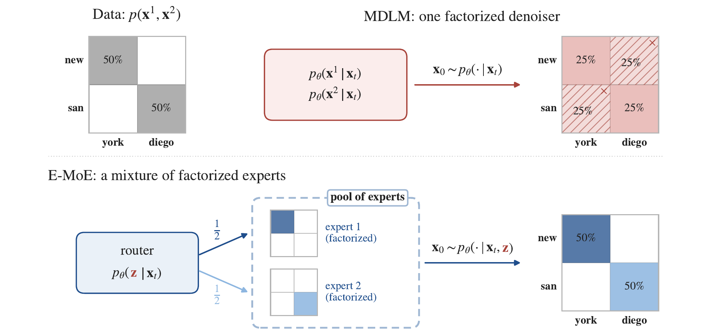
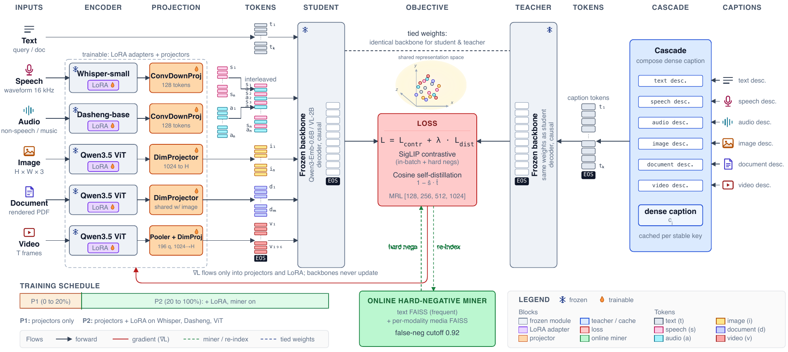
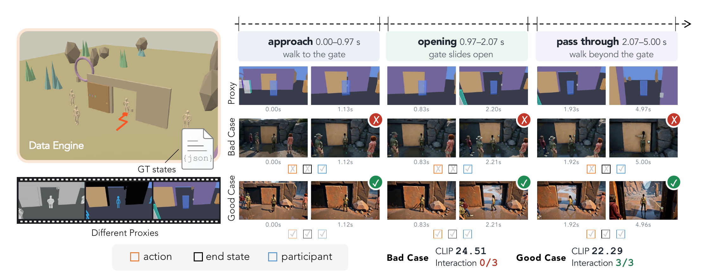

# 论文精选

比较了 12 篇近期候选，选取六个不同问题。全部为 v1 预印本；以下“结果”均指作者实验，本站未训练或部署复现。每项均有站内阅读卡与许可允许归档的 PDF。

## 01 · 蒸馏动力学：先分清采样策略、损失和学习率

论文提交 2026-09-28（原站日期）｜v1 预印本｜近 7 天研究

为什么现在值得看：这篇新近创新研究把经常一起改变的三个因素拆开：训练答案由学生还是教师采样，匹配概率时使用哪个方向的 KL，以及学习率多大。作者实验，本站未复现；热度待验证。

“自己生成再学习”不一定是收益的唯一来源。研究以 Llama 3.1-8B 教师向 Llama 3.2-1B 学生蒸馏为主，在医学、科学和 Countdown 算术三个任务上独立改变这些因素，再以 Qwen2.5 做补充。主实验全参数训练 150 步、三随机种子，并比较七项分布外任务。这样才能看出，所谓 on-policy 优势是否其实来自损失或学习率。

结果并不支持一刀切。汇总最佳配置的平均准确率，学生采样与教师采样约为 72% 和 73%；前向 KL 在不同采样策略下较稳，反向 KL 对策略和学习率更敏感。低学习率的分布外性能下降不超过约 1.3 个百分点，高学习率条件下降约 11.2–14 个百分点。作者还用梯度分析解释前向 KL 的稳健性，但推导带有有界性等条件，不能直接升级为所有大模型的保证。

例外同样值得读：更难的四数 Countdown 上，学生采样有约 10–15 个百分点的泛化优势，不过接续 RLVR 后该优势未稳定保留。长推理补充实验也有更少种子等限制。最值得复用的是实验设计：先固定教师、任务、预算和学习率，再讨论采样策略；不要把两个完整训练配方的差异都归因于“是否 on-policy”。

Piskorz, Julianna 等，Figure 1，三任务最终准确率；阴影/误差来自三随机种子，不能跨任务直接比较难度。来源论文原图，CC BY 4.0；用于解释本段方法或实验。（[来源原图](https://arxiv.org/abs/2609.35259v1)；[查看原尺寸](images/paper-distillation.png)。）

[论文原文](https://arxiv.org/abs/2609.35259v1) · [站内阅读卡](../../../../papers/frontiers/distillation-dynamics-2609-35259/00-阅读卡.md) · [归档 PDF](../../../../papers/frontiers/distillation-dynamics-2609-35259/2609.35259v1.pdf)

## 02 · GraphForge：从职业任务图生成办公训练环境

论文提交 2026-09-30（原站日期）｜v1 预印本｜近 7 天研究

为什么现在值得看：GraphForge 给出了新近实用的办公代理训练数据生产流程，以及文件级评测的收益和失败。作者实验，本站未运行；热度待验证。

普通合成问答缺少真实办公中的文件、角色和交付物。GraphForge 从 O*NET 的职业与工作活动图抽取任务锚点，把任务、评分规则和可操作文件共同生成，再让教师代理实际执行，按执行反馈修订。评分不合格的轨迹不会直接进入监督微调集。这里的关键不是多写一些指令，而是让“任务能做、环境可操作、产出可评”一起成立。

主流程从 3,638 个已实例化任务筛出 2,169 条高分 SFT 轨迹，涉及 2,150 个工作区，平均约 23.1 个文件、50 个助手步骤和 16.2 万 token。它因此也不是低成本的一轮问答生成器。论文对 Qwen3.6-27B 和 35B-A3B 使用同一语料；在 Claude Code 脚手架下，27B 的 SpreadsheetBench II 从 10.3 提高至 24.0，35B-A3B 从 2.8 至 19.3。GDPVal 的 Elo 为论文内部评估口径，不应与公开排行榜直接拼接。

最有用的边界在评分器。作者故意破坏输出时，删除整个工作表会明显降分，但若只损坏数字、行或引用，平均降幅不到 0.03。这说明高分办公轨迹仍可能携带细小但重要的错误。零精确文件重合与 n-gram 抽查降低了部分污染疑虑，也不等于排除所有语义泄漏。复用时优先补单元格、公式和引用的确定性检查，再考虑扩大数据规模。

Su, Qisheng 等，Figure 1，O*NET 锚点、任务与评分规则、文件工作区、教师执行构成同一数据流水线。来源论文原图，CC BY 4.0；用于解释本段方法或实验。（[来源原图](https://arxiv.org/abs/2609.38923v1)；[查看原尺寸](images/paper-graphforge.png)。）

[论文原文](https://arxiv.org/abs/2609.38923v1) · [站内阅读卡](../../../../papers/frontiers/graphforge-2609-38923/00-阅读卡.md) · [归档 PDF](../../../../papers/frontiers/graphforge-2609-38923/2609.38923v1.pdf)

## 03 · E-MoE：用共享专家变量连接并行生成的位置

论文提交 2026-09-29（原站日期）｜v1 预印本｜近 7 天研究

为什么现在值得看：这是新近创新的扩散语言建模方法，针对少步并行生成时的位置依赖问题给出了实现与对照。作者实验，本站未复现；热度待验证。

假设正确答案只能是 New York 或 San Diego。若两个词的位置独立选择，高概率词仍可能拼成不存在的 New Diego。E-MoE 在反向生成分布里加入共享的专家隐变量：先决定一组相互一致的生成方式，再在该条件下生成各位置。它借用了混合专家结构，但要修复的是分布的因子化误差，而不只是扩大参数量。

训练时，路由器分别看到带噪样本，以及带噪样本加干净答案，学习先验与后验并以 KL 对齐；这需要两次前向。推理只使用带噪输入的一次前向。论文所称“不增加活跃参数”，是相对其因子化 MoE 对照的口径，不代表总参数、训练开销都没有增加。

LM1B 主实验序列长 128，训练一百万步、批大小 512，约 650 亿 token。在仅两次模型计算时，E-MoE 的生成困惑度为 383.7，MDLM 为 997.5，VADD 为 763.2；MAUVE 为 24.6，对照约 3.0 和 3.8。两种指标配合样本熵一起看，才不至于把重复输出误判成质量改善。

这个优势集中在少步生成。128 步时，论文自回归对照的生成困惑度约 67.97，仍低于 E-MoE 的 126.3；二维玩具实验中也有 VADD 更好的条件。它值得作为依赖建模方法复现，但不是已经证明能替代长上下文聊天模型的产品结论。

Ivanov, Arseny 等，Figure 2，把 New York 与 San Diego 的二选一交给共享专家，避免各位置独立抽样拼出错误组合。来源论文原图，CC BY 4.0；用于解释本段方法或实验。（[来源原图](https://arxiv.org/abs/2609.37533v1)；[查看原尺寸](images/paper-emoe.png)。）

[论文原文](https://arxiv.org/abs/2609.37533v1) · [站内阅读卡](../../../../papers/frontiers/emoe-2609-37533/00-阅读卡.md) · [归档 PDF](../../../../papers/frontiers/emoe-2609-37533/2609.37533v1.pdf)

## 04 · ActiveSaddler：按失败模式安排代理改进课程

论文提交 2026-10-01（原站日期）｜v1 预印本｜近 7 天研究

为什么现在值得看：这项新近实用 / 新近创新研究把“下一步修哪种失败”变成可适应的课程，而不仅优化补丁生成。作者实验；本站未运行，热度待验证。论文称项目与代码将提供于项目页，不能把预告写成已验证可安装。

ActiveSaddler 改的是代理的提示词、工具接口和控制逻辑，不更新底层模型权重。系统把反复出现的问题抽象成可复用的失败模式，例如工具输出解释错误或证据遗漏，再在“探索未见场景”和“修复已知弱点”之间分配预算。模式的严重度、可修复性、覆盖面和回归情况都会影响后续优先级；同一种任务类别中也可能出现不同模式。

实验沿用 AutoSaddler 的优化器，并使用 GPT-5.5 的既定任务与优化推理档。GAIA2 测试 300 个任务，Terminal-Bench 2.0 使用 89 个任务中的 40 个子集。最终代理运行三次，不等于整个优化过程独立训练了三次。测试 Pass@1，GAIA2 为 59.8±1.0，对固定课程对照的 55.4±1.2；Terminal-Bench 为 80.0±2.5，对照为 72.5±0.0。

消融中，去掉动态模式或探索步骤会损失收益，这比单一最高分更能支持课程设计的作用。论文的美元开销来自当时开发实验与调用设置，不是今天使用服务的报价。它只覆盖两个基准和一种主要底座，动态“多臂老虎机”的表述也不应被理解成已证明所有代理都有最优后悔界。实用启发是把失败日志整理成可重复触发的类别，并保留回归集，而不是每轮都只追逐最新失败。

Park, Sungho 等，Figure 2，先选择探索新场景或重访已知失败，再改提示词、工具接口和控制逻辑；反馈更新优先级。来源论文原图，CC BY 4.0；用于解释本段方法或实验。（[来源原图](https://arxiv.org/abs/2610.00906v1)；[查看原尺寸](images/paper-active.png)。）

[论文原文](https://arxiv.org/abs/2610.00906v1) · [站内阅读卡](../../../../papers/frontiers/activesaddler-2610-00906/00-阅读卡.md) · [归档 PDF](../../../../papers/frontiers/activesaddler-2610-00906/2610.00906v1.pdf)

## 05 · Omni-Embed-Mini：冻结文本空间，再接入其他模态

论文提交 2026-10-01（原站日期）｜v1 预印本｜近 7 天研究

为什么现在值得看：这项新近创新工作把保持文本检索能力作为结构约束，给小型多模态检索系统一个可复用取舍。作者实验，本站未训练复现；热度待验证。

给文本嵌入模型增加声音、图像与视频，联合训练可能损害原有文本检索。Omni-Embed-Mini 冻结文本侧全部参数，用轻量投影器和模态编码器的分阶段 LoRA 把媒体对齐到原有空间。所谓教师目标，并不是另一个巨型嵌入模型的向量：先生成细致的媒体描述，再让同一个冻结骨干对描述编码。学生与目标因此共享文本空间。

0.9B 版本采用 Qwen3-Embedding-0.6B 文本骨干；2.3B 版本采用原生视觉语言骨干。训练把余弦蒸馏、SigLIP 对比损失和多尺寸 Matryoshka 表示结合起来，并在线挖掘负例。有效训练样本约 22.8 万条，实验使用八张 MI210 64GB；小参数并不意味着训练能在普通笔记本完成。描述中的事实错误也没有全部被过滤。

0.9B 文本侧的 49.57 nDCG@10 与原骨干一致，评测为英文 BEIR 的八数据集子集，不是整个 MTEB 的普遍保证。2.3B 的图像、视频、视觉文档成绩分别为 64.80、55.18、58.10，而音频 33.4、语音 48.9 仍有短板；跨模态平均略高于某个闭源对照，不能写成每项都胜出。视频还限定八帧并做平均池化。

冻结的代价是文本侧不能因新任务继续适应，但消融显示简单放开文本 LoRA 会损害保留能力。复现的优先问题应是：同样的描述质量、帧数和向量长度下，对齐带来多少跨模态收益，以及冻结是否适合自己的新领域文本。

Kurpath, Mohammed Irfan 等，Figure 4，左侧不同模态经编码器和投影器进入冻结骨干；右侧稠密描述经同一骨干提供目标向量。来源论文原图，CC BY 4.0；用于解释本段方法或实验。（[来源原图](https://arxiv.org/abs/2610.02148v1)；[查看原尺寸](images/paper-omni.png)。）

[论文原文](https://arxiv.org/abs/2610.02148v1) · [站内阅读卡](../../../../papers/frontiers/omni-embed-mini-2610-02148/00-阅读卡.md) · [归档 PDF](../../../../papers/frontiers/omni-embed-mini-2610-02148/2610.02148v1.pdf)

## 06 · ROWBench：视频看起来好，不代表执行了程序状态

论文提交 2026-10-01（原站日期）｜v1 预印本｜近 7 天研究

为什么现在值得看：这项新近实用 / 新近创新评测把程序规定的物体、轨迹和交互作为可检查目标，适合研究可控视频与世界模型。作者实验，本站未复现；热度待验证。arXiv 条目名为 ROWBench，v1 PDF 内文写作 PROWBench，是同一编号的命名差异。

评测先生成可重放的世界状态与相机轨迹，再形成粗三维画面、另一类控制代理画面或彩色包围盒，并附物体和事件记录。170 个片段对应 600 个代理视频。这样可以分别问：物体是否在指定位置、动作与结束状态是否正确、消失后能否按原状态重现、多视角是否一致。漂亮程度与执行正确度因此可以分开。

位置使用 SAM3 检测、匹配与 IoU，未匹配物体计零；交互由 Qwen3.6-27B 按抽帧结果评判，综合 gISR 再乘位置质量。主比较涵盖多种原生输入方式；使用显式视觉代理的模型与只接收世界或相机控制的模型，输入信息不同，不能把表格当作严格等输入的模型排行榜。

在验证过首帧的短片条件下，相机控制系统的 IoU 约 0.303–0.351，部分代理条件系统约 0.454–0.518。30 秒长片只有十个场景，物体重现相关得分约 0.053–0.131，说明长程状态持续仍很困难。不同模型使用的分段生成流程也不同。多视角几何分数较好，仍可能同时出现物体身份不一致。

局限包括首帧生成与筛选偏差、视觉检测误差，以及未充分用人类评判校准的语言模型裁判。它真正提供的是可追踪的失败诊断方式：先核对状态记录和生成协议，再讨论视觉质量；不能从小规模、不同条件的平均分直接推出通用世界理解能力。

Huang, Zheng-Hui 等，Figure 1 局部裁切，去除原 PDF 图页空白边缘；保留全部比较内容，较高 CLIP 分数的样例反而没有完成三次指定交互。来源论文原图，CC BY 4.0；用于解释本段方法或实验。（[来源原图](https://arxiv.org/abs/2610.02205v1)；[查看原尺寸](images/paper-row-detail.png)。）

[查看未裁切整幅原图](images/paper-row.png)。裁图只移除页边空白，没有修改数字、图例或比较关系。

[论文原文](https://arxiv.org/abs/2610.02205v1) · [站内阅读卡](../../../../papers/frontiers/rowbench-2610-02205/00-阅读卡.md) · [归档 PDF](../../../../papers/frontiers/rowbench-2610-02205/2610.02205v1.pdf)
