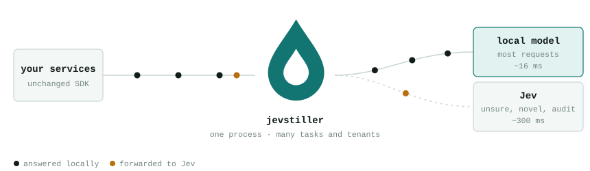
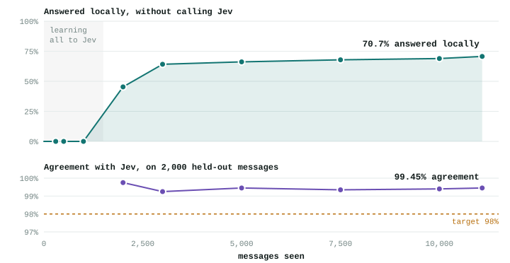
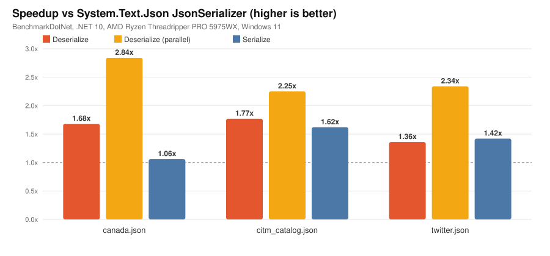
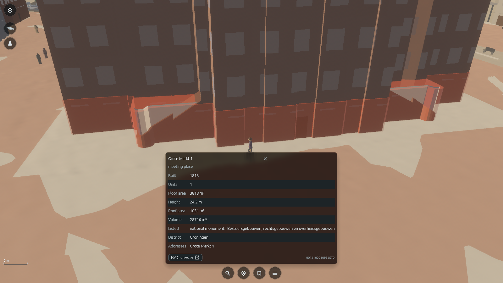

# 开源项目

十个不同任务的工具或有公开实现的方法。均已核对源码入口和许可，但未在本站安装；作者演示、基准及文档不等于独立验证。Enki 是开源框架加受限后端，许可边界单独展开。热度证据不足的条目均按新近价值入选。

| 任务 | 项目 | 先确认的门槛 |
| --- | --- | --- |
| 持续编码 / 远程接续 | PiPod | Linux服务器与身份服务 |
| 重复分类 / 路由降本 | Jevstiller | 教师API和独立校准集 |
| 结构化数据编辑 | REDox | .NET 10 |
| 代理工作区 / 页面协作 | OpenDots | Node24与代理计算环境 |
| 空间方案 / 场景原型 | floorplan-3d | 浏览器与CDN |
| 分镜 / 多模态创作 | BeefTV | 外部模型和本机桌面依赖 |
| 边做边学 / 会话记忆 | VibeWise | Claude Code、Python3 |
| 长任务 / 代理编排 | Raven | 模型权限与持久存储 |
| GPU 方法原型 | Enki | Vulkan及受限Parsu后端 |
| 程序场景 / 数据溯源 | Cartopolis | Rust、Git LFS与数据许可 |

## 01 · PiPod：把持续运行的编码会话带到手机

仓库创建于 2026-10-01（UTC），v0.1.5 发布于 10-02（UTC，北京时间 10-03）。新近实用；依据公开实现、部署文档与作者演示，本站未部署，热度待验证。

适合需要在桌面离开后继续查看编码代理的人：工作保留在远端容器 pod，手机接入同一会话、仓库与终端状态，避免把完整开发环境搬进手机。它与一次性问答不同，重点是会话持续和独立运行空间。

最小路径是先准备 Linux 主机，再按部署文档安装 Docker Compose、PostgreSQL 与 Zitadel 身份服务，最后连接客户端。文档给出至少 8GB 内存，CLI 需要 Node 22.19 或以上、Git 等依赖；使用模型仍需相应服务配置。作者列出的 iOS / Android 客户端不代表托管平台已全面开放：pipod.dev 仍写着 coming soon。远程服务的权限、持久磁盘和升级都需要自己维护，现阶段版本还很早。

[规范仓库](https://github.com/pi-pod/pipod) · [许可：AGPL-3.0](https://github.com/pi-pod/pipod/blob/main/LICENSE)

许可核对：[AGPL-3.0](https://github.com/pi-pod/pipod/blob/main/LICENSE)。

## 02 · Jevstiller：给云端分类器加可回退的本地学生

仓库创建于 2026-09-21，属于近 30 天近期补充；09-29 的 Show HN 讨论是发现线索。新近实用，作者公开实验与实现；本站未训练，只有一类社区信号，热度待验证。

给定反复出现的短文本分类请求，它收集教师的软概率，训练本地学生，再用独立校准集决定何时本地回答、何时回退教师。程序还保留在线抽查和失效回滚。相比固定置信阈值，价值是把覆盖率与允许的分歧预算明确写进校准过程。

Python 3.10、CPU 或 Docker 可作为起点，教师路径需要 Jev 服务密钥。作者 Banking77 留出集 2,000 项中，本地覆盖 71.9%、与教师一致率 99.50%；这是限定任务结果，Tweets 任务覆盖只有约两成。置信界依赖样本与部署分布等条件，而且“复刻教师”不会修正教师本来就错的答案。本期技术实践用合成标签演示了这一区别。先做离线回放，再决定是否能承担在线降级风险。

Jevstiller 作者的路由原图。深色圆点本地回答，橙色圆点回退；图中约16/300毫秒是作者示意的特定运行量级，不是本站测量；Apache-2.0。（[来源原图](https://github.com/tomerglick57/Jevstiller/blob/main/docs/media/flow-light.svg)；[查看原尺寸](images/jevstiller-flow.svg)。）

Jevstiller 作者 Banking77 在线流原图（09-25）。上图随消息积累达到70.7%本地回答；下图在2000条留出消息上与教师一致率99.45%，不同于正文另一项离线实验。两者均非真实准确率；Apache-2.0。（[来源原图](https://github.com/tomerglick57/Jevstiller/blob/main/docs/media/results-light.svg)；[查看原尺寸](images/jevstiller-results.svg)。）

[规范仓库](https://github.com/tomerglick57/Jevstiller) · [许可：Apache-2.0](https://github.com/tomerglick57/Jevstiller/blob/main/LICENSE)

许可核对：[Apache-2.0](https://github.com/tomerglick57/Jevstiller/blob/main/LICENSE)。

## 03 · REDox：在保留原始文本的结构上编辑数据

仓库创建于 2026-09-30。新近实用，依据源码、示例和作者基准；本站未运行，热度待验证。

REDox 面向 .NET 程序需要频繁读取、修改、重写结构化数据的任务。它用固定大小 token 与源文本引用表示结构，让编辑器在已有文档上改字段；目标是减少大量对象分配，同时保留可编辑的 DOM 体验。对于代理批量改配置或处理数据文件，比只比较“读一次 JSON 多快”更值得检查的是修改后能否正确往返。

上手需要 .NET 10，安装 NuGet 的 CAPCOM.REDox，再从 README 的解析、访问与写回例子开始。JSON 等已有示例，CSV 明确是预览能力，各格式支持面不能互相套用。作者在 Threadripper 5975WX、Windows 11 的三类 JSON 数据上报告顺序解析约 1.36–1.77 倍、并行约 2.25–2.84 倍的相对速度；测试数据、线程和分配口径改变后不保证同样收益。适合先对自己的配置文件做 round-trip 检查。

CAPCOM-TD-OSS 基准原图，Threadripper 5975WX / Windows 11 / .NET 10 的作者测量；图内基线与线程条件一起读，Apache-2.0。（[来源原图](https://github.com/CAPCOM-TD-OSS/REDox/blob/main/docs/images/benchmarks/summary-speedup.svg)；[查看原尺寸](images/redox-speedup.svg)。）

[规范仓库](https://github.com/CAPCOM-TD-OSS/REDox) · [许可：Apache-2.0](https://github.com/CAPCOM-TD-OSS/REDox/blob/main/LICENSE)

许可核对：[Apache-2.0](https://github.com/CAPCOM-TD-OSS/REDox/blob/main/LICENSE)。

## 04 · OpenDots：让代理对工作区里的页面提出修改

仓库创建于 2026-09-29。新近实用，依据公开工作区实现、文档及作者演示；本站未启动，热度待验证。

OpenDots 把页面、代理线程和持续运行的计算机放进同一个工作区。用户把任务交给代理后，可查看浏览器、文件和 shell 操作，也可让代理通过 AG-UI 卡片提出结构化页面修改。具体价值是把聊天里的结果变成可保存、可检查的工作区内容，而不只返回一段长文本。

按仓库安装路径准备 Node 24、npm 并完成环境配置；手动编辑页面与启用代理是不同层次，后者还需要模型服务和计算环境。OpenBot 可以给各代理保留自己的运行空间，但外部供应商仍会按配置接收请求。页面保存审批与版本冲突检查是实际协作中应优先试验的部分。当前标为 alpha，演示视频经过加速或剪辑，不能由视频长度推断任务耗时，也不要把浏览器演示当作本站已验证的稳定部署。

[规范仓库](https://github.com/CopilotKit/OpenDots) · [许可：MIT](https://github.com/CopilotKit/OpenDots/blob/main/LICENSE)

许可核对：[MIT](https://github.com/CopilotKit/OpenDots/blob/main/LICENSE)。

## 05 · floorplan-3d：把二维布局直接转成可检查的三维场景

仓库创建于 2026-09-29。新近实用，依据公开单页实现和作者功能演示；本站未实测操作，热度待验证。

给研究演示布置一个房间，输入墙线、门窗和家具尺寸，就能在二维平面与三维视图之间检查布局。程序包含约 60 类对象、毫米单位标尺、撤销，以及 PNG / JSON 导出，适合快速制作空间方案或可视化任务场景。它是手动几何编辑器，没有把语言指令自动变成可靠建筑图的能力主张。

最小路径是取得仓库的 index.html，在现代浏览器里打开；三维部分从 CDN 使用 Three.js r160，因此首次运行不是完全离线。数据使用浏览器本地存储，长期保存应主动导出 JSON；换设备、清缓存或使用不同来源地址可能看不到原布局。需要正式建筑或测绘精度的工作仍要另行验证几何和导出结果。它的近期价值来自一个可直接阅读和改造的轻量工具，而不是历史 Star 数。

[规范仓库](https://github.com/wy51ai/floorplan-3d) · [许可：MIT](https://github.com/wy51ai/floorplan-3d/blob/master/LICENSE)

许可核对：[MIT](https://github.com/wy51ai/floorplan-3d/blob/master/LICENSE)。

## 06 · BeefTV：画布代理开始与人工编辑共用素材和操作

仓库创建于 2026-09-24，本次关注 10-02 的 v1.6.23 实质更新，非把 10-03 小修复当新品。新近实用；源码、版本说明和作者演示，本站未安装，热度待验证。

新画布助手可以起草场景、修改节点、连接参考素材，并先提出图像或视频生成请求等待确认。对做分镜的读者，价值在于代理和手工编辑共用画布操作、素材与任务恢复机制，而非再开一个割裂的聊天窗口。版本说明还列出逐轮撤销、冲突检查和可撤销的外部代理访问。

可从 Releases 选择桌面包；源码构建需要 Go 1.25、Bun 与 Wails 系统组件，Windows 另有 GCC 等条件。Mac 包目前未做 Apple 公证。项目与配置默认保存在本机，但生成会调用自己配置的外部模型，可能需要账号、密钥及付费额度；“本地工作区”不等于所有模型本地运行。应先用非敏感素材确认恢复、撤销与权限行为。

[规范仓库](https://github.com/glanderness/BeefTV) · [许可：MIT](https://github.com/glanderness/BeefTV/blob/main/LICENSE)

许可核对：[MIT](https://github.com/glanderness/BeefTV/blob/main/LICENSE)。 [v1.6.23 更新](https://github.com/glanderness/BeefTV/releases/tag/v1.6.23) · [构建与外部服务条件](https://github.com/glanderness/BeefTV/blob/main/QUICKSTART.md)。

## 07 · VibeWise：让编码助手保留你的学习过程

仓库创建于 2026-09-29。新近实用，依据插件实现与文档示例；本站未装进 Claude Code，热度待验证。

直接拿到完整补丁，往往看不到为什么这样设计。VibeWise 在编码流程中插入解释与检查点，先让使用者描述自己的思路，再讨论方案和实现，把学习记录存入项目的 .vibe-wise 目录。会话启动钩子可以带回这些记录，帮助压缩或切换会话后继续同一条学习线索。

最小路径是按 README 添加插件市场、安装插件后运行 /vibe-wise:learn。依赖 Claude Code 和 Python 3 标准库；插件不需要另建知识库后端，但 Claude Code 本身的账号、模型和数据处理条件仍然适用。笔记会占用仓库空间，哪些记录应提交由项目维护者决定。它没有证明学习成绩提升；当前证据是可读的钩子与示例流程，适合先选一个小改动观察解释是否有帮助。作者关于市场收录的说法未作独立认证。

[规范仓库](https://github.com/nykooi1/vibe-wise) · [许可：MIT](https://github.com/nykooi1/vibe-wise/blob/main/LICENSE)

许可核对：[MIT](https://github.com/nykooi1/vibe-wise/blob/main/LICENSE)。

## 08 · Raven：用可组合代理和长期记忆推进跨领域任务

旧项目创建于 2026-05-21；本次新增依据是 09-27 技术报告发布及 arXiv:2609.33439 中的长程组合实验，不把最新补丁写成首发。新近实用 / 创新候选，作者报告与实现；本站未复现，热度待验证。

Raven 的主代理把目标拆成任务图，将任务交给模型与运行规则组成的不同代理，再用共享档案、EverOS 记忆和可复用技能连接后续步骤。具体适合需要跨多个会话保存中间结果的研究或开发流程。报告展示的长期任务并不能证明任意委托都能自动完成，模型调用和任务分工仍可能积累错误。

可按 README 的 Docker 路径准备 Git、Docker Compose，启动后在 localhost:18793 配置模型；也有源码安装路径。外部代理和模型通常需要各自服务权限，持久记忆还涉及嵌入与存储配置。项目自称 pre-alpha，接口会变化。现在值得看的是已公开的组合机制、持续任务记录与新报告，而不是用总 Star 判断可靠性；安装前先限制一个可回退任务的权限和预算。

[规范仓库](https://github.com/EverMind-AI/Raven) · [许可：Apache-2.0](https://github.com/EverMind-AI/Raven/blob/main/LICENSE)

许可核对：[Apache-2.0](https://github.com/EverMind-AI/Raven/blob/main/LICENSE)。 [技术报告发布](https://github.com/EverMind-AI/Raven/releases/tag/tech-report-v1) · [报告原文](https://arxiv.org/abs/2609.33439)。

## 09 · Enki：同一段 Rust 内核在 CPU 与 GPU 两侧运行

仓库和 v0.1.0 发布于 2026-09-22，近期补充。新近实用 / 创新候选；公开 Rust 实现与作者演示，本站未执行，热度待验证。开放范围是 Enki 框架源码，编译后端需单独看许可。

给向量缩放函数加宏标记，再用同一函数分别调用 CPU 与 GPU，是 README 的最小例子；它把 GPU 地址、任务依赖与同步管理包装进 Rust 工作流。相比同时维护 Rust 和着色语言，研究原型可能更容易逐项对照输入输出。作者还提供光线步进场景演示，但没有本站可复核的跨硬件加速数字。

起点是 cargo add enki-gpu glam；GPU 侧需要 Vulkan 1.3、64 位设备地址等能力，主要列 Linux / Windows。README 的 Rust 1.80+ 与 Cargo 的 2024 edition 存在工具链口径不一致，不能保证旧工具链可用。Cargo 明确声明框架双许可，但标准 LICENSE 文件未取得。尤其 Parsu 预编译后端是单独评估许可：研究、开源及内部原型可用，商业生产未授权，也限制独立再分发。不要把框架开源延伸为完整工具链可自由商用。

[规范仓库](https://github.com/enkiruntime/enki) · [许可：MIT OR Apache-2.0](https://github.com/enkiruntime/enki/blob/main/Cargo.toml)

许可核对：[MIT OR Apache-2.0](https://github.com/enkiruntime/enki/blob/main/Cargo.toml)。 [Parsu 后端独立许可](https://github.com/enkiruntime/enki/blob/main/PARSU_LICENSE.md)。

## 10 · Cartopolis：把公开地理记录变成可查询的三维世界

旧项目创建于 2026-07-22，本次新增是 10-01 面向代理的周边观察、地点与笔记工具，以及 10-02 登记船屋泊位等地物实现；持续预发布标签的 7 月日期没有被当成 10 月首发。新近实用，作者实现与截图，本站未运行；热度待验证。

它把 OpenStreetMap、荷兰 3DBAG / PDOK 等公开记录映射到可步行的三维空间，并保留建筑卡片及原始登记入口。对于空间代理或可控世界实验，价值是场景中的建筑属性有数据来历，不只是随机拼出看起来合理的街区。10-01 的实现还让代理从已加载的世界记录读取周边文字、保存地点与笔记，减少每一步都传截图；10-02 又补齐登记泊位。数据过期、匹配和几何误差仍会影响结果。

源码运行需要 Rust、C 编译器、GPU 驱动及 Git LFS，再使用 cargo run -p cartopolis；另有 WebGPU 浏览器入口。荷兰地区细节更丰富，不代表全球同样覆盖。近期新增提交见[代理观察工具](https://code.garage44.eu/jeroen/cartopolis/commit/074a24239b1c968b75caf9b26f15d98646282767)。代码双许可与地图、建筑、天气和素材许可分开，OSM 涉及 ODbL，3DBAG 等保留各自署名要求。程序允许查询和改造世界，尚不能据此宣称物理仿真或现实位置绝对准确。

Jeroen 的原界面截图，建筑卡片展示来源可追踪的属性；引用范围为该功能说明。地图 © OpenStreetMap contributors（ODbL），建筑数据见 3DBAG / PDOK，具体资源许可遵循仓库 license.md；并非本站运行截图。（[来源原图](https://code.garage44.eu/jeroen/cartopolis/src/branch/main/docs/img/building.png)；[查看原尺寸](images/carto-building.png)。）

[规范仓库](https://code.garage44.eu/jeroen/cartopolis) · [许可：MIT OR Apache-2.0](https://code.garage44.eu/jeroen/cartopolis/src/branch/main/license.md)

许可核对：[MIT OR Apache-2.0](https://code.garage44.eu/jeroen/cartopolis/src/branch/main/license.md)。
