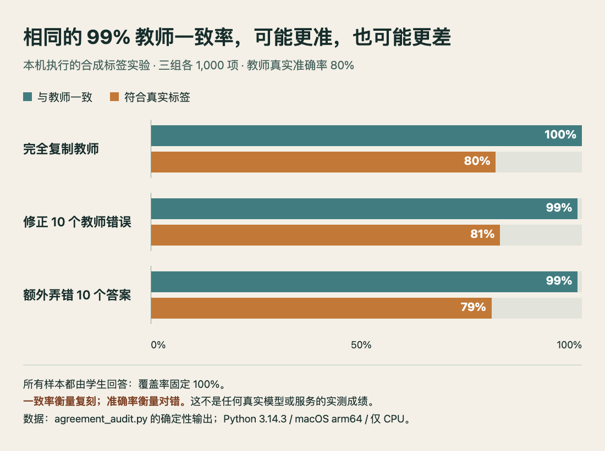

# 技术实践：教师一致率和真实准确率分开记

状态：**本机已运行验证，但使用的是明确构造的合成标签，并未调用真实模型。** 环境为 macOS arm64、Python 3.14.3、CPU、仅标准库；无需账号、密钥或额外下载。代码与原始 JSON 一并保存。

本期 Jevstiller 的校准目标是控制学生与教师的分歧。这个目标很有用，但它不会自动证明教师正确。下面用一个确定性实验，检查两种指标为什么必须分开。

## 先固定同一批答案

构造 1,000 个二分类真实标签，让教师固定答错前 200 个，所以教师准确率是 80%。再构造三种学生：完全复制教师；只修复其中 10 个错误；在教师原本正确的位置额外错 10 个。每组都回答全部样本，覆盖率保持 100%，从而避免路由选择改变分母。

核心计算是逐项比较，而不是拿模型自报的 confidence 当正确率：

```python
agree = sum(s == t for s, t in zip(student, teacher))
correct = sum(s == y for s, y in zip(student, truth))
agreement = agree / len(truth)
accuracy = correct / len(truth)
```

[完整可运行代码](code/agreement_audit.py) · [本机输出 JSON](code/agreement-results.json)

下载脚本后执行 `python3 agreement_audit.py`。脚本会在同目录写出 `agreement-results.json`，并断言三组计数分别为 `(1000, 800)`、`(990, 810)`、`(990, 790)`，不用随机种子。

## 实际运行结果

| 学生策略 | 与教师相同 / 1000 | 符合真值 / 1000 | 教师一致率 | 真实准确率 |
| --- | ---: | ---: | ---: | ---: |
| 完全复制 | 1000 | 800 | 100% | 80% |
| 修正10个教师错误 | 990 | 810 | 99% | 81% |
| 额外弄错10个答案 | 990 | 790 | 99% | 79% |



本站 Python 实际输出，经附带 HTML / JS 忠实绘图。三组分母都是 1,000，横轴从 0 到 100%；这里没有真实模型的性能数字。（[查看原尺寸](images/agreement-results.png)；[可复现图表源码](code/agreement-chart.html)；[数据](code/agreement-results.json)。）

## 放进实际路由审计时怎么用

面对真实请求，至少分别记录：总请求数、本地回答数、本地与教师的分歧数，以及由独立真值或人工复核得到的错误数。覆盖率的分母是总请求；只在本地回答子集计算的分歧率，不能直接叫全体请求的分歧率。若只抽查部分本地回答，还需记录抽样方式和置信区间，不能将观察比例当成保证。

这个实验没有训练、校准集、分布漂移或延迟测量，因此不能复现 Jevstiller 的覆盖率或统计保证。它只验证一个容易混淆的命题：即使一致率很高，真实准确率仍取决于教师质量，以及学生分歧落在哪些样本上。真实系统还要额外检验校准样本和上线请求是否接近同一分布。

方法背景：[Jevstiller 原始实现与校准说明](https://github.com/tomerglick57/Jevstiller)。本站合成实验为独立教学例子，不是该项目的性能复测。
