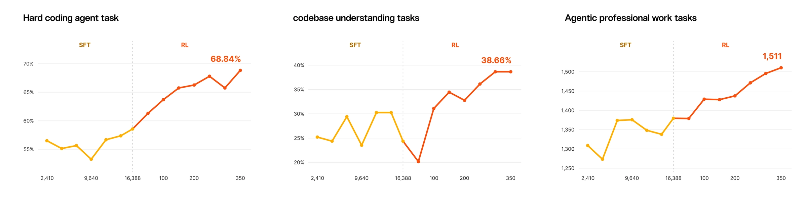
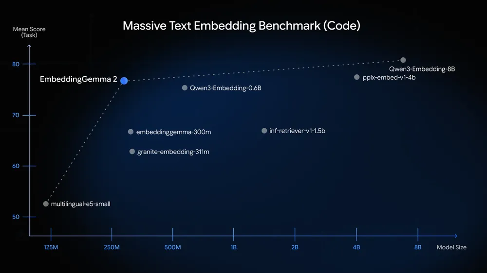
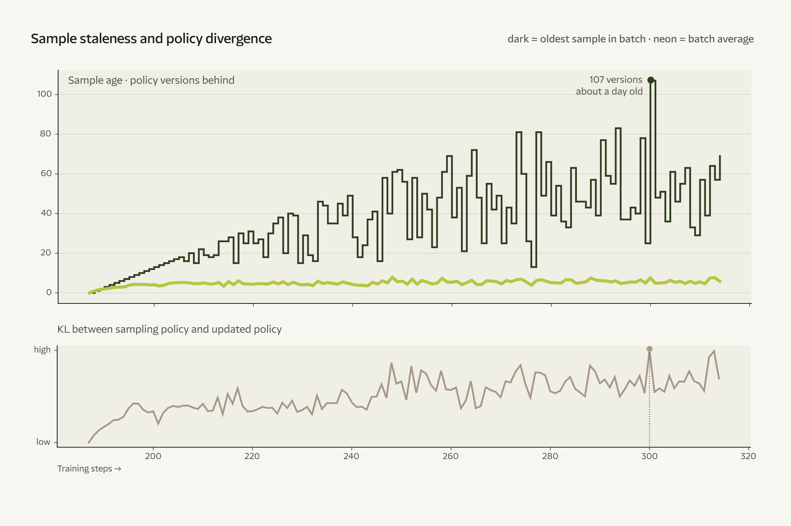
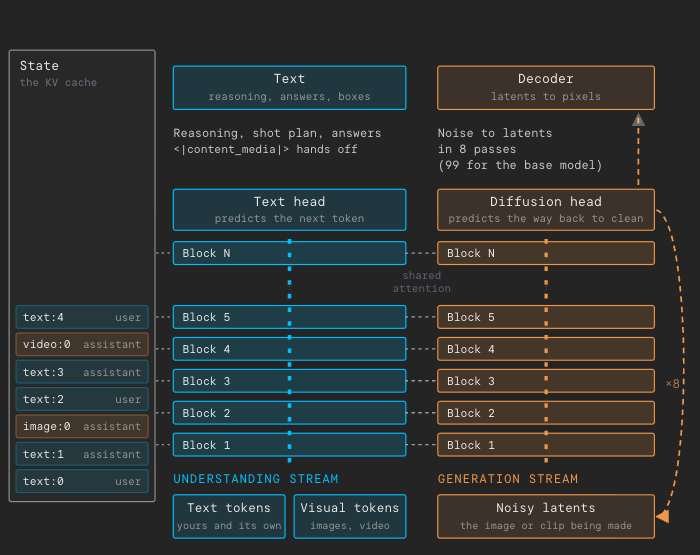

# AI 动态：先看真正开放了什么

本期 15 条：前 5 条重点详解，后 10 条速读。原始事件日期覆盖 9 月 30 日至 10 月 6 日；先查近 24 小时，再扩至 72 小时与近 7 天，较早条目注明“近期补充”。公告只提供日期时，不猜首发时刻。

## 01 · Mistral Large 4：预览 API 已开，权重还要等

Mistral Large 4 在 10 月 6 日进入公开预览，当前可通过 Mistral Studio API 评估；开放权重计划在本月稍晚完成。读这次发布，先把两个阶段分清：今天能试接口，不等于已经能下载部署。模型有约一万亿总参数、每次激活约 490 亿参数，支持图文输入和多语言，面向代码库、专业资料与长任务。

此次重点是从“能回答”转向“能持续做事”。官方训练流程让模型在带工具、环境和可验证结果的任务中接受强化学习；大量异步执行的尝试并行产生反馈，而不是只模仿一份标准答案。对读者而言，可以设想输入工程图和一组规格，让模型查找依据、修改文件，再交付可检查的产物。这个场景说明工作方式，并非本站已经跑通的案例。

公告中的训练曲线把监督微调阶段与后续强化学习阶段分开，展示困难代码、代码库问答和专业任务的变化。曲线帮助理解训练方向，但不同面板采用不同度量，也涉及不同检查点，不能把它们拼成一项总能力分数。正式预览结果和后续训练曲线同样需要分开读。

现在值得关注的是企业任务中的工具使用与多模态依据怎样结合，而非仅看参数规模。准备试用的团队应先建立自己的保留测试集，检查引用、代码执行和交付物是否正确，特别关注长任务中途出错能否恢复。官方评测与演示还不能替代独立复现，权重、技术报告和部署条件也需等正式发布后再判断。

读图：先看横轴的训练阶段，再分别比较各面板的变化；三个纵轴不是同一指标，曲线检查点也不等于当前 API 的统一成绩。Mistral 公告原图，限此处讨论训练过程。（[来源原图](https://mistral.ai/news/mistral-large-4/)；[查看原尺寸](images/mistral-training.webp)。）

日期：2026-10-06。新近实用 / 新近创新；验证：官方公告、演示或作者实验，本站未实测，热度待验证。 [原始来源](https://mistral.ai/news/mistral-large-4/)

## 02 · Nano Banana 2.1：编辑图片时，怎样保住同一个主体

Google 的 Nano Banana 2.1 将主体一致性和精细编辑放在更新中心。当前官方 API 文档已列出稳定型号 gemini-nano-banana-2.1，不能沿用早期媒体关于“还没有 API”的描述。它接收文字和图像等输入，输出图片或文字；默认生成 1K 图片，也支持选择更高分辨率，具体调用条件应以当前接口说明为准。

一个典型流程是先上传主体参考图，再要求改变场景、服装或构图，接着用局部标记指出要修正的位置。相比每次重新生成一张相似图片，这种流程更重视保留已有身份和视觉关系。官方样例把同一个蒲公英主体放进不同环境，能直观看到“场景变了，参考主体继续保留”要解决什么问题，但样例经过作者选择，不能当成每次都成功的保证。

模型支持多张参考图，也把思考预算、搜索依据和图像输出接在同一任务中。对研究资料整理者，实际用途可以是根据已经核对的事实制作示意图，再逐轮修正局部关系。不过，文字生成和画图属于不同的正确性问题：图看起来连贯，不代表里面的公式、数字、方位和小字都准确，仍须逐项检查。

模型卡明确列出边界，包括低分辨率的小字、较长文本、左右位置和复杂姿态保持；用笔迹标记要求编辑时，标记本身也可能被保留。现在值得看的是交互编辑的具体改进和可调用的稳定版本。本文只核对官方页面、模型卡与接口文档，没有独立测量一致性成功率，也不把私有评测上的相对偏好换成通用准确率。 [模型卡](https://deepmind.google/models/model-cards/nano-banana-2-1/) · [API 型号](https://ai.google.dev/gemini-api/docs/models/gemini-nano-banana-2.1?hl=en)

读图：左侧参考图限定主体，右侧四幅输出改变环境；这是 Google DeepMind 提供的生成样例，说明编辑任务，不是本站生成或独立测试。原图仅用于这一能力说明。（[来源原图](https://deepmind.google/models/gemini-image/flash/)；[查看原尺寸](images/banana-subject.png)。）

日期：2026-10-06。新近实用 / 新近创新；验证：官方公告、演示或作者实验，本站未实测，热度待验证。 [原始来源](https://deepmind.google/models/gemini-image/flash/)

## 03 · EmbeddingGemma 2：把文字、图像和声音放进同一检索空间

EmbeddingGemma 2 的工作不是直接写答案，而是把文字、代码、图像和音视频片段转成可以比较的向量。这样，一句描述就能检索不同类型的资料，例如在本地视频里找某种声音或画面，再把相关片段交给回答模型。10 月 6 日的公告带来新的多模态权重与工具接入；不能把权重仓库较早的建立日期当成正式公告日。

完整模型约 7.4 亿参数，由约 2.7 亿文本、1.7 亿视觉和 3 亿音频参数组成，使用 Apache 2.0 许可。模块化很重要：只做文字检索时，不必把“完整多模态模型的大小”当成文字路径的固定代价；反过来，也不能把文字路径的低内存数据当成全部模态同时运行的需求。

输出向量采用可以截短的表示方式，维度可从 768 降到 512、256 或 128。维度越小，保存和比较向量的成本通常越低，但任务质量要重新测量；向量元素减少六倍不等于整个检索系统的内存和耗时都缩小六倍。原文的代码检索图也应按具体基准阅读，不能据此断言所有语言和所有跨模态任务都同样领先。

官方给出设备端量化示例，文字部分和完整模型的内存数字不同。对希望离线处理私人资料的读者，本次价值是可以把嵌入环节留在本地；索引、文件读取和最终生成也必须采用相应本地流程，整条链才不会向外传输资料。建议先用几十个真实查询比较截短前后的召回结果，再选择向量维度。这里的能力依据来自官方实验与文档，本站没有运行设备端推理。

读图：纵轴是特定代码嵌入基准得分，横轴是参与比较的文本模型规模；EmbeddingGemma 2 标示的 270M 是文本路径，完整多模态模型为 740M。Google 公告原图，不能外推所有检索任务。（[来源原图](https://blog.google/innovation-and-ai/technology/developers-tools/embeddinggemma-2/)；[查看原尺寸](images/embedding-code.webp)。）

日期：2026-10-06。新近实用 / 新近创新；验证：官方公告、演示或作者实验，本站未实测，热度待验证。 [原始来源](https://blog.google/innovation-and-ai/technology/developers-tools/embeddinggemma-2/)

## 04 · Reflection Beam：先看计算取舍，再等正式开放

Reflection 公布了 Beam，一个约 501B 总参数、23B 激活参数的混合专家模型。公告时仍在最终评估和安全测试，提供早期访问登记，权重、模型卡与完整报告计划在本月稍晚发布。因此，本条属于研究与产品预告，不能写成已经可以下载的开源模型。

它目前是文本模型。读取图片和文档时可以通过 OCR 等工具把内容交给它，但这不等于原生视觉理解。团队把大量训练资源用于工具、编码和多步骤推理，并使用异步执行的尝试收集反馈。这里的一个难点是“过期样本”：模型已经更新，较早版本产生的尝试却稍后才返回，训练系统必须处理不同版本之间的差异。

原图把样本陈旧程度与策略差异摆在一起，提醒读者异步系统不仅要追求吞吐，还要看反馈来自哪个模型版本。公告披露的训练 GPU 数量和时间是训练预算，不能用来估计个人部署所需的显卡。作者尚未公开的实现细节，也不能由图表补推成已经验证的通用训练算法。

Beam 的另一条主线是推理计算取舍。官方提出某些任务的计算量较低，但采用的估算主要由激活参数量和生成 token 数计算，没有覆盖输入预填充、注意力和服务系统的全部开销。这不能直接换成便宜几倍或快几倍。它在不同基准上也并非统一领先。现在值得关注的是中等激活规模能否承担复杂任务；等权重与报告齐备后，用同一预算、同一工具环境做对照，才适合判断实际收益。

读图：旧版本产生的样本可能在模型更新后才返回，样本年龄与策略差异需要同时检查。Reflection 公告图 4 原图，讨论异步训练问题；这不是推理价格或速度图。（[来源原图](https://reflection.ai/blog/introducing-beam)；[查看原尺寸](images/beam-staleness.png)。）

日期：2026-10-05 · 近期补充。新近实用 / 新近创新；验证：官方公告、演示或作者实验，本站未实测，热度待验证。 [原始来源](https://reflection.ai/blog/introducing-beam)

## 05 · Reka Rho-1：理解与生成共享同一段多模态状态

Rho-1 是 Reka 公布的 19B 多模态研究预览。它想解决的是一个具体断点：通常“看懂图”“修改图”“做成视频”和“生成动作”由不同模型衔接，每次交接都要重新描述上下文。Rho-1 将这些输入输出放进同一段持续演变的上下文，希望上一轮生成的东西也能直接成为下一轮推理的材料。

架构不是把所有任务硬塞进完全相同的计算方式。理解与生成有各自的专家流，但共享注意力中的键值状态；文本等离散内容用下一词预测，视频与动作等连续内容用流匹配。这样，系统既保留不同输出的训练方式，又能在同一上下文里交换信息。公告中的灯塔示例从画图、标框，到动画、改成雪景，再回头描述结果，展示的正是这种跨任务衔接。

速度结果也要分开看。基础系统报告的生成速度约为实时的 0.79 倍，首段输出中位延迟约 6 秒；另一个蒸馏版本把去噪步骤从 99 次压到 8 次，展示约 1 秒生成 5.3 秒片段。这些是团队在其配置下的结果，不能直接用于估计个人电脑、任意分辨率或线上服务的等待时间，演示还压缩了等待部分。

作者也展示了在 LIBERO 仿真中同时预测动作和腕部视角，并用视频推断动作来补训练数据。仿真结果不等于真实机器人已能泛化操作。视频长到约 30 秒后可能出现结构漂移，编辑仍不稳定，原生视频分辨率为 672×384。现在值得读的是共享状态这一研究方向和明确的失败边界；本次未核实可下载权重或公开生产 API，因此将它放在新闻，而不计入六项开放模型。

读图：不同流保留各自训练目标，共享状态负责跨任务交换信息。Reka 公告架构部分的忠实截图，仅用于解释信息流；未重新绘制。（[来源原图](https://reka.ai/news/rho-1-collapsing-the-multimodal-stack)；[查看原尺寸](images/rho-streams.png)。）

日期：2026-10-05 · 近期补充。新近实用 / 新近创新；验证：官方公告、演示或作者实验，本站未实测，热度待验证。 [原始来源](https://reka.ai/news/rho-1-collapsing-the-multimodal-stack)

---

以下为 10 条速读。

## 06 · Anthropic 扩展网络安全验证计划

Anthropic 将网络安全验证计划分成防御、红队和专项用途层级。具备可核验经验的个人可申请部分防御能力，红队层级面向组织且限授权系统，专项用途还需进一步评估。价值在于把任务范围与验证要求对应起来，而不是无条件取消所有限制。申请仍需审核，不同层级可能耗时数天或数周；公告中的安全测试结果属于作者评估，不能当作任何网络环境下的成功率。

日期：2026-10-06。新近实用；验证：官方公告、演示或作者实验，本站未实测，热度待验证。 [原始来源](https://www.anthropic.com/news/cyber-verification-program)

## 07 · OpenAI 公开数学研究进展与形式化材料

OpenAI 公开内部前沿模型参与数学研究的结果材料、部分 Lean 形式化和十份推理摘要，并说明计算投入与尝试次数。现在值得看的是可复核材料：研究者可以区分模型提出的论证、形式化检查以及仍需人工审阅的部分。并非每项结果都已形式化或通过同行评议，也不能据此认定同样能力已进入公开产品。单次成功展示之外，失败尝试和所用计算预算同样影响评价。

日期：2026-10-06。新近实用；验证：官方公告、演示或作者实验，本站未实测，热度待验证。 [原始来源](https://openai.com/index/sharing-ai-progress-in-mathematics/)

## 08 · OpenAI 与 Ironclad 用完整工作流测试电脑操作

这项研究用 11 个商业、法律与采购任务评估电脑操作，每项包含多条判定标准。公开比较中，Astra 的 Max 档平均满足 55% 标准，5.6 Sol 的 High 档为 41.6%；分数不是完整任务成功率。报告的完成时间来自模拟评测，也不是客户已经节省的工时。对构建 Agent 的读者，新增价值在于同时检查业务结果和操作过程；上线前仍要用自己的权限、页面与判定标准测试。

日期：2026-10-06。新近实用；验证：官方公告、演示或作者实验，本站未实测，热度待验证。 [原始来源](https://openai.com/index/advancing-computer-use-with-ironclad/)

## 09 · Atlassian 与 OpenAI 扩大 Rovo 和开发流程合作

双方扩大合作，将 GPT-6 系列与 Rovo 的工作上下文结合，并继续推进开发流程中的 Codex 使用。Teamwork Graph 提供工单、文档和决策之间的关系，使回答能围绕团队实际工作展开；数据可访问范围仍取决于权限。公告称 Atlassian 已有三千名工程师使用 Codex，这是公司自述。更深入地在 Jira 分配和跟踪代理任务仍处探索阶段，不能把合作方向写成所有账户今日可用的功能。

日期：2026-10-06。新近实用；验证：官方公告、演示或作者实验，本站未实测，热度待验证。 [原始来源](https://openai.com/index/atlassian-partnership/)

## 10 · Pegasus 1.6：从第一视角视频提取可检查的动作描述

Twelve Labs 更新视频理解模型 Pegasus 1.6，重点包括第一视角动作、多图输入和结构化输出。研究者可把操作视频交给模型，提取事件、时间位置和动作描述，再由人核查标签；它本身不是直接控制机器人的动作模型。当前属于托管服务，语言和输入时长有条件，英文支持更完整，中文仍是部分支持。官方演示适合判断接口能做什么，尚不能证明自动标注已达到无需抽查的准确度。 [模型条件](https://docs.twelvelabs.io/docs/concepts/models/pegasus/pegasus-1-6)

日期：2026-10-06。新近实用；验证：官方公告、演示或作者实验，本站未实测，热度待验证。 [原始来源](https://www.twelvelabs.io/blog/what%E2%80%99s-new-pegasus-1.6)

## 11 · OpenAI textGrain：用统计信号标记生成文本

textGrain 在生成时轻微调整词语抽样倾向，形成可检测的统计信号。API 计划让部分模型自愿开启、默认关闭；欧盟符合条件的 ChatGPT 与 Codex 账户将在未来数周逐步启用。检测效果受长度、任务与改写影响，检测器暂面向获准机构。现在值得讨论的是如何披露检测不确定性；水印不能证明内容真实或版权归属，未检出也不能反推一定由人写作。

日期：2026-10-05 · 近期补充。新近实用；验证：官方公告、演示或作者实验，本站未实测，热度待验证。 [原始来源](https://openai.com/index/eu-text-provenance/)

## 12 · Cloudflare Containers 增加运行时选择与文件系统快照

新接口把镜像和实例规格选择移到运行时，并提供文件系统快照。编码任务可保存仓库与依赖，评测也可从同一个准备好的环境分支；但文件系统快照不等于冻结进程内存。官方引用 ComputeSDK 测试的启动中位数从四秒多降至 648 毫秒，仅适用于该测试条件。现在值得看的是代理沙箱的生命周期管理，已有应用仍须按原生接口说明迁移。

日期：2026-09-30 · 近期补充。新近实用；验证：官方公告、演示或作者实验，本站未实测，热度待验证。 [原始来源](https://blog.cloudflare.com/faster-agent-sandboxes/)

## 13 · AG-UI 1.0 固定代理界面的事件契约

AG-UI 1.0 用统一事件与行为约定连接代理后端和界面，明确子任务、工具输出、暂停恢复和取消状态。需要人工批准的长任务因此有依据显示“等待输入”，不会轻易与失败混淆。协议约定不保证任务本身正确，接入双方仍须核对 SDK 字段和迁移项。现在值得看的是客户端之间的互操作性；本条采用 1.0 公告日，不把它当成所有软件包的首次发布日期。

日期：2026-09-30 · 近期补充。新近实用；验证：官方公告、演示或作者实验，本站未实测，热度待验证。 [原始来源](https://www.copilotkit.ai/blog/ag-ui-1.0)

## 14 · Qwen3.8-Flash 新增美国弗吉尼亚部署范围

阿里云模型服务更新页列出 Qwen3.8-Flash 在美国弗吉尼亚部署模式的新增可用范围。它提供长上下文、工具调用和结构化输出等接口能力；这是部署区域变化，不是重新发布一款模型。对在该地区运行应用的团队，近期可执行的事情是核对具体型号、端点、配额和数据处理安排，不能把一个区域的可用性外推到其他区域或所有账户。

日期：2026-10-03 · 近期补充。新近实用；验证：官方公告、演示或作者实验，本站未实测，热度待验证。 [原始来源](https://www.alibabacloud.com/help/zh/model-studio/newly-released-models)

## 15 · arXiv 调整投稿速率：按提交者计算自然月额度

arXiv 的临时规则将每个提交者的投稿限制为每自然月两篇，跨类别合计，并保留最多三篇活跃投稿的约束。它按负责提交的人计算，不是按全部共同作者逐一扣额。退稿占用月度额度，在论文正式展示前删除的投稿不计入。对研究团队，当前变化是协调提交人、版本和时间；自然月也不等于任意连续三十天。它是研究基础设施规则调整，不代表针对某类 AI 论文的全面禁止。

日期：2026-10-01 · 近期补充。新近实用；验证：官方公告、演示或作者实验，本站未实测，热度待验证。 [原始来源](https://blog.arxiv.org/2026/10/01/updated-rate-limit-policy/)
