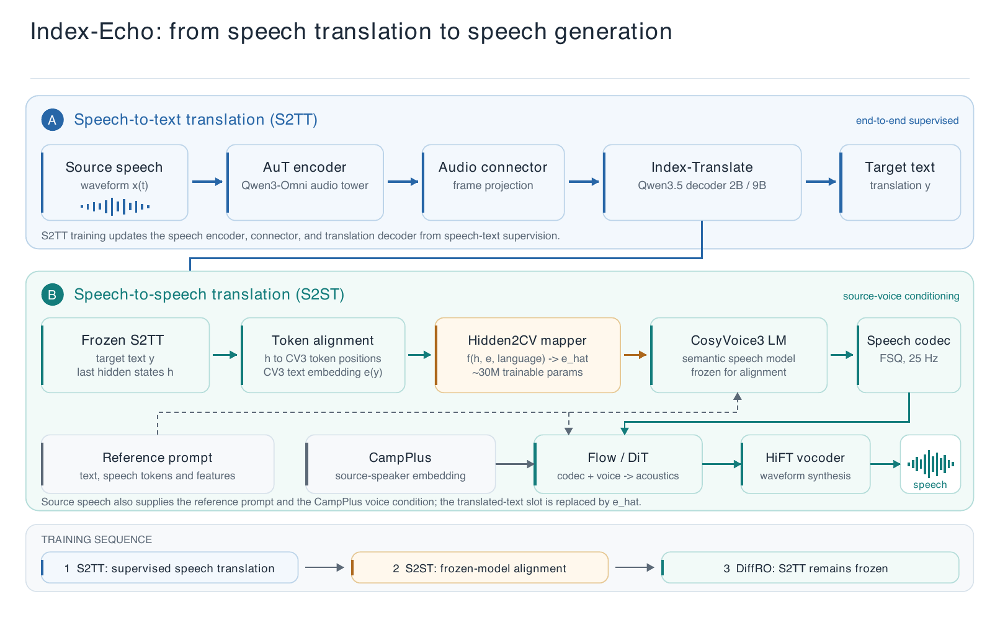
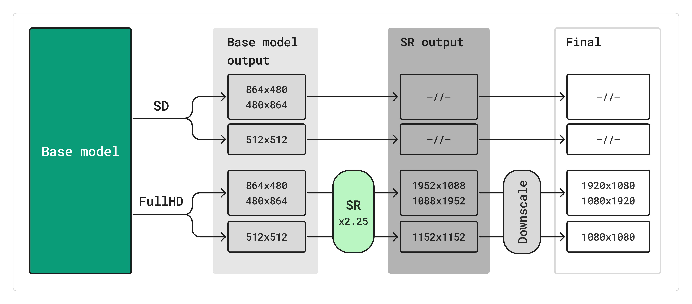
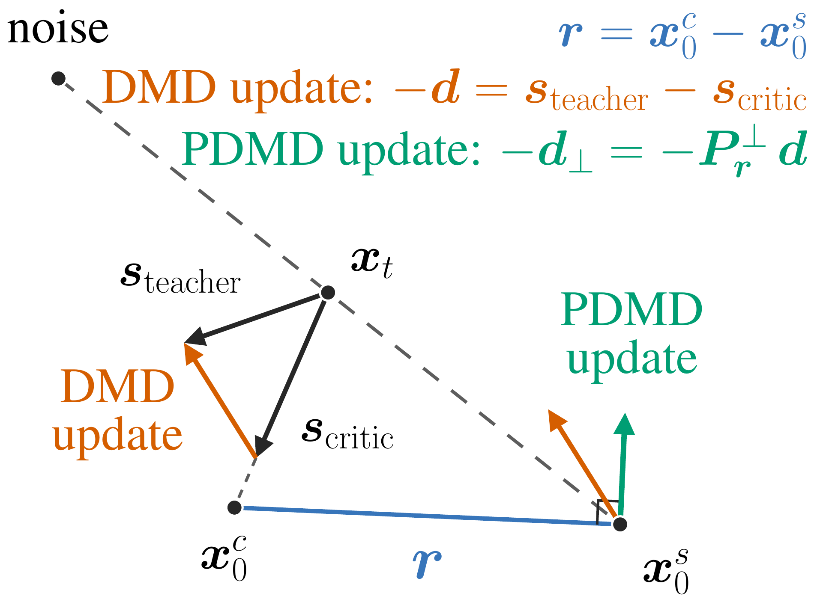

# 开源模型：开放的具体是哪一部分

六项包含完整权重和适配器，原日期覆盖 9 月 17 日至 10 月 6 日。均为新近实用或创新候选，热度待验证；本期读取模型卡、权重目录及相关结果，未安装推理。硬件数据是原作者配置，不是本站实测。

|模型|输入 → 输出|主要门槛|
|---|---|---|
|Index-Echo|中英文语音 → 六方向配音|至少24GB CUDA GPU与完整组件|
|JEV-27B-VL|图文问题 → 选项与概率|指定 vLLM，80GB GPU 示例|
|K2-Type|文本和类型化问题 → 结构化决策|CUDA、自定义服务|
|Ming Design Layer|压平图 + 规划 → RGBA 图层|官方验证 80GiB GPU|
|Kandinsky 6|文字或首帧 → 同步音视频|GPU、多组件、高清另需超分|
|PDMD LoRA|提示 + 基座 → 音视频|完整 H3 组件与基座许可|

## 01 · Index-Echo：把一句原声翻译成另一种语言的配音

近期补充。9 月 28 日建立的这一公开包，接收中文或英文片段，生成英文、中文、西班牙语或日语配音，共支持六个方向。[10 月 1 日](../../10/2026-10-01/02-开源模型.md)介绍过同团队文字翻译权重；这里补充独立的语音到语音模型，不能把文字基础模型的 150 种语言说成配音都支持。

方法把冻结的语音翻译骨干的隐藏状态，经约 30M 参数映射器接到 CosyVoice3，并用源音频提供声线条件。9B 指翻译解码器，整包还含其他组件。作者在相同翻译文本下比较两种合成路径，9B 的六个方向中四个降低了内容错误；中译英反而是串联基线较好，声线相似也不等于完全复刻。

上手下载完整包，使用 DubbingBridgeModel 的 dub 接口，返回 24kHz 音频及可选转录、译文。官方要求单张至少 24GB CUDA GPU、固定依赖与 ffmpeg；句段建议不超过约三十秒，公开包装器尚不支持 chunk=True。Apache-2.0 许可；翻译重复、短音频失败和混合语言误判仍需检查，本站未推理。现在值得看的是能检查中间译文的配音路径与明确的对照条件。

读图：上路输出译文，下路将翻译隐藏状态通过 Hidden2CV 接到语音生成器；源音频还提供声线条件。Index 团队模型卡架构原图，Apache-2.0。多个组件一起运行，9B 不是整包总参数。（[来源原图](https://huggingface.co/IndexTeam/Index-Echo-S2ST-9B)；[查看原尺寸](images/index-echo.png)。）

原日期：2026-09-28。新近实用；验证：作者文档、演示或论文实验。 [模型卡与文件](https://huggingface.co/IndexTeam/Index-Echo-S2ST-9B)

## 02 · JEV-27B-VL：把图文判断输出成选项和概率

JEV-27B-VL 在 Qwen3.8-27B 上增加决策能力，面向“这个商品图是否匹配描述”“两张图哪张更符合要求”等任务。相比让模型先写一长段解释，再从文字里猜结论，它提供选择、判断与概率输出；需要推理时还有完整推理路径。

图像决策部分是从文本训练迁移而来，不能说所有视觉任务都被专项训练。作者在 MMRB2 四项平均为 63.8，图像编辑判断仍较弱。模型卡还列旧版视觉奖励榜单，但不能借较老对手的成绩宣称领先当前全部模型。

部署要求很具体：约 52GB 权重，长上下文还需较多 KV 缓存，示例配置面向 80GB GPU 与指定 vLLM 开发版本；卡片要求 max-num-seqs=8，超过会有概率输出问题。代码和权重声明 Apache-2.0，完整训练集未随之提供。适合已有图文质检工作流的研究者，本期只核验卡片、文件与作者结果，尚无独立复现。

原日期：2026-09-30。新近实用；验证：作者文档、演示或论文实验。 [模型卡与文件](https://huggingface.co/autotrust/JEV-27B-VL)

## 03 · K2-Type：把多字段判断压进小型文本模型

近期补充。这个约 0.9B 骨干、含输出头约 1.08B 的模型，面向有确定类型和候选项的文本任务。输入文本与多个问题，输出分类或选项；问题通过块状因果注意力隔离，可以并行处理，降低逐题让聊天模型组织回答的额外工作。

作者在 JevBench 报告 176/231 正确，约 76.2%，并给出 H200 上的延迟。这些结果受任务格式、批处理和硬件影响，不能理解成手机上也有同样毫秒数。适合先在自己的表单或路由任务上，检查错误类型及置信度，再考虑替换通用聊天调用。

示例服务依赖 CUDA、PyTorch 2.8、Transformers 5.17 或更新及自定义实现。模型卡声明 Apache-2.0，未发现独立 LICENSE 文件，训练数据未公开；采用前需核对卡片与代码对应版本。新近实用依据是明确的类型化输入输出和作者实验，不是历史下载量。

原日期：2026-09-26。新近实用；验证：作者文档、演示或论文实验。 [模型卡与文件](https://huggingface.co/IFM/K2-Type-0.9B)

## 04 · Ming Design Layer：把一张设计图拆成透明图层

近期补充。输入一张已经压平的设计图，加上图层规划，模型输出一组 RGBA 透明图片，便于调整前景、装饰和背景。[9 月 23 日](../../09/2026-09-23/02-开源模型.md)曾介绍同系列设计生成器；本条补充不同的图层分解权重和输入工作流，不能把原始 9 月 17 日权重说成今日新增。

官方样例把卡片分成六层，再合成回原图。它能帮助准备可继续编辑的视觉资产，但分层是否正确仍要检查遮挡关系、边缘与透明度；不保证得到原始 PSD 的真实图层。推理推荐 1024 分辨率、12 步、CFG 2.0、BF16，官方验证硬件是单张 80GiB CUDA GPU，也可用 512 档降低部分成本。

先克隆 Ming-Image 代码，使用 layer-decompose 任务和官方卡片样例。给出详细 prompt 时，图层数按其中的规划；不提供规划才使用 num-layers 参数。代码与模型有 MIT 许可，示例和 Crello 指标属于官方演示与实验，本站未实测。

读图：左侧压平的设计输入被拆为多张带透明通道的图，再在右侧重组。它解释可编辑性，不证明能够复原作者原始图层。inclusionAI 模型卡原图，MIT 许可。（[来源原图](https://huggingface.co/inclusionAI/Ming-Image-0.1-Design-Layer)；[查看原尺寸](images/ming-layers.webp)。）

原日期：2026-09-17。新近实用；验证：作者文档、演示或论文实验。 [模型卡与文件](https://huggingface.co/inclusionAI/Ming-Image-0.1-Design-Layer)

## 05 · Kandinsky 6：音视频一起生成，高清另走超分路径

本次新增的是 10 月 6 日公开技术报告及对应音视频模型家族，不把 9 月 9 日建立的权重仓库误写成当天首次创建。Lite 为 3B、Pro 为 29B，两条流通过交叉注意力联系声音与画面，支持文本或首帧图像条件，生成约五秒、带 44kHz 同步音频的视频。

这里选的是 Pro 蒸馏权重：模型卡明确采用 PiFlow、10 步与 guidance 1.0，不能套用非蒸馏版的 50 步、guidance 5.0。基础输出是 SD；Full HD 需要额外超分模型，不能把最终导出的 1080p 说成基座原生一次生成。同步说话等效果来自作者实验，仍须检查口型、声音和动作是否一致。

完整运行还包括文本编码器、音视频 VAE、声码器与可选超分组件。需 NVIDIA GPU 和匹配的 CUDA / PyTorch、Diffusers 环境，显存不足时依赖卸载；参数量或蒸馏步数都不能直接推出个人电脑上的耗时。代码与权重采用 MIT，论文为 CC BY 4.0；训练数据没有随模型完整开放。现在值得看的是公开同步音视频系统的可检查组件，本站未运行重型推理。 [代码与安装](https://github.com/kandinskylab/kandinsky-6)

读图：上路直接输出 SD；下路先经超分，再缩放到目标高清尺寸。Kandinsky 团队论文图 12，CC BY 4.0，原图未改；这张图解释分辨率路径，不是速度测试。（[来源原图](https://arxiv.org/abs/2610.05608v1)；[查看原尺寸](images/kandinsky-inference.png)。）

原日期：2026-10-06。新近实用 / 新近创新；验证：作者文档、演示或论文实验。 [模型卡与文件](https://huggingface.co/kandinskylab/Kandinsky-6.0-Pro-distill-5s-Diffusers)

## 06 · PDMD 4-NFE LoRA：过滤蒸馏更新里的误差方向

近期补充。PDMD 的论文原日期为 9 月 28 日，LoRA 权重 9 月 29 日建立。它针对分布匹配蒸馏中评价模型的误差逐步累积、画面过饱和的问题：用学生与评价模型的端点残差估计误差方向，再把更新向量在这个方向上的分量投影去掉。

作者在匹配的四步 Wan2.1 实验中，VBench 总分为 83.73，比其重实现的 DMD 高 1.03 点；MiniMax-H3 实验另外报告视频与音频结果。不同骨干和评测不能拼成一组统一提升；一步生成仍有明显质量限制。图示是方法直觉，正确性还依赖论文的高维假设和具体训练条件。

这里下载的是约 1.38GB、rank 128 的 LoRA，不含完整模型。还需 MiniMax-H3 的 Transformer 基座、音视频 VAE、文本组件及匹配调度器。卡片声明适配器 Apache-2.0，基座许可必须另核对；不能把小适配器大小当整套显存，也不能把 4 NFE 直接写成四倍端到端提速。

读图：从 DMD 更新中去掉与端点残差平行的分量，保留垂直方向。论文图 3 的方法部分由作者源文件忠实导出，省略解码效果小图；完整原图见论文。Zimo Wang 等，CC BY 4.0。（[来源原图](https://arxiv.org/abs/2609.35768v1)；[查看原尺寸](images/pdmd.png)。）

原日期：2026-09-29。新近实用 / 新近创新；验证：作者文档、演示或论文实验。 [模型卡与文件](https://huggingface.co/pdmd2026/pdmd_4NFE_lora)
