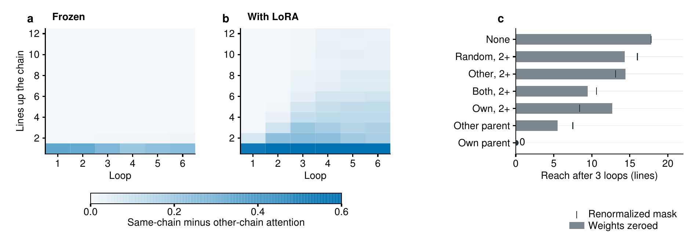
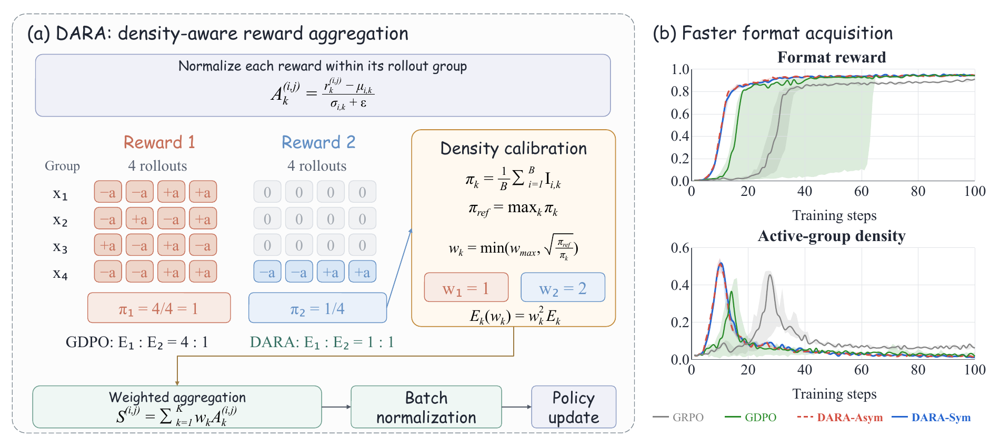
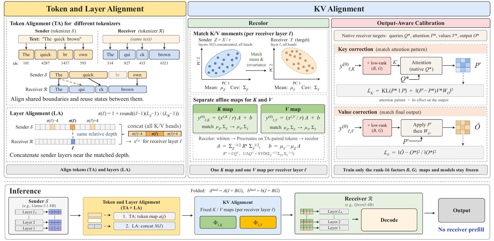
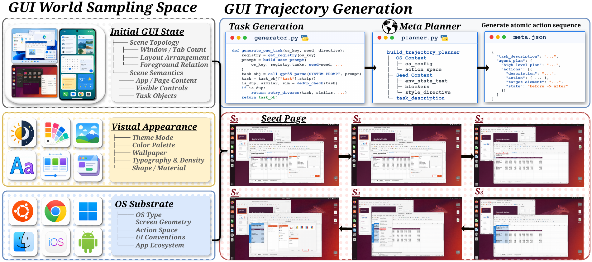
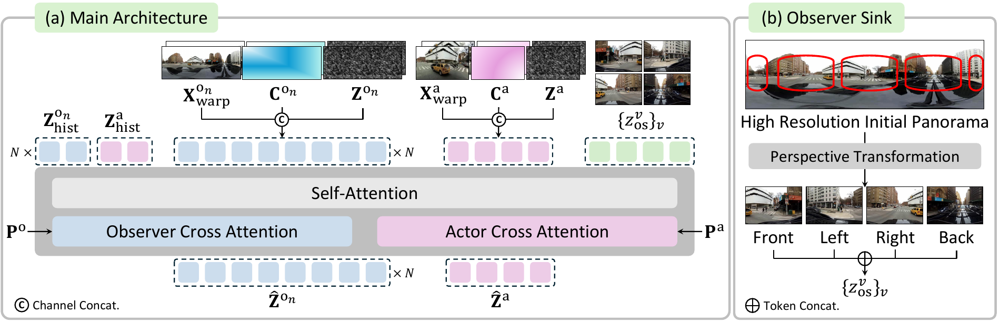
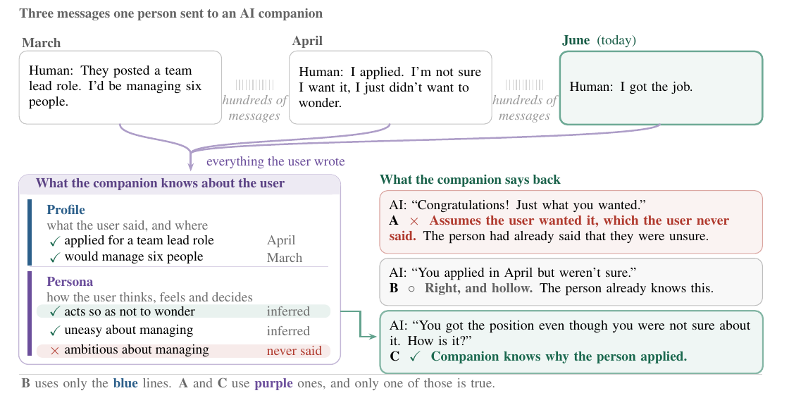

# 论文精选：先把机制和分母读清楚

比较 19 篇候选（新增候选先读摘要筛选，入选者读核心方法与结果）后选入 6 篇。均为预印本，以下为原文阅读，本站未运行作者训练或评测；“新近创新”指可核查的新方法或评测设计，持续热度仍待独立证据验证。

## 01 · Tiny LoRA：早层的小改动怎样延长推理链

为什么现在值得看：9 月 29 日预印本把“模型有多少层”与“实际用多少层追踪依赖”分开测量，提供一种成本较低的机制实验。

作者让模型沿变量引用链找答案，在冻结基础权重的同时，只在一个早层训练 rank-8 LoRA。Qwen3-8B 增加约 6.55 万参数后，24 行受控程序的精确准确率从 15.5% 到 99%。消融显示，适配器启动了中间层的信息接力，切断指向父节点的注意力会使增益消失；不是额外写一长段推理文本。

MuSiQue 另行训练了任务专用 LoRA，不能说程序任务训练出的适配器直接迁移。900 道开发集问题上，最早测试层的适配在 Qwen、OLMo、Llama 上分别增加 11.4、9.4、17.9 个精确匹配百分点。不过层位也在同一开发集上比较，缺少独立的层选择留出集。适合学习因果干预与低秩适配；不能据此断言所有推理失败都能靠小 LoRA 修复。

图 5：看左侧两幅热图中深色区域是否随循环向上延伸，再看右侧切断父节点注意力后追踪距离的变化；这是 Ouro-1.4B 的受控引用链实验。Zehao Jin 等，CC BY 4.0，源图忠实导出。（[来源原图](https://arxiv.org/abs/2609.36585v1)；[查看原尺寸](images/tiny-relay.png)。）

原日期：2026-09-29 · 近期补充。新近创新；验证：论文实验，本站未复现。 [论文原文](https://arxiv.org/abs/2609.36585v1) · [站内阅读卡](../../../../papers/frontiers/tiny-lora-relay/00-阅读卡.md)

## 02 · DARA：别让少数才起作用的奖励在训练中消失

为什么现在值得看：9 月 30 日论文给多奖励强化学习提出了一个可检查的失衡来源。奖励在每组里分别标准化后，若某项多数时候对所有回答都打同分，它仍很少提供学习信号。

DARA 统计每项奖励在哪些回答组里产生非零相对优势，按活跃密度的平方根倒数调整聚合权重。理论分析使用理想化的 GDPO 标准化条件；“优势能量”也不是完整梯度大小，不能把数学等式直接当成任何训练轨迹的保证。

工具调用实验使用 ToolRL 的 3,920 条训练样本、Qwen2.5-1.5B/3B，并比较 GRPO、GDPO 等。100 步后，1.5B 的 DARA-Sym 在 BFCL-v4 三类平均准确率为 51.17%，GDPO 为 50.37%；重点收益是某些行为更快学会，而非终点全面碾压。数学实验中，对长度约束更好的 Sym 也可能牺牲答案准确率。复现时应同时画正确率、超长率和二者都满足的比例，不能只挑一个漂亮指标。

图 1：左边四组回答中，蓝色奖励只有一组产生区分；DARA 根据活跃组比例补偿权重。右边是作者格式奖励实验的训练曲线，不代表所有最终任务精度同步上涨。Tong Zheng 等原图，仅节选用于方法评述。（[来源原图](https://arxiv.org/abs/2610.00574v1)；[查看原尺寸](images/dara-method.png)。）

原日期：2026-09-30。新近创新；验证：论文实验，本站未复现。 [论文原文](https://arxiv.org/abs/2610.00574v1) · [站内阅读卡](../../../../papers/frontiers/dara-rewards/00-阅读卡.md)

## 03 · HeteroFold：不同模型之间能否直接传递 KV 缓存

为什么现在值得看：9 月 26 日原文，作为近 30 天近期补充。异构 Agent 往往反复阅读同一背景，HeteroFold 尝试把发送方已经计算出的 KV 缓存转换成接收方可用的状态。

难点有三层：两个模型切词不同、层数不同、缓存坐标空间也不同。方法用共享字符结束位置对齐 token，结合相近层深的信息，再给 K、V 分别拟合映射和低秩校准。两端语言模型冻结，但映射并非零训练：作者用 1,600 个提示校准、400 个留出提示选模型，不使用标准答案。

实验在 Llama-3.1-8B、Qwen3-4B、Ministral-3-14B 的六个方向上比较，使用 BF16 与 H100 80GB。32K 上下文的一条 Llama→Ministral 路径，报告相对原生 prefill 约 10.7 倍的阶段加速；这不是完整多轮系统端到端加速。基线还专门加入了相同 token 对齐，避免把全部收益都归功于新映射。值得复现的是跨家族缓存接口，局限是模型组合、校准分布和长序列误差仍需分别验证。

图 3：先沿字符边界对齐 token 与相对层深，再分别映射 K、V，最后校准接收方的注意力输出。底部才是推理路径，“不做接收方 prefill”不代表无需预先训练映射。Vincent-Daniel Yun 等，CC BY 4.0。（[来源原图](https://arxiv.org/abs/2609.32259v1)；[查看原尺寸](images/heterofold.png)。）

原日期：2026-09-26 · 近期补充。新近创新；验证：论文实验，本站未复现。 [论文原文](https://arxiv.org/abs/2609.32259v1) · [站内阅读卡](../../../../papers/frontiers/heterofold-kv/00-阅读卡.md)

## 04 · AutoGUIWorld：用生成的界面轨迹训练真实桌面操作

为什么现在值得看：10 月 1 日提交的预印本把图像生成器用于 GUI 训练数据，研究“没有运行目标软件的合成轨迹”能否迁移到真实操作。

流程先指定操作系统、界面外观和初始状态，再由规划器决定原子动作与预期视觉变化，图像模型逐步修改截图，最后标注动作坐标、过滤不合格转移。论文得到 79,266 条逐步样本，用于微调 Qwen3.5-35B-A3B；这些不是录制下来的真实桌面轨迹。

作者在真实运行的应用中评测：361 项 OSWorld 任务的平均任务分数从 33.0% 到 40.8%；143 项 ScienceBoard 任务的成功率从 14.0% 到 32.2%，但排除了 Lean 域。两个指标分母和含义不同，不能混成统一成功率。收益也不均匀，OSWorld 的 Chrome 子集从 39.0 降至 26.0。实验来自一次训练的多个检查点，不能代替多种子或其他基础模型验证。复现价值在数据过滤与合成到真实的迁移设计，不在把好看的假界面当可靠模拟器。

图 2：左边采样界面与系统条件，右上规划动作，右下由图像生成器合成后续截图；这些是合成训练画面，不能当作真实软件执行记录。Cheng Yang 等论文作者原图，节选用于解释数据构造。（[来源原图](https://arxiv.org/abs/2610.01215v1)；[查看原尺寸](images/autogui.png)。）

原日期：2026-10-01。新近创新；验证：论文实验，本站未复现。 [论文原文](https://arxiv.org/abs/2610.01215v1) · [站内阅读卡](../../../../papers/frontiers/autoguiworld/00-阅读卡.md)

## 05 · World Observer：镜头转走后，物体还会怎样变化

为什么现在值得看：10 月 1 日论文直面世界模型的一个失败情形——物体离开镜头后，重新出现时可能位置丢失、停止运动，或变成另一个物体。

方法用同一个视频扩散 Transformer 联合生成行动者视角与一个或多个全景观察者，让看不见的区域也持续演变。共享全景的几何变换负责对应位置，Observer Sink 提供高分辨率透视参照，帮助恢复细节；它仍是生成模型，不能理解成已建立精确物理仿真。

实验提出离开再进入画面的频率 OOV-F，以及运动是否符合目标或此前轨迹的 OOV-D。真实场景单观察者的 OOV-Dgt 为 0.426，高于表中比较方法，但 OOV-F 为 0.492，并非所有指标第一；多观察者只在合成基准上评测。方法使用额外观察流和初始全景条件，与不同输入条件的基线比较要看附录适配方式。适合研究长程状态保持与评测设计，仍缺本期独立复现，不能把演示视频的连贯性等同于所有对象永久守恒。

图 4：Actor 是当前视角，Observer 是观察别处的全景流；右侧把高分辨率初始全景变成四个参照视图，帮助再次看见物体时保留外观。Hyunwook Choi 等，CC BY 4.0。（[来源原图](https://arxiv.org/abs/2610.02162v1)；[查看原尺寸](images/world-observer.png)。）

原日期：2026-10-01。新近创新；验证：论文实验，本站未复现。 [论文原文](https://arxiv.org/abs/2610.02162v1) · [站内阅读卡](../../../../papers/frontiers/world-observer/00-阅读卡.md)

## 06 · RealCompanion：先判断什么时候真的需要长期记忆

为什么现在值得看：10 月 1 日预印本把长期记忆评测从“总有一个旧事实要找”改成“真实对话里到底何时需要回忆”。它公开来自十段真实陪伴关系的 27,218 条消息，并对公开文本作匿名化改写；不是未经处理的原始日志。

作者分别构造用户事实、人物特征和聊天问题，并把标签的证据链连回消息。自然比例样本中，核实需要跨线程记忆的消息占 3.4%，更严格定义下为 1.3%；需要时，最远证据的中位距离却达到 2,157 条消息。这两点解释了为什么平均检索分数容易误导。

按时间倒序的检索在混合问题里能达到 95.9% 命中，但在真正需要远距离记忆的子集中只剩 2.2%。三种代理重建人物特征时 F1 都约 0.69–0.70，处理 token 数却相差约三十倍；不能把 token 差直接写成同倍率账单差。样本仅十人，且两段关系占 73% 消息，标签生成与评判大量使用模型。适合复现分层评测、标注审计与“是否检索”的决策，不能外推所有人都极少需要长期记忆。

图 1：同一句“我得到职位了”，仅记住申请事实和理解此前犹豫，会产生不同回应。图中文字是论文公开的示例，不是本站采集的用户对话；保留原论文完整入口。Arman Behnam 等原图，按图框忠实截取。（[来源原图](https://arxiv.org/abs/2610.01780v1)；[查看原尺寸](images/realcompanion.png)。）

原日期：2026-10-01。新近创新；验证：论文实验，本站未复现。 [论文原文](https://arxiv.org/abs/2610.01780v1) · [站内阅读卡](../../../../papers/frontiers/realcompanion/00-阅读卡.md)
