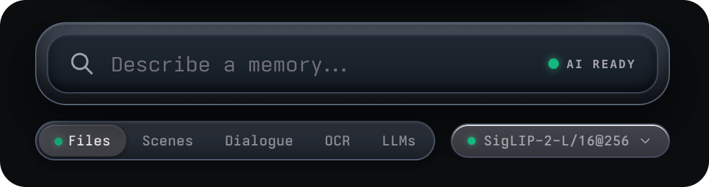
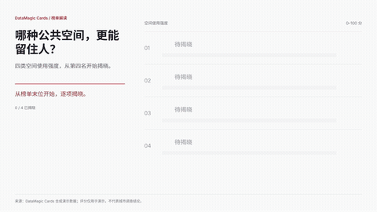
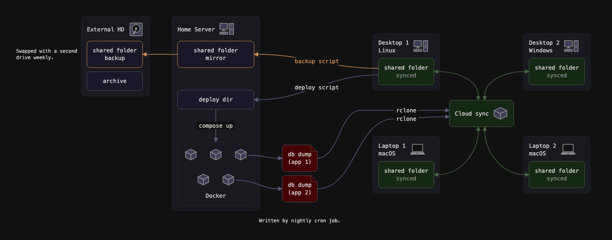
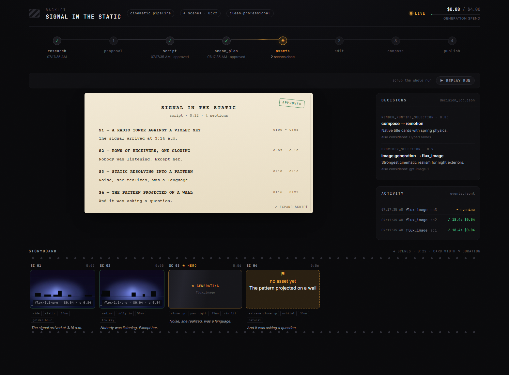

# 开源项目：按任务选工具，再看环境和更新

比较 24 个仓库候选后选入 10 项。以下均为新近实用或创新进展，缺第二类独立近期热度信号时标为热度待验证。本站读取了源码入口、README、许可与版本记录，未安装运行这十个项目；演示和测试结果均注明归属。

|任务|工具|
|---|---|
|视频检索|SCM|
|数据表达|DataMagic|
|路径规划|DMM|
|数据代理评测|Argo-Bench|
|应用测试|e2e|
|开发工作流|pstack-claude|
|代理任务管理|paperclip|
|技术图解|reladraw|
|CAD工作流|text-to-cad|
|创作流程管理|OpenMontage|

## 01 · SCM：在本地素材里按内容找片段

把一批本地图片、视频建成可按内容检索的素材库，适合剪辑前找人物、场景或带某行文字的镜头。10 月 3 日新公开的仓库提供桌面应用和处理流程：CLIP 提取视觉表示，OCR 处理画面文字，转录另有可选模型。它按采样帧组织视觉信息，不等于逐帧看完所有细节。

官方上手面向 macOS 12 及更新的 Apple Silicon，开发环境使用 Bun、Electron；首次要准备数百 MB 模型，音频和可选问答还涉及额外权重。先用小目录建库，再用已知片段检查漏检。现在值得看的是本地检索工作流和可查看的界面，依据为作者演示及代码；本站未安装，也未验证长视频的召回率。

读图：检索栏下方区分文件、场景、对话和 OCR 等入口，右侧选择视觉表示模型。SCM 仓库原图，MIT；它展示交互布局，不证明所有帧或全部声音都已检索。（[来源原图](https://github.com/allenv0/SCM)；[查看原尺寸](images/scm-tabs.png)。）

本次进展日期：2026-10-03。新近实用；验证：作者文档、实现或演示，未本机运行，热度待验证。 [仓库](https://github.com/allenv0/SCM) · [MIT](https://github.com/allenv0/SCM/blob/main/LICENSE) · [更新证据](https://github.com/allenv0/SCM/commits/main)

## 02 · DataMagic：从可编辑配方做数据视频

项目自 6 月存在，本次新增是 10 月 2 日发布的 139 张动态配方卡及配套 Skill。输入自己的表格和想表达的比较关系，选择排名揭晓、趋势或分镜配方，得到可继续修改的源码与视频。与只拿到一个成片相比，数据、文案和动画时序都能回到模板里调整。

先看配方目录的预览、示例数据与实现说明，再在隔离项目中接入编程助手；具体渲染依赖随配方准备，不应直接执行未经检查的 Skill。原图展示分阶段揭晓排名的效果，属于官方合成示例。代码采用 MIT；开源配方库不等于托管站所有服务都免费或全部实现均在本仓库。现在值得看的是近期可复用的源码集合，本站没有替读者数据做自动分析或渲染测试。

读图：排名逐项揭晓，观众先看问题再看差异；数值属于 DataMagic 官方演示数据，不是本站调查结果。仓库 RankedReveal 动图，MIT，保留原动画。（[来源原图](https://github.com/HKUSTDial/DataMagic)；[查看原尺寸](images/datamagic.gif)。）

本次进展日期：2026-10-02。新近实用；验证：作者文档、实现或演示，未本机运行，热度待验证。 [仓库](https://github.com/HKUSTDial/DataMagic) · [MIT](https://github.com/HKUSTDial/DataMagic/blob/main/LICENSE) · [更新证据](https://github.com/HKUSTDial/DataMagic/commits/main)

## 03 · DMM：用公开实现研究分散式多智能体寻路

DMM 将地图、局部观察与目标变成多个智能体的移动决策，适合研究仓储网格中的避让和协作。仓库 9 月 27 日公开实现，10 月 3 日补充发布权重的获取路径；当前包含训练、评测和推理链，而不是只有方法名称。已有模拟环境与小模型权重让任务定义可以逐项检查。

上手应先按 README 准备 Linux x86、NVIDIA GPU、匹配 CUDA 工具链和编译器，再下载权重、编译推理部分并从小地图评测。作者的大规模结果使用多张 H100，不能写成 Mac 上开箱即用。MIT 覆盖仓库代码；模型控制的是基准中的移动代理，不等于真实机器人已解决碰撞与感知误差。现在值得看的是新近公开的完整方法链，验证程度为作者实验和代码阅读，本站未编译或跑大规模仿真。

本次进展日期：2026-10-03。新近实用；验证：作者文档、实现或演示，未本机运行，热度待验证。 [仓库](https://github.com/CognitiveAISystems/DMM) · [MIT](https://github.com/CognitiveAISystems/DMM/blob/main/LICENSE) · [更新证据](https://github.com/CognitiveAISystems/DMM/commits/main)

## 04 · Argo-Bench：让数据代理交付业务结果

Argo-Bench 把企业数据任务写成需要交付结果的 210 道题：代理要查询仓库、读资料、使用 Python 或完成动作，评分不只看 SQL 能否执行。仓库 9 月 26 日建立，相关论文 10 月 1 日公开，适合已经有数据助手、想检查端到端能力的团队。

最小路径是阅读任务定义和示例解法，按 Inspect 配置建立隔离执行环境，再接 DuckDB 或 BigQuery 数据。数据仓库规模约 71GiB、235 张表，准备成本并不轻；Docker 是推荐路径。代码 Apache-2.0，数据许可另核对。公开数据是同一生成体系中的另一套种子实例，私有判题器未全部开放，所以不能声称本地跑完就复现官方排行榜。现在值得看的是任务和交付物的设计，本站未下载大数据或运行评测。

本次进展日期：2026-10-01。新近实用；验证：作者文档、实现或演示，未本机运行，热度待验证。 [仓库](https://github.com/TextQLLabs/Argo-Bench) · [Apache-2.0](https://github.com/TextQLLabs/Argo-Bench/blob/main/LICENSE) · [更新证据](https://github.com/TextQLLabs/Argo-Bench/commits/main)

## 05 · e2e：自然语言探索后，再用断言与回放核查

e2e 让代理按自然语言目标操作网页或移动应用，再由定位器和断言核查结果；经过断言验证的步骤可以录制，后续回放通常无需重复模型调用，界面变化后再回到代理探索。10 月 4–6 日的更新补足执行器、语义断言与回放行为，适合把“看起来点对了”转成可重复检查。

当前 0.18.0 的重要门槛是 Node 22.22.3 或更新的 22 系列，或 24.8.0 及更新版本；23 和部分早期 24 版本不支持。先按文档用 npx e2e init 在测试应用中配置浏览器与模型服务，再写业务断言。新版本也能识别同一页面互相矛盾的金额等值。Apache-2.0 不包含模型服务费用；本站核对了实现说明与发行记录，未运行目标应用测试。

本次进展日期：2026-10-06。新近实用；验证：作者文档、实现或演示，未本机运行，热度待验证。 [仓库](https://github.com/tester-army/e2e) · [Apache-2.0](https://github.com/tester-army/e2e/blob/main/LICENSE) · [更新证据](https://github.com/tester-army/e2e/releases/tag/e2e%400.18.0)

## 06 · pstack-claude：把开发工作流带到多个编程助手

项目在 5 月建立，10 月 6 日北京时间发布的 v0.9.73 增加 Copilot CLI 工作流适配，随后 v0.9.74 调整验证与恢复边界。输入开发任务，工具组织规划、实现、检查和 PR 等步骤；价值在于不同助手共享较明确的任务程序，而不只是重复粘贴提示词。

先按仓库选择对应 harness 的安装方式，并核对运行时版本。Copilot 适配说明涉及 1.0.87–1.0.92 范围以及 1.0.92 非交互模式问题，不能只看到支持名称就认为所有执行方式可靠。模型账户、Git 工具和相关开发依赖仍需自己准备。MIT；本期只读取变更日志与实现入口，未让它执行项目。现在值得看的是新增适配及明确暴露的运行边界，不把自动工作流等同于无人检查即可合并。

本次进展日期：2026-10-06。新近实用；验证：作者文档、实现或演示，未本机运行，热度待验证。 [仓库](https://github.com/michael-denyer/pstack-claude) · [MIT](https://github.com/michael-denyer/pstack-claude/blob/main/LICENSE) · [更新证据](https://github.com/michael-denyer/pstack-claude/releases/tag/v0.9.74)

## 07 · Paperclip：让代理跨任务保留文件与技能版本

Paperclip 将代理、任务、权限和费用放进统一管理界面。最新 v2026.1005.0 的发行记录标注 10 月 5 日，GitHub 发布时刻则为北京时间 10 月 7 日 00:40；本条保留这两个日期，不把它混成项目首发。

本次具体新增包括代理跨任务保留自己的文件、从 GitHub 同步公司技能快照，以及可跟随和接管的 Browser Use Cloud 浏览器。技能刷新失败保留上一个可用版本，适合需要可追溯工作环境的团队。MCP 聚合连接器在此版本默认开启，与上一版试验开关不同，部署前要检查连接权限。

本地核心需要 Node 24.11 或更新版本、仓库文档指定的包管理与数据库环境，再配置模型/执行器。MIT 核心不意味着浏览器云服务、模型或所有连接器免费。现在值得看的是文件和技能如何延续到下一任务；本站没有运行其后台任务或付费服务。

本次进展日期：2026-10-07。新近实用；验证：作者文档、实现或演示，未本机运行，热度待验证。 [仓库](https://github.com/paperclipai/paperclip) · [MIT](https://github.com/paperclipai/paperclip/blob/master/LICENSE) · [更新证据](https://github.com/paperclipai/paperclip/releases/tag/v2026.1005.0)

## 08 · reladraw：把自有 SVG 图标放进约束式图解

用文字描述节点与相对位置，输出可编辑 SVG 图解。相比手工不断拖动对齐，约束式布局适合维护架构图。[9 月 27 日](../../09/2026-09-27/04-开源项目.md)介绍过早期版本；这次选择的是 v0.15 新增自定义 SVG 图标和徽标，允许团队图解沿用自己的视觉符号，而不是重复推荐旧功能。

v0.15 在北京时间 10 月 1 日发布；CLI 可读取相对路径中的 SVG，网页环境需粘贴图形内容。当前 v0.16 又调整语法，名称不能包含冒号或分号，升级要检查旧文本。Apache-2.0。最小路径是用一个小图声明图标、添加两个节点并导出 SVG；本站未运行该工具。现在值得看的是复用真实资产的能力，配图仅说明输出形式，不冒充最新自定义图标功能的实测。

读图：文字中的相对位置最终形成连线与节点布局。reladraw 仓库示例原图，Apache-2.0；展示约束式图解的产物，不是本站绘制，也不是对新增图标功能的测试。（[来源原图](https://github.com/reladraw/reladraw)；[查看原尺寸](images/reladraw.png)。）

本次进展日期：2026-10-01。新近实用；验证：作者文档、实现或演示，未本机运行，热度待验证。 [仓库](https://github.com/reladraw/reladraw) · [Apache-2.0](https://github.com/reladraw/reladraw/blob/main/LICENSE) · [更新证据](https://github.com/reladraw/reladraw/releases/tag/v0.16.0)

## 09 · text-to-cad：生成几何后，还要检查模型和导出

项目将自然语言需求经编程助手转成可执行建模代码，输出 STEP、STL 等文件并在查看器里检查。4 月建立的项目在 v0.7.12 增加 Render studio，以及从子模型保存的 STEP 组合父模型的流程；本次关注的是这组实质变化，后续补丁不另当新产品。

使用时先按官方流程准备 uv 与 Python 3.13 运行环境，再让助手建立一个简单零件、执行代码、查看尺寸和导出文件。新的柔光、材质和视角保持让模型更容易观察，但漂亮渲染不能证明几何封闭、尺寸正确或可以制造。MIT；PR 中的性能结果是作者在特定机器和项目上的对照，本站没有复跑。现在值得看的是建模、复用和检查连成了更完整的流程，重要用途仍需独立检查导出件。

本次进展日期：2026-10-05。新近实用；验证：作者文档、实现或演示，未本机运行，热度待验证。 [仓库](https://github.com/earthtojake/text-to-cad) · [MIT](https://github.com/earthtojake/text-to-cad/blob/main/LICENSE) · [更新证据](https://github.com/earthtojake/text-to-cad/pull/499)

## 10 · OpenMontage：保留生成任务身份，超时后继续查询

OpenMontage 组织脚本、资产、生成和剪辑流程。10 月 3 日合并的提供方更新明确区分模型、承载服务和调用格式，并让轮询超时后的任务可以继续查询，避免把“没有等到结果”直接变成再次提交付费生成。未知价格会标为需报价，不能解释成免费。

上手需 Python 3.10+、ffmpeg、Node 18+ 与编程助手；本地生成还需模型和 GPU，云生成另需相应账户、权限与费用。HeyGen Avatar V 等能力有具体账户和素材资格条件，不能仅凭菜单存在判断可以调用。代码为 AGPL-3.0。作者明确说本次只做回归与接口契约检查，没有实际付费生成或 GPU 推理；本站也未执行。现在值得看的是任务恢复和能力边界的实现，成片质量仍须真实运行检验。

读图：项目看板把脚本、素材和当前阶段放在一起，便于看到工作进行到哪里。OpenMontage README 示例界面，AGPL-3.0；图中的费用和状态属于演示，不是本站运行记录。（[来源原图](https://github.com/calesthio/OpenMontage)；[查看原尺寸](images/montage-board.png)。）

本次进展日期：2026-10-03。新近实用；验证：作者文档、实现或演示，未本机运行，热度待验证。 [仓库](https://github.com/calesthio/OpenMontage) · [AGPL-3.0](https://github.com/calesthio/OpenMontage/blob/main/LICENSE) · [更新证据](https://github.com/calesthio/OpenMontage/pull/698)
