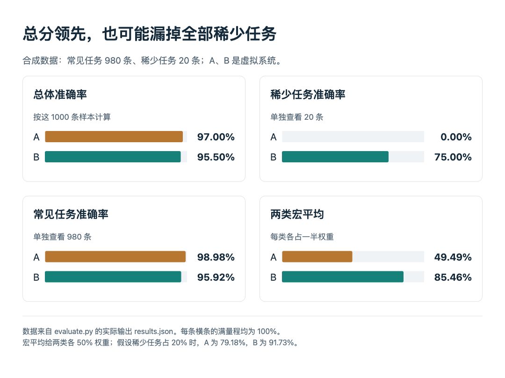

# 技术实践：总分赢了，稀少任务却全错

本篇已在本机运行，Python 3.14.3，只用标准库。数据是手工构造的汇总计数，不是任何真实模型或论文的成绩；只验证评测算术，不验证模型能力。

假设有 1000 条测试：980 条常见任务、20 条必须特别关注的稀少任务。虚拟系统 A 在常见任务答对 970 条，稀少任务一条也没答对；B 分别答对 940 和 15 条。如果只看总分，会优先选谁？

|任务层|样本数|A 正确|B 正确|
|---|---:|---:|---:|
|常见|980|970|940|
|稀少|20|0|15|

## 三个问题，用三个分母

总体准确率就是总正确数除以总样本数：A 为 97%，B 为 95.5%。它正确回答了“在这批测试的样本比例下，平均能做对多少”。问题在于，这不同时回答“对稀少任务是否可用”：单独看这一层，A 是 0%，B 是 75%。

宏平均先分别求两类准确率，再给它们相同权重。A 为 49.49%，B 为 85.46%。这个数字表达的是两类同等重要的评价选择，不是发现了一个比总体准确率永远更正确的指标。如果真实使用中稀少任务占 20%，按 80% / 20% 加权则分别为 79.18% 和 91.73%；这里的比例仍是假设，不是实际流量估计。



读图：左上 A 总分略高，右上 A 的稀少任务却为零；看完分层再决定权重。HTML/JS 根据本机 Python 输出绘制，所有条形均以 100% 为满量程；合成数据，不是论文复现。（[运行数据](code/results.json)；[查看原尺寸](images/stratified-results.png)。）


## 运行和检查

将同目录的 [evaluate.py](code/evaluate.py) 与 [stratified.csv](code/stratified.csv) 下载到一起，运行：

```bash
python3 evaluate.py
```

核心计算只有几行：

```python
micro = sum(correct) / sum(total)
macro = sum(c / n for c, n in zip(correct, total)) / len(total)
```

这里 correct、total 分别表示按任务层排列的正确数和样本数；可运行脚本使用带列名的 CSV，另检查计数非负、正确数不超过总数，以及加权分层结果与总体结果一致。

实际输出如下，完整记录见 [run.txt](code/run.txt)，结构化结果见 [results.json](code/results.json)：

```text
A: micro=97.00%, macro=49.49%, rare=0.00%, target_rare20=79.18%
B: micro=95.50%, macro=85.46%, rare=75.00%, target_rare20=91.73%
```

图可由 [HTML/JS 源文件](code/results-figure.html) 与同目录 results.json 重新绘制；用本地 HTTP 服务打开它，以便读取 JSON。

## 什么时候用这个检查

本期 [RealCompanion 的阅读卡](../../../../papers/frontiers/realcompanion/00-阅读卡.md)提醒我们：混合任务里的高分，可能遮住真正需要长期记忆的那一小部分。这里借用的是分层检查思路，数据和算法都不属于该论文的复现。

在自己的评测中，应先按真实任务定义分层，保留各层样本数，再同时报告总体与重点层结果。20 条样本仍很少，75% 不代表稳定的真实成功率；本例没有随机抽样、置信区间、代价估计或误差相关性。不能为了让喜欢的系统获胜，看到结果后才挑层、改权重。
