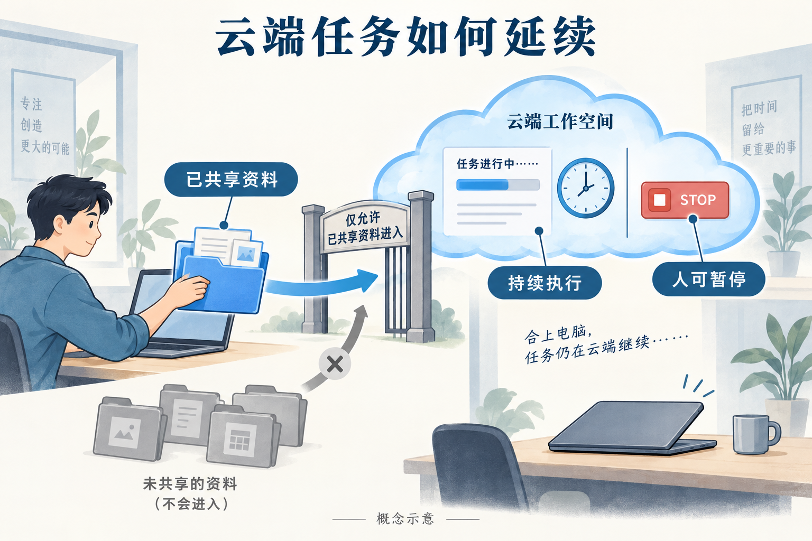
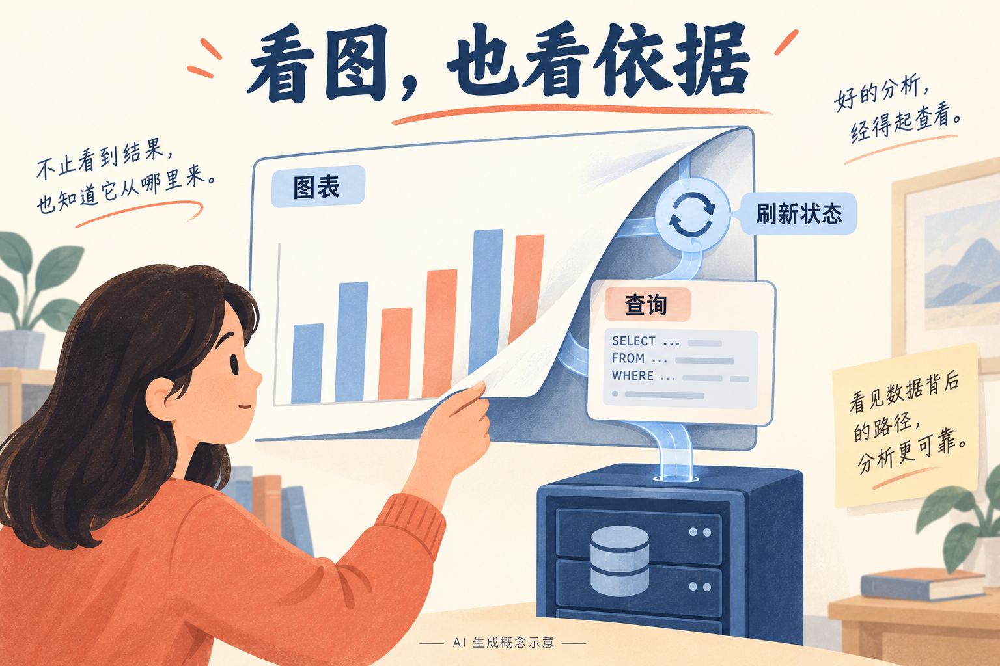

# AI 动态：5 条重点详解 + 10 条速读

本期事件原日期覆盖 **2026-10-06—2026-10-09**。日期只有日精度时保留来源原日期；近 24 小时优先，不足补充近 72 小时和 7 天内未收录事件。所有性能数字均注明官方口径，未把公告当作本站实测。

## 01 · GPT-6.1 Sol Ultrafast：加快生成，也要算上连接和工具等待

2026-10-08｜新近实用 / 新近进展；验证：官方公告、文档或作者实验，热度待验证。

本次变化是 GPT-6.1 Sol 增加 Ultrafast 推理档位。9 月 29 日发布的模型没有因此变成一个新的权重版本；10 月 8 日的 API 更新把更快的服务档位开放给所有 API 用户，但仍受各组织的速率限制约束。官方发布称，生成速度最高可达 Sol Standard 的八倍。这是特定服务条件下的速度主张，不能直接换算成代码任务、浏览网页或整段研究流程快八倍。

实际接入时，在 Responses 请求里使用 `gpt-6.1-sol`，并设置 `service_tier: "ultrafast"`。对于“生成下一步—执行工具—返回结果”的多轮代理，官方建议保持 WebSocket 长连接，减少每轮重新连接的开销；HTTP 仍可使用。若任务大部分时间花在数据库、浏览器或外部服务上，模型吐字更快带来的整体收益会小得多。

选择它之前，值得先记录自己的耗时构成：首段输出等待、后续 token 生成、工具执行分别花多久。公告给出的 API 输入/输出价格为每百万 token 12/60 美元。应结合实际输入长度、缓存与完整账单比较，不能拿最快档位的速度与另一档位的价格拼成一个“性价比”结论。这里没有进行付费调用或性能测试。

Codex 与 ChatGPT Work 的权限和 API 权限不同：公告列出 Pro 500、符合条件的按使用量计费 Enterprise 及按积分计费 Edu；Enterprise 需要管理员启用。Sol Ultrafast 支持美国和欧洲数据驻留，具体组织配置仍需检查。

现在值得关注的是工程上的等待预算：当人正在等待一次调试反馈或界面操作结果时，这个档位可能有价值；批处理则未必需要。读者可以从一条真实工作流做对照，比较同一任务质量、总耗时和费用，再决定是否切换。

[原始来源](https://developers.openai.com/api/docs/changelog) · [补充文档](https://community.openai.com/t/ultrafast-is-rolling-out-today-for-gpt-6-1-sol-in-the-api-codex-and-chatgpt-work/1404475) · [补充文档](https://developers.openai.com/api/docs/guides/ultrafast-mode)

## 02 · Gemini 企业代理：任务留在云端，权限跟着工作走

2026-10-09｜新近实用 / 新近进展；验证：官方公告、文档或作者实验，热度待验证。

Google Cloud 的官方页面标注 10 月 9 日，介绍统一的企业工作代理：知识工作、代码和媒体任务可以在同一入口、API 与持久工作空间中衔接。它强调任务留在云端，用户合上电脑后仍可继续处理。当前列出的模型包括 Gemini 与 Claude，其他模型属于后续方向；这次不应写成某个新的 Gemini 基础模型已经发布。

可以用整理项目进展来理解：代理先拿到用户共享的材料，再结合可用工具检查任务，生成报告；人在手机、桌面或命令行回来时，继续同一段工作。官方区分会话、语义、程序和经历等记忆。它们分别服务于当前上下文、长期事实、反复使用的方法以及过去任务，但保存了记忆不等于记忆一定正确，原始材料和操作记录仍需能够追溯。

“协作代理”还可以有自己的邮件、日历和 Drive 身份。这意味着团队可以把它当作具体的协作对象分配工作，同时也需要清楚它究竟被共享了什么。公告限定这类代理使用被共享的上下文；不能把统一入口理解为默认读取整个公司的所有文件。

治理部分包括工具与技能注册、代理身份、OAuth 授权、审计、沙箱和网关。一个很具体的控制是项目支出上限：把 token 与沙箱支出纳入 Cloud Billing，达到硬上限时暂停代理，再由人恢复。实际成本仍随任务、工具和配置变化，支出上限也不能替代执行前对任务权限的检查。

金融服务和法律方案处于预览，其他行业方案另有推进计划。本文依据官方产品介绍解释机制，尚未在企业租户验证开放范围与长任务表现。现在值得看的是“持久任务、可共享身份、可审计权限”如何一起出现；采用时应先用边界明确的内部任务验证。

[原始来源](https://cloud.google.com/blog/products/ai-machine-learning/welcome-to-gemini-at-work-2026)

读图：云端任务的持续性和资料授权是两条同时存在的约束。图中门和停止键用于解释概念，不是产品真实界面，也不表示对所有部署配置的安全保证。AI 生成概念示意（[依据官方公告生成](https://cloud.google.com/blog/products/ai-machine-learning/welcome-to-gemini-at-work-2026)；[查看原尺寸](images/gemini-cloud-concept.png)。）

## 03 · Claude 增加 Dashboards 与 Motion：图表需要可查的依据

2026-10-08｜新近实用 / 新近进展；验证：官方公告、文档或作者实验，热度待验证。

Claude 把新的产出形式带进工作流：Dashboards 连接数据源生成分析看板，Motion 用代码制作文字、图形、图像等动效。二者都处于 beta，但开放范围不同。Dashboards 面向所有付费计划，Motion 面向 Team 与 Enterprise；Docs、Slides 和 Design 则正式面向包括 Free 在内的各计划开放。

对于分析看板，最有价值的细节不是“能画图”，而是能查看数字背后的查询和最近刷新时间。公告列出的数据连接包括 BigQuery、Snowflake、Databricks、Redshift、ClickHouse 和 Salesforce。团队可以先描述业务问题，再检查查询与结果，最后把图表带入共享分析环境。连接成功、查询正确和业务定义正确是三件不同的事，图画出来以后仍需核对分母、过滤条件和数据新鲜度。

输出可以进入若干现有分析产品，公告列出 Amplitude、Grafana、Hex、Mixpanel、Omni、PostHog、Sigma 等；Looker、Monday 和 Tableau 属于后续接入计划。这样的路径适合把一次分析延续为可反复查看的看板，但不能据此声称所有外部分析平台都已经兼容。

Motion 更像可编辑的动效制作环境：用文字描述想表达的关系，再调整画面中的元素，导出 MP4。它不等于通过扩散模型生成实拍式视频。对科研演示或产品说明而言，代码控制的文字和图形更容易继续修改；实际视觉质量、导出一致性仍需针对素材检查。

Enterprise 的 Dashboards 和 Motion 默认关闭，需要管理员开启。独立 Claude Design 站点计划于 12 月 14 日关闭，迁移也不是聊天、评论和旧分享链接的原样搬家。正在使用独立站点的团队应查看迁移说明。现在值得看的是分析、表达和可追溯信息的结合；本文仅核对官方说明，没有把演示当成本机使用结果。

[原始来源](https://claude.com/resources/articles/dashboards-and-motion)

读图：查看图表时还要核对查询及刷新状态；无坐标的色块不是实验数据。AI 生成概念示意，非 Claude 截图（[依据官方说明生成](https://claude.com/resources/articles/dashboards-and-motion)；[查看原尺寸](images/claude-dashboard-concept.png)。）

## 04 · GPT-6 进入 ChatGPT Chat：回答可以边生成边交互

2026-10-07｜近期补充｜新近实用 / 新近进展；验证：官方公告、文档或作者实验，热度待验证。

OpenAI 在 10 月 7 日把 GPT-6 与 Intelligent UI 带入 ChatGPT 的 Chat 页。回答可以根据问题组合文字、图表、对比和可操作的小组件，例如调整参数的计算器。简单问题仍可以只返回文字；这次改变的是回答如何呈现和接受后续操作，而非要求所有答案都变成复杂应用。

一个学习场景是比较不同概率假设：先读解释，再直接改变示例参数，观察结果如何变化。相比反复输入“把这个值改成另一个值”，这样的交互能保留同一组上下文。它也让核查更重要：控件能动并不保证公式、样本条件或数据源正确。研究用途仍应查看推导和引用，而不是因为画面生动就接受结论。

系统也可以在继续思考或使用工具的同时开始回答，随后补充新的发现。因此，“已经看到第一段”与“整个任务完成”需要分开。官方举例展示了可交互解释和工具，这些属于官方演示；本站没有测量其在复杂研究问题上的可靠性，也没有把演示中的体验当作普遍性能保证。

按发布记录，Plus、Pro、Business 与 Enterprise 从 10 月 7 日开始全球推出，Free 与 Go 从次日开始。付费计划使用 Sol，Free/Go 使用 Luna；Enterprise 还取决于工作区管理员设置。Intelligent UI 支持 Instant 到 Extra High，Pro 推理选项仍使用 Astra，且不支持这套交互界面。

这份公告没有更换 Work 和 Codex 所用模型，开发者也应把 Chat 的可变快照和固定生产模型配置分开。现在值得看的是同一个答案中“解释—尝试—修改”的距离缩短了。对于数学直觉和方案比较，这可能很有帮助；真正要复用结果时，仍应保留输入、计算规则和可检查的输出。

[原始来源](https://openai.com/index/gpt-6-for-everyone/) · [补充文档](https://help.openai.com/en/articles/6825453-chatgpt-release-notes)

## 05 · Claude Haiku 5.5：更便宜的小任务模型，先看完整工作成本

2026-10-07｜近期补充｜新近实用 / 新近进展；验证：官方公告、文档或作者实验，热度待验证。

Haiku 5.5 面向需要快速、重复处理的任务，例如从材料提取字段、检查一个局部问题或给较大的代理完成一段明确的子任务。它首次在 Haiku 系列中加入 effort 控制，让使用者根据任务选择投入程度。这里应先看任务边界：把复杂工作切成小任务，并不意味着每一块都能交给最便宜的模型而不检查。

公告给出的短上下文价格很醒目：输入不超过 10 万 token 时，每百万输入 0.10 美元、输出 0.50 美元；超过这个输入阈值时，分别为 0.50 与 2.50 美元。缓存还有单独的读写价格。成本估算要按真实请求长度分组，不能把短上下文单价套到所有长任务上。

官方同时提到单位价格下降与平均工作成本变化，这两者不是同一指标。新 tokenizer 会改变相同内容的 token 数，代理还可能增加轮次、工具调用和重试。因此，读者更值得记录“完成同一任务用了多少费用、成功率是多少”，而不是只比较价目表中的一个数字。

能力证据来自官方基准。以其报告的 Terminal-Bench 4 为例，Haiku 5.5 为 39.2，前代为 16.4；不同模型在该测试上还有不同成绩。这样的数据说明升级值得进入评估，却不能替代你自己的代码库、工具权限和运行环境。电脑操作成绩也受测试框架与条件影响，不能直接解释成对任意桌面任务的成功率。

模型以 `claude-haiku-5-5` 提供，并列出 Claude Platform、AWS、Google Cloud 和 Microsoft Foundry 等渠道。实际区域、配额和供应方配置仍需分别确认。现在值得看的是低成本模型承担代理局部任务的可行性；本文依据官方价格与实验整理，未调用模型，也没有验证公告中的平均节省比例。

[原始来源](https://www.anthropic.com/claude-haiku-5-5)

## 06 · Windows 上的 Copilot：本地推理与工具沙箱一起推进

2026-10-07｜近期补充｜新近实用 / 新近进展；验证：官方公告、文档或作者实验，热度待验证。

微软介绍 Copilot CLI、app 和 VS Code 中的本地模型路径，包括 Windows ML 与 MAI-Code，以及兼容的本地端点。工具隔离也在推进：Windows 使用执行容器，macOS/Linux 使用对应系统机制。内置文件操作与远程 MCP 的边界仍需单独看。对离线或私有代码任务，不能把“本地推理”直接理解成整个会话没有网络请求。当前为逐步推出；新近实用，官方文档核验，未运行。

[原始来源](https://commandline.microsoft.com/local-models-sandboxed-tools-github-windows/)

同场 NVIDIA 公告还包含 RTX Spark 预订与 Windows DGX Station 预览；这里合并为 Windows 本地 AI 的发布语境，不再拆条计数。[同场硬件公告](https://blogs.nvidia.com/blog/local-ai-rtx-spark-microsoft-windows-event/)

## 07 · Decisions API 公开测试：直接返回概率、选项与评分

2026-10-06｜近期补充｜新近实用 / 新近进展；验证：官方公告、文档或作者实验，热度待验证。

OpenAI 的 10 月 6 日更新记录确认 Decisions API 进入公开 beta，目前支持 `gpt-6-luna`。输入文本或图像，输出条件概率、固定集合中的选择或按规则评分，适合内容分流与工具路由。官方称相较 Responses API 约快十倍，本文未复测。返回一个概率不等于它已在你的数据上校准；应检查阈值下的错误和拒答情况。新近实用；依据接口文档与更新日志，不是通用推理能力全面提升。

[原始来源](https://developers.openai.com/api/docs/guides/decisions) · [补充文档](https://developers.openai.com/api/docs/changelog)

## 08 · Anthropic Cyber Mission：把防御支持延伸到关键系统和开源维护者

2026-10-08｜新近实用 / 新近进展；验证：官方公告、文档或作者实验，热度待验证。

Anthropic 公布面向关键基础设施的合作支持，并提供开源项目可申请的定期扫描。前者结合模型、工程师与威胁研究，针对获选组织；后者可能把原始模型报告直接交给维护者，包含解释、证据和修补建议，但不等于每条都有人复核。公告中的预期精度也不是本站测得的结果。现在值得看的是维护流程：有了扫描线索，还需要验证、排期与负责任披露的能力。新近实用，计划与官方说明已核对。

[原始来源](https://www.anthropic.com/news/anthropic-cyber-mission)

## 09 · Goodfire 把内部探针接入推理栈，先筛查再调用裁判

2026-10-08｜新近实用 / 新近进展；验证：官方公告、文档或作者实验，热度待验证。

Goodfire 把读取内部激活的探针当作第一道筛查，只将可疑交流交给模型裁判。原文在约 2,400 段会话、6 万余轮的内部评估上报告：正常会话中断率 5.5% 时，危险会话召回约 93%。这是会话级口径，不能混用媒体报道的另一组数字。作者还报告 FAR.AI 的短期静态攻击测试；它不代表适应性攻击已解决。新近创新，依据作者实验与其披露的外部测试，本站未独立复现；部署仍需联系团队。

[原始来源](https://www.goodfire.com/research/production-cyber-monitors-on-kimi-k3)

## 10 · SynthID Detector 向公众开放，检测结果仍有覆盖边界

2026-10-07｜近期补充｜新近实用 / 新近进展；验证：官方公告、文档或作者实验，热度待验证。

Google 宣布 SynthID Detector 以英语向全球公众开放，可检查图像、视频和音频中的相关 AI 水印。公告列出 Google、OpenAI、NVIDIA 与 Kakao，Apple 属于后续计划。它提供的是受支持系统的来源信号；未检出水印，不能推出“内容一定由真人创作”，检出也不保证内容叙述真实。新近实用，官方开放说明已核对。注意本次日期是 2026 年 10 月 7 日，不能把 2025 年的专业用户早期版公告当成本次更新。

[原始来源](https://blog.google/innovation-and-ai/models-and-research/google-deepmind/synth-id-ai-content/)

## 11 · Google Playground：把描述变成可玩的游戏原型

2026-10-07｜近期补充｜新近实用 / 新近进展；验证：官方公告、文档或作者实验，热度待验证。

Google 公布实验性 Playground：用户描述游戏想法，再逐步修改可玩的原型，结合模型生成与交互式修改。它适合探索玩法和表达创意，不应把一次演示理解成完整商业游戏制作流程。首批面向美国 18 岁以上用户，创建权限按 Google AI 订阅档位逐步开放；Unity Spark 整合属于后续计划，该工具当时仍在测试中。新近实用，依据官方演示和开放说明；本站没有实际生成游戏，也没有验证复杂玩法的稳定性。

[原始来源](https://blog.google/innovation-and-ai/technology/ai/playground-experimental-gaming-platform/)

## 12 · Biohub 扩大虚拟生物学合作，重点投入可训练的数据

2026-10-07｜近期补充｜新近实用 / 新近进展；验证：官方公告、文档或作者实验，热度待验证。

Biohub、DOE、NIH 及合作方宣布扩大面向预测生物学的开放数据建设，总承诺口径约 18 亿美元，包含资金、计算、技术与既有数据投入。其中 NIH 对应的是此前联邦投入形成的数据资源，不能全部写成当天新增现金。Google DeepMind、Isomorphic Labs 与 Meta 共同投入 3 亿美元。新近研究基础设施进展；现在值得看的是干预数据与测量规模，开放资源属于建设目标，不是已经发布的完整可用数据集。

[原始来源](https://biohub.org/news/virtual-biology-initiative-expansion/)

## 13 · Pinterest Beauty Guides：从一张参考图走到可执行的说明

2026-10-06｜近期补充｜新近实用 / 新近进展；验证：官方公告、文档或作者实验，热度待验证。

Pinterest 推出 Beauty Guides，先识别美发或美甲图片中的样式细节，再生成可保存的说明，例如到店时如何描述、相近造型及相关产品。入口位于相应 Pin 的详情页。首批仅面向美国 iOS 用户，其他地区和品类属于后续计划。新近实用，依据官方产品说明；它展示了图像输入如何转成具体下一步，但没有独立证据证明推荐效果或复刻成功率，本文也未试用。

[原始来源](https://newsroom.pinterest.com/news/pinterest-launches-beauty-guides-to-turn-inspiration-into-action/)

## 14 · Genesis 科研支持新增算力与模型额度承诺

2026-10-08｜新近实用 / 新近进展；验证：官方公告、文档或作者实验，热度待验证。

NVIDIA 宣布未来五年价值 10 亿美元的美国科研支持，涉及研究机构、量子计算和服务相关任务的云基础设施。Anthropic 同日承诺三年 1.5 亿美元，用于 Genesis Mission 项目的 Claude 产品、API 额度、培训和技术支持。两者合并为一条科研资源事件，避免把同场承诺拆成多则。新近实用的资源信息；均为未来支持计划，不能当作已交付资金，也不表示一般读者现在可以直接领取同等额度。

[原始来源](https://nvidianews.nvidia.com/news/nvidia-commits-1-billion-to-advance-us-science-over-the-next-five-years) · [补充文档](https://www.anthropic.com/news/genesis-mission-commitment)

## 15 · OpenAI 披露两起“伪装机构”影响行动的处置

2026-10-08｜新近实用 / 新近进展；验证：官方公告、文档或作者实验，热度待验证。

OpenAI 报告封禁两起影响行动：操作者把模型生成内容与虚构记者、伪装机构及传统传播办法结合，用看似独立的实体传递信息。公开调查展示了身份与跨平台传播线索。现在值得看的是核验方法：内容写得像新闻，不能替代对作者身份、机构关系和原始证据的检查。本文仅转述厂商披露的调查结论，未独立调查归属或影响规模；这是新披露的安全事件，不把其中较早发布的文章日期改写为今天。

[原始来源](https://openai.com/index/disrupting-ai-enabled-false-front-operations/)
