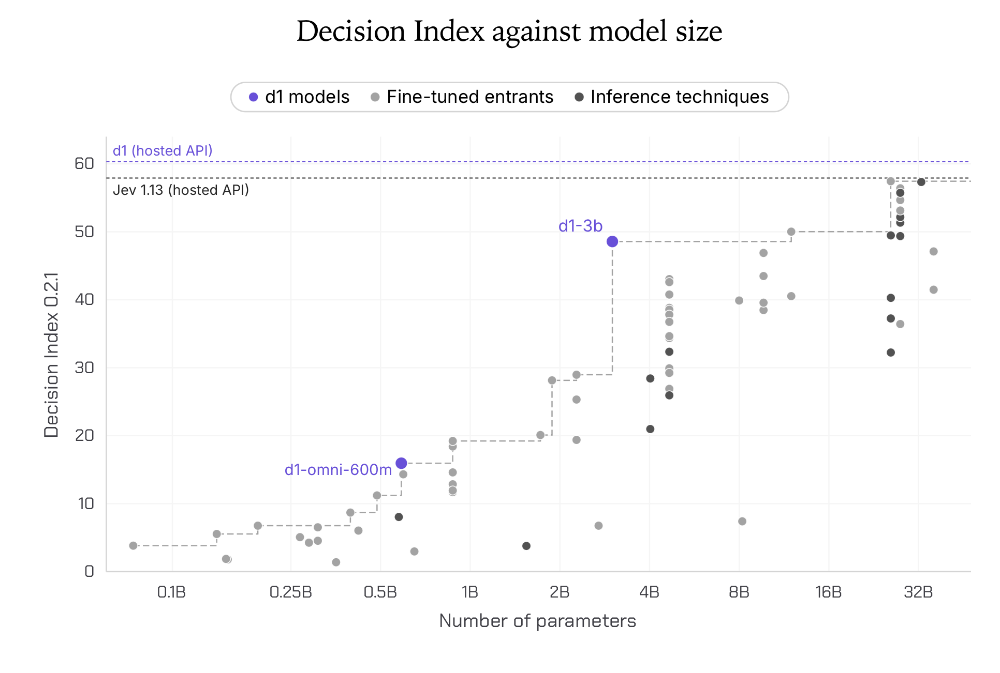
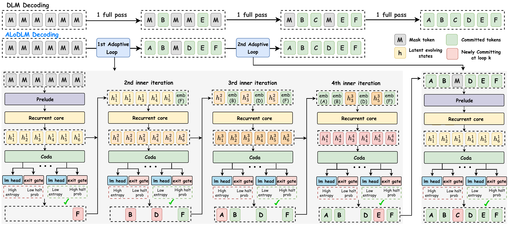

# 开源模型：六个不同的部署与研究取舍

本栏包含开放权重与研究实现，**开放程度和商业条件并不相同**。优先近 7 天，9 月 29—30 日的两项标明近期补充。所有模型均未在本机加载；性能来自模型卡或作者实验，热度待验证。

| 对象 | 输入 → 输出 | 主要门槛 |
| --- | --- | --- |
| d1-3B | 文本/图像 → 类型化决策 | 自定义代码、条件许可 |
| Interfaze 1 Lite | 多模态文件 → 结构化结果 | 多组件、80GB GPU 示例 |
| ALoDLM | 文本 → 自适应扩散生成 | 非商业权重、GPU 路径 |
| Kitten TTS 2 | 文字/参考音频 → 语音 | 社区许可、声码器额外开销 |
| Spotlight VM | 程序状态 → 执行步骤 | 研究型、整数运算 |
| Saluki 27B | 提示 → 工具调用/文本 | GGUF 文件之外仍需缓存 |

## 01 · d1-3B：为有限选项直接打分

2026-10-05｜LFM Open License 1.0｜验证：模型卡、许可与发布文件。

d1-3B 接收文字或图像，把问题限制为真假、选项或评分，一次前向计算给出结果，不必先生成一段解释再从中提取答案。它适合路由、过滤、优先级判断；3.12B 参数和 32K 上下文也不等于能够承担任意开放式推理。模型卡把同系列 d1-omni 作为不同规模选择，本期按一个系列计数。

为什么现在看：10 月 5 日公开的权重为“少生成、多决策”提供了本地实现路径，属新近实用。作者给出的 Decision Index 分数以及 RTX 4090 预热、编译后的延迟是特定任务与配置结果；不能把毫秒级单次计算当成整条应用链路耗时。归一化后的选项概率也不保证在你的样本上已校准。

上手依赖 Transformers 5.14 或更新版本、torchvision 与 Pillow，并使用仓库自定义模型代码；启用 `trust_remote_code` 前应审阅实现。开放的是权重和推理接口。LFM Open License 1.0 带商业使用条件及年营收门槛，不等同于 Apache/MIT。本文核对模型卡与许可，未加载权重。

[模型卡与权重](https://huggingface.co/LiquidAI/d1-3B)

读图：横轴为参数量（对数尺度），纵轴为作者的 Decision Index。紫色 d1-3B 才对应这里的开放模型；图上更高的 d1 是另一服务，不能把它的成绩套给 3B。该图不证明概率已经校准。Liquid AI 模型卡原图，按 LFM Open 1.0 引用，许可文本随图保存（[来源原图](https://huggingface.co/LiquidAI/d1-3B)；[查看原尺寸](images/d1.png)。）

## 02 · Interfaze 1 Lite：把多个专业组件装进同一调用入口

2026-10-03｜Apache-2.0 原创部分；组件各自许可｜验证：模型卡、许可与发布文件。

Interfaze 1 Lite 是一个模型与专用工具的组合：视觉语言核心负责理解或安排任务，OCR、版面、语音识别、说话人区分、分割和时间序列组件负责对应工作。输入一份扫描报告时，目标是先取得结构化文本与布局，再供后续回答使用；直接指定任务也可以绕开规划步骤。

10 月 3 日公开这一较小部署组合，属新近实用。官方最小部署示例仍使用一张 80GB H100，并需要 Python、CUDA 环境和 ffmpeg。它不是普通笔记本上的轻量单文件模型；缺少某些加速依赖时，OCR 可能明显变慢。模型卡的结构化输出比例及多项基准是作者测得，本期没有运行文档解析任务。

许可必须拆开读：项目原创部分是 Apache-2.0，但打包组件还包括 MIT、CC BY 4.0、Llama 3.2 Community License 与修改版 OpenRAIL 条款。不能因为主要核心是 Apache 就把整套权重称为无限制商业开源。适合愿意维护多组件运行栈的文档/多模态应用团队。

[模型卡与权重](https://huggingface.co/interfaze-ai/interfaze-1-lite)

## 03 · ALoDLM：还没确定的 token，可以继续在内部迭代

2026-10-02｜CC-BY-NC-4.0｜验证：模型卡、许可与发布文件。

ALoDLM 将扩散式文本生成与自适应循环结合。普通扩散模型反复做完整前向以填入空位；这里尚未决定的位置可以保留隐状态继续迭代，由停止门和不确定性条件决定何时提交 token。已公开的 1.7B 与 8B 属于同一方法系列，本期合并介绍。

新近创新的依据是可下载权重、推理实现及质量/速度对照。8B 在作者 11 项测试平均分中为 80.3，对照 Qwen3-8B 为 78.5；这组质量测试使用每次只提交一个 token 等明确设置。高吞吐配置采用不同的并行提交方式，不能把两个设置的最好数字拼在一起，宣称同时无损提速。

最优化路径要求 Linux、Python 3.12 和支持 BF16 的 GPU，作者测试包含 A100 40GB；较通用路径使用 PyTorch 2.8、Transformers 4.56.1，CPU 可运行但会慢。权重 CC BY-NC 4.0 限非商业，代码另看 Amazon Science 仓库许可。新发布不等于已经形成持续热度；本文按 10 月 2 日原日期列入，未本机推理。

[模型卡与权重](https://huggingface.co/amazon/ALoDLM-8B)

读图：灰色 M 是未填位置，绿色是已提交 token；底部循环说明“继续内部计算”和“提交输出”可以分开。速度取决于停止与提交条件。Amazon 作者原图，CC BY-NC 4.0，未裁切（[来源原图](https://huggingface.co/amazon/ALoDLM-8B)；[查看原尺寸](images/alodlm.png)。）

## 04 · Kitten TTS 2：语音克隆还要算上声码器的体积

2026-09-30｜Stellon Labs Community License｜验证：模型卡、许可与发布文件。

近期补充，原日期 9 月 30 日。Kitten TTS 2 由约 1.7B 的语音语言模型生成 S3 语音 token，再经声码器输出 24kHz 音频。模型卡提供 47 个声音和以短音频作参考的声音克隆路径；参考片段需要有使用授权，不能把演示声音质量推广到所有录音条件。

这次的实用点是可选权重与声码器组合。表中主模型有约 954MB 的打包版，另有更小、会损失信息的量化版；声码器还要另算，主模型文件大小不是总内存需求。Python 3.10 与 torch 是起点，按 `kittenml` 文档安装；非英语输入还需注意关闭面向英语的文本归一化设置。

权重使用 Stellon Labs 社区许可：有限的免费商业使用要求年度收入和累计融资等条件均满足门槛，不能把代码的 Apache-2.0 许可套到权重。属于新近实用，依据官方音频接口、组件表和许可；本站未生成或主观评测声音，也没有可核验的近期下载增长。

[模型卡与权重](https://huggingface.co/KittenML/kitten-tts-2)

## 05 · Spotlight VM：一个手工构造的 Transformer 执行器

2026-09-29｜Apache-2.0｜验证：模型卡、许可与发布文件。

近期补充，原日期 9 月 29 日。Spotlight VM 的特别之处在于它不是经过大规模训练的聊天模型：作者手工构造了不到 10 万参数的 Transformer，使其执行类似 Python 虚拟机的步骤，并把程序状态放在显式记忆中。开放包包含权重、相关记忆文件和运行实现。

如果你想理解“网络能否严格实现一个程序执行过程”，它是很具体的研究材料；如果想让模型自由生成高质量答案，它就不是合适替代品。当前强调整数运算，不支持一般浮点计算。作者报告 C99 单核运行速度和若干程序例子，这些是其实现的特定 token 计数，不能与聊天模型 token/s 直接比较。

新近创新的依据是固定构造与可运行实现，而非热度。上手可从模型卡所连的 C 运行器和小型整数程序开始，依赖编译器及相应权重/记忆文件；Apache-2.0 许可已核对。本站没有执行该虚拟机，复杂例子的正确性仍以作者给出的程序条件为限。

[模型卡与权重](https://huggingface.co/percepta-ai/spotlight-vm)

## 06 · Saluki 27B：压到 8GB 文件以内，工具调用保留多少

2026-10-08｜Apache-2.0｜验证：模型卡、许可与发布文件。

Saluki 将 Qwen3.8-27B 做成 7.89GB 的混合低比特 GGUF，面向已有 llama.cpp 工具链；图像输入还要另外下载约 0.6–0.9GB 的视觉投影文件。这里的 8GB 是主文件大小，运行时上下文缓存、系统和视觉组件另占内存。

10 月 8 日公开，属于新近实用。作者在固定的 120 个 BFCL v4 子任务上报告通过 88 个，对照全尺寸模型为 84；100 个并行调用任务为 42 对 35。这些都是小样本，不能据此宣称量化全面优于原模型。作者也明确数学成绩有下降，且部分公开基线使用不同测试框架，不适合把所有成绩合成一个可靠的“96%保留率”。

最小路径是下载 GGUF，以 `llama-server -m … --jinja` 启动，并按硬件设置上下文和 GPU 卸载。工具调用模板与 thinking 开关会影响结果；接口兼容并不免除格式检查。Apache-2.0 及上游来源已核对，未在本站加载。热度待验证，不用当天下载数代替实际用户采用。

[模型卡与权重](https://huggingface.co/ConwayResearch/Underdog-Saluki-27B-1.0)
