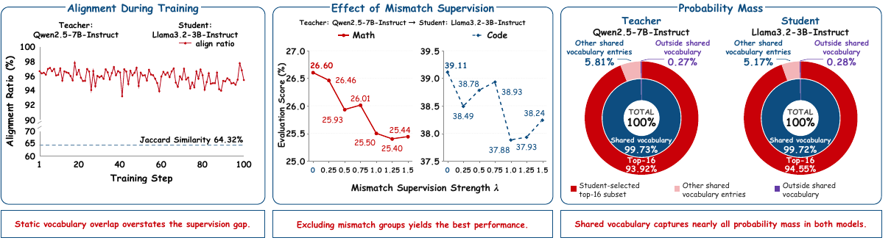
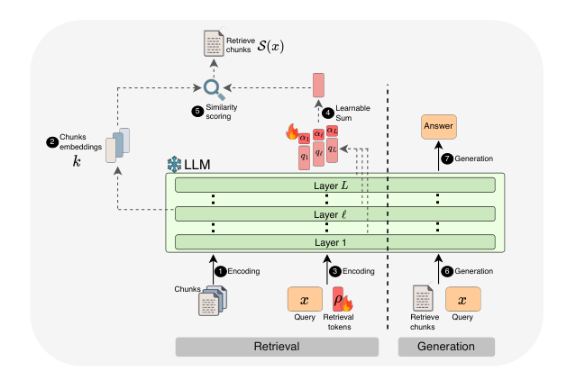
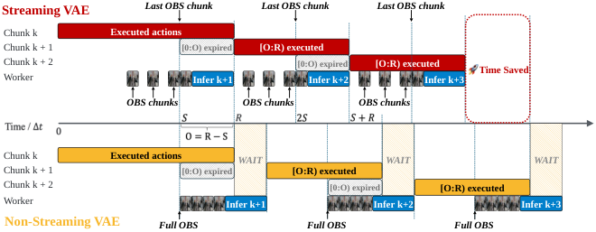

# 论文精选：从结果分数回到实现条件

比较了 14 篇近期候选后，选出以下 6 篇。均按 arXiv v1 预印本处理，未把作者实验写成独立复现；入选依据为新近创新或实用价值，**热度待验证**。研究、实现和模型权重按对象去重。

## 01 · 跨分词器蒸馏：监督更多位置，不一定学得更好

2026-10-06｜arXiv 2610.08448v1｜新近创新，作者实验；本站未复现。

当教师和学生用不同分词器时，同一句话切出的 token 可能对不上。常见直觉是尽量补全这种对齐；本文反问：新增的监督是否可靠？作者先只保留一一对应的位置，再在双方共享词表里计算蒸馏损失，甚至把每个位置限制为学生选出的 top-16 个候选。

研究使用三个教师—学生组合，覆盖 Qwen、Llama、Granite 与 Phi，训练提示共两万条，数学和代码各一万。三个组合中，一一对齐已覆盖约 85.6%—97.0% 的学生 token；词表表面差异并不等于真实生成位置同样缺乏监督。top-16 方案保留了完整共享词表方案至少 96% 的提升幅度。注意这是“提升保留比例”，不是准确率达到 96%。

作者还加入跨跨度概率的均方误差，试图覆盖所有不匹配位置；18 组正权重设置都降低了相应成绩。梯度方向与大小的诊断提示这些监督可能冲突，但这还不是对所有蒸馏方法的因果证明。新近创新的价值是给出更节制的损失设计：先检查可靠性，再追求覆盖。未发现已核实的作者训练仓库，本站未复现。

[原文](https://arxiv.org/abs/2610.08448v1) · [站内阅读卡](../../../../papers/frontiers/2610.08448/00-阅读卡.md)

[站内 PDF](../../../../papers/frontiers/2610.08448/2610.08448v1.pdf)

看左图的实际对齐率，再看中图增加不匹配监督后的变化；右图说明共享词表保留了大部分概率质量。Bingxi Hou 等，原文 Figure 1；从 PDF 第 1 页裁切图区，未改数字、轴线或图例，完整原图和图注见站内 PDF。（[来源原图](https://arxiv.org/abs/2610.08448v1)；[查看原尺寸](images/paper-opd.png)。）

## 02 · TRACE：让 FP4 训练看见 rollout 时真正发生的量化

2026-10-06｜arXiv 2610.07767v1｜新近创新，作者实验；本站未复现。

强化学习中的 rollout 用模型生成轨迹，训练再依据轨迹更新参数。把前者压成 FP4 后，问题不仅是位数变少：两条计算路径可能把相近数值舍入到不同的离散值，训练优化的行为便偏离实际采样行为。TRACE 保存 rollout 的量化码与尺度，用它们引导训练侧选择更接近的量化值。

论文给出局部量化差异的论证，并在四个 MoE 模型/任务配置上比较。一个 35B-A3B 数学推理配置中，TRACE 平均分 75.3，与 BF16 对照相当，而普通 QAT 为 68.8。局部舍入误差的控制不等于对整个网络优化效果的无条件保证。

工程成本需要分开算。作者在 4 个 GB200 的 rollout 测试中报告最高 5.4 倍加速；另一个 72 个 GB200 的端到端步骤比较中，加入 TRACE 后从 664 秒变成 713 秒，即相对普通 FP4 增加约 7.4%。缓存、传输与训练不是免费的，不能把 rollout 的最佳加速比写成端到端训练加速。

新近创新来自训练与采样路径对齐的实现思路和多配置对照。适合研究低精度 RL 系统的读者；没有核实到可直接复现的作者代码发布，普通单卡环境也不对应论文的集群条件。本文依据原文，未训练。

[原文](https://arxiv.org/abs/2610.07767v1) · [站内阅读卡](../../../../papers/frontiers/2610.07767/00-阅读卡.md)

## 03 · UNREAL：用同一模型的隐状态做检索，再用它回答

2026-10-06｜arXiv 2610.08463v1｜新近创新，作者实验；本站未复现。

UNREAL 想减少“外部神经检索器找到的东西，与生成模型真正需要的东西不同”这一隔阂。它冻结语言模型，从模型内部不同层取表示，再学习少量检索 token 和层混合系数；同一个模型先用于编码、检索，随后读回选中的片段生成答案。

这并不是完全没有检索系统。实验仍使用 BM25 初始上下文、离线分块索引和 MaxSim 相似度计算，学习参数不到 50 万也不代表整个系统只有这点存储或计算量。其大规模库约有 2,100 万个文本块，来自约 30 亿 token 的维基百科数据。

在固定 Nemotron 生成器、取回五个片段的主表条件下，HotpotQA 的精确匹配率由强检索/重排对照的 43.3 提高到 52.6，2Wiki 由 31.4 到 42.0，MuSiQue 由 13.2 到 16.9。检索召回率是另一组指标，不能与答案精确匹配率混用。长上下文实验还包含人工填充干扰片段，不等于任意自然长文阅读。

新近创新在于让表示服务于同一生成模型，并用对照检验收益。代价包括索引、额外编码和多次调用；截至本期未核实作者实现仓库。可从小规模语料尝试研究这种检索表示，但本文未复现训练或问答结果。

[原文](https://arxiv.org/abs/2610.08463v1) · [站内阅读卡](../../../../papers/frontiers/2610.08463/00-阅读卡.md)

[站内 PDF](../../../../papers/frontiers/2610.08463/2610.08463v1.pdf)

先看左侧用同一冻结 LLM 编码文本块，再看中间少量可学习的检索 token 和层组合；右侧才是读回片段后生成答案。Edan Kinderman 等，原文 Figure 2，CC BY 4.0，未修改。（[来源原图](https://arxiv.org/abs/2610.08463v1)；[查看原尺寸](images/paper-unreal.png)。）

## 04 · SafeAct：会回答风险问题，不等于会在行动前查证

2026-10-06｜arXiv 2610.07753v1｜新近创新，作者实验；本站未复现。

SafeAct 把安全评测放到工具执行轨迹里。系统用明确的证据账本记录：证据属于哪个实体、状态是什么、来自哪里；模型只有先取得符合要求的证据，后续行动才算合规。例如两笔同金额交易，第一笔的核查记录不能自动授权对第二笔操作。

基准包含 656 个案例、六个领域和五种协议，从静态问题延伸到单步、连续动作与依赖链。十种模型与运行框架组合的表现不同；评测对象因此是模型加框架，而不是脱离工具环境的模型排行榜。判定以确定性的轨迹检查为主，不用模型隐藏思考来充当行动证据。

一个协议中的提前行动比例在已尝试行动的样本里达到约 37%—66.9%。这不是“全部任务的失败率”，分母不能丢。论文也发现取得决定性证据之后，许多配置的条件成功率很高；但那已筛掉了没拿到证据的失败案例，不能反过来说明整体可靠。

新近创新是把“是否在正确时刻、凭正确证据行动”做成可检查协议。静态回答与交互行动差距值得关注，但实验仍是构造环境。部分框架改动收益的置信区间包含零，不能宣称统一修复有效。本文读了方法、协议与结果，未找到可核实的完整公开实现，未本机复现。

[原文](https://arxiv.org/abs/2610.07753v1) · [站内阅读卡](../../../../papers/frontiers/2610.07753/00-阅读卡.md)

## 05 · Long-WAM：更长历史与更短控制等待，要同时处理

2026-10-07｜arXiv 2610.10528v1｜新近创新，作者实验；本站未复现。

机器人需要历史画面来理解任务进度，却又不能一直等新预测。Long-WAM 以长上下文因果视频预训练为基础，再连接世界—动作模型；动作侧利用历史与未来视频潜变量。推理中结合流式 VAE、异步重叠、缓存和低精度视频计算，让观察编码、预测与执行尽量重叠。

历史并非越长越好：论文一组上下文比较中，19.2 秒历史的成功率为 78.7%，38.4 秒为 75.2；更长输入也增加延迟。原文对较短历史基线的文字、表格存在不一致，本期不引用那组基线差值，保留可直接核对的条件与结果。

在 RTX 5090 的指定 V4A4 配置中，优化后延迟由 356 降至 107.4 毫秒，同时成功率由 94.4% 变为 93.5%；这是具体配置的速度/效果取舍。真实 Unitree G1 的移动抓取和堆叠任务各只有 20 次试验，例如 7.5cm/s 传送带抓取为 18/20，不能推广成所有动态环境成功率 90%。

新近创新在于把长历史和实时执行放在同一系统里检验。[官方实现](https://github.com/NVlabs/LongLive/tree/main/Long-WAM)指向 NVlabs/LongLive 的 Long-WAM 目录；预训练使用大量 H100 计算，适应阶段也需多卡。本站未训练或控制机器人，这不是笔记本可复现的完整训练教程。

[原文](https://arxiv.org/abs/2610.10528v1) · [站内阅读卡](../../../../papers/frontiers/2610.10528/00-阅读卡.md)

[站内 PDF](../../../../papers/frontiers/2610.10528/2610.10528v1.pdf)

上半部分是流式观察与执行重叠，下半部分等待完整观察，黄色 WAIT 表示等待段。Wei Huang 等，原文 Figure 3，CC BY 4.0；图是作者时序示意，不是本站测得的控制轨迹。（[来源原图](https://arxiv.org/abs/2610.10528v1)；[查看原尺寸](images/paper-wam.png)。）

## 06 · DuoMatching：视频老师管时间，图像老师补画面

2026-10-02｜arXiv 2610.03543v1｜新近创新，作者实验；本站未复现。

少步视频生成希望减少迭代次数，但同时保持运动和单帧画面。DuoMatching 用视频教师学习联合的时序分布，用图像教师约束单帧边缘分布。两套教师的潜空间不同，作者用 LatentBridge 把压缩的视频潜变量映射到对应帧的图像潜变量，再按变化程度采样帧。

在匹配的每帧两次函数评估设置下，VBench 从 CausalForcing++ 的 80.67 到 83.53；但动态程度指标从 94.44 到 93.61。画面与整体指标改善，不代表每一项运动指标也改善。与直接使用不匹配潜变量或完整解码再编码的对照，支持了桥接设计的价值。

桥接本身有开销：对应显存表中，从基线的 56.49GB 到 59.41GB。23 位参与者每人做 40 组比较的用户研究，整体偏好为 80.87%，时序一致性偏好却为 49.57%。两项结论应同时读，不能只保留最大的百分比。

新近创新是把图像教师的单帧知识接入视频蒸馏，并给出潜空间桥接消融。原文版本为 10 月 2 日 v1；截至本期未核实可直接运行的作者实现，结果仍是作者实验。复现时应固定教师、采样预算与推理步数，重点核查画面收益是否以运动退化为代价。

[原文](https://arxiv.org/abs/2610.03543v1) · [站内阅读卡](../../../../papers/frontiers/2610.03543/00-阅读卡.md)
