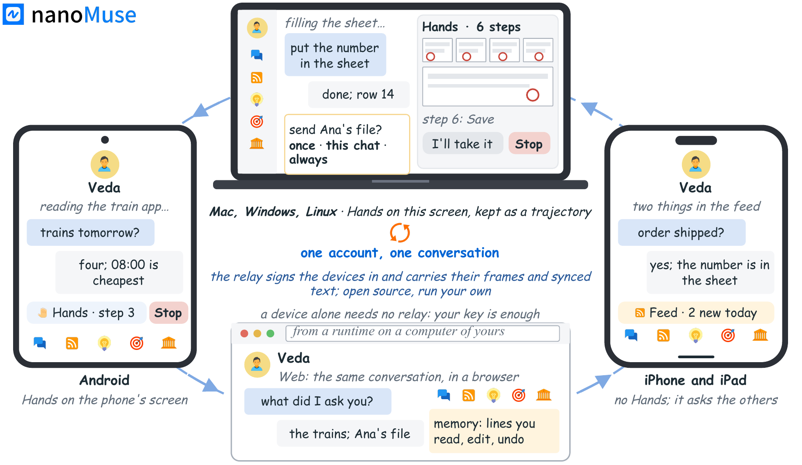
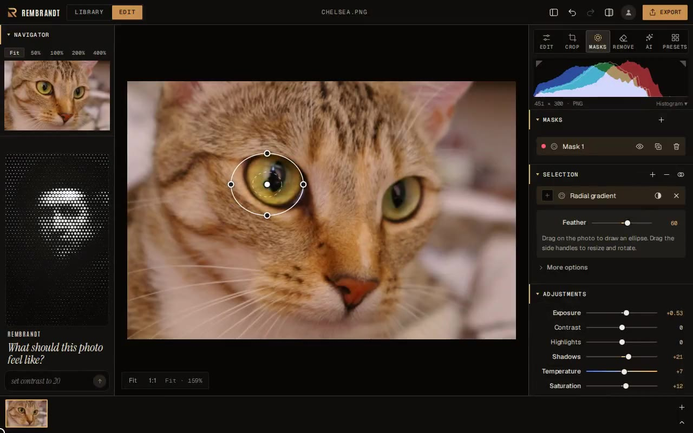
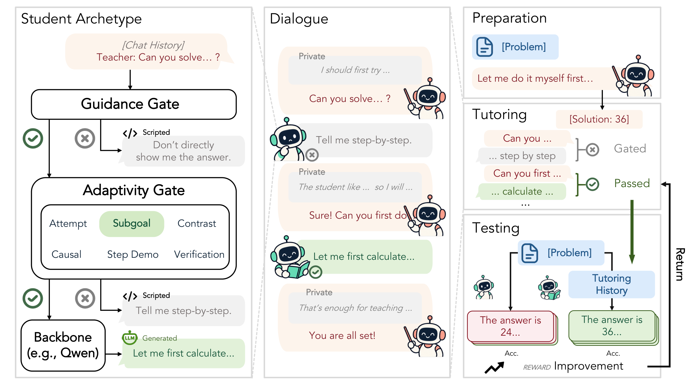
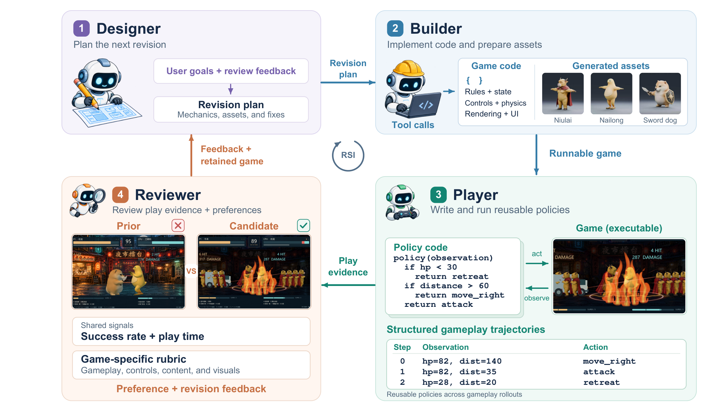

# 开源项目：从输入资料到可检查的产出

本期十项均核对了规范仓库、许可、README 与实际实现文件。**除技术实践中的独立合成实验外，本站未安装或运行这些项目**；下面的功能表现依据作者演示、版本记录和静态代码，热度均待验证。

| 任务 | 工具 | 先准备什么 |
| --- | --- | --- |
| 跨设备整理资料 | nanoMuse | 支持的设备、模型服务 |
| 图片预处理 | Rembrandt | 本地 GPU 与图片 |
| 借用远程计算 | rGPU | 可连接的远程 NVIDIA GPU |
| 有状态 Agent 后端 | Durable Actors | Node.js / Bun 与后端 |
| 只读检查集群 | k10s | 示例模式或 kubeconfig |
| 辅导模型训练 | Sherpa | 多 GPU 与训练数据 |
| 可玩的游戏原型 | Recursive Game Creator | Docker、模型登录 |
| 浏览器视觉任务 | WebFovea | 浏览器与模型 API |
| 可编辑几何重建 | CADFather | Linux、多卡和模型 |
| 图像数据筛选 | photoc | 照片目录、终端 |

## 01 · nanoMuse：手机与电脑之间接续一项任务

2026-10-09｜新近实用｜验证：作者材料与静态代码；热度待验证。

nanoMuse 将聊天、手机操作和桌面执行接在同一任务里，例如在手机上提出资料整理要求，再由电脑处理本地文件。与单端聊天窗口相比，价值在于任务上下文与执行设备可以衔接；可用动作仍取决于设备和授权，不能将作者架构图当成隐私保障的独立证明。

仓库始于 9 月 23 日，9 月 25 日有预览；现在值得看的是北京时间 10 月 9 日的 v1.0.0 Keel。Android 路径要求 Android 8+、arm64；桌面覆盖 macOS、Windows、Linux。iOS 的 TestFlight 仍待开放，不能当作功能齐备的已发布客户端。按 Releases 安装、配置模型服务，再从需要人工批准的小任务开始；自托管还需 Docker。代码中的通知处理区分单次批准与持续授权。本期核对了实现和作者演示，未接管任何设备。

作者架构示意把手机与电脑的本地执行放在会话两端；它解释任务如何跨端接续，不是真实操作截图，也不构成数据保密性测试。nanoMuse 项目原图，GPL-3.0-or-later，未改动。（[来源原图](https://github.com/nano-muse/nanoMuse)；[查看原尺寸](images/muse.png)。）

[规范仓库与上手说明](https://github.com/nano-muse/nanoMuse) · [GPL-3.0-or-later](https://github.com/nano-muse/nanoMuse/blob/main/LICENSE) · [实现核验位置](https://github.com/nano-muse/nanoMuse/blob/28edfc29002c0fa8f039a195275563267e19e46f/android/src/android/app/src/main/java/io/github/nanomuse/guard/RiskApprovalNotifier.kt)

[发布记录](https://github.com/nano-muse/nanoMuse/releases)

## 02 · Rembrandt：在本地 GPU 上整理与编辑研究图片

2026-09-29｜新近实用｜验证：作者材料与静态代码；热度待验证。

近期补充：仓库创建于 9 月 29 日。Rembrandt 提供本地 GPU 图像编辑、RAW 处理和局部蒙版，适合为实验演示、数据集检查或文章制作调整图片。输入原始照片，输出编辑版本与可继续修改的设置；相比云端上传编辑，它将主要处理放在本机。自然语言式命令使用词汇解析，并非一个通用 LLM 助手。

最小路径是下载对应 macOS、Windows 或 Linux 的发布包，导入照片，创建蒙版后预览导出；GPU 与格式支持以当前构建为准。本次核对管线代码中的多阶段 uniform、曲线 LUT 和去雾参数，及作者的实际界面，未本机安装。核心无需账号，另有可选的云同步服务，服务条款不能套用核心代码许可。新近实用依据是可操作界面和公开处理管线；尚无独立的近期使用增长或画质对照。

看猫眼附近的圆形范围：这是作者展示的径向蒙版界面，帮助理解局部调整的作用区域，不能标成深度分割结果。thesnarkitecht / Rembrandt 原始界面图，GPL-3.0，未裁切。（[来源原图](https://github.com/thesnarkitecht/rembrandt)；[查看原尺寸](images/rembrandt.jpg)。）

[规范仓库与上手说明](https://github.com/thesnarkitecht/rembrandt) · [GPL-3.0](https://github.com/thesnarkitecht/rembrandt/blob/main/LICENSE) · [实现核验位置](https://github.com/thesnarkitecht/rembrandt/blob/409bedf35b15bd79095a9942456017ec753aff84/engine/src/pipeline.js)

## 03 · rGPU：保留本地 Python，把张量运算交给远程 GPU

2026-09-11｜新近实用｜验证：作者材料与静态代码；热度待验证。

近期补充：仓库创建于 9 月 11 日，10 月 7 日有作者的 Show HN 演示。rGPU 为 PyTorch 增加远程设备路径，Python 程序仍在本机，相关张量与 CUDA 运算转到有 NVIDIA GPU 的服务器；另提供 Linux CUDA 转发方式。适合已有远程显卡、希望少搬动应用环境的开发者，网络往返仍会影响小算子密集任务。

按 README 安装 `rgpu`，先准备远程 CUDA 环境，再通过 `rgpu-run --host user@machine` 运行小例子；PyTorch 代码需要按其设备接口调整，不能承诺所有 CUDA 库直接兼容。已核对服务端真实 CUDA、cuBLAS、cuDNN 调用分派，不只是界面原型。原生协议没有完整认证加密，使用作者支持的 SSH 路径并限制端口暴露。新近实用，依据作者例子和实现；本站未连接 GPU，未复现吞吐。

[规范仓库与上手说明](https://github.com/ymcrcat/rgpu) · [Apache-2.0](https://github.com/ymcrcat/rgpu/blob/main/LICENSE) · [实现核验位置](https://github.com/ymcrcat/rgpu/blob/a1d63cacd9374bb183dff407452b91f3fc681581/server/main.cpp)

## 04 · Durable Actors：连接留在网关，空闲执行实例可以休眠

2026-10-04｜新近实用｜验证：作者材料与静态代码；热度待验证。

这不是新建仓库：项目始于 8 月 30 日。本次选的是北京时间 10 月 4 日 v0.7.10 的实质变化：WebSocket 保留在网关，空闲 actor 沙箱可以关闭，下条应用消息再唤醒替代实例。随后 v0.7.12 加入 SQLite WAL 捕获与恢复。它把持续连接、执行生命周期和持久状态拆开，适合多人共享聊天或长任务后端。

输入是 actor 方法调用与消息，输出是持久状态及向客户端流式广播。示例通过 `@Persisted` 保存会话，并显式控制等待期间能否处理其他调用。需 Node.js 22.19+、Bun 1.3.9+；可从 `npx durable-actors init`、本地 `dev` 和客户端生成开始，部署仍需自己的后端。相关版本升级要同时匹配 runtime 与 SDK；早期容量测试不是最终发布提交的独立压测。新近实用，核对版本记录和聊天示例，本站未部署或做崩溃恢复测试。

[规范仓库与上手说明](https://github.com/TerseAI/durable-actors) · [MIT](https://github.com/TerseAI/durable-actors/blob/main/LICENSE.md) · [实现核验位置](https://github.com/TerseAI/durable-actors/blob/924e5cd1ed87607e3e04e5eb29e20d335e733670/examples/ai-chat/src/actors.ts)

[实质变化：v0.7.10](https://github.com/TerseAI/durable-actors/releases/tag/v0.7.10) · [WAL 恢复：v0.7.12](https://github.com/TerseAI/durable-actors/releases/tag/v0.7.12)

## 05 · k10s：把只读模式落到 Kubernetes 请求层

2026-10-09｜新近实用｜验证：作者材料与静态代码；热度待验证。

k10s 是 Go 编写的 Kubernetes 终端界面。仓库始于 8 月 26 日，本次新增价值来自北京时间 10 月 9 日的 v0.1.7：只读模式既隐藏编辑、删除等动作，又在各客户端的 transport 中拒绝写请求，连可能通过 GET 建立的 exec、port-forward 和代理入口也另外拦截。它适合查看训练集群状态而减少误操作。

先用 `k10s demo --readonly` 熟悉示例数据，再以自己的 kubeconfig 运行 `k10s --readonly`；演示模式不等于已经连接真实集群。发布包或 Go 工具链二选一，源码构建需相应 Go 1.26 环境。可选 AI 功能另需端点与凭据，使用前核对将发送的上下文。此模式不改变 kubeconfig 本身的权限，外部插件和编辑器自行发出的请求也不受它兜底。新近实用，已静态核对实际拦截代码；未操作本机或远程集群。

[规范仓库与上手说明](https://github.com/p10node/k10s) · [Apache-2.0](https://github.com/p10node/k10s/blob/main/LICENSE) · [实现核验位置](https://github.com/p10node/k10s/blob/227fed8d5381e11e6baa283db7d4c6d3bb5bfa2c/internal/k8s/readonly.go)

[发布记录](https://github.com/p10node/k10s/releases)

## 06 · Sherpa：用学生的后续表现训练辅导模型

2026-09-30｜新近实用 / 新近创新｜验证：作者材料与静态代码；热度待验证。

Sherpa 面向辅导模型研究：教师先给学生提示，再根据学生能否继续推进和最终作答来计算奖励，而不只让教师给出看起来像教学的长解释。公开实现将教师调用、学生反馈与训练循环连起来，适合比较“直接告知答案”和“帮助学生完成下一步”的差异。

仓库于 9 月 30 日公开，近期补充；10 月的新论文给出配套实验，代码与论文只在本栏合并介绍。环境基于 AReaL、Linux 与 CUDA；示例使用 8B 教师、1.7B 学生和多 GPU，不能按普通聊天插件理解。先检查环境与任务数据，再运行提供的训练入口。作者的数学任务改善主要针对模拟学生，人工偏好评分也不是现实学生学习成绩的直接测量。新近创新，已核对训练调用和作者实验说明，尚无本期独立复现；不建议日报读者直接启动重型训练。

从左到右看教师提示怎样影响学生后续行为，再由学生轨迹形成反馈。下方不同约束对应“给帮助”与“过早给答案”的取舍。SALT-NLP 作者方法图，Apache-2.0，未改动；图中效果属于作者实验。（[来源原图](https://github.com/SALT-NLP/Sherpa)；[查看原尺寸](images/sherpa.png)。）

[规范仓库与上手说明](https://github.com/SALT-NLP/Sherpa) · [Apache-2.0](https://github.com/SALT-NLP/Sherpa/blob/main/LICENSE) · [实现核验位置](https://github.com/SALT-NLP/Sherpa/blob/23e2a47c2c84fe59a087258a29d931b801a72fd5/examples/sherpa/core/callers.py)

## 07 · Recursive Game Creator：让游戏生成带上试玩和复查

2026-10-08｜新近实用 / 新近创新｜验证：作者材料与静态代码；热度待验证。

输入一个玩法目标，Recursive Game Creator 组织 Designer、Builder、Player、Reviewer 四种角色，输出可运行游戏、试玩轨迹及评审材料。Player 使用可复用的程序化操作策略，而非每一帧都让大模型看图作答；新一轮可根据试玩与评审修改游戏。公开代码于北京时间 10 月 8 日建立，属于新近公开的方法实现。

项目支持 HTML 和 Godot 路线。最小实验仍需 macOS/Linux、Node.js 22、Docker Compose/Buildx、Python 3.12，真实模型运行需要 Codex 登录等配置；mock 模式可以检查流程，但不能证明真实生成质量。实现中可以看到命令执行、取消、日志以及角色任务衔接，产出保存在运行目录便于复查。新近实用与创新的依据是把生成与实际试玩反馈连接，本站未生成游戏；最终素材、模型服务和生成内容的权利还需各自核对。

四个角色围绕可玩的产出反复迭代，关键区别是 Player 产生试玩材料再交给 Reviewer。IMBALDY 团队方法原图，MIT 许可文本随附；仅引用完整方法图，图内游戏素材不作为独立可复用素材授权。（[来源原图](https://github.com/IMBALDY/RecursiveGameCreator)；[查看原尺寸](images/gamecreator.png)。）

[规范仓库与上手说明](https://github.com/IMBALDY/RecursiveGameCreator) · [MIT](https://github.com/IMBALDY/RecursiveGameCreator/blob/main/LICENSE) · [实现核验位置](https://github.com/IMBALDY/RecursiveGameCreator/blob/8284caeac655e8c6c08354a759b97b1599d426fd/src/game_agent_lite/agent.py)

## 08 · WebFovea：把截图、点击位置和网页反馈对齐

2026-10-07｜新近实用｜验证：作者材料与静态代码；热度待验证。

WebFovea 接收网页任务，通过截图选择点击或悬停位置，再读取动作反馈。公开控制器包括坐标解析与对齐、必要的 DOM 回退、iframe 处理和等待页面稳定等步骤，适合研究视觉 Agent 为什么会点错、何时应重新观察。输入任务 JSON，输出运行记录、截图与动作结果，比只看最终成败更方便定位错误。

新近实用之处是 10 月 7 日公开了实现。论文提到的比赛发生在 8 月底至 9 月初，那些成绩不是本周重新测试。上手需要 Python 3.10+、Playwright/Chromium 以及配置好的模型 API，按仓库 `scripts/run_local.sh` 先运行示例任务。本文读取了浏览器控制实现，未执行网页操作；作者在特定任务和模型上的提升不保证迁移到任意站点，页面登录、变化和视觉定位误差仍然存在。

[规范仓库与上手说明](https://github.com/jianganghan/WebFovea) · [MIT](https://github.com/jianganghan/WebFovea/blob/main/LICENSE) · [实现核验位置](https://github.com/jianganghan/WebFovea/blob/4b75e10722e2f9c1c662f16dbb8319fe2a33188f/src/agent/web_controller.py)

## 09 · CADFather：把三角网格反推为可编辑 CAD 程序

2026-10-06｜新近实用 / 新近创新｜验证：作者材料与静态代码；热度待验证。

CADFather 接收 STL 网格，生成可执行的 CAD 程序与重建几何，再以几何误差指导修改。它把从零生成、已有程序修改和参数拟合组合起来，目标是获得能继续编辑的结构，而非只给另一张渲染图。10 月 6 日公开实现，配套论文在 10 月 7 日发布，属于新近实用与创新候选。

输出包括程序、STL 和评估指标。作者的完整路径需要 Linux、多张 H100、Qwen 模型及不同 Python/vLLM 环境；只通过 preflight 环境检查不等于已经完成重建。几何执行代码使用单独进程、超时终止与结构化错误回传，让失败的 CAD 调用可供代理修正。适合有计算资源、正在研究网格到参数化建模的人；本站只读实现和作者材料，未复现复杂零件，代码 MIT 也不覆盖所有模型权重的使用条件。

[规范仓库与上手说明](https://github.com/kulibinai/cadfather) · [MIT](https://github.com/kulibinai/cadfather/blob/main/LICENSE) · [实现核验位置](https://github.com/kulibinai/cadfather/blob/2ca0891e66b5c2c9c2f10243e84c874550d34514/agent/cad_agent/capabilities/execute.py)

## 10 · photoc：先在终端筛选照片，再交给模型处理

2026-10-07｜新近实用｜验证：作者材料与静态代码；热度待验证。

photoc 是照片处理 CLI，可在批量送入视觉模型前检查元数据、统计和整理文件。仓库始于 9 月 27 日；北京时间 10 月 7 日 v0.6.0 新增交互式 JPEG 审片：标记保留或拒绝，选择结果原子写入单独 JSON，原照片不变。它解决的是输入资料整理，核心不依赖 AI 模型或账号。

macOS/Linux 可按项目 Homebrew tap 安装，手动安装需 libexif、jpeg-turbo、libxml2；先执行 `photoc stats ./photos --recursive`，再用 `photoc review ./photos` 筛选。内联图片依赖支持的 iTerm2 协议，其他终端会退到文本显示；review 只支持 JPEG。重命名、移动等另有预览与 `--apply`，本文只核对代码中计划检查和应用边界，没有修改照片。新近实用依据是具体版本、交互演示和可检查的输出，不以总 Star 认定热门。

[规范仓库与上手说明](https://github.com/ahmetomerv/photoc) · [MIT](https://github.com/ahmetomerv/photoc/blob/main/LICENSE) · [实现核验位置](https://github.com/ahmetomerv/photoc/blob/5b28cd4e210868de2644bdb29580fdfe751ccf10/src/commands/rename.c)

[发布记录](https://github.com/ahmetomerv/photoc/releases)
