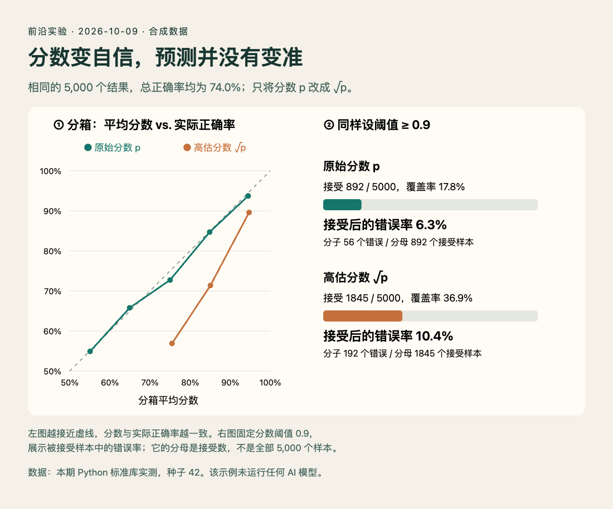

# 技术实践：用短 Python 程序检查决策阈值的分母

本期提到直接输出评分的决策接口和开放模型。拿到一个 0.9，首先要知道：它在你的任务上能否对应约九成的正确率？下面用合成数据演示这个问题。**本机已运行，Python 3.14.3，只有标准库；没有调用、下载或评测任何模型。**

[9 月 27 日的练习](../../09/2026-09-27/05-技术实践.md)用 20 个固定样本比较 Brier 与放行比例。本次继续到连续分数、分箱曲线和“相同接受数量”的对照：把阈值造成的变化，与排序能力的变化分开。

## 同样的预测，只改分数

生成 5,000 个样本，每个样本的真实正确概率 `p` 从 0.5 到 0.99 均匀抽取，再用它随机生成“这次预测是否正确”。保留相同的正确/错误结果，只制作两版分数：原始版用 `p`，高估版用 `sqrt(p)`。在 0 到 1 之间，平方根会增大数值，却没有改变任何预测。

随机种子固定为 42。原始分数来自已知生成概率，所以有校准的设计基础，但有限样本仍会产生偏差。高估版是人为构造的对照，不是对任何产品的判断，也没有拟合校准器。

## 用哪些数检查

- **覆盖率**：超过阈值、愿意自动接受的数量，除以所有样本数。
- **接受后的错误率**：被接受的错误数量，除以接受数量。接受数为 0 时结果应为“未定义”，不能填 0 表示完美。
- **分箱校准误差 ECE**：把分数分箱，计算每箱平均分数与实际正确率之差的绝对值，再按该箱样本数加权。它受分箱方式影响，不能单独证明可靠性。

本次使用 [0.5,0.6)、[0.6,0.7)、…、[0.9,1.0) 五个固定箱。实验只统计预测对错，没有讨论不同错误的代价。

## 实际运行与结果

下载到同一目录后运行：

```bash
python3 selective_risk.py
```

程序会在自身目录写出 `results.json`。这是可覆盖的实验输出文件；需要保留其他结果时，先复制脚本到独立目录。核心选择逻辑如下，完整实现包含空集处理和固定随机数生成：

```python
idx = [i for i, score in enumerate(scores) if score >= threshold]
wrong = sum(not correct[i] for i in idx)
coverage = len(idx) / len(scores)
risk = wrong / len(idx) if idx else None
```

| 统计项 | 原始分数 p | 高估分数 √p |
| --- | ---: | ---: |
| 全部样本正确率 | 74.0% | 74.0% |
| 阈值 ≥ 0.9 的接受数 | 892 | 1845 |
| 覆盖率 | 17.84% | 36.90% |
| 接受中的错误数 | 56 | 192 |
| 接受后的错误率 | 6.28% | 10.41% |
| 五分箱 ECE | 0.0086 | 0.1193 |

阈值同为 0.9，高估分数接收了更多样本，也纳入更多错误。注意 192/1,845 才是右栏的条件错误率；用 192/5,000 会低估自动接受部分的风险。



读图：左侧曲线接近虚线，表示该分数分箱的平均值接近真实正确率；右侧条形比较接受比例，文字明确列出错误率的分子和分母。制作方式：HTML/JS，数据来自本次实际执行的合成实验；不是模型实测成绩。图片需要精确对应 JSON 数值，因此没有用生成图绘制实验结果。[查看原尺寸](images/selective-risk.png) · [绘图源码](code/selective-risk.html) · [实际结果 JSON](code/results.json) · [Python 源码](code/selective_risk.py)。

## 怎样迁移到自己的任务

换成自己的验证集时，每条记录至少保留“分数、预测结果、人工标签”，再运行同样的分箱和阈值统计。标签必须来自实际任务；分类器的 softmax、模型口头写出的置信度和另一个评分器的分数，不能未经检验就当作同一种概率。

这里的变换是单调的。代码实际核对了两版各取最高分的 892 个样本：样本编号完全相同，均有 56 个错误，条件错误率都是 6.28%。差异来自固定数值阈值，不是排序能力突然变差。实际选择阈值还需要独立验证集、样本量与置信区间，以及错误成本。本次单种子合成例子仅解释分母与校准，不提供任何产品可直接采用的阈值。
