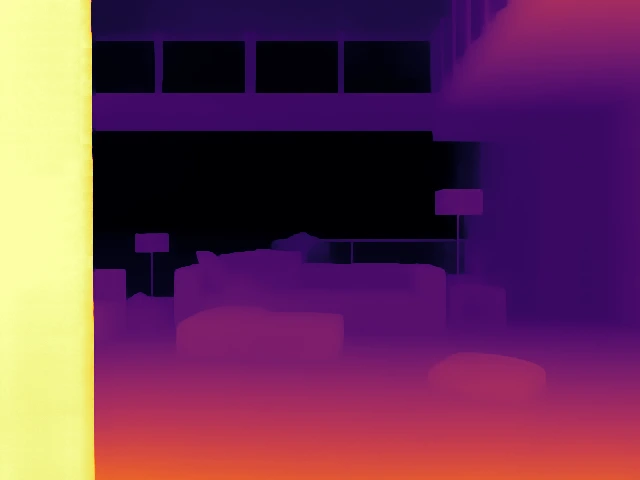
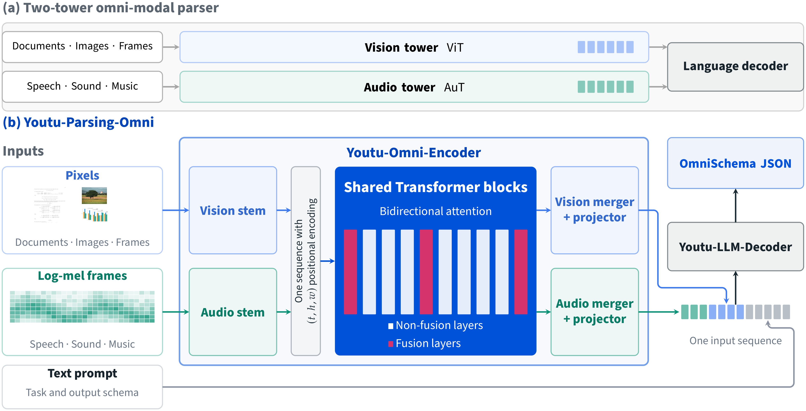
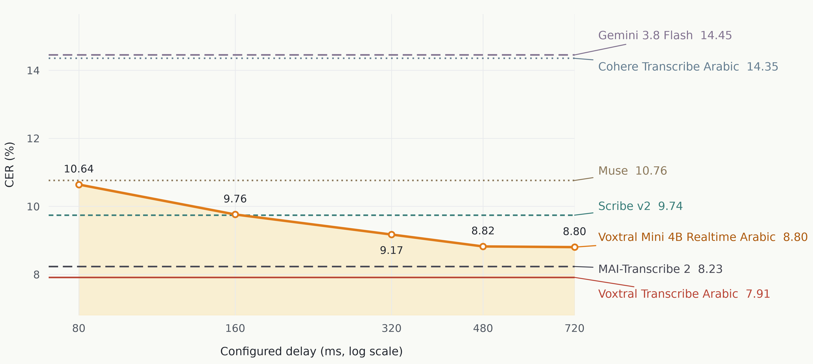
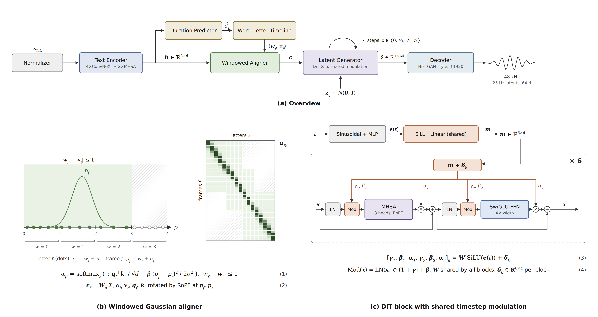

# 开源模型：六种任务，六组不同的运行条件

本栏沿用“开源模型”栏目名，但逐项区分开放权重与许可：Youtu带额外地域限制，不能称为不受限开源。日期优先保留模型仓库的创建记录，并列UTC原日期与北京时间，它只能证明该仓库何时出现，不自动等于模型首次研发完成。六项均核对模型卡、权重文件与运行材料，本站未下载权重做推理；作者演示和性能表不算独立验证，热度待验证。

| 任务 | 本期对象 | 先确认的条件 |
| --- | --- | --- |
| 文档转Markdown并定位块 | LightOnOCR 3 | PDF渲染、模型版本与grounding格式 |
| 图像生成转深度/修复 | Iris-3B | 下游任务需要各自微调权重 |
| 图像、语音、视频统一解析 | Youtu-Parsing-Omni | 自定义许可与专用推理依赖 |
| 阿拉伯语实时转录 | Voxtral Realtime Arabic | 16kHz输入、配置延迟与实际延迟区别 |
| 地形高度图细化 | TerrainSR | 合成细节不等于测绘观测 |
| 小体积土耳其语朗读 | EMA Lightning | 单音色；速度与音质分别评估 |

## 01 · LightOnOCR 3：从识别文字走到带位置的文档块

原始仓库日期（UTC）：2026-10-06；北京时间：2026-10-07｜近7天。许可：Apache-2.0。

LightOnOCR 3新增4B、0.8B等尺寸选择，4B版本基于Qwen3.5，适合把扫描页、表格和公式转成可继续加工的文档结构。这里选4B权重，不将同系列不同尺寸拆成多个模型。新近实用价值是同一文档既能做普通Markdown转写，也能用grounding模式返回带位置的内容块，方便后续定位原页与检查错误。

具体输入是渲染后的页面图像；普通模式输出文本结构，grounding则加入块标签与归一化到0—1000的坐标。作者报告后一模式约增加25%的输出token，因此“可追溯”需要付出长度与解码成本。坐标来自预测，不等于已经准确匹配原PDF中的全部对象；复杂表格仍应逐块对照页面。

模型卡建议Transformers 5.5.4及以上，提供vLLM与转换工具路径；示例PDF以400DPI渲染、长边处理到2048，并关闭思考输出。实际显存还取决于页面尺寸、并发和上下文，不能只按4B参数算总需求。权重采用Apache-2.0，训练数据未在本次仓库中完整随附。验证程度：官方演示、模型卡与依赖说明；本站未做OCR准确率复测。

[官方模型卡与文件](https://huggingface.co/lightonai/LightOnOCR-3-4B)

## 02 · Iris-3B：直接在像素空间学习，再微调到深度与修复

原始仓库日期（UTC）：2026-10-05；北京时间：2026-10-05｜近7天。许可：Apache-2.0。

Iris-3B把图像生成直接放在像素空间，不使用VAE压缩潜变量；文本生成路径还依赖冻结的Qwen3-VL-4B编码器，所以“3B”并不是完整工作流的全部参数。它的新近创新价值在于展示同一视觉骨干可经微调用于相对深度和图像恢复，并提供对应权重，而非仅给出一个概念架构。

下图是官方深度示例：房间图像被转成相对深度图，颜色表示模型对空间层次的估计，没有米制标尺。深度与四倍超分各需独立微调检查点，不是在文生图模型上换一句提示就自动获得该能力。作者按Marigold V2协议在五个深度数据集报告平均AbsRel 0.071；这不是本期独立结果，也不能保证换到你的相机后仍有相同误差。

文生图示例为1024分辨率、100步、CFG 3，依赖Python 3.11、PyTorch 2.7.1和CUDA环境；下游单步推理走不同条件路径。模型、代码及各组件仍须分别核对，不能因视觉骨干不含VAE就认为部署很轻。权重为Apache-2.0；本期只核对公开实现说明、原图与实验口径，没有运行模型。

[官方模型卡与文件](https://huggingface.co/speridlabs/iris-3b)

先看输入中的近处柱子、沙发与远处墙面。Sperid Labs官方模型卡原图，Apache-2.0，完整引用单个演示输入，未修改（[来源原图](https://huggingface.co/speridlabs/iris-3b)；[查看原尺寸](images/iris-photo.webp)。）

与上图对照物体边界和前后层次；颜色不是以米计的测量结果，也没有真实深度误差标尺。Sperid Labs官方演示输出原图，Apache-2.0，本站未复现（[来源原图](https://huggingface.co/speridlabs/iris-3b)；[查看原尺寸](images/iris-depth.webp)。）

## 03 · Youtu-Parsing-Omni：把不同模态解析到同一结构化输出

原始仓库日期（UTC）：2026-10-09；北京时间：2026-10-09｜近7天。许可：Youtu-Parsing自定义许可（含欧盟地域限制）。

Youtu-Parsing-Omni是约5B的解析模型，将文档、图片、音频和视频输入转成OmniSchema JSON。新近实用与创新之处，是在模态专用的轻量输入层之后共享Transformer编码，并用统一时空位置组织内容，而不是把几套完全独立的解析器在输出端拼接。

文档可输出文字块、位置、公式或表格结构；音频可给出转录、时间戳与说话人信息；视频侧重事件和镜头解析。它做的是结构提取，不生成新音视频。官方OmniDocBench 1.6总分为96.96，但另一个综合解析评估75.08仍低于表中Gemini 3 Pro的77.44；不能选取一列就称其全面领先。

部署需匹配专用代码与模型版本。模型卡分别列出vLLM 0.19、插件及对应Transformers依赖，独立Transformers路径又有自己的版本要求；音视频还需要ffmpeg，建议固定远程代码版本后审阅运行。自定义许可包含“非面向欧盟使用”的地域条款，不能简写为Apache-2.0。权重和推理材料可获取不代表全部训练数据开放。验证程度为模型卡、作者实验和架构原图，本站未推理。

[官方模型卡与文件](https://huggingface.co/tencent/Youtu-Parsing-Omni)

读下半图：视觉与音频先经过各自输入层，再在共享编码器中交互；最右侧输出是结构化JSON。上半图是对照的双塔方式。腾讯官方架构原图，完整保留；许可全文及署名随本期保存（[来源原图](https://huggingface.co/tencent/Youtu-Parsing-Omni)；[查看原尺寸](images/youtu-architecture.png)。）

## 04 · Voxtral Realtime Arabic：转录延迟是可调条件，不是固定速度

原始仓库日期（UTC）：2026-10-08；北京时间：2026-10-08｜近7天。许可：Apache-2.0。

这份约4.4B权重在已有实时Voxtral基座上适配阿拉伯语，覆盖标准语、方言和夹杂其他语言的转录。新近实用价值是流式语音识别有了可下载的专门权重及延迟—错误率曲线；并不是重新发布2月的基础架构。

官方使用16kHz音频，在七个评估集上报告平均字符错误率。将配置延迟设为480毫秒时，平均CER为8.82%，离线Voxtral Arabic为7.91%；二者相差0.91个百分点。图中横轴是配置的等待时间，不包括所有采集、网络、排队和解码开销，不能改写成端到端延迟。

模型卡给出vLLM实时WebSocket路径、mistral-common音频组件和Transformers 5.2及以上环境。评估还使用指定文本归一化、温度等条件；图中部分比较对象在个别集上有过滤或限制，跨系统数字应连同卡中说明阅读。Apache-2.0覆盖所发权重。适合先用自己的方言、噪声与说话速度测流式稳定性，本站只核对文档和作者曲线，未录音测试。

[官方模型卡与文件](https://huggingface.co/mistralai/Voxtral-Mini-4B-Realtime-Arabic)

先看橙线：从80到480毫秒，平均CER从10.64%降到8.82%，继续到720毫秒为8.80%。这展示等待与准确率的取舍，不是本机测速。Mistral官方图，Apache-2.0；七项评估的具体条件见模型卡，未改坐标或图例（[来源原图](https://huggingface.co/mistralai/Voxtral-Mini-4B-Realtime-Arabic)；[查看原尺寸](images/voxtral-delay.png)。）

## 05 · TerrainSR：给游戏地形补细节，不能替代真实高程数据

原始仓库日期（UTC）：2026-10-06；北京时间：2026-10-07｜近7天。许可：Apache-2.0。

TerrainSR面向一个具体需求：把100米网格的地形高度图变成10米网格的细节，用于大范围游戏地形，避免直接存储极大的高分辨率地图。输入还可包含水域掩码，输出是浮点高度数组。为什么现在值得看：近期公开的任务专用权重，把地形细化的输入、输出与边界讲得很具体，属于新近实用进展。

训练刻意排除了城市、矿坑等人造地形，因此模型可能把原数据里的建筑或人工结构解释成自然地貌。新增沟壑和坡面只是符合训练分布的合成细节，不能拿来做洪水、工程或测绘判断；更低于100米的粗输入也不是它声明可靠的区域。

官方示例依赖Python 3.10及以上、PyTorch 2.6，可走GPU或CPU，提供分块及上下文裁边处理。作者在RTX 4070上的速度示例包含特定区域与模型已加载条件，不能套用于所有硬件。权重和代码为Apache-2.0，原始地理数据仍有各自许可。验证程度为作者演示和运行文档，本站没有生成地形。

[官方模型卡与文件](https://huggingface.co/joe-gibbs/terrainsr)

## 06 · EMA Lightning：约34MB的土耳其语单音色语音合成

原始仓库日期（UTC）：2026-10-01；北京时间：2026-10-01｜近期补充（近30天首次收录）。许可：Apache-2.0。

EMA Lightning由约5.6M参数的声学模型与3M参数的声码器组成，总计8.6M、约34MB，输出48kHz语音。它是近30天首次收录的专用模型，不将10月6日的仓库修改时间改写成首发。新近实用价值在于提供小体积、可离线的土耳其语朗读路径；单音色设计不包含任意声音克隆和完整情绪控制。

架构先预测文字持续时间和对齐，再用四步潜变量生成器与解码器产生波形。官方Freya-TR-Eval评估使用495句、三个随机种子和指定识别器，报告WER 0.92%±0.13%；其中部分对比数字来自其他模型卡。低识别错误不等于声音自然度最高，作者表中的UTMOS也没有在所有对象中领先。

可从ema-lightning包及EMA调用示例起步。GPU路径可用编译与CUDA Graph，CPU有回退；RTX 4090上约440倍实时速度、首段音频时间等均为作者特定环境报告，并非个人电脑保证。Apache-2.0权重与代码可取得，训练音频不等于完整随附。本站读了模型卡、结构图和评估条件，没有试听或测速；适合将资源占用、可懂度和自然度分别测试。

[官方模型卡与文件](https://huggingface.co/canberkkkkkk/ema-lightning)

先沿上半图从左到右读：文本规范化→编码及持续时间预测→对齐→四步生成→音频解码。下半图展开对齐和共享调制，不是额外四个模型。作者架构原图，Apache-2.0，保留全部公式；手机可打开原尺寸查看（[来源原图](https://huggingface.co/canberkkkkkk/ema-lightning)；[查看原尺寸](images/ema-architecture.png)。）

---

各图作者、许可与引用范围见[配图说明](images/README.txt)。回到[今日导读](00-今日导读.md)。
