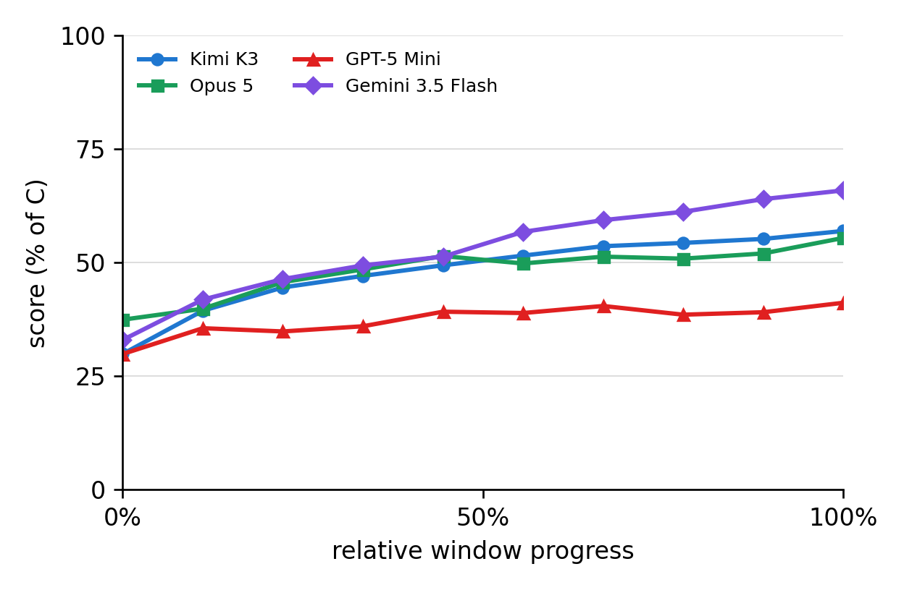
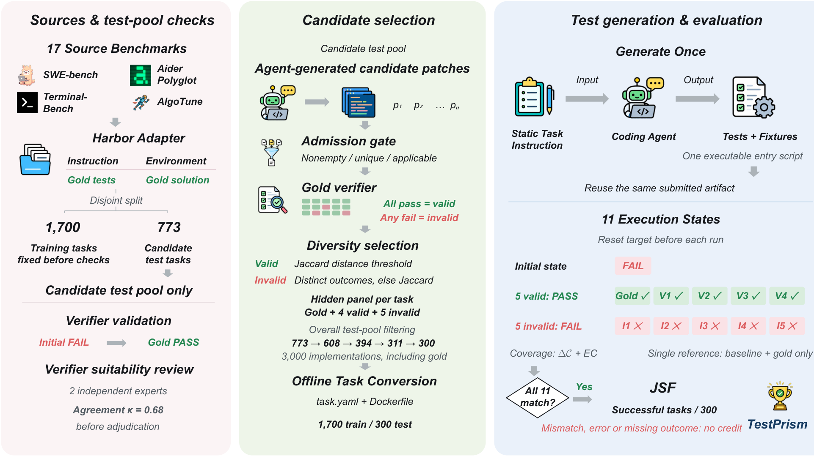
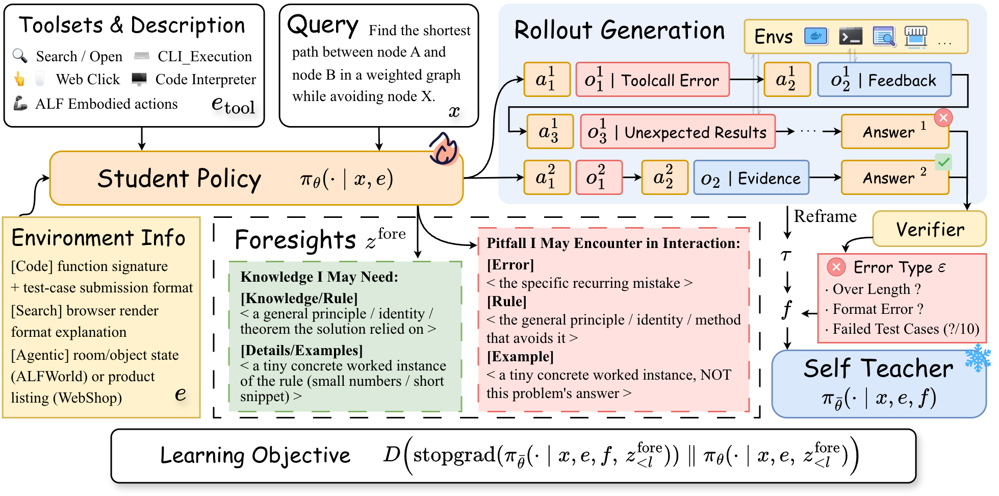

# 论文精选：让经验、证据和评测条件留得下来

从16篇近期候选中选6篇，覆盖推理系统、经验学习、白盒诊断、测试评估、训练方法与工作区代理。六篇均按所列arXiv版本解读；TokenRouter的PDF标有会议名称，未另核录用记录，已读核心方法、主结果和关键限制，未独立复现实验。入选依据是新近实用或创新价值；HF榜单只作为发现线索，缺少第二类独立信号，热度待验证。

读表时注意：百分比与百分点不同，作者基准与本站实测不同，换了模型、运行框架或数据子集的两行也未必可以作因果对照。每篇均有站内阅读卡；四篇CC BY 4.0原文保存PDF，另两篇仅存阅读卡及原文入口。

## 01 · TokenRouter：逐token切换模型，先处理好调度与状态

首发：2026-10-08；所读版本：v1（2026-10-08）。会议状态见下文。

PDF页脚标注NeurIPS 2026；本站尚未另查会议录用页面，以下按arXiv v1解读。

Token级路由允许同一答案在不同模型间切换，但现成服务往往把“一次请求由一个模型处理”作为基本单位。TokenRouter的新近实用价值是为这种频繁切换提供运行系统：每个模型保留自己的子服务与KV状态，请求交接后可以恢复，减少重复接入和前缀处理的开销。它不是一种新的“何时选大模型”判据。

系统把客户端接入、模型解码和模型间传递分成三条异步循环，再通过延迟成批调度避免每次收到一个token请求就急着启动小批量计算。读图时把黑色箭头理解为模型间交接、蓝色箭头理解为模型内循环；这里有吞吐与等待的取舍，并非所有等待都被消除。

论文图2(b)对应的架构原图。紫色为客户请求，蓝色为解码，黑色为模型间传递；三条循环分开后才便于保留状态和批调度。Tianyu Fu等，CC BY 4.0；引用单个架构面板的原始图片文件，未重画。（[来源原图](https://arxiv.org/html/2610.12242v1)；[查看原尺寸](images/tokenrouter.png)。）

作者比较五种路由算法，使用Qwen小/大模型组合和A100 80GB环境，在短数学题、长推理和长提示代码等工作负载上评估。并发4时报告相对较强对照系统约2.01—64.15倍吞吐提升，但这个区间不是相对单独大模型的普遍倍数：例如Co-LLM条件下，TokenRouter为76.02 token/s，单大模型为134.79，仍更慢。

表中R2R从官方实现89.62升至244.56 token/s，说明调度确实可能成为瓶颈；同时也提示复现要同时记录路由决策频率、输入输出长度和并发。实现仓库可读，但本期未确认独立开源许可，故只在论文栏讨论，不再作为一个开源项目计数。验证程度是原文方法、主表与系统条件，尚无本站部署或尾延迟实测。

[原始论文](https://arxiv.org/abs/2610.12242v1) · [站内阅读卡](../../../../papers/frontiers/2610.12242/00-阅读卡.md)

## 02 · Learn2Play Bench：会总结经验，不等于真的学会规则

首发：2026-10-06；所读版本：v2（2026-10-08）。预印本。

Learn2Play Bench用20种手工设计、规则隐藏的文字游戏测试代理能否从交互中学习。十种固定实例、十种重排实例，后者改变表面布局但保留规则；其中五种挑战游戏给十轮计分，其余给五轮。新近创新价值是把“知道常识”与“根据反馈发现新规则”拉开，且用确定性反馈和自动评分支持轨迹复查。

作者在每种游戏固定一个种子、每配置做三次独立试验，分别报告最高表现Max、全程均值Mean、学习增益LG和斜率LS。挑战游戏还有不同权重，不能把总分当成20项未经加权的正确率。下图把五轮和十轮窗口都对齐成相对进度，只帮助观察走势，不表示相同墙钟时间。

论文图4原图：横轴对齐五轮/十轮计分窗口，纵轴是按论文规则归一化及加权后的分数。比较曲线走势，勿把横轴看成实际耗时。Yibo Li等，CC BY 4.0；完整保留原图。（[来源原图](https://arxiv.org/html/2610.08215v2)；[查看原尺寸](images/learn2play.png)。）

一个值得复现的结果是：Kimi K3保留原始历史的Memory方案，Max为63.3、Mean为48.0，高于同组Reflexion的61.6与40.4。作者认为过早压缩经验可能固化错误规则；但同一模型换到OpenCode框架又得到68.5的Max，说明不能只比较“有没有反思”而忽略工具框架。

人类Top-1是按每个游戏最高表现选出的玩家，84.3的Max不代表平均人类水平；模型分组、框架比较也需要分别看。新近实用的启发是保留可回查的原始证据，同时测试重排后的迁移，不只测最后一次得分。本站已读评测协议、主表、框架与记忆对照，没有运行游戏；公开代码快照的许可未在本期确认。

[原始论文](https://arxiv.org/abs/2610.08215v2) · [站内阅读卡](../../../../papers/frontiers/2610.08215/00-阅读卡.md)

## 03 · U-Space：从隐藏状态区分几类不确定性

首发：2026-10-06；所读版本：v1（2026-10-06）。预印本。

U-Space问的是：模型在一句答案的什么位置开始不确定，这种不确定更像歧义、信息不足还是证据冲突？它的新近创新之处，是把表示空间中的方向与这些类别联系起来，而不是只计数“可能”“也许”等词，或只看最后输出的概率。

方法先用确定/不确定词语作为锚点，经J-Lens的平均Jacobian映射到残差流，构造并正交化方向，再用U-Lens读取逐token状态。分类方向的强度与整段预测熵结合，用于判断答案是否容易出错。直觉上，这是给内部表示选几根测量轴；轴的名称来自设计与实验解释，不代表读到了人类意义上的真实思想。

评估覆盖Gemma、Qwen与Magistral三种模型、四个任务，每项约1000题并用三个种子。为控制“答案越长越容易错”的混淆，作者按长度分箱再比较AUROC：长度基线从68.6降到52.4，U-Lens从71.1降到69.3。这个对照支持它不只利用长度，但仍只是在论文模型与样本分布上的证据。

虽然方法不需要错误标签训练或多次采样，它需要白盒隐藏状态和模型特定的Jacobian等准备，不是一个黑盒API即可套用的免费监控器。实验还剔除了截断和无法解析的答案；方向分数也不是校准好的错误概率。适合研究者做可解释诊断和分布外检验，本站未复现。原文分发许可未确认允许本站镜像，故保留阅读卡与原始页面。

[原始论文](https://arxiv.org/abs/2610.09087v1) · [站内阅读卡](../../../../papers/frontiers/2610.09087/00-阅读卡.md)

## 04 · TestPrism：好测试应接受多种正确实现，也拒绝多种错误

首发：2026-10-08；所读版本：v1（2026-10-08）。预印本。

日期采用arXiv v1提交记录2026-10-08；PDF封面另写October 9，二者不混作抓取日。

只用一份参考修复检查测试，可能把“恰好通过参考实现”误判为测试有效。TestPrism的新近实用与创新价值，是给每个测试任务放置多种正确和错误实现：一份生成的测试，必须接受全部正确变体、拒绝全部错误变体，并在初始缺陷状态失败，才算联合成功。

基准含1700训练任务和300测试任务，来源覆盖17个基准、6种语言。每个测试任务有参考修复加四种其他有效实现、五种无效实现，共3000个候选实现；再加初始状态，一次评估涉及11种执行状态。标签由来源验证器及适合性审查支持，两位专家的初始一致性κ为0.68，不能当成所有程序语义的完备证明。

论文图1原图。重点看右侧：初始状态应失败，五个正确实现应通过，五个错误实现应失败；773是候选测试池，最终测试任务为300。Han Li等，CC BY 4.0；完整引用构建图，未改数字。（[来源原图](https://arxiv.org/html/2610.12289v1)；[查看原尺寸](images/testprism.png)。）

作者比较14种配置，最高基线Claude Fable 5.1的联合成功率为28%，只看参考实现通过则为59.67%。差距说明单参考评估较宽松，但两个指标有不同判定条件，不能把差值直接解释成测试错误率。提出的TestHelix用多组修复/测试代理交叉运行、语义审查及训练阶段总结策略；GPT-5.6 Sol在其配置下从23.33%升到32.33%。

消融中增加代理组数的收益不总是大于改进策略，因此“更多代理”不是主要结论。比较还受预算、候选实现质量与既有验证器覆盖影响。本站读了构建流程、主表及消融，没有运行完整容器基准；[本期技术实践](05-技术实践.md)只用一个合成小任务演示评估思路，不冒充论文复现。

[原始论文](https://arxiv.org/abs/2610.12289v1) · [站内阅读卡](../../../../papers/frontiers/2610.12289/00-阅读卡.md)

## 05 · SRD：把事后遇到的坑，蒸馏成事前可用的提示

首发：2026-10-06；所读版本：v2（2026-10-08）。预印本。

Self-Retrospection Distillation（SRD）试图把“失败后才知道的原因”变成下次行动前就能使用的知识。学生先生成交互轨迹；同一模型的停止梯度副本读取事后经验，再指导学生学习行动前的pitfall或knowledge提示。新近创新点在于监督预见内容的token分布，而非把整条成功动作直接当作唯一模仿目标。

这里的“自我”不等于没有外部信息。教师条件包含完成后的轨迹、验证器结果或参考信息；学生学习的是如何在事前表达与任务相关的风险和知识。主要实验采用pitfall分支，将该损失与GRPO等目标相加，默认权重为0.01。下图冰块代表停止梯度的教师，火焰代表被更新的学生。

论文图2原图。顺着上半部先看行动和反馈，再回到下半部的知识/风险提示及蒸馏目标；教师能看见学生事前没有的事后信息。Haoxiang Zhang等，CC BY 4.0，完整保留原图和公式。（[来源原图](https://arxiv.org/html/2610.08077v2)；[查看原尺寸](images/srd.png)。）

作者在Qwen3.5的4B和9B上，跨数学、代码、搜索及交互任务比较。同一4B GRPO设置中，数学分数从46.22到56.25、代码从36.85到45.18；但并非处处提高，9B OPSD的WebShop从91.76降至88.15。不同目标还会影响动态采样保留哪些轨迹，匹配提示顺序不等于每个训练细节完全相同。

这个方法增加训练侧计算，并且生成的预见可能错误；推理时额外写预见的收益也不稳定。复现时应分别记录教师条件、数据筛选、训练预算和推理开销，而不是只复制一个总损失。代码由作者公开，本站未训练；它与同日项目栏去重，仅在论文及阅读卡展开。

[原始论文](https://arxiv.org/abs/2610.08077v2) · [站内阅读卡](../../../../papers/frontiers/2610.08077/00-阅读卡.md)

## 06 · RunningTab：文件读过了，事实为什么仍没进入交付结果

首发：2026-10-07；所读版本：v1（2026-10-07）。预印本。

RunningTab关注长工作区任务的一种常见失败：代理打开了正确文件，却在最终报告遗漏已经看过的事实。新近实用价值是把任务要求、实际阅读记录和“列出但未打开”的候选文件保存在环境侧，不让它们只依赖当前上下文还能容纳多少历史。

代理为任务建立要求项；环境自动记录文件读取内容和出处。复查时用BM25匹配要求与已读片段，完成某项需要引用阅读日志，最后交付前还有一次核查机会。这个设计把“计划做过”和“证据读过”分开，但关键词重叠只是较弱的门槛，不等于引用在语义上完全支持结论。

作者用三种模型、每配置三次运行，在Workspace-Bench、AgentCompany的文件服务器子集和不依赖外部访问的OfficeQA子集比较。统一框架设300回合及一小时限制，并允许截断旧观察。在Workspace-Bench中，DeepSeek V4 Flash从53.28到59.99，Gemini 3.8 Flash从31.42到46.91；这些是给定评分规则与子集的表现，不代表任意工作区成功率。

去掉环境侧捕获或复查都会降低相应成绩，支持保留证据这一机制的作用。不过阅读记录中存在答案，不保证代理最终写对；自动匹配也可能漏掉同义表达。读者可先从“需求—引用—交付内容”的核对表复现思路，再测试更强的语义检查。本站已读方法、设置和消融，没有运行完整基准；分发许可仅支持原站阅读，本站保存阅读卡。

[原始论文](https://arxiv.org/abs/2610.10444v1) · [站内阅读卡](../../../../papers/frontiers/2610.10444/00-阅读卡.md)

---

原图的许可与引用范围见[配图说明](images/README.txt)。回到[今日导读](00-今日导读.md)。
