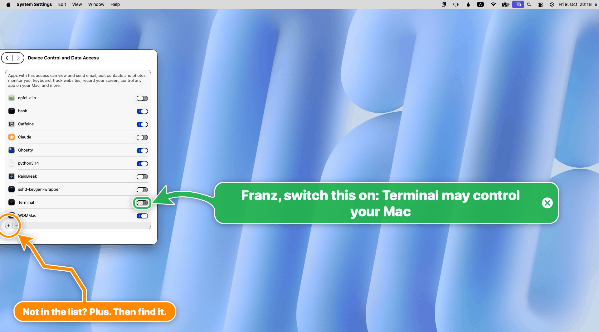
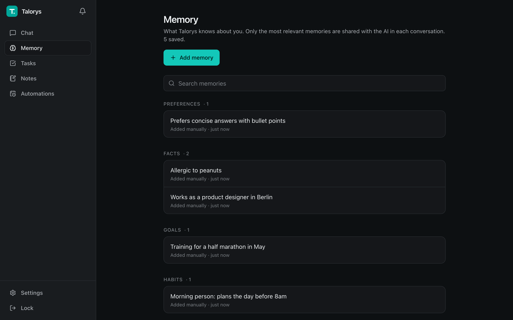
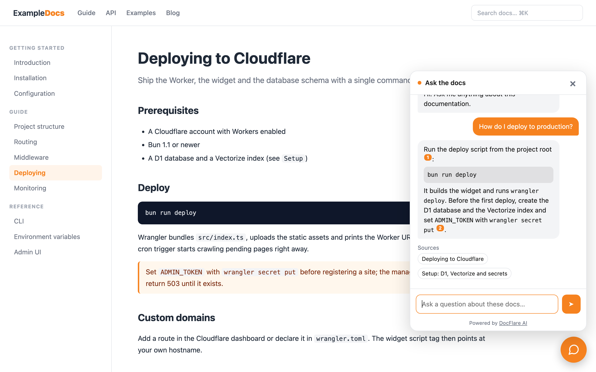
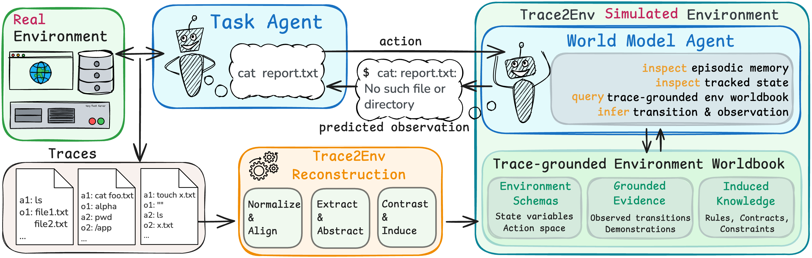

# 十个项目：从人工接手到可回查的代理实验

本期比较21个候选，选择10个有公开实现的工具或方法。发现渠道包括GitHub日/周榜与版本记录、HN/Show HN，以及HF论文与作者发布。只将REA标为近期热门；其他项目凭新近实用或创新入选，热度待验证。以下均未在本站安装运行，界面来自作者，代码检查限于说明的入口。

| 你的任务 | 可以先看 |
| --- | --- |
| 二进制与应用行为分析 | REA |
| 桌面操作中的人工接手 | Big Arrow |
| 个人助手与长期记忆 | Talorys |
| 代理输出的人工审阅 | Pinrail |
| 个人数据的结构化读写 | LifeOS |
| 给文档站加检索问答 | DocFlare AI |
| 交互世界研究中的视觉渲染 | AgentGarten |
| 为代理建立离线试验环境 | Trace2Env |
| 运维代理的故障调查评测 | Project Arena |
| 排查代理工作进程与资源关系 | ProcInSh |

## 01 · REA：让逆向分析结果带着可追溯证据

原始日期：2026-04-14；6.3.0 于2026-10-09 23:56 UTC（北京时间10月10日）发布。标签：近期热门 / 新近实用。

REA把反编译、应用行为观察和运行时证据接给编码代理，适合分析自己有权研究的二进制、Electron或.NET应用。相比单独复制反编译文本，它让结论引用带上下文的证据，方便回查原始观察。

本次新近实用点是6.3.0重整证据契约：生产者、上下文及事务身份需要显式携带，旧采集结果可能要重新采集，先保留原件。可从`npx rea-agents setup`配置MCP，但它会改动代理配置；Node支持22.19+、24.11+或26系列，Hopper、IDA等外部工具另有安装与许可要求。

近期热门有两类信号：10月11日08:41读取GitHub日榜显示当日新增25,793 Star，10月10日HN帖子累计691分、302条评论。它们代表关注而非分析准确率，也没有连续30天增长基线。本站核对了版本说明与证据输入契约，未运行逆向任务。

来源：[规范仓库与使用文档](https://github.com/morluto/rea) · [MIT](https://github.com/morluto/rea/blob/main/LICENSE) · [核对的实现](https://raw.githubusercontent.com/morluto/rea/d21132fc9735808631fa0ab6b1f6c6d112d5cd18/src/contracts/evidenceInputContracts.ts) · [版本说明](https://github.com/morluto/rea/releases/tag/rea-agents-6.3.0) · [近期讨论](https://news.ycombinator.com/item?id=50028275)。

## 02 · Big Arrow：让代理把下一步指给人看

原始日期：2026-10-08；v0.4.5，2026-10-09 UTC；新项目首次收录。标签：新近实用。

代理知道该点哪里，但人仍要亲自操作时，Big Arrow能在Mac屏幕上画箭头、框和文字。它输出视觉提示，不点击、输入或截图；适合教程、故障排查，以及需要人工接手的桌面步骤。10月8日新建仓库提供了可执行CLI和原生Swift实现。

最小示例是`bigarrow point --at 760,500 --text "检查这里"`。按坐标画图不需要辅助功能权限；按`--element`查找应用控件则需要该权限，并可能抬起目标窗口。元素匹配实现会考虑文本、可见性和启用状态，不能假定任何网页控件都能可靠定位。

源码构建要求macOS 14+与Xcode 16。新近实用依据是作者演示及可核验的匹配实现；HN有412分、188条评论，但缺第二类独立信号，热度待验证。本站未安装。

绿色箭头把提示文字关联到具体控件，橙色圈标出另一处入口。这是Franz Enzenhofer的作者演示原图，MIT；显示的是操作指引，不能证明工具已替用户授予权限。（[来源原图](https://github.com/franzenzenhofer/big-arrow-on-the-screen)；[查看原尺寸](images/bigarrow.png)。）

来源：[规范仓库与使用文档](https://github.com/franzenzenhofer/big-arrow-on-the-screen) · [MIT](https://github.com/franzenzenhofer/big-arrow-on-the-screen/blob/main/LICENSE) · [核对的实现](https://raw.githubusercontent.com/franzenzenhofer/big-arrow-on-the-screen/9c75dce6e87916d15cbdf6a2caa51ebd46c87665/Sources/BigArrowCore/ElementMatcher.swift) · [版本说明](https://github.com/franzenzenhofer/big-arrow-on-the-screen/releases/tag/v0.4.5) · [近期讨论](https://news.ycombinator.com/item?id=50018817)。

## 03 · Talorys：把任务、笔记和记忆放进个人云助手

原始日期：2026-10-10；当前主分支，无正式Release。标签：新近实用。

Talorys让单个用户在聊天中建立任务、记录笔记并维护偏好记忆。10月10日公开的新实现将网页放在Cloudflare Pages，代理放在Worker，数据保存在Durable Object的SQLite中，提醒由Alarms调度。它是用户自部署的云服务，并非数据只留在本机的离线助手。

记忆代码每次先取最多八条相关结果，再补最多四条偏好；过长历史会总结。这比把所有历史都塞进提示更可控，却仍可能漏记或总结错误。下图可见作者把偏好、事实、目标和习惯分开管理，便于人工纠正。

安装需要Node 20.18+及Cloudflare账号；`npx create-talorys`会建立云资源，先核对额度与配置。默认推理依赖Workers AI，免费额度不代表任意用量都免费。新近实用依据为作者界面与实现检查，本站未部署；HN239分、120评论只有一类信号，热度待验证。

先看右侧记忆卡的分类和编辑入口：这是rociiu提供的示例界面与示例数据，用于解释人工管理记忆；不是本站运行截图。原图按MIT许可引用，未裁切。（[来源原图](https://github.com/rociiu/talorys)；[查看原尺寸](images/talorys-memory.png)。）

来源：[规范仓库与使用文档](https://github.com/rociiu/talorys) · [MIT](https://github.com/rociiu/talorys/blob/main/LICENSE) · [核对的实现](https://raw.githubusercontent.com/rociiu/talorys/4aa1db8f997ff034a84b1ff9256b67abfa4f4b2b/apps/agent/src/agent/memory.ts) · [近期讨论](https://news.ycombinator.com/item?id=50031614)。

## 04 · Pinrail：把代理等待确认的内容送进审阅收件箱

原始日期：2026-09-13；近期补充；v0.1.3于2026-10-09发布，主要是通知修复。标签：新近实用。

Pinrail把代码审查发现、设计提案等代理输出送进桌面收件箱，让用户接受、拒绝或补充意见，再把决定返回命令行。新近实用价值来自9月13日出现的工具与可运行协议；本期按近30天首次收录，不把10月9日通知修复包装成重大能力更新。

例如`pinrail submit code-review --data findings.json --wait`提交结构化发现，桌面端逐条审阅后返回Markdown或JSON。CLI还用不同退出码区分决定、关闭、超时等结果，调用方可以据此继续或停下；它本身不会强制所有代理行动都经过批准。

作者提供macOS、Linux路径，源码涉及Tauri、Rust与React，可按仓库mise任务安装依赖。下图用于理解逐项决定与差异定位。本站只核对CLI实现和作者界面，没有接入真实代理；新近实用，热度待验证。

从左侧发现列表选项，再看中间差异及右侧决定区，可以理解为什么返回值不只是一个“通过”。Forgeplane作者演示原图，Apache-2.0，未改动；密集代码请打开原尺寸。（[来源原图](https://github.com/forgeplane/pinrail)；[查看原尺寸](images/pinrail-review.png)。）

来源：[规范仓库与使用文档](https://github.com/forgeplane/pinrail) · [Apache-2.0](https://github.com/forgeplane/pinrail/blob/main/LICENSE) · [核对的实现](https://raw.githubusercontent.com/forgeplane/pinrail/62182e6d9ecd54ab5b1df845242e8b0a364db7b2/cli/src/main.rs) · [版本说明](https://github.com/forgeplane/pinrail/releases/tag/v0.1.3) · [近期讨论](https://news.ycombinator.com/item?id=49995778)。

## 05 · LifeOS：给个人记录接上API与MCP

原始日期：2026-09-05；原项目早于30天；v1.0.0于2026-10-08开放API/MCP，v1.1.0于10月10日发布。标签：新近实用。

LifeOS把习惯、任务、笔记和其他个人记录存进自托管数据库，再通过API或MCP提供给助手。项目9月5日已存在，本周值得看的是10月8日1.0版加入的API、MCP及Docker使用路径，而非仓库再次被讨论。

运行核心需要PHP 8.1、pdo_mysql和mbstring，以及MySQL 8或MariaDB 10.4；MCP stdio另需Node 22.9+。10月10日1.1版将原来十二个只读工具统一为`lifeos_query`，减少工具选择负担。当前README的旧工具总数与新版实现不一致，接入时以版本实现为准。

它适合希望统一管理可结构化个人记录的人，不是现成的通用记忆模型。访问令牌的读写权限仍较宽，`secret`可见性标签也不等于加密。新近实用依据是正式版本与公开工具实现，本站未部署，热度待验证。

来源：[规范仓库与使用文档](https://github.com/edrisranjbar/lifeos) · [MIT](https://github.com/edrisranjbar/lifeos/blob/main/LICENSE) · [核对的实现](https://raw.githubusercontent.com/edrisranjbar/lifeos/8435faa899b1c3c6c7b645860940ea01dec050a9/mcp/src/tools.js) · [版本说明](https://github.com/edrisranjbar/lifeos/releases/tag/v1.1.0) · [近期讨论](https://news.ycombinator.com/item?id=50014150)。

## 06 · DocFlare AI：从站点地图到带来源的文档问答

原始日期：2026-10-07；当前主分支，无正式Release。标签：新近实用。

DocFlare AI接受文档站的sitemap，抓取、分块并向量化页面；提问时先检索，再重排片段，流式返回回答和来源入口。10月7日出现的新工具把这条链路放进Cloudflare Workers，适合维护公开技术文档、希望读者直接找到相关段落的人。

最小使用路径包含建立D1与Vectorize资源、配置Workers AI、执行迁移并导入站点；需要Bun 1.1+及Wrangler。即使启动本地开发，一些AI和向量能力仍调用远程服务，不能当完全离线演示。实现中先取二十个向量候选再重排，并检查查询与调用额度。

默认嵌入是384维的英文BGE模型，中文检索效果尚未在本站验证；有来源按钮也不保证答案忠实。新近实用依据为作者交互截图、README流程及服务实现，本站未部署，热度待验证。

看右侧回答下方的来源入口，读者可回到文档核对内容。p10node作者原图按MIT引用；截图仅说明问答交互，安装步骤以当前README的资源创建和迁移流程为准。（[来源原图](https://github.com/p10node/docflare-ai)；[查看原尺寸](images/docflare-widget.png)。）

来源：[规范仓库与使用文档](https://github.com/p10node/docflare-ai) · [MIT](https://github.com/p10node/docflare-ai/blob/main/LICENSE) · [核对的实现](https://raw.githubusercontent.com/p10node/docflare-ai/6c00950c87ce190ba43c376d3a02b5b6c5238d8d/src/services/ai.ts) · [近期讨论](https://news.ycombinator.com/item?id=50009313)。

## 07 · AgentGarten：先复用已开放的流式神经渲染器

原始日期：2026-10-08；当前研究代码；完整练习循环仍在待办清单。标签：新近实用 / 新近创新。

AgentGarten的设想是让代码世界决定状态与物理，再把深度、法线等几何缓冲渲染成视频，供视觉代理交互。本期收录的是10月8日公开、已有实现的神经渲染器训练及流式推理，不把尚未开放的代码世界、完整练习循环与交互前端算作可用产品。

研究者可从几何条件和文字描述生成连续视频块，复用流式缓存来限制历史开销。入口实现提供块处理及KV缓存设置，相比直接把任意生成视频当环境，更容易把视觉输出与已知状态联系起来，但逼真画面仍不证明物理或动作完全正确。

依赖Python 3.11、PyTorch 2.9与CUDA，预训练组件涉及Cosmos 3 Nano及Wan 2.2 VAE，权重许可需另查；首次编译和图捕获也有开销。新近创新/实用依据为公开渲染代码及作者实验，本站未运行，热度待验证。

上半部左侧看同一几何如何变成不同外观，可理解已开放渲染器的作用；下半部是作者研究中的完整练习循环，目前并未随仓库全部开放。MirroS-Lab原图，Apache-2.0，未改动；图中的轮数是作者示例，不是本站测量。（[来源原图](https://github.com/MirroS-Lab/AgentGarten)；[查看原尺寸](images/agentgarten.png)。）

来源：[规范仓库与使用文档](https://github.com/MirroS-Lab/AgentGarten) · [Apache-2.0](https://github.com/MirroS-Lab/AgentGarten/blob/main/LICENSE) · [核对的实现](https://raw.githubusercontent.com/MirroS-Lab/AgentGarten/06bb4621deb9b380c34abb6dac42fe0b31eec2e3/wm/networks/cosmos3/streaming.py)。

## 08 · Trace2Env：把交互轨迹整理成可检查的模拟环境

原始日期：2026-10-04；近期公开方法与当前主分支实现。标签：新近实用 / 新近创新。

Trace2Env从工具调用轨迹中整理对象、规则和证据，形成worldbook，再让语言世界模型提出下一状态与观察，交给运行框架检查和提交。10月4日新建的公开实现，为只有交互日志、难以直接取得原系统的研究者提供了环境重建路径。

关键区别是把状态补丁、持久状态和证据显式保存，而非每轮只生成一段听起来合理的反馈。下图左侧是重建过程，右侧是任务代理与模拟环境交互；它并没有从有限轨迹恢复真实系统的全部可执行程序，未见过的条件仍可能模拟错误。

项目需要Python 3.11。仓库的`init-demo-ledger`使用手写演示规则，可先不调用模型理解状态机制；自动重建则需要兼容OpenAI接口的模型服务。部分冻结worldbook和轨迹需另行申请。新近实用/创新；本站检查引擎实现但未复现实验，热度待验证。

左侧说明规则与证据从哪里来；右侧区分提议下一步的世界模型与保存状态的运行框架。ruyue0001及论文作者原图，Apache-2.0；输入轨迹不完整时，不能据此保证模拟世界正确。（[来源原图](https://github.com/ruyue0001/trace2env)；[查看原尺寸](images/trace2env-overview.png)。）

来源：[规范仓库与使用文档](https://github.com/ruyue0001/trace2env) · [Apache-2.0](https://github.com/ruyue0001/trace2env/blob/main/LICENSE) · [核对的实现](https://raw.githubusercontent.com/ruyue0001/trace2env/037c13a69cd50467ca75e1b5c912d574e6b4b942/src/trace2env/engine.py)。

## 09 · Project Arena：在可重建的Kubernetes故障中评估SRE代理

原始日期：2026-10-01；近期补充；当前主分支，非10月8日讨论时才首发。标签：新近实用。

Project Arena用可丢弃的Kubernetes环境注入故障、验证故障成立，再导入代理调查记录并按预先定义的规则评分。10月1日公开，10月8日进入Show HN讨论；它的新近实用价值是让故障条件和评分材料可回查，减少只看一次成功演示的偏差。

先运行六场景smoke集合，再考虑二十一场景完整集合。需要Python 3.10、Docker、kind、kubectl及Helm；作者说明Apple Silicon走smoke路径，完整预制镜像偏向AMD64。评分包会保存档案摘要、真值与rubric，实际裁判模型或服务还需另配。

作者Edge Delta也是参与方，给出的产品成绩不能视为独立测评，不同模式的检测分母也可能不同。“提出缓解建议”更不等于修复完成。本站核对评分材料构建代码，未建立集群或调用付费服务；新近实用，热度待验证。

来源：[规范仓库与使用文档](https://github.com/edgedelta/project-arena) · [MIT](https://github.com/edgedelta/project-arena/blob/master/LICENSE) · [核对的实现](https://raw.githubusercontent.com/edgedelta/project-arena/fc232a3fb38b2d49d5fbc8589071623e13f2c963/bench/scoring.py) · [近期讨论](https://news.ycombinator.com/item?id=50008642)。

## 10 · ProcInSh：把进程与连接关系放进三维视图

原始日期：2026-09-21；近期补充；当前主分支，无正式Release。标签：新近实用。

运行多个代理、浏览器和后台worker时，扁平进程列表很难直观看出关联。ProcInSh读取Linux的进程和连接信息，将其呈现在浏览器三维空间，适合在调试时先找到相关进程，再回到具体指标检查。它9月21日创建，10月7日获Show HN讨论，不把最近提交日期当作首发。

实现通过`/proc`采集，并把PID与进程启动时间结合，避免PID复用误认同一个进程。完整构建依赖Rust、C/Clang、bpftool、libelf、zlib及内核BTF，部分eBPF能力需要提升权限；以Linux x86_64为主要路径，Mac不能直接照做。

服务默认只绑定本机9090端口，缺少适合公开网络的认证，不应直接暴露。下图是作者采集的场景，非本站机器数据。近30天新工具首次收录；HN60分、25评论仍不足两类热度证据，热度待验证，本站未运行。

先看进程之间的连线和分组，再打开原尺寸观察节点标签；三维视图帮助发现关系，CPU或内存结论仍需核对具体指标。akawashiro作者原图，MIT，未裁切。（[来源原图](https://github.com/akawashiro/procinsh)；[查看原尺寸](images/procinsh-space.png)。）

来源：[规范仓库与使用文档](https://github.com/akawashiro/procinsh) · [MIT](https://github.com/akawashiro/procinsh/blob/main/LICENSE) · [核对的实现](https://raw.githubusercontent.com/akawashiro/procinsh/a209faa307ff07c642cf9a781566ef71bc708d42/src/http_server/process/discovery.rs) · [近期讨论](https://news.ycombinator.com/item?id=49991986)。
