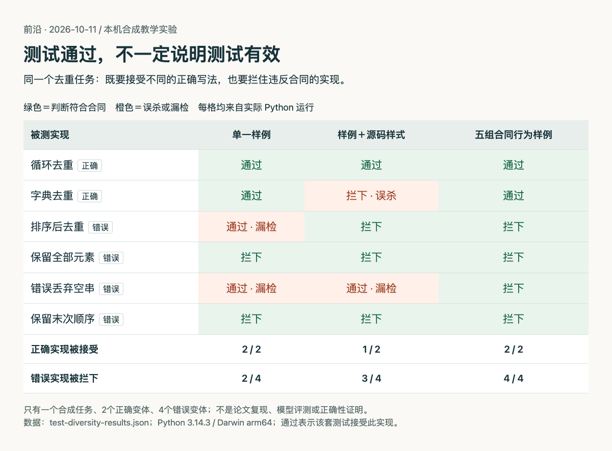

# 用六种实现检查一套测试：别把参考写法当成合同

**已运行验证。** 这是受[本期TestPrism论文](03-论文精选.md)启发的一个合成教学实验，由本站手写任务、实现和测试。它没有调用大模型、安装论文基准或复制作者成绩，不能作为TestPrism复现。

## 先写行为合同

输入是字符串列表，输出也是列表：去掉重复项，保留首次出现顺序，保留空字符串，且不修改输入。例如`["b", "a", "b", "", "a"]`应得到`["b", "a", ""]`。性能暂不属于合同，因而循环查重与利用字典顺序都可以是正确实现。

我们准备两种正确实现和四种故意错误的实现：排序后去重会破坏原顺序；原样复制没有去重；过滤空串损失有效值；保留末次出现会改变首次顺序。标签依据这个明确合同，只有这六个手写变体，不代表所有程序。

## 比较三套测试

第一套只有`["a", "b", "a"] → ["a", "b"]`这个样例。第二套在它上面再检查源码必须含`for item in values:`，刻意模拟把实现风格误写成要求的坏测试。第三套检查五组输入，加入逆序、空列表、重复空串和单元素，并逐项核对输出类型与输入未被修改。

```python
# 第三套测试的核心，完整实现见附件。
for values, expected in CASES:
    before = values.copy()
    result = fn(values)
    if not isinstance(result, list) or result != expected or values != before:
        return False
return True
```

本站在macOS arm64、Python 3.14.3 下运行，无第三方依赖：

```bash
python3 content/frontiers/2026/10/2026-10-11/code/test-diversity.py
```

运行脚本会在同目录重建JSON结果。只有打印出的计数及下面的矩阵属于本次实际运行结果；论文中更大规模的成绩仍是作者实验。



读图先看橙色格：单一样例接受了错误排序和丢空串；加源码样式又错误拒绝了正确的字典实现。最后一列在这组有限变体中接受2/2正确实现、拦下4/4错误实现。制作方式为HTML/JS，数据来自本机[实际运行JSON](code/test-diversity-results.json)，没有生成或修饰实验数值。[查看原尺寸](images/test-diversity-results.png)。

手机上可直接对照这三行计数；分母分别是两种正确实现、四种错误实现：

| 测试 | 接受正确；拒绝错误 |
| --- | --- |
| 单一样例 | 2 / 2；2 / 4 |
| 样例＋源码样式 | 1 / 2；3 / 4 |
| 五组合同行为样例 | 2 / 2；4 / 4 |

## 这一步能说明什么

弱测试也可能对参考实现全绿；更苛刻的测试也可能只是偏爱参考写法。把可接受的行为与必须拒绝的行为同时列出来，能帮助发现这两类问题。这里五组样例恰好覆盖四个手写错误，不构成语义正确性的证明，也没有压力、并发或安全边界测试。

若迁移到真实项目，应先讨论哪些差异允许存在，再设计不同算法、边界情况和真实历史缺陷。不要直接把“多放几个变体”当完整质量保证，也不要让实现和测试由同一个未经检查的假设决定。

附件：[完整Python](code/test-diversity.py) · [运行结果](code/test-diversity-results.json) · [可重现图表HTML](code/test-diversity.html)。原始研究：[TestPrism v1](https://arxiv.org/abs/2610.12289v1)，本站只借用其多实现评估思想。
