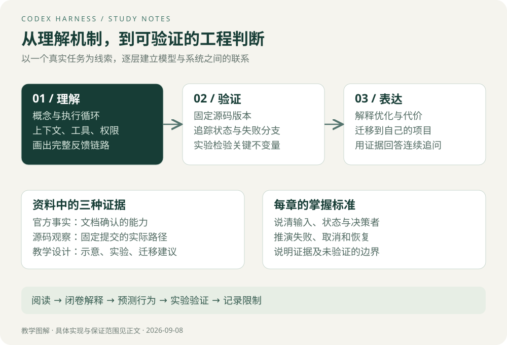

# Codex Harness

一个用户说“修好这个测试”，模型却不能凭空读取文件、启动进程或判断操作权限。谁把这些能力组织起来？任务持续几十轮后，谁维护状态、处理失败、把结果交给用户？这就是本专题研究的工程层。

学习主线是：**跟踪一个任务，解释每一次状态变化，再用源码与实验验证判断。** 面向有后端经验、希望掌握 Agent 工程的读者。Rust 语法按需学习；先理解数据与控制流，再研究所有权、异步和泛型。

## 阅读路线

| 章节 | 解决的问题 | 应当留下的学习证据 |
| --- | --- | --- |
| [01 概念与架构](01-概念与架构.md) | 模型、Harness、MCP、Skills 和客户端分别负责什么？ | 一张能解释职责与边界的架构图 |
| [02 执行循环与事件](02-执行循环与事件.md) | 一次请求如何推进？何时继续、停止、取消？ | 一段标注状态变化的执行轨迹 |
| [03 上下文工程](03-上下文工程.md) | 如何控制历史规模，又保留有效信息？ | 截断、压缩、检索的取舍表 |
| [04 工具与权限](04-工具与权限.md) | 如何调用工具、限制操作、安排并行？ | 一份工具契约与权限检查清单 |
| [05 状态与可靠性](05-状态与可靠性.md) | 超时、崩溃、恢复和副作用如何处理？ | 一份故障窗口与恢复策略表 |
| [06 源码与优化亮点](06-源码与优化亮点.md) | 哪些设计能在源码中找到证据？ | 固定版本的函数、调用者与限制记录 |
| [07 实验与评测](07-实验与评测.md) | 如何证明系统正确、优化有效？ | 本地实验结果与真实模型评测计划 |
| [08 面试与项目迁移](08-面试与项目迁移.md) | 如何讲出机制、取舍、证据和个人贡献？ | 三分钟讲述与连续追问练习 |

建议分四轮学习：先读 01–02，能闭卷画循环；再读 03–05，推演失败路径；然后读 06–07，检查源码、运行实验；最后读 08，把机制迁移到自己的项目。可以参考已有的[预算分析 Agent 项目](../agent项目/00-阅读指南.md)。

## 内容证据与完成范围

本文使用三种明确的证据口径：

- **官方事实**：来自官方文档，链接紧邻相关结论。
- **源码观察**：来自 OpenAI Codex 仓库提交 `d6489472f3c15e87d2d7763a5fde033545c530f8`，采样日期为 2026-09-08。结论只覆盖实际阅读的路径，不代表所有配置。
- **教学设计**：本专题的流程简化、Java 迁移建议和实验方案。它们帮助理解，不等同于 Codex 内部实现。

本专题已提供机制分析、固定版本源码入口、图解和可运行的无模型实验。实验只检验教学实现的不变量；没有运行 Codex 完整 Rust 测试，也没有完成真实模型对照评测，不包含性能提升百分比或生产上线经历。

> **Tip｜怎样避免“看懂了，却讲不出来”**
> 每章读完关闭原文，用五句话回答：输入是什么、状态在哪里、谁做决定、失败如何收尾、用什么证据证明。解释不清的部分就是下一次阅读入口。

## 开源范围

官方列出的开源组件包括 Codex CLI、SDK 和 App Server；IDE 扩展、Codex cloud 未开源。工程组件开源不能推导出模型权重开源。[官方开源清单](https://learn.chatgpt.com/docs/open-source)

本专题使用 Harness 表示模型周围的任务运行机制，并不假定官方存在一个单独名为“Codex Harness”的完整产品包。

开始阅读：[01 概念与架构](01-概念与架构.md)。
