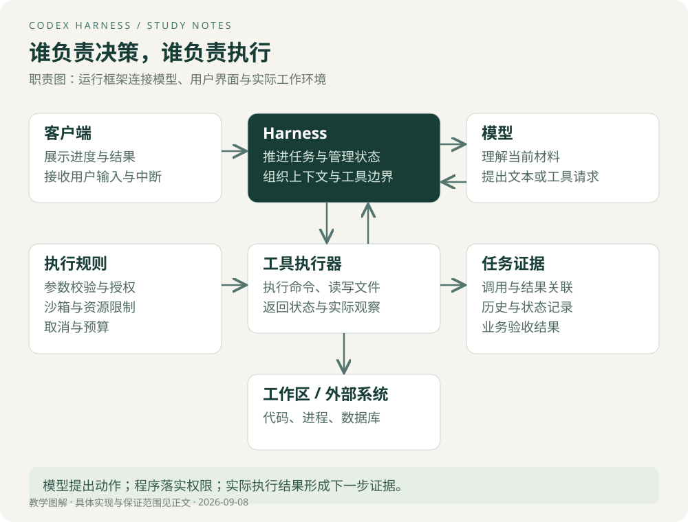

# 概念与架构

## 从“修复测试失败”理解职责

用户提供目标后，模型可能提出“先运行测试”。运行框架把这个结构化请求交给执行器，执行器返回退出码和输出。模型根据观察决定读取代码、修改文件或继续验证。客户端负责展示进度与接收新的用户输入。

这里有三个不同的成功条件：模型生成了合法调用、进程执行成功、用户目标真正满足。它们不能互相替代。例如命令退出码为零，但实际运行的测试目录为空，仍然没有证明修复有效。

图中是教学架构，不是 Codex 的完整类图。模型请求和工具执行构成反馈环；权限与状态管理跨越多步执行。

## 容易混淆的概念

| 概念 | 主要职责 | 不能据此假定的能力 |
| --- | --- | --- |
| 模型 | 根据输入产生文本或工具请求 | 自动拥有文件、网络和数据库权限 |
| Agent | 围绕目标持续观察、选择动作并推进的系统 | 必须采用多 Agent 架构 |
| Harness | 组织模型、上下文、工具、状态与控制策略 | 自动解决所有业务一致性问题 |
| 工具 | 提供一个明确的可执行能力 | 参数合法就代表业务上允许 |
| MCP | 为工具与资源等能力提供标准化连接方式 | 自动完成 Agent 调度、事务或授权 |
| Skills | 提供可复用的任务方法与相关资源 | 获得超出运行环境的权限 |
| SDK | 让其他程序使用封装好的能力 | 与完整运行框架职责完全相同 |
| App Server | 向客户端暴露会话、执行与事件接口 | 等于 Codex 云服务的全部实现 |

官方 App Server 支持认证、会话历史、审批与流式 Agent 事件，适合构建深度客户端集成；官方对自动化任务或 CI 场景推荐 Codex SDK。[App Server 文档](https://learn.chatgpt.com/docs/app-server)

## 为什么模型变强之后仍然需要 Harness

设想模型总能提出正确命令，系统仍然要决定命令在哪个目录运行、是否允许联网、输出如何保留，以及断线后是否继续。上述问题属于执行与状态管理，不会因为推理质量提高而消失。

因此可以把结果质量拆成四类影响因素：模型决策质量、信息是否充分、工具是否可靠、执行环境是否合适。这个拆分是排查框架，不是四个可独立相乘的概率。上下文错误会影响决策，工具失败又会改变下一轮上下文，它们存在反馈关系。

> **Tip｜别把所有失败都归因于模型**
> 先问：必要文件是否被读取？工具返回是否完整？目录是否正确？权限是否阻止了操作？确认输入与执行条件以后，再评估模型的判断。

## 与熟悉的后端架构建立联系

客户端类似控制台；任务运行层类似带状态的应用服务；工具执行器类似对外部资源的适配器。但 Agent 的下一步通常受模型输出影响，控制流不再完全写死在代码里。

确定性边界仍要保留：校验用户身份、检查参数与授权、落实预算、保存操作结果。模型可以选择“查询哪个部门”，服务端负责确保该用户确实能访问该部门。

这引出一个设计亮点：**把动态决策放在反馈循环里，把必须成立的规则放在程序边界上。** 好处是可测试、可审计；代价是需要设计明确的接口、状态和错误分类，不能只写一段提示词。

## 本章验收

闭卷画出“读取测试 → 修改文件 → 执行测试 → 返回结果”。分别标出模型、Harness、执行器和客户端参与的位置。再回答：如果模型说“测试通过”而没有测试结果，系统拥有什么证据？参考答案是只拥有模型的文本断言，需要对应测试记录才能支持该结论。

[下一章：执行循环与事件](02-执行循环与事件.md) · [专题目录](00-阅读指南.md)
