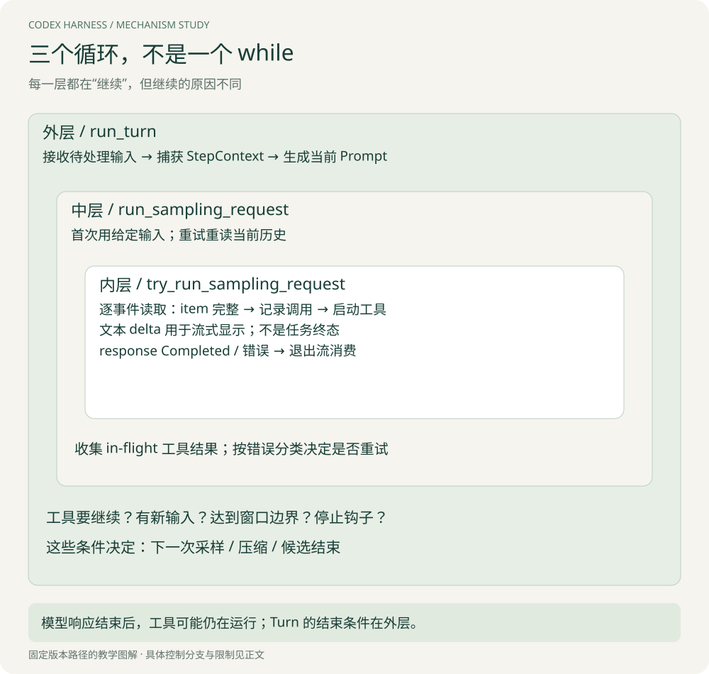

# 执行循环与事件：读通一次采样之后发生的事

本章默认你已经实现过基本的 tool-calling loop。目标是解释它进入真实运行环境后，为什么需要多层循环、快照、事件与结果收尾。示例中的工具名称和数据为教学简化，源码链接固定到专题版本。

## 1. 先纠正一个过度简化的模型

“调用模型 → 等它全部返回 → 执行全部工具 → 再调用模型”可以作为入门实现，但不足以描述本版 Codex。需要同时看到三层控制流：

| 层次 | 真实入口 | 一次迭代做什么 | 什么使它继续 |
| --- | --- | --- | --- |
| 外层：任务推进 | `run_turn` | 把新输入和观察组织成下一次采样 | 工具结果需要解释、待接收输入、继续条件 |
| 中层：采样重试 | `run_sampling_request` | 准备 Prompt，执行一次请求尝试 | 被判定可重试的请求错误 |
| 内层：消费流 | `try_run_sampling_request` | 逐事件处理模型输出并安排工具 | 下一条流事件到达 |

三个“继续”有完全不同的语义。工具失败后模型改参数，是新一轮推理；网络故障后重新连接，是请求重试；收到下一个文本片段，只是同一响应还没读完。[三层循环源码](https://github.com/openai/codex/blob/d6489472f3c15e87d2d7763a5fde033545c530f8/codex-rs/core/src/session/turn.rs)



[查看原图，可放大阅读](images/nested-loops.svg)

> **Tip｜排查“Agent 一直重试”之前，先定位循环层**
> 看请求次数、response ID、tool call ID 和历史新增项。重复的是 HTTP 请求、同参数工具调用，还是不同参数的主动纠错？如果没有先分类，重试上限和提示词都可能改错位置。

## 2. 固定一个贯穿案例

用户要求：“找出空数组测试失败的原因，只解释，先不要改代码。”假设模型这次返回两个可并行的只读调用：A 读取实现，B 读取测试。B 很快完成，A 较慢。我们用以下教学对象表示，不照搬完整协议：

```json
{"type":"function_call","item_id":"i-A","call_id":"c-A","name":"read_impl","arguments":"{}"}
{"type":"function_call","item_id":"i-B","call_id":"c-B","name":"read_test","arguments":"{}"}
```

`item_id` 标识输出单元；`call_id` 用来把一次调用与其结果配对。最终测试代码的内容是工具返回的数据，不是模型生成的解释。分清这三类内容，才能追踪下一次 Prompt 到底携带了什么证据。

## 3. 采样之前：为什么捕获 StepContext

`StepContext` 是一次模型采样使用的请求级状态，包含解析后的设置、环境快照、MCP 绑定和最终工具路由。外层循环在组装请求前捕获它，工具运行时保留同一个对象。[定义](https://github.com/openai/codex/blob/d6489472f3c15e87d2d7763a5fde033545c530f8/codex-rs/core/src/session/step_context.rs)

考虑一个容易漏掉的竞态：t0 把工具 `read_test(v1)` 的说明交给模型；t1 用户或插件刷新了工具集合；t2 模型根据 v1 发回参数；t3 执行器却按照 v2 解释。如果每个环节各自读取“当前配置”，同一调用可能跨越不兼容版本。

固定 StepContext 让“本次公布的工具”和“本次调用的路由”共享请求视图，减少此类不一致。它不是把整个机器冻结：文件仍可被外部进程修改，远程连接也可能失效。要获得文件内容的一致快照，仍需其他机制。

这里真正值得学习的是**决策所依据的能力视图与执行该决策时采用的能力视图需要关联**，而不只是“用一个不可变对象”。

## 4. 流事件到来：何时可以真正执行工具

内层收到 `OutputItemAdded` 或参数增量时，可以更新显示或消费参数差量。但本章追踪的普通工具调用路径在 `OutputItemDone` 后才把完整 item 转成 ToolCall。

`handle_output_item_done` 的工具分支按顺序完成：识别调用 → 记录调用 item → 创建工具 future → 设置 `needs_follow_up = true` → 返回给流消费者。流消费者把 future 放入 `in_flight` 集合。[处理函数](https://github.com/openai/codex/blob/d6489472f3c15e87d2d7763a5fde033545c530f8/codex-rs/core/src/stream_events_utils.rs#L290)

为什么不等整个响应结束？因为第一个工具 item 已经完整，后续可能还有另一个调用或文本。提前启动可以使模型流剩余部分与工具执行重叠。

为什么不直接执行尚未完成的普通 JSON 参数？因为前缀可能不完整，也可能尚未包含关键字段。界面预览参数和产生副作用是两个不同动作。不能把“有参数 delta 消费器”解释为任意工具都支持安全的增量执行。

## 5. 两个调用如何并发，结果何时进入历史

工具运行时通过 `tokio::spawn` 安排执行；`in_flight` 使用 `FuturesOrdered`。这些 future 可以对应并发运行的任务，但集合交付结果保持插入顺序。内层流处理退出后，`drain_in_flight` 才将结果逐项记录到历史。[执行与收尾](https://github.com/openai/codex/blob/d6489472f3c15e87d2d7763a5fde033545c530f8/codex-rs/core/src/session/turn.rs#L2232)

假设时间只用于演示，不是测量数据：

| 时刻 | 流 / 执行事件 | 历史的变化 |
| --- | --- | --- |
| t0 | A item 完整，启动 A | 加入 call A |
| t1 | B item 完整，启动 B | 加入 call B |
| t2 | B 先完成 | B 的结果等待收集，不据此立即开始下一次模型请求 |
| t3 | 收到本次 response 的 Completed | 模型流结束，开始或继续收尾 |
| t4 | A 完成，按 A、B 顺序收集 | 加入 output A，再加入 output B |
| t5 | 返回外层推进循环 | 下一次输入包含调用与观察 |

三个顺序必须分开：**模型声明顺序、工具实际完成顺序、结果进入历史的顺序**。用户界面可能通过工具生命周期事件先显示 B 已完成；模型却不一定已经消费 B。不要用界面顺序推断下一次 Prompt。

有序收集的代价是队头等待：B 的结果已经有了，但 A 没收齐时不能越过它交付。这不等于 B 串行执行。何时值得改成按完成顺序消费，需要同时考虑协议、历史稳定性和是否允许模型在部分结果到达后继续。

## 6. 两个完成信号之间还有工作

模型侧的 response Completed 只说明该模型响应结束。工具可能还在运行，甚至某个工具正在等待用户输入。源码在流处理后收集 in-flight 结果，再处理用量事件与取消状态，才向外层返回。

外层拿到的不只是文本，而是 `SamplingRequestResult`，其中有 `needs_follow_up` 和最后 Agent 消息。工具 item 会要求继续；响应中的 `end_turn = false` 也能要求继续。最后，外层还会检查输入队列。

下面是对已读取分支的缩写，不是可执行源码：

```text
model_continue = sampling_result.needs_follow_up
pending = input_queue.has_pending_input()
continue_needed = model_continue OR pending

if continue_needed AND (请求换窗口 OR 达到上下文边界):
    压缩并建立新窗口
    安排后续输入的接收顺序
    continue

if NOT continue_needed:
    执行停止钩子
    若钩子给出有效继续材料：记录材料并 continue
    否则按终止分支退出
else:
    continue
```

[外层判断](https://github.com/openai/codex/blob/d6489472f3c15e87d2d7763a5fde033545c530f8/codex-rs/core/src/session/turn.rs#L446)还存在配置与特殊会话分支。重要的是：**“模型没有工具调用”不足以单独决定 Turn 结束**。后续输入、明确继续标记和停止钩子都可能改变结果。

## 7. 用户中途补充要求，为什么不能随时塞进流

用户在 A、B 运行时补充“重点解释边界判断”。已发出的模型请求并不会因为内存里的历史变了就自动看到这句话；必须由下一次请求读取，或走明确支持的中途输入机制。

本版外层在允许接收时从队列取输入，再重新捕获 StepContext、组装 Prompt。源码说明两个延迟接收的场景：轮次刚开始先采样原始输入；自动压缩后，若需要接续模型/工具工作，先恢复该连续过程，再接收 steer。[队列与快照捕获](https://github.com/openai/codex/blob/d6489472f3c15e87d2d7763a5fde033545c530f8/codex-rs/core/src/session/turn.rs#L330)

这解决的是顺序语义：压缩与新指令不能任意穿插。读者应能回答某句用户输入从哪个请求开始可见，而不是只说“支持实时交互”。

## 8. 断流不是正常完成

如果流直接 EOF、没有收到 response Completed，内层返回流错误。它不会把“最后一段文本看起来完整”当成成功。中层随后根据错误分类决定是否重试。[流结束检查](https://github.com/openai/codex/blob/d6489472f3c15e87d2d7763a5fde033545c530f8/codex-rs/core/src/session/turn.rs#L2370)

更细的情况是：断流之前 A 已经执行。再次尝试时，中层会从当前历史重新组装输入，而不只是机械重放最初的 Prompt；相关风险在[第五章](05-状态与可靠性.md)展开。

## 9. 用三个反事实检验理解

**把工具执行放到 response Completed 后才开始？** 实现更简单，但失去工具与剩余模型流的重叠时间；最终会慢多少取决于重叠部分，不能直接把工具总耗时当作损失。

**B 完成后立即请求模型，不等 A？** 可能更早行动，但模型看到的是部分观察；还需处理 A 晚到的结果、重复决策以及依赖 A 的动作。当前追踪路径不是这种调度方式。

**只要最后一句像答案就退出？** 会漏掉待处理工具、end_turn 继续标记、队列输入与停止钩子。以协议状态和外层控制条件判断，而不是匹配自然语言。

[下一章：上下文工程](03-上下文工程.md) · [专题目录](00-阅读指南.md)
