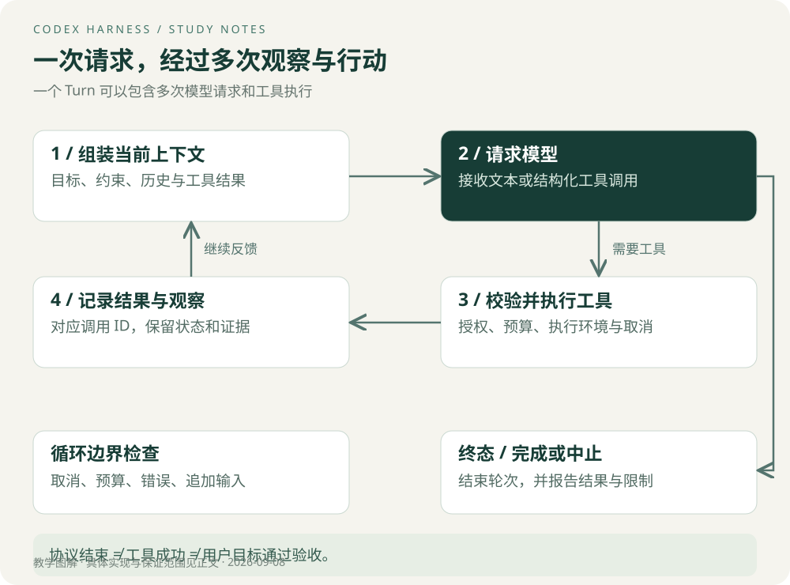

# 执行循环与事件

## 一次请求不是一次模型调用

用户说“修复空列表导致的异常”，可能触发读取文件、运行测试、打补丁、再次测试等多次动作。每次工具返回都改变下一步判断所依据的信息。这就是反馈循环的实际意义。



图中的完成、预算耗尽、取消是教学状态分类。真实实现还有流式错误、压缩、用户追加输入等分支。

## Thread、Turn 与 Item

官方 App Server 使用三层对象：Thread 是会话，Turn 是用户请求及其后续工作，Item 是其中的输入或输出单元，例如消息、命令执行、文件变更或工具调用。[核心对象与生命周期](https://learn.chatgpt.com/docs/app-server)

可以把“修复空列表异常”看成一个 Turn。其中先后出现用户消息、命令执行和 Agent 消息等 Item。不要把一个 token 增量、一次工具调用和完整 Turn 当成相同粒度。

**设计亮点：分离会话、任务轮次和执行单元。** 前端可以展示每个执行单元的状态，同时保留整个任务的完成状态。代价是需要正确关联 ID，处理交错的事件，不能只维护一个全局 `loading` 布尔值。

## 用一条教学轨迹看信息怎样流动

| 步骤 | 系统观察到什么 | 下一步为何合理 |
| --- | --- | --- |
| 1 | 用户描述空列表异常 | 需要定位实现与测试 |
| 2 | 读取函数及对应测试 | 得到输入边界与现有行为 |
| 3 | 测试失败，退出码和断言可见 | 形成可复现的失败证据 |
| 4 | 修改边界处理 | 产生待验证的代码变更 |
| 5 | 目标测试通过 | 证明该测试覆盖的行为满足预期 |
| 6 | 检查改动和相关测试范围 | 判断是否需要补充验证后结束 |

工具结果必须与调用关联，否则模型可能把 A 命令的成功当成 B 命令的成功。用户界面也需要保留命令、工作目录、输出和状态之间的联系。

## 教学伪代码

```python
while budget.remaining() and not cancelled():
    request = build_context(history, task_state)
    response = await model.generate(request)
    history.record(response)
    if response.has_tool_calls():
        for call in response.tool_calls:
            if cancelled():
                break
            result = await validate_authorize_execute(call)
            history.record_tool_result(call.id, result)
    else:
        finish_turn(response)
        break
```

这段示意没有实现流式聚合、并行、工具错误、压缩和持久化。它用于明确循环关系，不能作为 Codex 源码替代品。源码的 `run_turn` 以及后续采样路径可以从[固定版本入口](https://github.com/openai/codex/blob/d6489472f3c15e87d2d7763a5fde033545c530f8/codex-rs/core/src/session/turn.rs#L163)开始阅读。

## 停止条件需要分层

模型不再请求工具，可能意味着模型认为任务已完成；运行框架完成 Turn，是协议层的终态；用户需求真正满足，是业务验收结果。三者需要分别记录。

预算耗尽时应返回已完成内容与未解决问题。用户取消时应停止后续调度，并处理正在运行的工具。已写入的文件、已提交的事务不会因为取消自动撤销。

> **Tip｜收到文本不等于结束**
> 流式文本可能是进度说明。客户端应依据协议终态结束等待，而不是看到一句自然语言就把任务标成完成。

App Server 提供 `turn/steer` 追加运行中的用户输入，以及 `turn/interrupt` 中断；最终通过 `turn/completed` 携带终态。具体字段以相应版本协议为准。[官方生命周期](https://learn.chatgpt.com/docs/app-server)

## 优化：区分体感速度与总耗时

流式事件可以更早展示“正在读文件”和命令输出，但这不必然减少最终完成时间。衡量时分别记录首次可见反馈、首个有效结果、端到端耗时。避免用更早打印“开始了”冒充任务性能提升。

自测：断开浏览器连接后命令是否仍运行？答案取决于服务端任务生命周期和连接处理，不能从“支持流式”推导。需要断线实验与服务端日志。

[下一章：上下文工程](03-上下文工程.md) · [专题目录](00-阅读指南.md)
