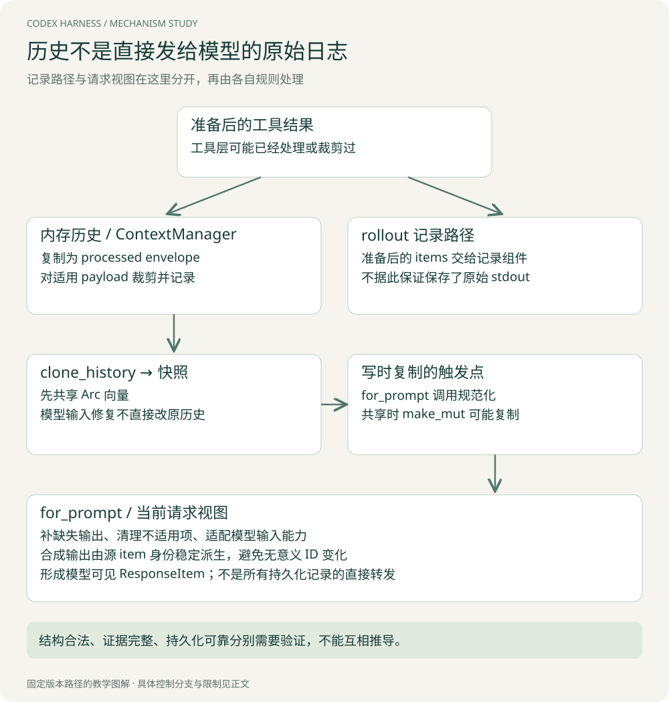

# 上下文工程：把历史变成一份可继续执行的请求

已有 Agent 基础的人需要掌握的不是“上下文要压缩”，而是：**什么对象被改了，下一次 Prompt 怎样生成，哪些基线必须同步更新，优化作用在哪一层。** 本章沿真实函数拆解。

## 1. 四种状态，不要统称为 memory

| 对象 / 状态 | 保存什么 | 在本次分析中的作用 |
| --- | --- | --- |
| `ContextManager.items` | 带元数据的模型历史项 | 原料，可以生成模型输入 |
| `for_prompt` 生成的向量 | 规范化并适配输入能力后的 ResponseItem | 当前请求视图 |
| 上下文基线 | 已向模型表达过的设置、world state 等 | 决定本轮发全量还是差量 |
| rollout / checkpoint | 用于记录与恢复的事件、历史替换等 | 跨执行阶段或会话恢复 |

模型历史和保存记录不是同一个向量的别名，Prompt 也不是原封不动地把所有持久化日志交给模型。宿主持有的事实还有特定保留机制，配置会影响路径；不能由这张表推出所有信息都永久保存。



[查看原图，可放大阅读](images/context-pipeline.svg)

## 2. 追踪一条工具输出：裁剪在哪发生

工具结果记录路径会进入 `record_prepared_conversation_items`。函数先让内存历史记录 annotated items，再把准备后的 items 映射成 rollout items，交给持久化路径。[入口](https://github.com/openai/codex/blob/d6489472f3c15e87d2d7763a5fde033545c530f8/codex-rs/core/src/session/mod.rs#L3382)

`ContextManager::record_items_with_metadata` 对每个输入 item 创建一个 processed envelope；若是函数或自定义工具输出，按对应策略裁剪 processed 的 payload，再放进历史。某些元数据可覆盖 token 限制。[裁剪点](https://github.com/openai/codex/blob/d6489472f3c15e87d2d7763a5fde033545c530f8/codex-rs/core/src/context_manager/history.rs#L350)

因此，至少在这个调用边界上，**进入模型历史的 processed 版本可以与传给记录系统的版本不同**。但不能反向保证“磁盘一定有完整原始 stdout”：工具层可能已经裁剪过，记录层也可能过滤或受配置控制。若要证明完整结果可取回，必须继续追踪实际工具输出与保存位置。

这比“长日志要截断”多了一层实现含义：裁剪应明确发生在什么边界，是否只影响模型视图，如何让更完整的证据仍然可寻址。

## 3. 用一次输入污染看裁剪的质量代价

日志为：前 200 行是环境信息，第 201 行才是空数组异常，第 202 行以后是重复堆栈。前缀截断可能保留环境而丢掉异常；只留最后部分可能保留栈尾却失去报错上下文。

可考虑结构化保留退出码、错误位置与局部上下文，另带完整输出引用。但这不是免费的：提取规则可能选错错误；额外检索增加工具轮次；摘要又需要成本和校验。

对已有系统，先做故障归因：是根本没读到关键行，还是模型看到却理解错？前者属于信息供应问题，后者才可能需要模型或提示策略调整。把二者混在一张最终准确率表里，无法解释优化为何生效。

## 4. for_prompt：为何先复制快照，再修复结构

源码路径可缩写为：

```text
Session.clone_history()
  → 克隆 ContextManager（其中历史向量由 Arc 共享）
  → for_prompt(input_modalities)
  → normalize_history()
  → 去掉 envelope 的内部包装，形成 ResponseItem 向量
```

`for_prompt` 消费的是历史快照，对该快照规范化；它不是把所有合成修复项直接写回原始历史。源码中的合成输出 ID 注释也说明，规范化可重复运行而不持久化这些合成项。[请求视图](https://github.com/openai/codex/blob/d6489472f3c15e87d2d7763a5fde033545c530f8/codex-rs/core/src/context_manager/history.rs#L389)

这使得“用于适配模型输入的修复”与“真实执行记录”可以区分。否则一次模型适配就可能污染原始观察，下一次排查很难知道某个结果究竟真的发生过还是自动补的。

## 5. 缺失结果具体怎么修复

假设历史包含：

```text
call(c-A, item=i-A)
call(c-B, item=i-B)
output(c-B, "test code ...")
output(c-X, "orphan ...")
```

规范化对普通函数调用检查输出集合，发现 c-A 缺失，于其后插入内容为 `aborted` 的合成结果；c-X 没有对应调用，清理孤立输出时会移除它。源码按不同工具类型分别匹配；工具搜索缺失结果走空 tools 结果，具名外部输出也存在独立规则，不能把所有 item 都当普通函数。[规范化实现](https://github.com/openai/codex/blob/d6489472f3c15e87d2d7763a5fde033545c530f8/codex-rs/core/src/context_manager/normalize.rs#L21)

教学化结果：

```text
call(c-A, item=i-A)
output(c-A, "aborted", 合成)
call(c-B, item=i-B)
output(c-B, "test code ...", 真实)
```

这里 `aborted` 表示没有正常可用的结果，绝不能解释为外部副作用一定没发生。结构修复不是业务回滚，也不能倒推出执行器已经杀掉全部子进程。

实现先收集缺失项的位置，再从后往前插入，避免前面的插入改变后面的索引。这是一个小但具体的工程细节：相同的输入序列，修复位置保持可预测。

## 6. 为什么连“合成结果 ID”都要稳定

如果每次 `for_prompt` 都为 c-A 的补全结果生成随机 ID，内容虽然都是 aborted，序列化后的请求却不同。对于依赖稳定输入前缀的缓存机制，这类无意义变化会破坏重用机会。

源码 `synthetic_output_id` 在源 item 有 ID 时，基于固定命名空间、输出类型前缀和源 item ID 派生稳定 UUID；源 ID 缺失时保留兼容行为。[稳定 ID](https://github.com/openai/codex/blob/d6489472f3c15e87d2d7763a5fde033545c530f8/codex-rs/core/src/context_manager/normalize.rs#L145)

因此要区别两个 ID：call ID 用于配对；item ID 用于标识这条 item，并可参与派生稳定的合成 item。相同 call ID 不自动意味着所有请求字节相同。

**优化亮点：先消除自身产生的不稳定，再讨论缓存命中。** 稳定 ID 不保证实际命中，因为其他前缀内容、服务端策略和模型仍可能改变；但随机 ID 会引入一个不必要的变化源。

## 7. Arc 快照为什么不是“Prompt 零拷贝”

`ContextManager.items` 是 `Arc<Vec<...>>`。假设原始历史 H 与快照 S 引用同一向量：

```text
H ─┐
   ├── shared Vec
S ─┘
```

只读时无需深复制向量。可是 `normalize_history` 调用 `Arc::make_mut` 获得可变访问：若共享引用仍在，就需要复制，确保修复 S 不改变 H。即使最后没有插入缺失项，获取共享数据的可变访问也可能产生复制。随后 `Arc::unwrap_or_clone` 决定能否直接取出向量。[历史规范化](https://github.com/openai/codex/blob/d6489472f3c15e87d2d7763a5fde033545c530f8/codex-rs/core/src/context_manager/history.rs#L702)

因此准确表述是“快照共享推迟并减少特定只读路径的复制”，不能说“生成每次 Prompt 完全不复制”。真正分析性能，要分别测快照建立、规范化、序列化、发送等阶段。

> **Tip｜性能优化至少有四本账**
> 内存分配、请求字节、模型 token、端到端时间。Arc 优化第一本，输出裁剪影响后两本中的部分，稳定前缀影响重用机会。把它们统称“节省 token”会掩盖真实机制。

## 8. 压缩触发：阈值究竟比较什么

本版 `context_window_token_status` 区分全部活动上下文与自动压缩计数范围；配置可以统计总量，也可以统计初始前缀之后增加的部分。同时仍检查完整上下文上限。[计数逻辑](https://github.com/openai/codex/blob/d6489472f3c15e87d2d7763a5fde033545c530f8/codex-rs/core/src/session/context_window.rs)

下面仅用假设数字手算，忽略可配置的 fallback buffer：初始前缀 P=40k，后续内容 B=25k，总量 A=65k；自动范围限额 L=30k，完整有效上限 C=100k。

- 若按总量：65k 已超过 30k，达到自动边界。
- 若按前缀后增量：25k 尚未达到 30k，且 65k 未达到 100k。
- 若初始前缀增至 80k、后续仍是 25k：增量未达 30k，但总量 105k 达到完整上限，仍触发边界。

这说明“只计算后续增量”不会让很大的前缀无限突破模型窗口。源码还会考虑缓冲量，剩余预算口径与触发口径不完全相同，不能把 UI 显示的某个剩余值直接代入另一条条件。

外层还要求后续工作确实需要继续，才进入相应的轮中换窗口分支。一次任务已可结束时，不必仅为之后并不存在的采样立即做同样的压缩工作。

## 9. 压缩是状态迁移，不是替换一段字符串

假设原历史表达过工作目录 `/repo/a`，程序基线也记着“目录已发送”。压缩后若仅留下摘要，却忘了更新基线，下一次配置没变，差量生成会认为“无需发送目录”，模型就失去了执行背景。

本版 `InitialContextInjection` 区分轮前/手动与轮中压缩。前者让后续常规轮次完整重新注入；后者按规定位置把初始上下文放进替换历史。`replace_compacted_history` 还更新 world-state 基线并记录替换历史和相关元数据。[压缩注入](https://github.com/openai/codex/blob/d6489472f3c15e87d2d7763a5fde033545c530f8/codex-rs/core/src/compact.rs#L70) · [替换路径](https://github.com/openai/codex/blob/d6489472f3c15e87d2d7763a5fde033545c530f8/codex-rs/core/src/session/mod.rs#L3778)

需要维护的关系是：**基线宣称模型已经知道的内容，必须能在新工作窗口里找到等价表达，或在下一次请求重新提供。** 摘要、设置基线与窗口版本分别正确，却相互不匹配，也会导致失败。

## 10. 实验应怎样检验这一章

检查三类不变量：原始历史不被请求视图修复污染；相同源 item 的合成输出稳定；压缩之后必要基线重新可见。对质量另做长任务实验，把关键约束放在早期输入，检查压缩后是否依然遵守。

[第七章](07-实验与评测.md)提供前两类的教学实验，以及压缩继续条件的确定性演练。它们不直接证明真实模型压缩质量。

[下一章：工具与权限](04-工具与权限.md) · [专题目录](00-阅读指南.md)
