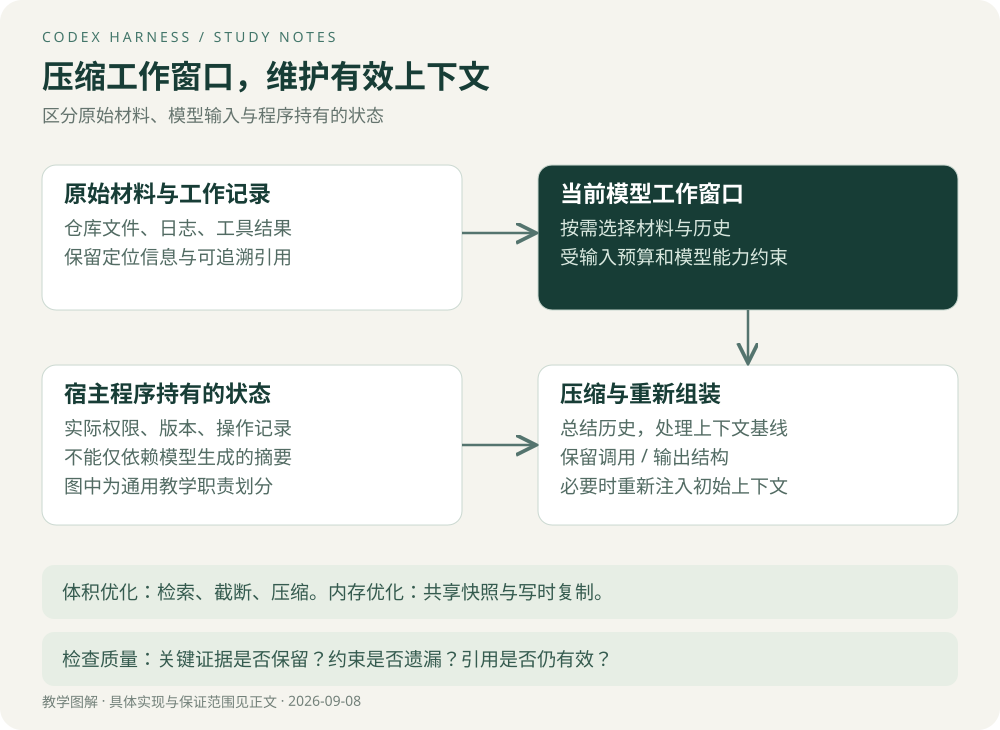

# 上下文工程

## 上下文是有预算的工作材料

一个仓库有上万文件，测试输出又可能有数万行。全部输入会增加请求体积，也可能挤掉与任务直接相关的信息。上下文工程要决定：这一步需要什么证据，以什么形式提供，何时重新读取。

先区分三种东西：磁盘和数据库里的真实状态、可供恢复与追溯的记录、当前发给模型的工作窗口。它们可以相互引用，但不应假定完全相同。

## 四种方法解决不同问题

| 方法 | 作用对象 | 主要收益 | 可能代价 |
| --- | --- | --- | --- |
| 按需检索 | 仓库或外部资料 | 避免加载无关材料 | 未命中时缺少必要信息 |
| 输出截断 | 单次工具结果 | 限制一次调用占用 | 核心错误可能处于被删部分 |
| 历史压缩 | 多轮工作历史 | 为后续执行释放空间 | 摘要可能遗漏约束或误写结论 |
| 稳定前缀与缓存 | 重复请求输入 | 可能减少重复处理成本 | 命中依赖服务与具体输入，不能凭空保证 |

这些措施不能互相替代。截断把长日志缩短，不会自动识别哪段是根因；压缩总结历史，也不能替代读取刚被修改的文件。

## 关键优化一：在结果进入历史时控制体积

固定版本 `ContextManager::record_items_with_metadata` 对函数或自定义工具输出执行裁剪，使用可覆盖的截断策略后再记录。这说明限制可以在输入历史的边界统一实施，避免每个消费者各自应对超长输出。[源码](https://github.com/openai/codex/blob/d6489472f3c15e87d2d7763a5fde033545c530f8/codex-rs/core/src/context_manager/history.rs#L350)

工程上应进一步考虑结果结构：状态码、错误摘要、匹配位置、是否截断以及完整结果引用。保留引用后，模型可以选择追加读取。此结构是迁移建议，不是上述函数必然返回的字段。

> **Tip｜字符数不等于 token 数**
> 中文、代码和日志的字符/token 比例不同。真实预算应使用模型用量或相应计数方法。教学实验用字符数，只能说明内容保留行为。

## 关键优化二：压缩之后仍保持协议结构

如果保留工具输出却删除对应调用，历史可能变成“一个没有问题的答案”。反过来只保留调用而丢失结果，也会造成悬空状态。

源码 `normalize_history` 会补齐调用结果、清理孤立输出，并按模型输入能力处理图像与音频。具名外部工具输出存在允许独立出现的例外。[源码及不变量注释](https://github.com/openai/codex/blob/d6489472f3c15e87d2d7763a5fde033545c530f8/codex-rs/core/src/context_manager/history.rs#L702)

**亮点在于：上下文不仅要“语义上有用”，还要“结构上合法”。** 自动补齐用于维持协议，不代表工具真实执行成功。业务验收必须区分真实结果与占位或错误记录。

## 关键优化三：压缩后重新建立上下文基线

`InitialContextInjection` 区分轮次之前或手动压缩，以及轮次中间压缩。源码注释说明：前者清除参考上下文，使下一次常规轮次完整重新注入；后者按特定位置注入初始上下文。[固定版本源码](https://github.com/openai/codex/blob/d6489472f3c15e87d2d7763a5fde033545c530f8/codex-rs/core/src/compact.rs#L70)

这体现一个通用问题：历史被替换后，增量更新所依赖的基线可能失效。假设系统认为“目录和权限已经发过”，但那段内容被压缩删除，后续仅发送差量就可能缺少必要背景。

迁移到预算 Agent 时，压缩后的结构化状态可以保留用户目标、数据版本、指标口径、已完成操作引用和未解决问题。真正的权限仍由服务端认证与授权机制判断，不能把模型摘要当作授权凭证。

## 关键优化四：共享快照减少深复制

源码使用 `Arc<Vec<ResponseItemEnvelope>>` 存放历史，并通过 `Arc::make_mut` 更新。读者可共享不可变数据；存在共享引用时写入会触发复制。[ContextManager 定义](https://github.com/openai/codex/blob/d6489472f3c15e87d2d7763a5fde033545c530f8/codex-rs/core/src/context_manager/history.rs#L65)

这优化的是宿主程序内存与复制开销，不会直接减少模型看到的 token。快照长期存活且写入频繁时，复制与旧版本占用仍可能明显。需要测量快照数量、分配量、峰值内存和写入频率。

自测：若压缩之后仍记得“导出成功”，可以直接重用文件吗？不能。还需确认文件引用存在、数据版本正确、权限有效，必要时核对实际文件。

[下一章：工具与权限](04-工具与权限.md) · [专题目录](00-阅读指南.md)
