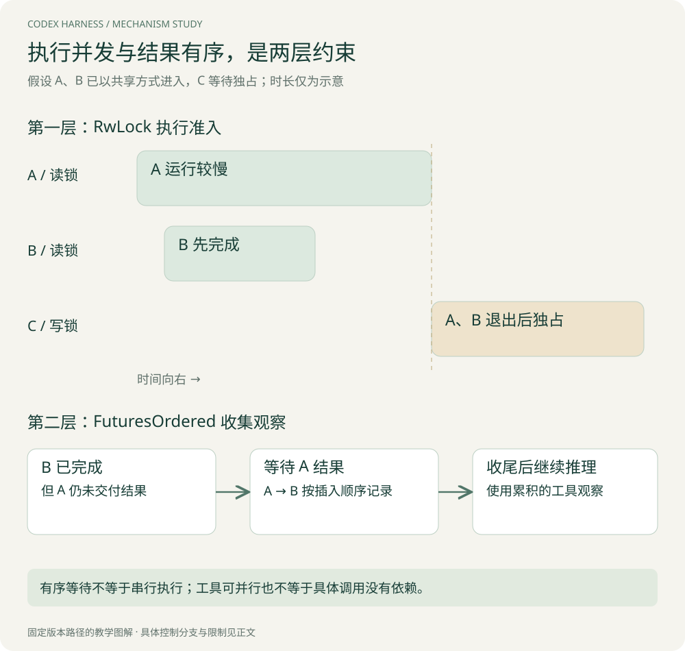

# 工具与权限：从路由到并发门，再到执行策略

本章继续追踪“读取实现 A、读取测试 B”的案例，然后加入一个不可并行的修改工具 C。关键问题是：**哪些对象决定能执行，哪些对象决定何时执行，哪些对象决定失败后能否再试。**

## 1. 分清路由、调度与执行策略

| 组件 | 本章追踪的职责 | 不应自动推导出的能力 |
| --- | --- | --- |
| `ToolRouter` | 识别工具、查注册项、分发调用 | 自动识别全部业务依赖 |
| `ToolCallRuntime` | 启动执行任务、并发门、取消与结果转换 | 回滚任意外部副作用 |
| `ToolOrchestrator` | 对适用工具落实审批、沙箱与特定重试 | 所有工具一定走完全相同路径 |
| 具体工具 runtime / handler | 解析领域参数，调用实际能力，形成结果 | 获得高于配置的权限 |

把这些层次分开，才能解释为什么“参数合法”仍可能被拒绝、“工具已注册”仍要等待、“执行结束”仍要收集结果。下面的源码观察主要覆盖直接工具调用与对应执行路径；Code Mode、MCP 和具体执行器还可能有额外层。

## 2. 从模型名称到实际 handler

模型产生 FunctionCall 等 item 后，`ToolRouter::build_tool_call` 把名称、命名空间、call ID 和 payload 转成内部 ToolCall。随后运行时按名称取得已注册的能力，并保留本次 StepContext。[路由入口](https://github.com/openai/codex/blob/d6489472f3c15e87d2d7763a5fde033545c530f8/codex-rs/core/src/tools/router.rs#L245)

这里有两类校验，不要混为一谈：把字符串解成内部调用，是协议解析；检查文件路径、参数类型和实际可执行操作，是具体能力与执行策略的职责。模型输出结构正确，不代表资源合法。

例如 `read_file(path)` 的 path 即使是字符串，也可能越出允许目录、经符号链接指向其他位置，或在校验后发生变化。参数 schema 只能解决部分输入约束，实际访问还应由执行层落实。此处是通用边界分析，不是宣称本章已审计所有文件工具。

## 3. 并发门具体怎样工作：读锁与写锁

`ToolCallRuntime` 持有一个共享 `RwLock<()>`。若路由声明该工具支持并行，执行任务获取读锁；否则获取写锁。锁保护的不是某个 Rust 数据字段，而是这一运行时内的执行准入。[实现](https://github.com/openai/codex/blob/d6489472f3c15e87d2d7763a5fde033545c530f8/codex-rs/core/src/tools/parallel.rs#L94)

多个读锁可共存，所以 A 与 B 可以一起执行；写锁要求独占，所以 C 不能与同一门内已获准的读者同时运行。runtime clone 共享这把锁。它不是跨机器或跨所有会话的全局锁，也不是按文件路径分配的锁。



[查看原图，可放大阅读](images/parallel-gate.svg)

图中时间是示意。假设 A、B 已获得准入，C 等待独占。A 慢、B 快，因此 B 先结束，但 C 还需等 A 退出。B 的完成也不意味着 B 的结果马上越过 A 写入历史；结果集合还有上一章讲的有序收集规则。

**两个机制分别解决不同问题：** RwLock 控制哪些 handler 能同时执行；FuturesOrdered 控制结果交付顺序。仅看到一个就推断整个并发行为，容易得到错误结论。

## 4. 这种设计的收益和代价

它比“所有调用串行”更容易获得只读工具的重叠收益，也比“所有调用全部放行”更保守。对新工具，`tool_supports_parallel` 未找到声明时返回 false。[资格默认值](https://github.com/openai/codex/blob/d6489472f3c15e87d2d7763a5fde033545c530f8/codex-rs/core/src/tools/router.rs#L235)

代价是门的粒度较粗：一个不可并行工具可能挡住实际上不冲突的调用。若优化为按资源锁，理论上可以提高并行度，但需要正确声明读写集合、处理路径别名、动态访问范围与死锁顺序。错误的资源声明会把保守延迟换成一致性风险。

此外，支持并行并不提供因果排序。如果 B 读取的是 A 应当生成的文件，就应该在拿到 A 结果后再提出 B，而不是同一批不加区分地并行。这里的锁不负责理解自然语言目标中的依赖。

> **Tip｜“工具耗时”至少拆成等待和执行**
> 本版在通过并发门时记录 execution start。因此从调用创建到准入的等待，和 handler 真正运行的时间可以分开。排队慢时更换模型无济于事；handler 慢时减小 Prompt 也未必有帮助。

## 5. 审批不是一个布尔判断

`ToolOrchestrator::run` 先获取当前 step 的审批策略和工具所选环境，再构建权限视图，确定审批要求。已读分支可分成：

| 要求 | 普通含义 | 本版需要注意的额外分支 |
| --- | --- | --- |
| `Forbidden` | 直接拒绝 | 不进入第一次执行 |
| `NeedsApproval` | 构造动作并请求批准 | 动作准备失败也会拒绝 |
| `Skip` | 配置无需通常的交互批准 | strict auto-review 开启时仍可能走审查 |

因此不能把 Skip 简化为“完全不检查”。同样，审批针对某个动作及其上下文；沙箱负责执行时的资源约束，两者都有必要。[审批分支](https://github.com/openai/codex/blob/d6489472f3c15e87d2d7763a5fde033545c530f8/codex-rs/core/src/tools/orchestrator.rs#L124)

第一轮尝试还会考虑工具偏好、环境权限、执行器是否自己管理进程沙箱和网络策略。看到 `SandboxType::None` 也不能脱离上下文直接断言“没有任何限制”：执行器管理的限制、受管网络等需要继续追踪。

## 6. 失败以后为什么有些请求能再试，有些不能

以下是第一次工具尝试后的简化决策树：

```text
执行成功 → 返回输出
非沙箱拒绝错误 → 返回对应错误，不进入这条沙箱升级路径
沙箱拒绝 → 检查网络决策能否进一步审批
           → 检查工具是否允许失败后升级
           → 检查当前策略是否允许请求升级
           → 检查环境是否允许相应执行方式
           → 必要时重新审批
           → 构造第二次 attempt
```

这是一组有条件的分支，而不是“失败就去掉沙箱再跑”。本版在 `Never` / `OnRequest` 等策略下有约束和网络审批例外；strict auto-review 下，对沙箱内尝试的批准不能直接覆盖无沙箱重试。[失败与第二次尝试](https://github.com/openai/codex/blob/d6489472f3c15e87d2d7763a5fde033545c530f8/codex-rs/core/src/tools/orchestrator.rs#L325)

具体例子：命令因缺少文件失败，不是沙箱拒绝，应把事实反馈给模型；命令因资源策略拒绝，只有被当前策略允许的后续审批才可改变执行条件。调度器不能把“完成任务的意愿”当成新的授权来源。

## 7. 错误成为观察，还是终止控制流

工具运行时会把部分非 fatal 错误转换成工具失败结果，使模型在下一次输入中看到原因。fatal 错误则保留为错误通道。[转换边界](https://github.com/openai/codex/blob/d6489472f3c15e87d2d7763a5fde033545c530f8/codex-rs/core/src/tools/parallel.rs#L70)

这相当于划分“模型可能通过重新选择动作解决”的错误与“不能按普通工具观察处理”的错误。但不要只看这个函数就认定某个错误最终一定结束会话：还应继续跟踪 future 的收集方及其处理方式。本版 `drain_in_flight` 对 error 分支执行记录/诊断处理，不能概括为所有错误都按同样方式上抛。

设计自己的系统时，应明确错误契约：参数可修正、权限拒绝、临时失败、结果未知和内部错误各自怎样进入模型与 UI。把它们都包装为字符串“失败”，会丢掉自动恢复需要的信息。

## 8. 取消与完成撞在一起，谁赢

假设 handler 已生成最终结果，但生命周期通知还没完全结束，此时用户点击取消。如果取消分支无条件返回 aborted，就可能出现“业务已经成功，历史却说取消”的矛盾。

本版运行时在取消分支检查 `terminal_outcome_reached` 或 dispatch task 是否已完成；满足条件时等待并保留结果。否则 abort dispatch，再等待任务收尾，处理竞态后才生成中断结果和通知。[取消分支](https://github.com/openai/codex/blob/d6489472f3c15e87d2d7763a5fde033545c530f8/codex-rs/core/src/tools/parallel.rs#L181)

仓库还有专门测试 `cancellation_after_handler_finishes_preserves_completed_lifecycle`，说明这个边界是显式考虑的，而不是只有一个取消标志。[测试入口](https://github.com/openai/codex/blob/d6489472f3c15e87d2d7763a5fde033545c530f8/codex-rs/core/src/tools/parallel.rs#L596)

但 abort Rust task 不自动证明外部进程或远程事务回滚。真实工具的清理与外部副作用仍要分别核对。掌握这个边界后，才能准确解释“取消任务”和“撤销已发生操作”的区别。

## 9. 练习：从现象倒推所在层

A、B 都显示开始，B 很快完成，但下一次推理迟迟不来。首先检查 A 是否仍在执行以及 in-flight 收尾，而不是认定 B 的结果丢失。

C 花了十秒，但 handler 日志只有一秒。检查准入等待、工具 readiness 与其他前置等待，不要把九秒归入业务执行。

命令第一次被拒绝，第二次却没有弹窗。要查看当前策略、此前审批作用域、strict review、网络上下文与实际执行方式，不能仅凭 UI 推断绕过权限。

[下一章：状态与可靠性](05-状态与可靠性.md) · [专题目录](00-阅读指南.md)
